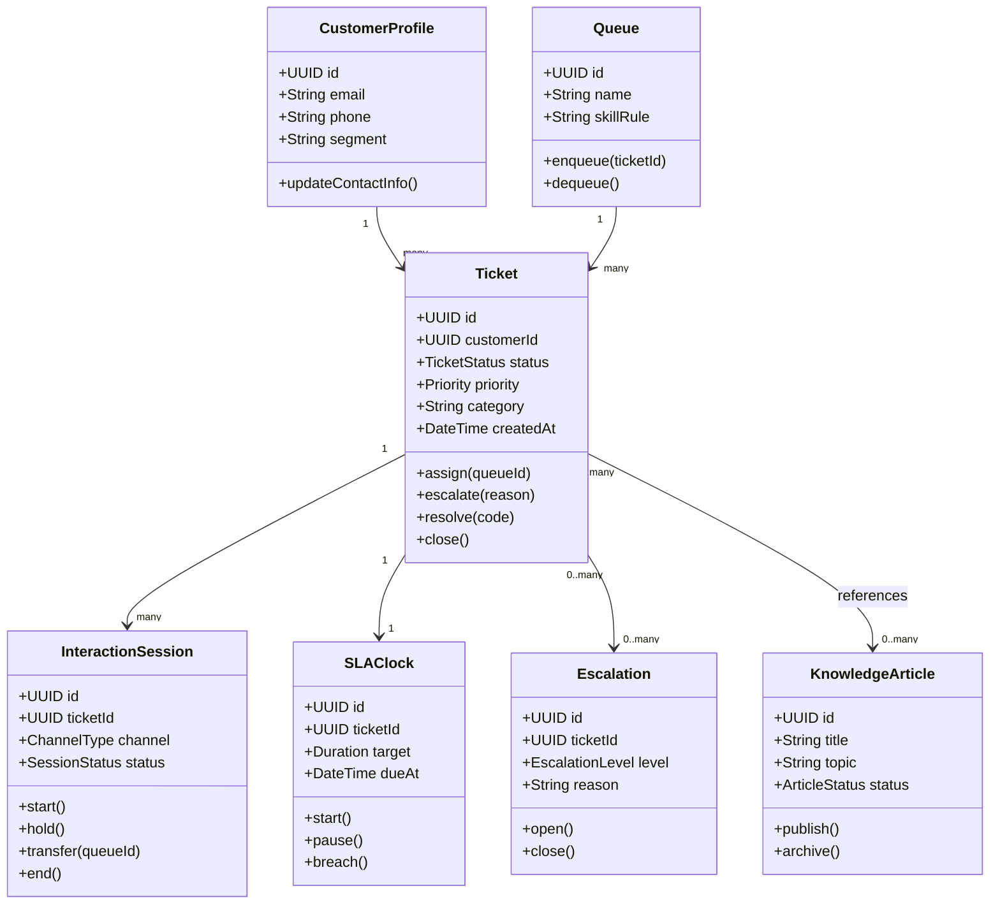
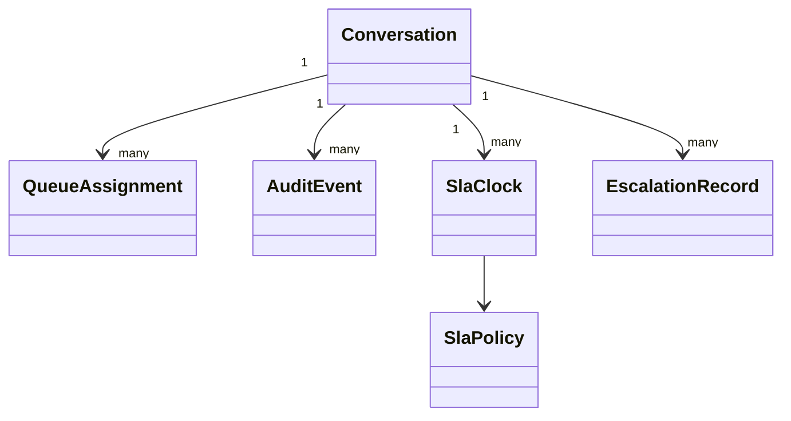

# Class Diagrams

## Class Model Narrative for Operations
Representative classes and invariants:
- `Conversation`: aggregate root; owns interaction timeline.
- `QueueAssignment`: value object linking skill profile and priority score.
- `SlaPolicy` and `SlaClock`: policy/instance split for versioned rule execution.
- `EscalationRecord`: immutable escalation decision snapshot.
- `AuditEvent`: cryptographically signed event envelope.

Class methods that mutate state must emit both domain events and audit events, ensuring replay + compliance parity.

Operational coverage note: this artifact also specifies omnichannel and incident controls for this design view.
