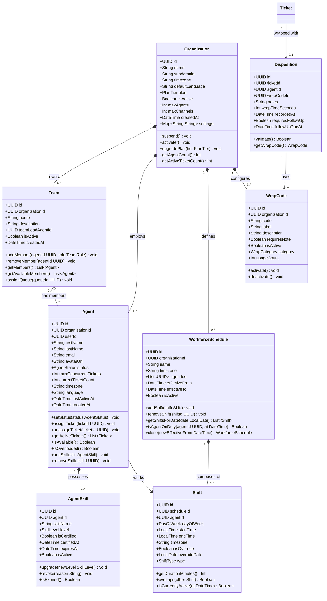
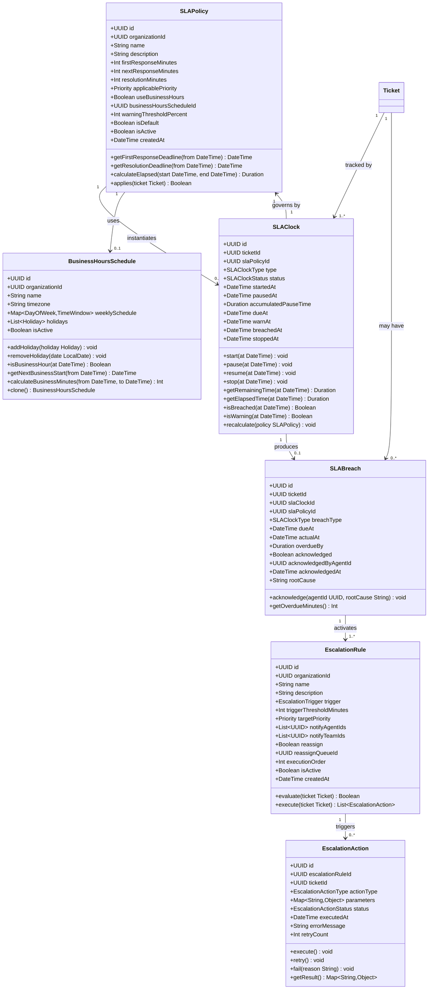
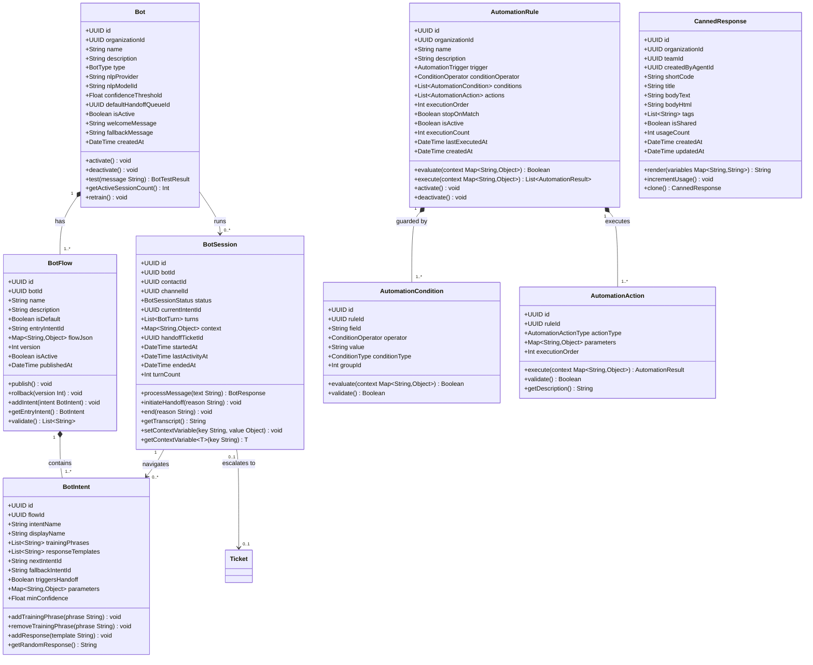
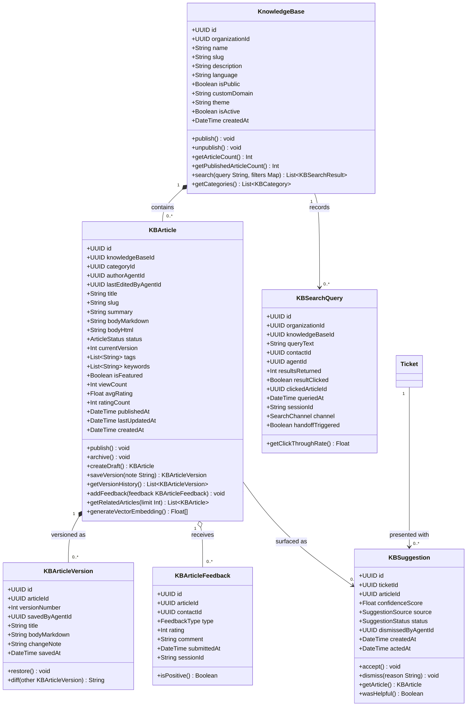
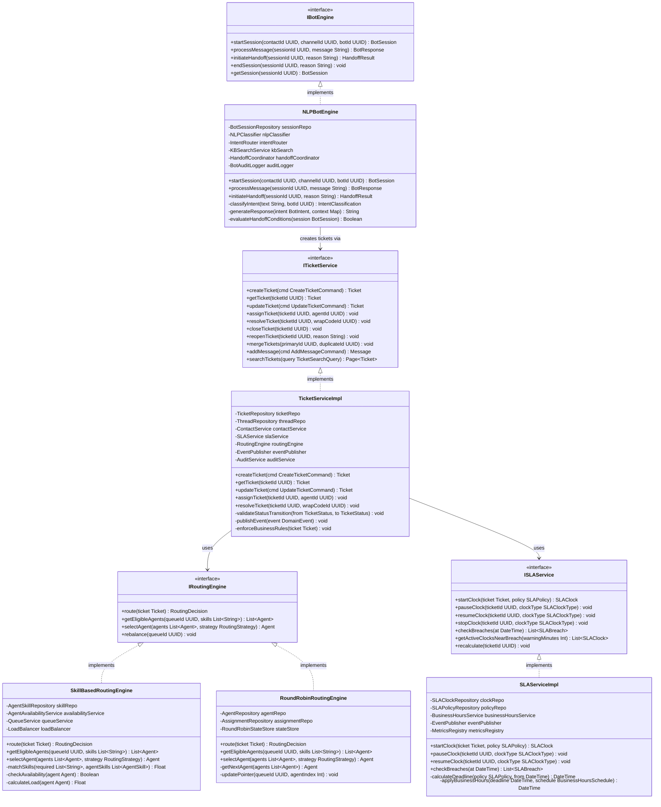

# Class Diagrams — Customer Support and Contact Center Platform

> **Document Purpose:** Defines the object-oriented domain model for the platform using UML class diagrams rendered in Mermaid. Each diagram covers one bounded context. Attributes include visibility modifiers (`+` public, `-` private, `#` protected) and types. Relationships are annotated with cardinality and role labels.

---

## Diagram 1 — Core Ticket Domain

This diagram models the central aggregate of the platform: **Ticket**. A Ticket is the unit of work that tracks a customer issue from creation to resolution. It owns a set of `TicketThread` objects (conversations), each composed of `Message` instances. Messages may carry `Attachment` objects. Every ticket is linked to a `Contact` (the customer), routed through a `Queue`, associated with one or more `Channel` definitions, and tagged with zero-or-more `Tag` labels.

```mermaid
classDiagram
    class Ticket {
        +UUID id
        +String ticketNumber
        +UUID organizationId
        +UUID contactId
        +UUID queueId
        +UUID assignedAgentId
        +UUID assignedTeamId
        +TicketStatus status
        +Priority priority
        +String subject
        +String description
        +ChannelType sourceChannel
        +DateTime createdAt
        +DateTime updatedAt
        +DateTime firstResponseAt
        +DateTime resolvedAt
        +DateTime closedAt
        +String externalRef
        +Map~String,String~ customFields
        +open() void
        +assign(agentId UUID) void
        +reassign(agentId UUID, reason String) void
        +pend() void
        +hold(reason String, duration Duration) void
        +resolve(wrapCodeId UUID) void
        +close() void
        +reopen(reason String) void
        +addTag(tag Tag) void
        +removeTag(tagId UUID) void
        +merge(sourceTicketId UUID) void
        +split(messageIds List~UUID~) Ticket
        +calculateSLAStatus() SLAStatus
    }

    class TicketThread {
        +UUID id
        +UUID ticketId
        +ThreadType type
        +String subject
        +Boolean isInternal
        +DateTime createdAt
        +DateTime lastMessageAt
        +Int messageCount
        +addMessage(message Message) void
        +getMessages(page Int, size Int) List~Message~
        +markRead(agentId UUID) void
    }

    class Message {
        +UUID id
        +UUID threadId
        +UUID senderId
        +SenderType senderType
        +String bodyText
        +String bodyHtml
        +MessageDirection direction
        +MessageStatus status
        +DateTime sentAt
        +DateTime deliveredAt
        +DateTime readAt
        +String externalMessageId
        +List~UUID~ attachmentIds
        +Boolean isPrivateNote
        +addAttachment(attachment Attachment) void
        +markDelivered() void
        +markRead() void
        +redact(reason String) void
    }

    class Attachment {
        +UUID id
        +UUID messageId
        +String filename
        +String mimeType
        +Long fileSizeBytes
        +String storageKey
        +String downloadUrl
        +DateTime uploadedAt
        +Boolean isInline
        +String virusScanStatus
        +generatePresignedUrl(ttlSeconds Int) String
        +flagInfected() void
        +delete() void
    }

    class Contact {
        +UUID id
        +UUID organizationId
        +String firstName
        +String lastName
        +String email
        +String phone
        +String externalId
        +String avatarUrl
        +String timezone
        +String language
        +ContactSegment segment
        +Map~String,String~ customAttributes
        +DateTime createdAt
        +DateTime lastSeenAt
        +getFullName() String
        +getTickets(limit Int) List~Ticket~
        +merge(duplicateContactId UUID) void
        +updateSegment(segment ContactSegment) void
    }

    class Channel {
        +UUID id
        +UUID organizationId
        +ChannelType type
        +String name
        +String externalAddress
        +Boolean isActive
        +Map~String,String~ config
        +DateTime createdAt
        +activate() void
        +deactivate() void
        +testConnectivity() Boolean
        +getConfig~T~(key String) T
    }

    class Queue {
        +UUID id
        +UUID organizationId
        +UUID teamId
        +String name
        +String description
        +Int maxConcurrentTickets
        +Int currentDepth
        +RoutingStrategy routingStrategy
        +Boolean isActive
        +DateTime createdAt
        +enqueue(ticketId UUID, priority Priority) void
        +dequeue() UUID
        +peek() UUID
        +getDepth() Int
        +pause() void
        +resume() void
        +transferTickets(targetQueueId UUID) void
    }

    class Tag {
        +UUID id
        +UUID organizationId
        +String name
        +String colorHex
        +String description
        +Int usageCount
        +DateTime createdAt
        +rename(newName String) void
        +merge(targetTagId UUID) void
        +getTickets(limit Int) List~Ticket~
    }

    Ticket "1" *-- "1..*" TicketThread : contains
    TicketThread "1" *-- "0..*" Message : composed of
    Message "1" o-- "0..*" Attachment : has
    Contact "1" --> "0..*" Ticket : raises
    Queue "1" --> "0..*" Ticket : holds
    Channel "1" --> "0..*" Ticket : source
    Ticket "0..*" --> "0..*" Tag : labelled with
```

---

## Diagram 2 — Agent and Team Domain

This diagram covers the **workforce model**. An `Organization` owns multiple `Team` objects. Each `Team` contains `Agent` members. An `Agent` holds a collection of `AgentSkill` proficiencies used by the routing engine. Agents follow `WorkforceSchedule` definitions that decompose into `Shift` windows. Post-interaction wrap-up is captured via `WrapCode` and `Disposition`.

---

## Diagram 3 — SLA and Escalation Domain

The SLA subsystem tracks time-based service level commitments. An `SLAPolicy` defines the rules (first-response time, resolution time, applicable conditions). An `SLAClock` is an instance created per ticket, per policy. `BusinessHoursSchedule` adjusts elapsed time calculations to exclude non-business hours. `SLABreach` records are created when a clock exceeds its deadline. `EscalationRule` defines automated reactions to breach events, executed via `EscalationAction`.

---

## Diagram 4 — Bot and Automation Domain

The bot layer provides self-service and triage capabilities. A `Bot` is configured with a `BotFlow` (conversation script) containing `BotIntent` nodes that the NLP classifier resolves. Each customer interaction spawns a `BotSession`. `AutomationRule` objects implement conditional business logic with `AutomationCondition` guards and `AutomationAction` executors. `CannedResponse` objects provide agent shortcuts.

---

## Diagram 5 — Knowledge Base Domain

The Knowledge Base (KB) subsystem supports agent and bot-assisted self-service. A `KnowledgeBase` scopes articles per organisation and language. `KBArticle` is the content entity, versioned via `KBArticleVersion` snapshots. `KBArticleFeedback` captures per-article reader sentiment. `KBSearchQuery` records search telemetry. `KBSuggestion` models AI-powered article recommendations that the bot and ticket form surface.

---

## Diagram 6 — Service Layer Classes

This diagram documents the service-layer interfaces and their primary concrete implementations. It captures the dependency inversion principle applied across all domain services: controllers depend on interfaces; concrete classes are injected at runtime.

---

*Last updated: 2025 | Version: 1.0 | Owner: Platform Engineering*
