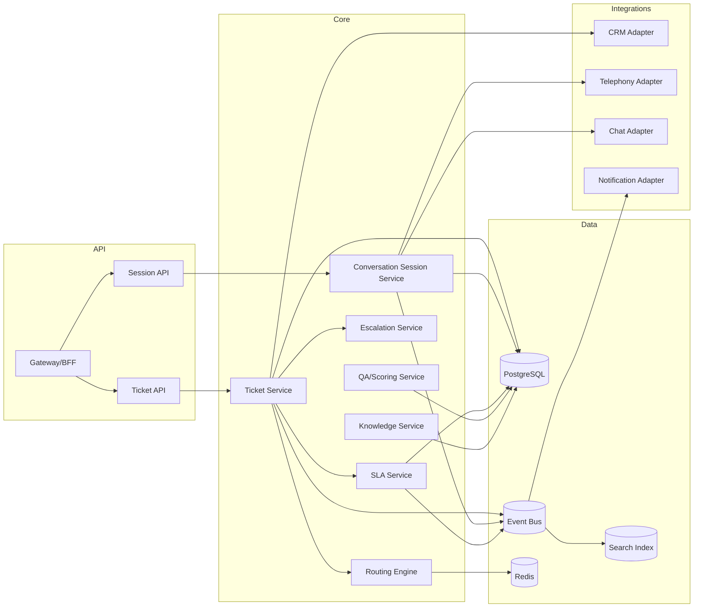

# Component Diagrams

```mermaid
flowchart LR
    subgraph API
      Gateway[Gateway/BFF]
      TicketAPI[Ticket API]
      SessionAPI[Session API]
    end

    subgraph Core
      TicketSvc[Ticket Service]
      RoutingSvc[Routing Engine]
      SessionSvc[Conversation Session Service]
      SlaSvc[SLA Service]
      EscSvc[Escalation Service]
      QASvc[QA/Scoring Service]
      KBSvc[Knowledge Service]
    end

    subgraph Integrations
      CRM[CRM Adapter]
      Voice[Telephony Adapter]
      Chat[Chat Adapter]
      Notify[Notification Adapter]
    end

    subgraph Data
      DB[(PostgreSQL)]
      MQ[(Event Bus)]
      Search[(Search Index)]
      Cache[(Redis)]
    end

    Gateway --> TicketAPI --> TicketSvc
    Gateway --> SessionAPI --> SessionSvc

    TicketSvc --> RoutingSvc
    TicketSvc --> SlaSvc
    TicketSvc --> EscSvc
    SessionSvc --> Voice
    SessionSvc --> Chat
    TicketSvc --> CRM

    TicketSvc --> DB
    SessionSvc --> DB
    SlaSvc --> DB
    QASvc --> DB
    KBSvc --> DB

    TicketSvc --> MQ
    SessionSvc --> MQ
    SlaSvc --> MQ
    MQ --> Notify
    MQ --> Search
    RoutingSvc --> Cache
```
