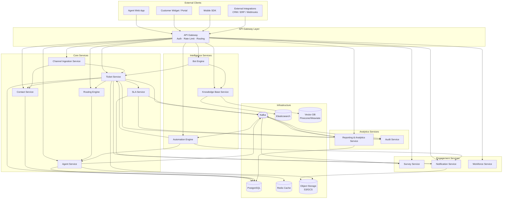

# Component Diagrams — Customer Support and Contact Center Platform

> **Document Purpose:** Describes the major software components of the platform, their responsibilities, interfaces, dependencies, and technology choices. Components are coarse-grained deployable services following a microservices architecture. The diagrams use Mermaid graph notation for visual representation.

---

## Component Overview

The platform is decomposed into **15 independently deployable services** communicating via:
- **Synchronous REST/gRPC** for request/response operations (inter-service calls and external APIs)
- **Asynchronous event streaming** via Apache Kafka for domain events (ticket lifecycle, SLA events, analytics)
- **WebSocket** for real-time agent and customer chat channels

All external traffic is routed through the **API Gateway**, which handles authentication (JWT/OAuth2), rate limiting, and request routing. Internal services communicate within a private service mesh (mTLS enforced via Istio/Linkerd).

---

## High-Level Architecture Diagram

---

## Component Specifications

---

### 1. API Gateway

**Description:** The single entry point for all external traffic. Handles cross-cutting concerns so that downstream services remain lean.

**Key Responsibilities:**
- JWT and OAuth2 token validation (delegating to identity provider)
- Rate limiting per tenant, per IP, and per endpoint (token-bucket algorithm)
- Request routing to upstream services via path-based rules
- Request/response logging and distributed tracing header injection (OpenTelemetry)
- TLS termination and CORS enforcement
- API versioning (via path prefix `/v1/`, `/v2/`)
- Web Application Firewall (WAF) rules for OWASP top-10 protection

**Exposes Interfaces:**
- `HTTPS :443` — all external REST APIs
- `WSS :443` — WebSocket upgrade for chat and agent real-time channels

**Depends On:**
- Identity Provider (Keycloak / Auth0) for token introspection
- All downstream microservices

**Technology Choices:** Kong Gateway (open-source) or AWS API Gateway; Nginx as edge proxy; OpenTelemetry Collector for trace forwarding.

---

### 2. Channel Ingestion Service

**Description:** Connects to all external communication channels and normalises inbound messages into the platform's canonical `Message` model before forwarding to the Ticket Service.

**Key Responsibilities:**
- **Email connector:** Poll IMAP / receive SMTP webhooks; parse MIME bodies; extract `In-Reply-To` headers for thread chaining
- **Chat connector:** Maintain WebSocket sessions with the customer chat widget; bridge messages to Bot Engine or Ticket Service
- **Voice connector:** Integrate with Twilio/Amazon Connect; receive call events (started, ended, recording ready); create call-type tickets
- **Social connectors:** Twitter DM, Facebook Messenger, Instagram DM — poll or receive webhooks; normalise message objects
- **SMS connector:** Twilio SMS inbound webhook; normalise to Message
- **WhatsApp connector:** WhatsApp Business API webhook; handle template messages and free-form
- **Message normalisation:** Convert channel-specific payloads to `CreateMessageCommand`
- **Deduplication:** Prevent duplicate ticket creation for email thread replies using `Message-ID` header matching

**Exposes Interfaces:**
- `POST /internal/ingestion/email` — internal trigger from email poller
- `POST /internal/ingestion/webhook/{channel}` — webhook receiver per channel type
- `WS /chat/connect` — WebSocket endpoint for chat widget connections

**Depends On:** Ticket Service, Contact Service, Bot Engine (for chat sessions), Notification Service, Object Storage (attachments), Kafka (publishes `MessageIngested` events)

**Technology Choices:** Spring Boot (Java) or Node.js; Bull queue for per-channel job processing; AWS SES/SendGrid for email; Twilio SDK.

---

### 3. Ticket Service

**Description:** The authoritative service for the `Ticket` aggregate. Enforces all business rules around ticket lifecycle, thread management, and attachment handling.

**Key Responsibilities:**
- Ticket CRUD with full domain validation
- Status transition enforcement (state machine guard conditions)
- Thread and message creation; per-thread internal/external segregation
- Attachment upload coordination with Object Storage; virus-scan callback handling
- Custom field schema validation per organization
- Ticket merge and split operations
- Full-text search index synchronisation (write to Elasticsearch)
- Publish domain events to Kafka: `TicketCreated`, `TicketAssigned`, `TicketResolved`, `TicketClosed`, `MessageAdded`
- Enforce per-organization ticket retention policies

**Exposes Interfaces:**
- `REST /v1/tickets` — CRUD and search
- `REST /v1/tickets/{id}/messages` — message management
- `REST /v1/tickets/{id}/threads` — thread management
- `REST /v1/tickets/{id}/merge` — merge operation
- `gRPC TicketService.GetTicket` — low-latency internal reads
- Kafka topics: `ticket.events`, `message.events`

**Depends On:** SLA Service (clock management), Routing Engine (assignment), Contact Service (contact validation), Notification Service (agent/contact alerts), Audit Service (immutable audit log), Object Storage (attachments), PostgreSQL (primary store), Elasticsearch (search index)

**Technology Choices:** Spring Boot + Spring Data JPA; PostgreSQL with optimistic locking; Debezium CDC for Elasticsearch sync; AWS S3 / GCS for attachments.

---

### 4. Routing Engine

**Description:** Determines the optimal queue and agent assignment for every ticket entering or re-entering the routing process.

**Key Responsibilities:**
- Evaluate organization-configured routing rules (priority, category, channel, custom field conditions)
- Match required skills against `AgentSkill` registry
- Check agent real-time availability (status, concurrent load, shift schedule)
- Implement routing strategies: skill-based, round-robin, least-loaded, sticky (contact → agent)
- Queue management: enqueue when no agent is available; dequeue when agent becomes available
- Load rebalancing: redistribute tickets when agent goes offline
- Maintain routing audit trail (every routing decision recorded)

**Exposes Interfaces:**
- `REST /internal/routing/route` — synchronous routing request
- `REST /internal/routing/queues/{id}/depth` — queue depth query
- `REST /internal/routing/rebalance` — trigger rebalancing job
- Kafka consumer: `ticket.events` (TicketCreated), `agent.events` (AgentStatusChanged)
- Kafka producer: `routing.events` (TicketRouted, TicketQueued)

**Depends On:** Agent Service (availability/skills), Ticket Service (ticket reads), Notification Service (assignment notifications), Redis (routing state / round-robin pointers)

**Technology Choices:** Go service for low-latency routing decisions; Redis Sorted Sets for priority queues; Drools (optional) for complex rule evaluation.

---

### 5. SLA Service

**Description:** Manages all SLA clock instances and breach detection. Operates as both a request handler (clock start/stop) and a scheduled background processor (breach detection ticks).

**Key Responsibilities:**
- Select applicable `SLAPolicy` for a ticket based on priority, channel, team, and tag conditions
- Instantiate `SLAClock` records (first-response, next-response, resolution) on ticket creation
- Pause/resume clocks on ticket status changes
- Scheduled breach-detection tick (every 60 seconds): evaluate all running clocks
- Emit `SLAWarning` events at configured threshold percentage
- Emit `SLABreached` events and create `SLABreach` records on deadline expiry
- Recalculate clock deadlines when policy changes or ticket priority changes
- Apply `BusinessHoursSchedule` to exclude non-business time from elapsed calculation

**Exposes Interfaces:**
- `REST /internal/sla/clocks` — clock management
- `REST /internal/sla/policies` — policy CRUD
- `REST /internal/sla/breaches` — breach queries
- Kafka consumer: `ticket.events` (status changes)
- Kafka producer: `sla.events` (SLAWarning, SLABreached)

**Depends On:** Ticket Service (ticket state), Notification Service (warning alerts), Audit Service (breach records), Escalation Engine (breach event consumer), PostgreSQL

**Technology Choices:** Java Spring Boot; Quartz Scheduler for breach-detection ticks; DB-backed clock store for durability across restarts.

---

### 6. Agent Service

**Description:** Manages agent profiles, skill registries, real-time availability, and concurrent load tracking. Acts as the source of truth for the routing engine's agent selection queries.

**Key Responsibilities:**
- Agent profile CRUD (name, email, timezone, language, avatar)
- Skill registry: add, update, expire, and revoke `AgentSkill` records
- Real-time status management (Online, Busy, Break, DND, Offline) with automatic transitions
- Concurrent ticket load tracking: increment on assignment, decrement on resolution/unassignment
- Publish status-change events for routing engine consumption
- Agent performance summary reads (ticket counts, avg handle time, CSAT)
- Team membership management: add/remove agents from teams

**Exposes Interfaces:**
- `REST /v1/agents` — CRUD and search
- `REST /v1/agents/{id}/status` — status update
- `REST /v1/agents/{id}/skills` — skill management
- `gRPC AgentService.GetAvailableAgents` — internal availability query
- Kafka producer: `agent.events` (AgentStatusChanged, AgentSkillUpdated)

**Depends On:** Workforce Service (shift schedule checks), Notification Service (status alerts to supervisors), PostgreSQL, Redis (availability cache)

**Technology Choices:** Node.js with TypeScript; Redis Hash per agent for live presence; PostgreSQL for persistent agent records.

---

### 7. Contact Service

**Description:** Manages the customer/contact master data. Provides a 360-degree view of a contact's interaction history and supports deduplication and merge workflows.

**Key Responsibilities:**
- Contact CRUD with custom attributes
- Automatic deduplication on ingest: match by email, phone, or external ID
- Merge duplicate contacts: consolidate ticket history, activity timeline, and attributes
- Contact segmentation and tagging
- Timeline API: return ordered activity (tickets, notes, surveys, bot sessions) for a contact
- GDPR/data deletion: right-to-be-forgotten workflow (anonymise or delete contact data)
- Contact import via CSV with field mapping

**Exposes Interfaces:**
- `REST /v1/contacts` — CRUD, search, deduplication check
- `REST /v1/contacts/{id}/timeline` — activity timeline
- `REST /v1/contacts/{id}/merge` — merge duplicates
- `REST /v1/contacts/import` — bulk CSV import
- Kafka consumer: `ticket.events` (to update `lastSeenAt`)
- Kafka producer: `contact.events` (ContactCreated, ContactMerged)

**Depends On:** Ticket Service (ticket history reads), Audit Service, PostgreSQL, Elasticsearch (contact search)

**Technology Choices:** Spring Boot; PostgreSQL with JSONB for custom attributes; Elasticsearch for full-text contact search.

---

### 8. Knowledge Base Service

**Description:** Manages the self-service knowledge base. Provides AI-powered semantic search and article suggestion capabilities for agents, bots, and customer portals.

**Key Responsibilities:**
- Knowledge base CRUD (multi-KB per organization, multi-language)
- Article lifecycle management (Draft → Review → Published → Archived)
- Category hierarchy management (parent/child categories)
- Full-text search via Elasticsearch
- AI-powered semantic search via vector embeddings (OpenAI `text-embedding-3-small` or Cohere)
- Article suggestion engine: given a ticket subject/body, suggest relevant articles
- Article version history (immutable snapshots on each save)
- Article feedback collection (thumbs-up/down, star rating, comments)
- Search analytics: track query→click→handoff conversions
- Public portal rendering via markdown-to-HTML conversion

**Exposes Interfaces:**
- `REST /v1/knowledge-bases` — KB management
- `REST /v1/knowledge-bases/{kbId}/articles` — article CRUD and publishing
- `REST /v1/knowledge-bases/{kbId}/search?q=` — search endpoint
- `REST /internal/kb/suggest` — AI suggestion endpoint (called by bot, ticket form)
- `POST /v1/articles/{id}/feedback` — submit article feedback

**Depends On:** Object Storage (article images/attachments), Elasticsearch (full-text index), Vector DB (semantic search), AI Embedding API (async embedding generation), Audit Service

**Technology Choices:** FastAPI (Python) for NLP-adjacent logic; Elasticsearch 8.x with `dense_vector` fields; Pinecone or Weaviate for vector store; OpenAI API for embeddings.

---

### 9. Bot Engine

**Description:** Manages the full lifecycle of bot-driven customer conversations. Integrates with NLP providers for intent classification and coordinates handoffs to human agents.

**Key Responsibilities:**
- Bot and BotFlow configuration management
- Session lifecycle management (create, maintain context, end)
- NLP intent classification (supports multiple providers: Dialogflow, OpenAI, in-house models)
- Confidence-based fallback strategy: low confidence → clarifying question → KB search → handoff
- Context variable management within sessions (e.g., order ID, account number collected from conversation)
- Outbound message routing back to the correct channel connector
- Automated handoff: package session context, create ticket, trigger routing
- A/B testing support for bot flows
- Conversation analytics: intent distribution, containment rate, handoff rate

**Exposes Interfaces:**
- `REST /v1/bots` — bot configuration CRUD
- `REST /v1/bots/{id}/flows` — flow management
- `WS /bot/session` — real-time session messaging
- `REST /internal/bot/classify` — sync NLP classification (for external callers)
- `REST /internal/bot/handoff` — initiate handoff
- Kafka producer: `bot.events` (SessionStarted, IntentClassified, HandoffInitiated, SessionEnded)

**Depends On:** Channel Ingestion Service (message source), NLP Provider (Dialogflow / OpenAI API), Knowledge Base Service (article lookup), Ticket Service (ticket creation on handoff), Routing Engine (handoff routing), Redis (session state cache)

**Technology Choices:** Node.js with TypeScript; Socket.IO for WebSocket; Redis for session state; Dialogflow CX SDK or OpenAI Chat Completions API.

---

### 10. Automation Engine

**Description:** Evaluates automation rules against platform events in real-time and executes configured actions. Replaces manual workflows with rule-driven automation.

**Key Responsibilities:**
- Rule configuration: trigger type (ticket created, message received, SLA event, time-based), condition groups (field comparisons, regex, tag matching), actions (assign, tag, reply, notify, webhook)
- Real-time rule evaluation triggered by Kafka events
- Time-based rules: execute scheduled checks (e.g., "if open for > 4 hours with no response, send reminder")
- Action execution with retry semantics and dead-letter handling
- Rule conflict resolution via `executionOrder` and `stopOnMatch` flags
- Execution history and audit logging for each rule run
- Sandbox/test mode: evaluate rules against a sample ticket without executing actions

**Exposes Interfaces:**
- `REST /v1/automation/rules` — rule CRUD
- `REST /v1/automation/rules/{id}/test` — test against sample
- `REST /v1/automation/executions` — execution history
- Kafka consumer: `ticket.events`, `message.events`, `sla.events`, `contact.events`
- Kafka producer: `automation.events` (RuleExecuted, RuleFailed)

**Depends On:** Ticket Service (read/write), Agent Service (assignment actions), Notification Service (notification actions), HTTP client (webhook actions)

**Technology Choices:** Java Spring Boot; Drools for rule evaluation or custom expression engine (Spring Expression Language); Kafka Streams for event-driven processing.

---

### 11. Survey Service

**Description:** Manages CSAT, NPS, and custom survey templates. Handles survey dispatch scheduling, response collection, and score aggregation.

**Key Responsibilities:**
- Survey template CRUD (multi-language, customisable questions, rating scales)
- Dispatch scheduling: trigger on ticket resolution events, with configurable delays
- Deduplication: one survey per contact per configurable cooldown window
- Multi-channel dispatch: email, chat widget, SMS
- Unique survey token generation (signed, time-limited)
- Response collection and storage
- CSAT/NPS score calculation and aggregation
- Integration with Analytics Service for dashboard metrics
- Opt-out management per contact

**Exposes Interfaces:**
- `REST /v1/survey-templates` — template CRUD
- `REST /v1/survey-responses` — response collection
- `GET /survey/{token}` — survey rendering (embedded in email/portal)
- `POST /survey/{token}/submit` — survey submission
- Kafka consumer: `ticket.events` (TicketResolved trigger)
- Kafka producer: `survey.events` (SurveyDispatched, SurveyResponseReceived)

**Depends On:** Notification Service (dispatch), Contact Service (contact info, opt-out status), Ticket Service (ticket context), Analytics Service (score publishing)

**Technology Choices:** Node.js; PostgreSQL for responses; token signing with JWT (short-lived).

---

### 12. Workforce Service

**Description:** Manages agent scheduling, shift definitions, and provides availability inputs to the routing engine and real-time dashboards.

**Key Responsibilities:**
- Workforce schedule CRUD (weekly template + date-specific overrides)
- Shift management per agent: define working hours by day of week and timezone
- Holiday calendar management
- Availability calculation: given agent ID and timestamp, determine if on-shift
- Schedule import via CSV or third-party (Kronos, BambooHR)
- Shift adherence tracking: compare agent login times against scheduled shifts
- Capacity planning queries: future availability coverage for a queue
- Break management: types (lunch, short break, offline training) with durations

**Exposes Interfaces:**
- `REST /v1/workforce/schedules` — schedule CRUD
- `REST /v1/workforce/shifts` — shift management
- `REST /internal/workforce/is-on-shift?agentId=&at=` — routing query
- `REST /v1/workforce/coverage` — capacity planning
- Kafka consumer: `agent.events` (login/logout for adherence tracking)

**Depends On:** Agent Service (agent roster), Notification Service (shift reminders)

**Technology Choices:** Spring Boot; PostgreSQL for schedule data; iCal-compatible schedule export.

---

### 13. Reporting & Analytics Service

**Description:** Provides real-time operational metrics and historical reporting for supervisors and leadership. Aggregates events from Kafka into OLAP-style data stores.

**Key Responsibilities:**
- Real-time dashboards: live queue depths, agent availability counts, tickets in-progress, active SLA warnings
- Historical reports: ticket volume by period, first-response time distribution, resolution time, SLA compliance %, CSAT trend
- Agent performance reports: tickets handled, avg handle time, CSAT, adherence
- Custom report builder: drag-and-drop metric selection with date range and group-by filters
- Report scheduling: PDF/CSV export delivered via email on a schedule
- Event stream aggregation: consume Kafka events, update counters in Redis, sink to data warehouse (ClickHouse/Redshift)
- Anomaly detection: alert when metric deviates > N standard deviations from baseline

**Exposes Interfaces:**
- `REST /v1/reports` — report CRUD and execution
- `REST /v1/dashboards` — dashboard configuration and real-time data
- `REST /v1/metrics/realtime` — live metric queries (SSE stream)
- Kafka consumer: `ticket.events`, `sla.events`, `agent.events`, `survey.events`, `bot.events`

**Depends On:** PostgreSQL (source data fallback), Redis (real-time counters), ClickHouse or Redshift (historical OLAP)

**Technology Choices:** FastAPI + Pandas for report generation; ClickHouse for columnar analytics; Grafana or custom React dashboards; Apache Flink for stream aggregation.

---

### 14. Notification Service

**Description:** Centralised dispatcher for all platform notifications. Abstracts channel selection and delivery retry from all producing services.

**Key Responsibilities:**
- Multi-channel dispatch: in-app (WebSocket push), email (transactional), SMS (Twilio), mobile push (FCM/APNs)
- Template management: per-notification-type templates with variable substitution (Handlebars/Mustache)
- Preference management: per-agent/contact channel preferences and opt-out records
- Delivery tracking: sent, delivered, read states per message
- Retry with exponential backoff and dead-letter queue for failed deliveries
- Rate limiting to prevent notification storms (max N per minute per recipient)
- Digest mode: batch low-priority notifications into a single digest email

**Exposes Interfaces:**
- `REST /internal/notifications/send` — synchronous dispatch request
- `REST /v1/notifications/preferences` — preference management
- `REST /v1/notifications/history` — delivery history
- Kafka consumer: `ticket.events`, `sla.events`, `agent.events` (event-driven dispatch)

**Depends On:** Email provider (SendGrid / AWS SES), SMS provider (Twilio), Push provider (FCM / APNs), Template Store (PostgreSQL)

**Technology Choices:** Node.js; Bull queue for async delivery jobs; SendGrid API; Twilio API; Firebase Admin SDK.

---

### 15. Audit Service

**Description:** Records an immutable, tamper-evident log of all significant business events across the platform. Supports compliance reporting and forensic investigation.

**Key Responsibilities:**
- Append-only audit event ingestion from all services
- Structured audit record schema: `who`, `what`, `when`, `on_what`, `from_where`, `result`
- Cryptographic chaining: each record includes a hash of the previous record (blockchain-style)
- Compliance report generation: GDPR access/deletion log, SOC2 evidence export
- Audit search: filter by actor, resource type, date range, action type
- Long-term retention: configurable retention periods per event category
- Alert on suspicious patterns (e.g., bulk data export, mass ticket reassignment)

**Exposes Interfaces:**
- `REST /internal/audit/log` — write audit event (internal only, not exposed externally)
- `REST /v1/audit/events` — search and filter audit log (admin only)
- `REST /v1/audit/reports` — compliance report generation
- Kafka consumer: all topic events (as a cross-cutting consumer group)

**Depends On:** PostgreSQL or dedicated append-only store (TimescaleDB / AWS QLDB), Object Storage (long-term archive)

**Technology Choices:** Go microservice for high-throughput append operations; PostgreSQL with INSERT-only policy; AWS QLDB for cryptographic verification (alternative).

---

*Last updated: 2025 | Version: 1.0 | Owner: Platform Engineering*
