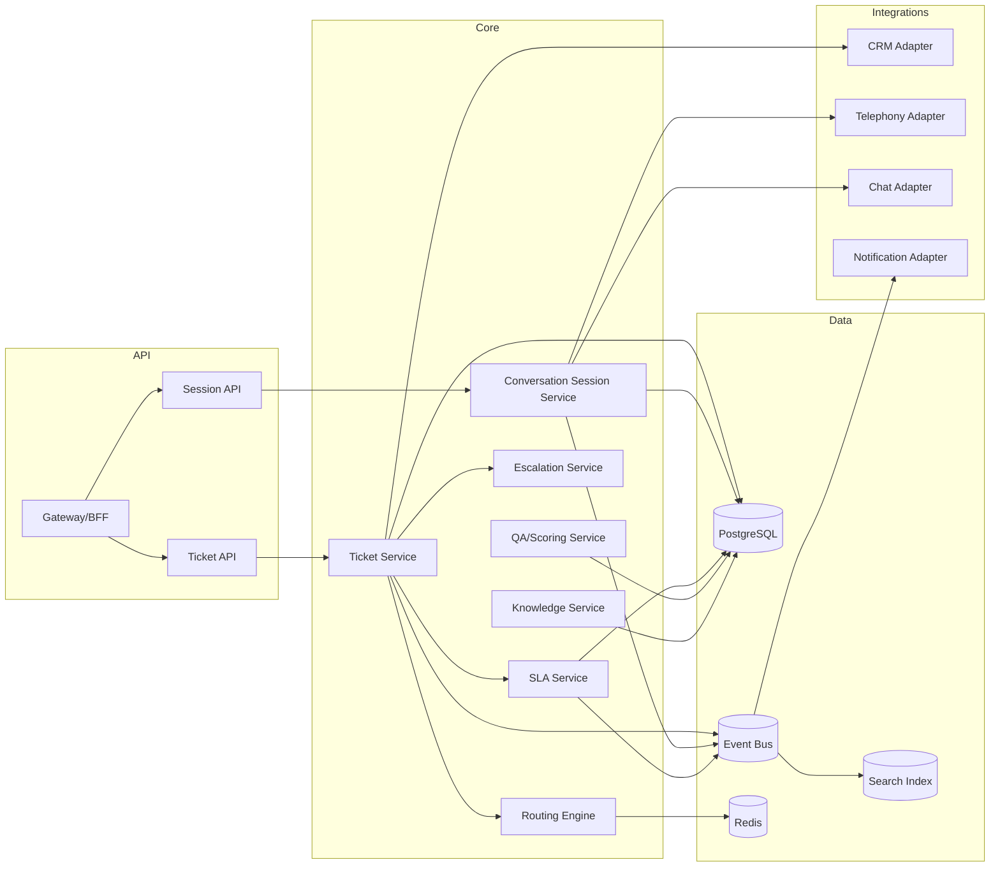
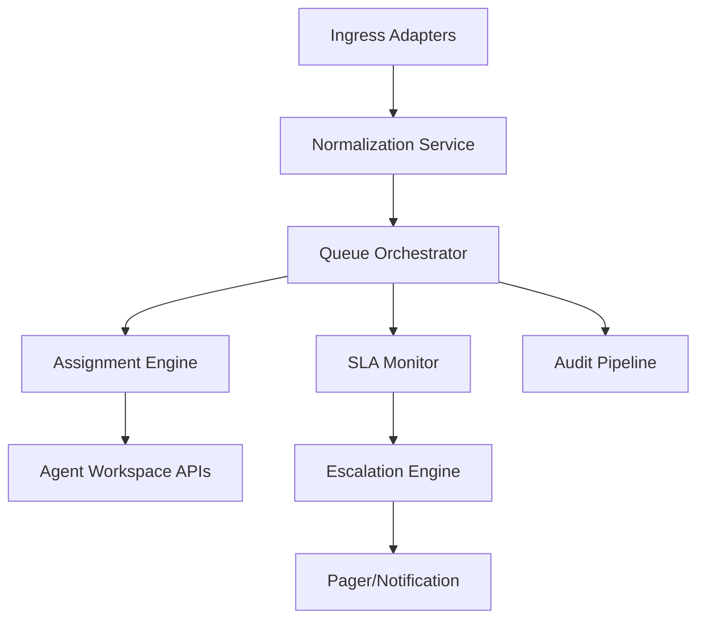

# Component Diagrams

## Component Diagram Narrative: Runtime Behavior

Each component must declare failure semantics:
- Normalizer: retry + dedup.
- Queue orchestrator: optimistic lock on queue item.
- SLA monitor: deterministic timer recalculation on replay.
- Escalation engine: once-only escalation using durable idempotency token.

Operational coverage note: this artifact also specifies omnichannel and incident controls for this design view.
