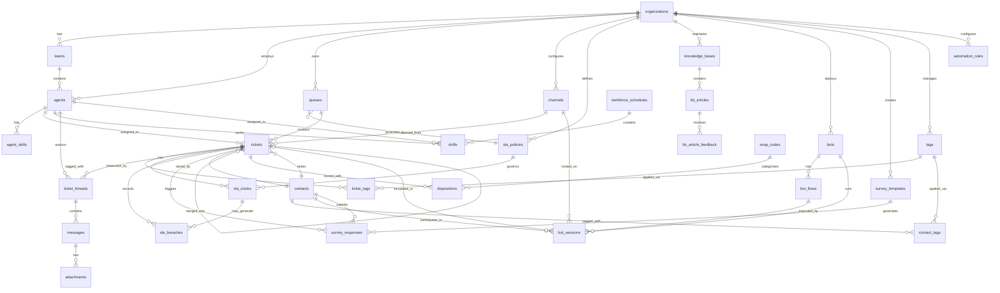

# ERD & Database Schema — Customer Support and Contact Center Platform

## 1. Overview

### 1.1 Design Principles

| Principle | Implementation |
|-----------|----------------|
| Multi-Tenancy | Every table includes `org_id TEXT NOT NULL` as the second column. Row Level Security (RLS) policies enforce tenant isolation at the PostgreSQL layer. |
| Soft Deletes | Sensitive tables use `deleted_at TIMESTAMPTZ NULL` instead of physical deletion. Hard deletes occur only through supervised GDPR erasure jobs. |
| UTC Timestamps | All `_at` timestamp columns are `TIMESTAMPTZ` stored in UTC. Application layers are responsible for local timezone display. |
| JSON Extensions | `custom_fields JSONB` and `settings JSONB` columns on core entities enable tenant-specific schema extensions without DDL migrations. |
| Immutable Audit | `audit_logs` is append-only; an BEFORE trigger raises an exception on any UPDATE or DELETE. The table is range-partitioned monthly. |
| ULID Primary Keys | All primary keys are 26-character ULIDs (Universally Unique Lexicographically Sortable Identifiers) stored as `TEXT`. This provides both uniqueness and natural time-ordering without sequential ID exposure. |
| Generated FTS Columns | `body_tsvector` on `messages` and `kb_articles` is a `GENERATED ALWAYS AS ... STORED` column, automatically updated on every write. |
| Schema Isolation | All tables live in the `support` schema. Archived data moves to `support_archive`. A `support_analytics` materialized view layer is maintained separately. |

### 1.2 Schema Layout

```
support schema
├── Core:      organizations, teams, agents, channels
├── Ticketing: tickets, ticket_tags, ticket_threads, messages, attachments
├── Contacts:  contacts, contact_tags
├── Taxonomy:  tags, wrap_codes, dispositions
├── SLA:       sla_policies, sla_clocks, sla_breaches
├── Routing:   queues, escalation_rules, automation_rules
├── Knowledge: knowledge_bases, kb_articles, kb_article_feedback, canned_responses
├── Bots:      bots, bot_flows, bot_sessions
├── Surveys:   survey_templates, survey_responses
├── Workforce: workforce_schedules, shifts, agent_skills
└── Audit:     audit_logs
```

---

## 2. Entity-Relationship Diagram



---

## 3. Detailed Table Definitions

---

### 3.1 organizations

```sql
CREATE TABLE support.organizations (
    id                    TEXT        NOT NULL,
    slug                  TEXT        NOT NULL,
    name                  TEXT        NOT NULL,
    plan                  TEXT        NOT NULL DEFAULT 'starter'
                              CHECK (plan IN ('starter', 'growth', 'enterprise', 'enterprise_plus')),
    timezone              TEXT        NOT NULL DEFAULT 'UTC',
    locale                TEXT        NOT NULL DEFAULT 'en-US',
    custom_fields_schema  JSONB       NOT NULL DEFAULT '{}',
    settings              JSONB       NOT NULL DEFAULT '{}',
    created_at            TIMESTAMPTZ NOT NULL DEFAULT NOW(),
    updated_at            TIMESTAMPTZ NOT NULL DEFAULT NOW(),
    deleted_at            TIMESTAMPTZ,

    CONSTRAINT pk_organizations PRIMARY KEY (id),
    CONSTRAINT uq_organizations_slug UNIQUE (slug)
);

CREATE INDEX idx_organizations_slug
    ON support.organizations (slug);
CREATE INDEX idx_organizations_active
    ON support.organizations (id)
    WHERE deleted_at IS NULL;
```

---

### 3.2 teams

```sql
CREATE TABLE support.teams (
    id              TEXT        NOT NULL,
    org_id          TEXT        NOT NULL,
    name            TEXT        NOT NULL,
    description     TEXT,
    lead_agent_id   TEXT,
    metadata        JSONB       NOT NULL DEFAULT '{}',
    created_at      TIMESTAMPTZ NOT NULL DEFAULT NOW(),
    updated_at      TIMESTAMPTZ NOT NULL DEFAULT NOW(),
    deleted_at      TIMESTAMPTZ,

    CONSTRAINT pk_teams PRIMARY KEY (id),
    CONSTRAINT fk_teams_org FOREIGN KEY (org_id)
        REFERENCES support.organizations (id) ON DELETE CASCADE,
    CONSTRAINT uq_teams_org_name UNIQUE (org_id, name)
);

CREATE INDEX idx_teams_org_id
    ON support.teams (org_id);
CREATE INDEX idx_teams_active
    ON support.teams (org_id)
    WHERE deleted_at IS NULL;
```

---

### 3.3 agents

```sql
CREATE TABLE support.agents (
    id                      TEXT        NOT NULL,
    org_id                  TEXT        NOT NULL,
    team_id                 TEXT,
    email                   TEXT        NOT NULL,
    name                    TEXT        NOT NULL,
    role                    TEXT        NOT NULL DEFAULT 'agent'
                                CHECK (role IN ('agent', 'team_lead', 'supervisor', 'admin')),
    status                  TEXT        NOT NULL DEFAULT 'offline'
                                CHECK (status IN ('online', 'away', 'busy', 'offline', 'break')),
    status_reason           TEXT,
    status_until            TIMESTAMPTZ,
    max_concurrent_tickets  INT         NOT NULL DEFAULT 10
                                CHECK (max_concurrent_tickets > 0),
    current_ticket_count    INT         NOT NULL DEFAULT 0
                                CHECK (current_ticket_count >= 0),
    timezone                TEXT        NOT NULL DEFAULT 'UTC',
    locale                  TEXT        NOT NULL DEFAULT 'en-US',
    avatar_url              TEXT,
    last_seen_at            TIMESTAMPTZ,
    custom_fields           JSONB       NOT NULL DEFAULT '{}',
    created_at              TIMESTAMPTZ NOT NULL DEFAULT NOW(),
    updated_at              TIMESTAMPTZ NOT NULL DEFAULT NOW(),
    deleted_at              TIMESTAMPTZ,

    CONSTRAINT pk_agents PRIMARY KEY (id),
    CONSTRAINT fk_agents_org FOREIGN KEY (org_id)
        REFERENCES support.organizations (id) ON DELETE CASCADE,
    CONSTRAINT fk_agents_team FOREIGN KEY (team_id)
        REFERENCES support.teams (id) ON DELETE SET NULL,
    CONSTRAINT uq_agents_org_email UNIQUE (org_id, email)
);

CREATE INDEX idx_agents_org_id
    ON support.agents (org_id);
CREATE INDEX idx_agents_team_id
    ON support.agents (team_id);
CREATE INDEX idx_agents_status
    ON support.agents (org_id, status)
    WHERE deleted_at IS NULL;
CREATE INDEX idx_agents_email
    ON support.agents (email);
CREATE INDEX idx_agents_active
    ON support.agents (org_id)
    WHERE deleted_at IS NULL;
```

---

### 3.4 agent_skills

```sql
CREATE TABLE support.agent_skills (
    id              TEXT        NOT NULL,
    org_id          TEXT        NOT NULL,
    agent_id        TEXT        NOT NULL,
    skill_id        TEXT        NOT NULL,
    proficiency     SMALLINT    NOT NULL DEFAULT 3
                        CHECK (proficiency BETWEEN 1 AND 5),
    certified_at    TIMESTAMPTZ,
    expires_at      TIMESTAMPTZ,
    created_at      TIMESTAMPTZ NOT NULL DEFAULT NOW(),
    updated_at      TIMESTAMPTZ NOT NULL DEFAULT NOW(),

    CONSTRAINT pk_agent_skills PRIMARY KEY (id),
    CONSTRAINT fk_agent_skills_org FOREIGN KEY (org_id)
        REFERENCES support.organizations (id) ON DELETE CASCADE,
    CONSTRAINT fk_agent_skills_agent FOREIGN KEY (agent_id)
        REFERENCES support.agents (id) ON DELETE CASCADE,
    CONSTRAINT uq_agent_skills_agent_skill UNIQUE (agent_id, skill_id)
);

CREATE INDEX idx_agent_skills_agent_id
    ON support.agent_skills (agent_id);
CREATE INDEX idx_agent_skills_skill_id
    ON support.agent_skills (skill_id);
CREATE INDEX idx_agent_skills_org_skill
    ON support.agent_skills (org_id, skill_id);
```

---

### 3.5 queues

```sql
CREATE TABLE support.queues (
    id                  TEXT        NOT NULL,
    org_id              TEXT        NOT NULL,
    name                TEXT        NOT NULL,
    description         TEXT,
    sla_policy_id       TEXT,
    routing_strategy    TEXT        NOT NULL DEFAULT 'round_robin'
                            CHECK (routing_strategy IN
                                ('round_robin', 'least_active', 'skill_based', 'manual')),
    max_capacity        INT         CHECK (max_capacity > 0),
    overflow_queue_id   TEXT,
    business_hours_id   TEXT,
    skills_required     TEXT[]      NOT NULL DEFAULT '{}',
    is_default          BOOLEAN     NOT NULL DEFAULT FALSE,
    settings            JSONB       NOT NULL DEFAULT '{}',
    created_at          TIMESTAMPTZ NOT NULL DEFAULT NOW(),
    updated_at          TIMESTAMPTZ NOT NULL DEFAULT NOW(),
    deleted_at          TIMESTAMPTZ,

    CONSTRAINT pk_queues PRIMARY KEY (id),
    CONSTRAINT fk_queues_org FOREIGN KEY (org_id)
        REFERENCES support.organizations (id) ON DELETE CASCADE,
    CONSTRAINT fk_queues_sla_policy FOREIGN KEY (sla_policy_id)
        REFERENCES support.sla_policies (id) ON DELETE SET NULL,
    CONSTRAINT fk_queues_overflow FOREIGN KEY (overflow_queue_id)
        REFERENCES support.queues (id) ON DELETE SET NULL,
    CONSTRAINT uq_queues_org_name UNIQUE (org_id, name)
);

CREATE INDEX idx_queues_org_id
    ON support.queues (org_id);
CREATE INDEX idx_queues_sla_policy_id
    ON support.queues (sla_policy_id);
CREATE INDEX idx_queues_active
    ON support.queues (org_id)
    WHERE deleted_at IS NULL;
```

---

### 3.6 channels

```sql
CREATE TABLE support.channels (
    id                TEXT        NOT NULL,
    org_id            TEXT        NOT NULL,
    type              TEXT        NOT NULL
                          CHECK (type IN (
                              'email', 'chat', 'voice', 'sms',
                              'whatsapp', 'twitter', 'facebook', 'api', 'portal'
                          )),
    name              TEXT        NOT NULL,
    is_enabled        BOOLEAN     NOT NULL DEFAULT TRUE,
    default_queue_id  TEXT,
    config            JSONB       NOT NULL DEFAULT '{}',
    created_at        TIMESTAMPTZ NOT NULL DEFAULT NOW(),
    updated_at        TIMESTAMPTZ NOT NULL DEFAULT NOW(),
    deleted_at        TIMESTAMPTZ,

    CONSTRAINT pk_channels PRIMARY KEY (id),
    CONSTRAINT fk_channels_org FOREIGN KEY (org_id)
        REFERENCES support.organizations (id) ON DELETE CASCADE,
    CONSTRAINT uq_channels_org_name UNIQUE (org_id, name)
);

CREATE INDEX idx_channels_org_id
    ON support.channels (org_id);
CREATE INDEX idx_channels_type
    ON support.channels (org_id, type)
    WHERE deleted_at IS NULL;
```

---

### 3.7 tickets

This is the central entity. The table is range-partitioned by `created_at` (see Section 4).

```sql
CREATE TABLE support.tickets (
    id                      TEXT        NOT NULL,
    org_id                  TEXT        NOT NULL,
    subject                 TEXT        NOT NULL,
    status                  TEXT        NOT NULL DEFAULT 'new'
                                CHECK (status IN (
                                    'new', 'open', 'pending',
                                    'on_hold', 'resolved', 'closed'
                                )),
    priority                TEXT        NOT NULL DEFAULT 'medium'
                                CHECK (priority IN (
                                    'low', 'medium', 'high', 'urgent', 'critical'
                                )),
    channel_id              TEXT        NOT NULL,
    queue_id                TEXT,
    contact_id              TEXT        NOT NULL,
    assignee_id             TEXT,
    team_id                 TEXT,
    sla_policy_id           TEXT,
    first_response_due_at   TIMESTAMPTZ,
    resolution_due_at       TIMESTAMPTZ,
    first_responded_at      TIMESTAMPTZ,
    resolved_at             TIMESTAMPTZ,
    closed_at               TIMESTAMPTZ,
    reopened_at             TIMESTAMPTZ,
    reopen_count            INT         NOT NULL DEFAULT 0,
    merged_into_ticket_id   TEXT,
    is_spam                 BOOLEAN     NOT NULL DEFAULT FALSE,
    external_id             TEXT,
    source_system           TEXT,
    custom_fields           JSONB       NOT NULL DEFAULT '{}',
    created_at              TIMESTAMPTZ NOT NULL DEFAULT NOW(),
    updated_at              TIMESTAMPTZ NOT NULL DEFAULT NOW(),
    deleted_at              TIMESTAMPTZ,

    CONSTRAINT pk_tickets PRIMARY KEY (id, created_at),
    CONSTRAINT fk_tickets_org FOREIGN KEY (org_id)
        REFERENCES support.organizations (id) ON DELETE CASCADE,
    CONSTRAINT fk_tickets_channel FOREIGN KEY (channel_id)
        REFERENCES support.channels (id) ON DELETE RESTRICT,
    CONSTRAINT fk_tickets_queue FOREIGN KEY (queue_id)
        REFERENCES support.queues (id) ON DELETE SET NULL,
    CONSTRAINT fk_tickets_assignee FOREIGN KEY (assignee_id)
        REFERENCES support.agents (id) ON DELETE SET NULL,
    CONSTRAINT fk_tickets_team FOREIGN KEY (team_id)
        REFERENCES support.teams (id) ON DELETE SET NULL,
    CONSTRAINT fk_tickets_sla_policy FOREIGN KEY (sla_policy_id)
        REFERENCES support.sla_policies (id) ON DELETE SET NULL
) PARTITION BY RANGE (created_at);

CREATE INDEX idx_tickets_org_status
    ON support.tickets (org_id, status)
    WHERE deleted_at IS NULL;
CREATE INDEX idx_tickets_queue_id
    ON support.tickets (queue_id)
    WHERE deleted_at IS NULL;
CREATE INDEX idx_tickets_assignee_id
    ON support.tickets (assignee_id)
    WHERE deleted_at IS NULL;
CREATE INDEX idx_tickets_contact_id
    ON support.tickets (contact_id);
CREATE INDEX idx_tickets_created_at
    ON support.tickets (org_id, created_at DESC);
CREATE INDEX idx_tickets_sla_first_response
    ON support.tickets (org_id, first_response_due_at)
    WHERE status NOT IN ('resolved', 'closed') AND deleted_at IS NULL;
CREATE INDEX idx_tickets_external_id
    ON support.tickets (org_id, external_id)
    WHERE external_id IS NOT NULL;
```

---

### 3.8 ticket_tags

Junction table linking tickets to tags. Composite PK enforces uniqueness.

```sql
CREATE TABLE support.ticket_tags (
    ticket_id   TEXT        NOT NULL,
    tag_id      TEXT        NOT NULL,
    tagged_at   TIMESTAMPTZ NOT NULL DEFAULT NOW(),
    tagged_by   TEXT,

    CONSTRAINT pk_ticket_tags PRIMARY KEY (ticket_id, tag_id),
    CONSTRAINT fk_ticket_tags_ticket FOREIGN KEY (ticket_id)
        REFERENCES support.tickets (id) ON DELETE CASCADE,
    CONSTRAINT fk_ticket_tags_tag FOREIGN KEY (tag_id)
        REFERENCES support.tags (id) ON DELETE CASCADE
);

CREATE INDEX idx_ticket_tags_tag_id
    ON support.ticket_tags (tag_id);
CREATE INDEX idx_ticket_tags_tagged_at
    ON support.ticket_tags (tag_id, tagged_at DESC);
```

---

### 3.9 ticket_threads

A thread groups related messages within a ticket (e.g., an email reply chain or an internal note chain).

```sql
CREATE TABLE support.ticket_threads (
    id                  TEXT        NOT NULL,
    org_id              TEXT        NOT NULL,
    ticket_id           TEXT        NOT NULL,
    type                TEXT        NOT NULL DEFAULT 'reply'
                            CHECK (type IN ('reply', 'note', 'system', 'forward', 'bot')),
    subject             TEXT,
    author_type         TEXT        NOT NULL
                            CHECK (author_type IN ('agent', 'contact', 'bot', 'system')),
    author_id           TEXT,
    channel_id          TEXT,
    external_thread_id  TEXT,
    created_at          TIMESTAMPTZ NOT NULL DEFAULT NOW(),
    updated_at          TIMESTAMPTZ NOT NULL DEFAULT NOW(),
    deleted_at          TIMESTAMPTZ,

    CONSTRAINT pk_ticket_threads PRIMARY KEY (id),
    CONSTRAINT fk_ticket_threads_org FOREIGN KEY (org_id)
        REFERENCES support.organizations (id) ON DELETE CASCADE,
    CONSTRAINT fk_ticket_threads_ticket FOREIGN KEY (ticket_id)
        REFERENCES support.tickets (id) ON DELETE CASCADE
);

CREATE INDEX idx_ticket_threads_ticket_id
    ON support.ticket_threads (ticket_id, created_at DESC);
CREATE INDEX idx_ticket_threads_org_id
    ON support.ticket_threads (org_id);
CREATE INDEX idx_ticket_threads_external_id
    ON support.ticket_threads (external_thread_id)
    WHERE external_thread_id IS NOT NULL;
```

---

### 3.10 messages

Each row is a single message within a thread. Hash-partitioned by `ticket_id` (see Section 4).

```sql
CREATE TABLE support.messages (
    id                  TEXT        NOT NULL,
    org_id              TEXT        NOT NULL,
    thread_id           TEXT        NOT NULL,
    ticket_id           TEXT        NOT NULL,
    sequence_number     INT         NOT NULL,
    direction           TEXT        NOT NULL
                            CHECK (direction IN ('inbound', 'outbound', 'internal')),
    body_html           TEXT,
    body_text           TEXT,
    body_tsvector       TSVECTOR
                            GENERATED ALWAYS AS (
                                to_tsvector('english', COALESCE(body_text, ''))
                            ) STORED,
    recipients_to       TEXT[]      NOT NULL DEFAULT '{}',
    recipients_cc       TEXT[]      NOT NULL DEFAULT '{}',
    recipients_bcc      TEXT[]      NOT NULL DEFAULT '{}',
    from_address        TEXT,
    external_message_id TEXT,
    send_status         TEXT        NOT NULL DEFAULT 'sent'
                            CHECK (send_status IN (
                                'draft', 'queued', 'sent',
                                'delivered', 'failed', 'bounced'
                            )),
    sent_at             TIMESTAMPTZ,
    delivered_at        TIMESTAMPTZ,
    read_at             TIMESTAMPTZ,
    metadata            JSONB       NOT NULL DEFAULT '{}',
    created_at          TIMESTAMPTZ NOT NULL DEFAULT NOW(),
    updated_at          TIMESTAMPTZ NOT NULL DEFAULT NOW(),

    CONSTRAINT pk_messages PRIMARY KEY (id, ticket_id),
    CONSTRAINT fk_messages_org FOREIGN KEY (org_id)
        REFERENCES support.organizations (id) ON DELETE CASCADE,
    CONSTRAINT fk_messages_thread FOREIGN KEY (thread_id)
        REFERENCES support.ticket_threads (id) ON DELETE CASCADE,
    CONSTRAINT uq_messages_thread_seq UNIQUE (thread_id, sequence_number)
) PARTITION BY HASH (ticket_id);

CREATE INDEX idx_messages_thread_id
    ON support.messages (thread_id, sequence_number);
CREATE INDEX idx_messages_ticket_id
    ON support.messages (ticket_id, created_at DESC);
CREATE INDEX idx_messages_tsvector
    ON support.messages USING GIN (body_tsvector);
CREATE INDEX idx_messages_external_id
    ON support.messages (external_message_id)
    WHERE external_message_id IS NOT NULL;
CREATE INDEX idx_messages_send_status
    ON support.messages (org_id, send_status)
    WHERE send_status IN ('queued', 'failed');
```

---

### 3.11 attachments

```sql
CREATE TABLE support.attachments (
    id              TEXT        NOT NULL,
    org_id          TEXT        NOT NULL,
    message_id      TEXT,
    ticket_id       TEXT,
    filename        TEXT        NOT NULL,
    mime_type       TEXT        NOT NULL,
    size_bytes      BIGINT      NOT NULL CHECK (size_bytes > 0),
    storage_key     TEXT        NOT NULL,
    storage_bucket  TEXT        NOT NULL DEFAULT 'attachments',
    cdn_url         TEXT,
    checksum_sha256 TEXT,
    is_inline       BOOLEAN     NOT NULL DEFAULT FALSE,
    uploaded_by     TEXT,
    virus_scanned   BOOLEAN     NOT NULL DEFAULT FALSE,
    virus_scan_at   TIMESTAMPTZ,
    expires_at      TIMESTAMPTZ,
    created_at      TIMESTAMPTZ NOT NULL DEFAULT NOW(),

    CONSTRAINT pk_attachments PRIMARY KEY (id),
    CONSTRAINT fk_attachments_org FOREIGN KEY (org_id)
        REFERENCES support.organizations (id) ON DELETE CASCADE,
    CONSTRAINT fk_attachments_message FOREIGN KEY (message_id)
        REFERENCES support.messages (id) ON DELETE CASCADE,
    CONSTRAINT fk_attachments_ticket FOREIGN KEY (ticket_id)
        REFERENCES support.tickets (id) ON DELETE CASCADE
);

CREATE INDEX idx_attachments_message_id
    ON support.attachments (message_id);
CREATE INDEX idx_attachments_ticket_id
    ON support.attachments (ticket_id);
CREATE INDEX idx_attachments_storage_key
    ON support.attachments (storage_key);
CREATE INDEX idx_attachments_virus_unscanned
    ON support.attachments (created_at)
    WHERE virus_scanned = FALSE;
```

---

### 3.12 contacts

```sql
CREATE TABLE support.contacts (
    id              TEXT        NOT NULL,
    org_id          TEXT        NOT NULL,
    name            TEXT        NOT NULL,
    email           TEXT,
    email_verified  BOOLEAN     NOT NULL DEFAULT FALSE,
    phone           TEXT,
    company         TEXT,
    external_id     TEXT,
    locale          TEXT        NOT NULL DEFAULT 'en-US',
    timezone        TEXT        NOT NULL DEFAULT 'UTC',
    avatar_url      TEXT,
    notes           TEXT,
    is_blocked      BOOLEAN     NOT NULL DEFAULT FALSE,
    gdpr_deleted    BOOLEAN     NOT NULL DEFAULT FALSE,
    gdpr_deleted_at TIMESTAMPTZ,
    custom_fields   JSONB       NOT NULL DEFAULT '{}',
    created_at      TIMESTAMPTZ NOT NULL DEFAULT NOW(),
    updated_at      TIMESTAMPTZ NOT NULL DEFAULT NOW(),
    deleted_at      TIMESTAMPTZ,

    CONSTRAINT pk_contacts PRIMARY KEY (id),
    CONSTRAINT fk_contacts_org FOREIGN KEY (org_id)
        REFERENCES support.organizations (id) ON DELETE CASCADE,
    CONSTRAINT uq_contacts_org_email UNIQUE (org_id, email),
    CONSTRAINT uq_contacts_org_external_id UNIQUE (org_id, external_id)
        DEFERRABLE INITIALLY DEFERRED
);

CREATE INDEX idx_contacts_org_id
    ON support.contacts (org_id);
CREATE INDEX idx_contacts_email
    ON support.contacts (org_id, email)
    WHERE email IS NOT NULL;
CREATE INDEX idx_contacts_phone
    ON support.contacts (org_id, phone)
    WHERE phone IS NOT NULL;
CREATE INDEX idx_contacts_external_id
    ON support.contacts (org_id, external_id)
    WHERE external_id IS NOT NULL;
CREATE INDEX idx_contacts_active
    ON support.contacts (org_id)
    WHERE deleted_at IS NULL AND gdpr_deleted = FALSE;
```

---

### 3.13 contact_tags

Junction table linking contacts to tags.

```sql
CREATE TABLE support.contact_tags (
    contact_id  TEXT        NOT NULL,
    tag_id      TEXT        NOT NULL,
    tagged_at   TIMESTAMPTZ NOT NULL DEFAULT NOW(),
    tagged_by   TEXT,

    CONSTRAINT pk_contact_tags PRIMARY KEY (contact_id, tag_id),
    CONSTRAINT fk_contact_tags_contact FOREIGN KEY (contact_id)
        REFERENCES support.contacts (id) ON DELETE CASCADE,
    CONSTRAINT fk_contact_tags_tag FOREIGN KEY (tag_id)
        REFERENCES support.tags (id) ON DELETE CASCADE
);

CREATE INDEX idx_contact_tags_tag_id
    ON support.contact_tags (tag_id);
```

---

### 3.14 tags

```sql
CREATE TABLE support.tags (
    id          TEXT        NOT NULL,
    org_id      TEXT        NOT NULL,
    slug        TEXT        NOT NULL,
    label       TEXT        NOT NULL,
    color       TEXT        NOT NULL DEFAULT '#6B7280',
    description TEXT,
    is_system   BOOLEAN     NOT NULL DEFAULT FALSE,
    created_at  TIMESTAMPTZ NOT NULL DEFAULT NOW(),
    updated_at  TIMESTAMPTZ NOT NULL DEFAULT NOW(),

    CONSTRAINT pk_tags PRIMARY KEY (id),
    CONSTRAINT fk_tags_org FOREIGN KEY (org_id)
        REFERENCES support.organizations (id) ON DELETE CASCADE,
    CONSTRAINT uq_tags_org_slug UNIQUE (org_id, slug)
);

CREATE INDEX idx_tags_org_id
    ON support.tags (org_id);
```

---

### 3.15 sla_policies

```sql
CREATE TABLE support.sla_policies (
    id                  TEXT        NOT NULL,
    org_id              TEXT        NOT NULL,
    name                TEXT        NOT NULL,
    description         TEXT,
    targets             JSONB       NOT NULL DEFAULT '[]',
    -- targets is a JSON array of priority-level objects:
    -- [{"priority":"critical","first_response_minutes":15,"next_response_minutes":60,"resolution_minutes":240},...]
    business_hours_only BOOLEAN     NOT NULL DEFAULT TRUE,
    business_hours_id   TEXT,
    is_default          BOOLEAN     NOT NULL DEFAULT FALSE,
    version             INT         NOT NULL DEFAULT 1,
    created_at          TIMESTAMPTZ NOT NULL DEFAULT NOW(),
    updated_at          TIMESTAMPTZ NOT NULL DEFAULT NOW(),
    deleted_at          TIMESTAMPTZ,

    CONSTRAINT pk_sla_policies PRIMARY KEY (id),
    CONSTRAINT fk_sla_policies_org FOREIGN KEY (org_id)
        REFERENCES support.organizations (id) ON DELETE CASCADE,
    CONSTRAINT uq_sla_policies_org_name UNIQUE (org_id, name)
);

CREATE INDEX idx_sla_policies_org_id
    ON support.sla_policies (org_id);
CREATE INDEX idx_sla_policies_default
    ON support.sla_policies (org_id)
    WHERE is_default = TRUE AND deleted_at IS NULL;
```

---

### 3.16 sla_clocks

Tracks the running SLA clock for each target type on a ticket. A unique constraint prevents duplicate active clocks of the same type.

```sql
CREATE TABLE support.sla_clocks (
    id              TEXT        NOT NULL,
    org_id          TEXT        NOT NULL,
    ticket_id       TEXT        NOT NULL,
    policy_id       TEXT        NOT NULL,
    policy_version  INT         NOT NULL DEFAULT 1,
    clock_type      TEXT        NOT NULL
                        CHECK (clock_type IN (
                            'first_response', 'next_response', 'resolution'
                        )),
    status          TEXT        NOT NULL DEFAULT 'active'
                        CHECK (status IN (
                            'active', 'paused', 'met', 'breached', 'cancelled'
                        )),
    started_at      TIMESTAMPTZ NOT NULL DEFAULT NOW(),
    target_at       TIMESTAMPTZ NOT NULL,
    met_at          TIMESTAMPTZ,
    breached_at     TIMESTAMPTZ,
    paused_at       TIMESTAMPTZ,
    pause_reason    TEXT,
    elapsed_seconds INT         NOT NULL DEFAULT 0,
    created_at      TIMESTAMPTZ NOT NULL DEFAULT NOW(),
    updated_at      TIMESTAMPTZ NOT NULL DEFAULT NOW(),

    CONSTRAINT pk_sla_clocks PRIMARY KEY (id),
    CONSTRAINT fk_sla_clocks_org FOREIGN KEY (org_id)
        REFERENCES support.organizations (id) ON DELETE CASCADE,
    CONSTRAINT fk_sla_clocks_ticket FOREIGN KEY (ticket_id)
        REFERENCES support.tickets (id) ON DELETE CASCADE,
    CONSTRAINT fk_sla_clocks_policy FOREIGN KEY (policy_id)
        REFERENCES support.sla_policies (id) ON DELETE RESTRICT,
    CONSTRAINT uq_sla_clocks_ticket_type_version
        UNIQUE (ticket_id, clock_type, policy_version)
);

CREATE INDEX idx_sla_clocks_ticket_id
    ON support.sla_clocks (ticket_id);
CREATE INDEX idx_sla_clocks_target_at
    ON support.sla_clocks (target_at)
    WHERE status = 'active';
CREATE INDEX idx_sla_clocks_active
    ON support.sla_clocks (org_id, status)
    WHERE status IN ('active', 'paused');
```

---

### 3.17 sla_breaches

Immutable record of every SLA breach. Never updated, only inserted.

```sql
CREATE TABLE support.sla_breaches (
    id                      TEXT        NOT NULL,
    org_id                  TEXT        NOT NULL,
    ticket_id               TEXT        NOT NULL,
    clock_id                TEXT        NOT NULL,
    policy_id               TEXT        NOT NULL,
    clock_type              TEXT        NOT NULL,
    target_at               TIMESTAMPTZ NOT NULL,
    breached_at             TIMESTAMPTZ NOT NULL,
    duration_seconds        INT         NOT NULL,
    assignee_id_at_breach   TEXT,
    queue_id_at_breach      TEXT,
    acknowledged            BOOLEAN     NOT NULL DEFAULT FALSE,
    acknowledged_by         TEXT,
    acknowledged_at         TIMESTAMPTZ,
    root_cause_code         TEXT,
    notes                   TEXT,
    created_at              TIMESTAMPTZ NOT NULL DEFAULT NOW(),

    CONSTRAINT pk_sla_breaches PRIMARY KEY (id),
    CONSTRAINT fk_sla_breaches_org FOREIGN KEY (org_id)
        REFERENCES support.organizations (id) ON DELETE CASCADE,
    CONSTRAINT fk_sla_breaches_ticket FOREIGN KEY (ticket_id)
        REFERENCES support.tickets (id) ON DELETE CASCADE,
    CONSTRAINT fk_sla_breaches_clock FOREIGN KEY (clock_id)
        REFERENCES support.sla_clocks (id) ON DELETE CASCADE
);

CREATE INDEX idx_sla_breaches_ticket_id
    ON support.sla_breaches (ticket_id);
CREATE INDEX idx_sla_breaches_org_breached
    ON support.sla_breaches (org_id, breached_at DESC);
CREATE INDEX idx_sla_breaches_unacknowledged
    ON support.sla_breaches (org_id)
    WHERE acknowledged = FALSE;
```

---

### 3.18 escalation_rules

```sql
CREATE TABLE support.escalation_rules (
    id              TEXT        NOT NULL,
    org_id          TEXT        NOT NULL,
    name            TEXT        NOT NULL,
    priority_order  INT         NOT NULL DEFAULT 0,
    trigger_type    TEXT        NOT NULL
                        CHECK (trigger_type IN (
                            'sla_warning', 'sla_breach', 'manual',
                            'inactivity', 'priority_change'
                        )),
    trigger_config  JSONB       NOT NULL DEFAULT '{}',
    actions         JSONB       NOT NULL DEFAULT '[]',
    is_enabled      BOOLEAN     NOT NULL DEFAULT TRUE,
    created_at      TIMESTAMPTZ NOT NULL DEFAULT NOW(),
    updated_at      TIMESTAMPTZ NOT NULL DEFAULT NOW(),
    deleted_at      TIMESTAMPTZ,

    CONSTRAINT pk_escalation_rules PRIMARY KEY (id),
    CONSTRAINT fk_escalation_rules_org FOREIGN KEY (org_id)
        REFERENCES support.organizations (id) ON DELETE CASCADE
);

CREATE INDEX idx_escalation_rules_org_active
    ON support.escalation_rules (org_id, priority_order)
    WHERE is_enabled = TRUE AND deleted_at IS NULL;
```

---

### 3.19 knowledge_bases

```sql
CREATE TABLE support.knowledge_bases (
    id              TEXT        NOT NULL,
    org_id          TEXT        NOT NULL,
    name            TEXT        NOT NULL,
    slug            TEXT        NOT NULL,
    description     TEXT,
    is_public       BOOLEAN     NOT NULL DEFAULT FALSE,
    locales         TEXT[]      NOT NULL DEFAULT '{en-US}',
    default_locale  TEXT        NOT NULL DEFAULT 'en-US',
    settings        JSONB       NOT NULL DEFAULT '{}',
    created_at      TIMESTAMPTZ NOT NULL DEFAULT NOW(),
    updated_at      TIMESTAMPTZ NOT NULL DEFAULT NOW(),
    deleted_at      TIMESTAMPTZ,

    CONSTRAINT pk_knowledge_bases PRIMARY KEY (id),
    CONSTRAINT fk_knowledge_bases_org FOREIGN KEY (org_id)
        REFERENCES support.organizations (id) ON DELETE CASCADE,
    CONSTRAINT uq_knowledge_bases_org_slug UNIQUE (org_id, slug)
);

CREATE INDEX idx_knowledge_bases_org_id
    ON support.knowledge_bases (org_id)
    WHERE deleted_at IS NULL;
```

---

### 3.20 kb_articles

```sql
CREATE TABLE support.kb_articles (
    id                  TEXT        NOT NULL,
    org_id              TEXT        NOT NULL,
    kb_id               TEXT        NOT NULL,
    category_id         TEXT,
    slug                TEXT        NOT NULL,
    title               TEXT        NOT NULL,
    body_html           TEXT,
    body_text           TEXT,
    body_tsvector       TSVECTOR
                            GENERATED ALWAYS AS (
                                to_tsvector('english',
                                    COALESCE(title, '') || ' ' || COALESCE(body_text, ''))
                            ) STORED,
    locale              TEXT        NOT NULL DEFAULT 'en-US',
    status              TEXT        NOT NULL DEFAULT 'draft'
                            CHECK (status IN (
                                'draft', 'under_review', 'published', 'archived'
                            )),
    author_id           TEXT,
    reviewer_id         TEXT,
    published_at        TIMESTAMPTZ,
    view_count          INT         NOT NULL DEFAULT 0,
    helpful_count       INT         NOT NULL DEFAULT 0,
    not_helpful_count   INT         NOT NULL DEFAULT 0,
    keywords            TEXT[]      NOT NULL DEFAULT '{}',
    meta_description    TEXT,
    embedding           vector(1536),
    version             INT         NOT NULL DEFAULT 1,
    created_at          TIMESTAMPTZ NOT NULL DEFAULT NOW(),
    updated_at          TIMESTAMPTZ NOT NULL DEFAULT NOW(),
    deleted_at          TIMESTAMPTZ,

    CONSTRAINT pk_kb_articles PRIMARY KEY (id),
    CONSTRAINT fk_kb_articles_org FOREIGN KEY (org_id)
        REFERENCES support.organizations (id) ON DELETE CASCADE,
    CONSTRAINT fk_kb_articles_kb FOREIGN KEY (kb_id)
        REFERENCES support.knowledge_bases (id) ON DELETE CASCADE,
    CONSTRAINT uq_kb_articles_kb_slug_locale UNIQUE (kb_id, slug, locale)
);

CREATE INDEX idx_kb_articles_kb_status
    ON support.kb_articles (kb_id, status)
    WHERE deleted_at IS NULL;
CREATE INDEX idx_kb_articles_tsvector
    ON support.kb_articles USING GIN (body_tsvector);
CREATE INDEX idx_kb_articles_keywords
    ON support.kb_articles USING GIN (keywords);
CREATE INDEX idx_kb_articles_embedding
    ON support.kb_articles USING ivfflat (embedding vector_cosine_ops)
    WITH (lists = 100);
```

---

### 3.21 kb_article_feedback

```sql
CREATE TABLE support.kb_article_feedback (
    id          TEXT        NOT NULL,
    org_id      TEXT        NOT NULL,
    article_id  TEXT        NOT NULL,
    contact_id  TEXT,
    agent_id    TEXT,
    helpful     BOOLEAN     NOT NULL,
    comment     TEXT,
    ticket_id   TEXT,
    created_at  TIMESTAMPTZ NOT NULL DEFAULT NOW(),

    CONSTRAINT pk_kb_article_feedback PRIMARY KEY (id),
    CONSTRAINT fk_kb_article_feedback_org FOREIGN KEY (org_id)
        REFERENCES support.organizations (id) ON DELETE CASCADE,
    CONSTRAINT fk_kb_article_feedback_article FOREIGN KEY (article_id)
        REFERENCES support.kb_articles (id) ON DELETE CASCADE
);

CREATE INDEX idx_kb_article_feedback_article
    ON support.kb_article_feedback (article_id, created_at DESC);
CREATE INDEX idx_kb_article_feedback_ticket
    ON support.kb_article_feedback (ticket_id)
    WHERE ticket_id IS NOT NULL;
```

---

### 3.22 bots

```sql
CREATE TABLE support.bots (
    id                TEXT        NOT NULL,
    org_id            TEXT        NOT NULL,
    name              TEXT        NOT NULL,
    description       TEXT,
    type              TEXT        NOT NULL DEFAULT 'rule_based'
                          CHECK (type IN ('rule_based', 'ai', 'hybrid')),
    model_config      JSONB       NOT NULL DEFAULT '{}',
    is_enabled        BOOLEAN     NOT NULL DEFAULT FALSE,
    default_flow_id   TEXT,
    handoff_queue_id  TEXT,
    created_at        TIMESTAMPTZ NOT NULL DEFAULT NOW(),
    updated_at        TIMESTAMPTZ NOT NULL DEFAULT NOW(),
    deleted_at        TIMESTAMPTZ,

    CONSTRAINT pk_bots PRIMARY KEY (id),
    CONSTRAINT fk_bots_org FOREIGN KEY (org_id)
        REFERENCES support.organizations (id) ON DELETE CASCADE
);

CREATE INDEX idx_bots_org_id
    ON support.bots (org_id)
    WHERE deleted_at IS NULL;
```

---

### 3.23 bot_flows

```sql
CREATE TABLE support.bot_flows (
    id              TEXT        NOT NULL,
    org_id          TEXT        NOT NULL,
    bot_id          TEXT        NOT NULL,
    name            TEXT        NOT NULL,
    trigger_intent  TEXT,
    flow_definition JSONB       NOT NULL DEFAULT '{}',
    version         INT         NOT NULL DEFAULT 1,
    is_active       BOOLEAN     NOT NULL DEFAULT FALSE,
    created_at      TIMESTAMPTZ NOT NULL DEFAULT NOW(),
    updated_at      TIMESTAMPTZ NOT NULL DEFAULT NOW(),

    CONSTRAINT pk_bot_flows PRIMARY KEY (id),
    CONSTRAINT fk_bot_flows_org FOREIGN KEY (org_id)
        REFERENCES support.organizations (id) ON DELETE CASCADE,
    CONSTRAINT fk_bot_flows_bot FOREIGN KEY (bot_id)
        REFERENCES support.bots (id) ON DELETE CASCADE
);

CREATE INDEX idx_bot_flows_bot_id
    ON support.bot_flows (bot_id);
CREATE INDEX idx_bot_flows_active
    ON support.bot_flows (bot_id)
    WHERE is_active = TRUE;
```

---

### 3.24 bot_sessions

```sql
CREATE TABLE support.bot_sessions (
    id                TEXT        NOT NULL,
    org_id            TEXT        NOT NULL,
    bot_id            TEXT        NOT NULL,
    flow_id           TEXT,
    contact_id        TEXT,
    channel_id        TEXT,
    ticket_id         TEXT,
    status            TEXT        NOT NULL DEFAULT 'active'
                          CHECK (status IN (
                              'active', 'handed_off', 'completed', 'expired', 'abandoned'
                          )),
    context           JSONB       NOT NULL DEFAULT '{}',
    handoff_reason    TEXT,
    handoff_queue_id  TEXT,
    handoff_at        TIMESTAMPTZ,
    started_at        TIMESTAMPTZ NOT NULL DEFAULT NOW(),
    ended_at          TIMESTAMPTZ,
    message_count     INT         NOT NULL DEFAULT 0,
    created_at        TIMESTAMPTZ NOT NULL DEFAULT NOW(),
    updated_at        TIMESTAMPTZ NOT NULL DEFAULT NOW(),

    CONSTRAINT pk_bot_sessions PRIMARY KEY (id),
    CONSTRAINT fk_bot_sessions_org FOREIGN KEY (org_id)
        REFERENCES support.organizations (id) ON DELETE CASCADE,
    CONSTRAINT fk_bot_sessions_bot FOREIGN KEY (bot_id)
        REFERENCES support.bots (id) ON DELETE CASCADE,
    CONSTRAINT fk_bot_sessions_contact FOREIGN KEY (contact_id)
        REFERENCES support.contacts (id) ON DELETE SET NULL,
    CONSTRAINT fk_bot_sessions_ticket FOREIGN KEY (ticket_id)
        REFERENCES support.tickets (id) ON DELETE SET NULL
);

CREATE INDEX idx_bot_sessions_bot_status
    ON support.bot_sessions (bot_id, status);
CREATE INDEX idx_bot_sessions_contact_id
    ON support.bot_sessions (contact_id);
CREATE INDEX idx_bot_sessions_ticket_id
    ON support.bot_sessions (ticket_id);
CREATE INDEX idx_bot_sessions_started_at
    ON support.bot_sessions (org_id, started_at DESC);
```

---

### 3.25 automation_rules

```sql
CREATE TABLE support.automation_rules (
    id                TEXT        NOT NULL,
    org_id            TEXT        NOT NULL,
    name              TEXT        NOT NULL,
    description       TEXT,
    trigger_event     TEXT        NOT NULL,
    conditions        JSONB       NOT NULL DEFAULT '[]',
    condition_logic   TEXT        NOT NULL DEFAULT 'ALL'
                          CHECK (condition_logic IN ('ALL', 'ANY')),
    actions           JSONB       NOT NULL DEFAULT '[]',
    run_order         INT         NOT NULL DEFAULT 0,
    is_enabled        BOOLEAN     NOT NULL DEFAULT TRUE,
    last_triggered_at TIMESTAMPTZ,
    trigger_count     INT         NOT NULL DEFAULT 0,
    created_at        TIMESTAMPTZ NOT NULL DEFAULT NOW(),
    updated_at        TIMESTAMPTZ NOT NULL DEFAULT NOW(),
    deleted_at        TIMESTAMPTZ,

    CONSTRAINT pk_automation_rules PRIMARY KEY (id),
    CONSTRAINT fk_automation_rules_org FOREIGN KEY (org_id)
        REFERENCES support.organizations (id) ON DELETE CASCADE
);

CREATE INDEX idx_automation_rules_org_event
    ON support.automation_rules (org_id, trigger_event, run_order)
    WHERE is_enabled = TRUE AND deleted_at IS NULL;
```

---

### 3.26 canned_responses

```sql
CREATE TABLE support.canned_responses (
    id          TEXT        NOT NULL,
    org_id      TEXT        NOT NULL,
    team_id     TEXT,
    name        TEXT        NOT NULL,
    shortcut    TEXT,
    subject     TEXT,
    body_html   TEXT        NOT NULL,
    body_text   TEXT        NOT NULL,
    locale      TEXT        NOT NULL DEFAULT 'en-US',
    category    TEXT,
    tags        TEXT[]      NOT NULL DEFAULT '{}',
    use_count   INT         NOT NULL DEFAULT 0,
    created_by  TEXT,
    created_at  TIMESTAMPTZ NOT NULL DEFAULT NOW(),
    updated_at  TIMESTAMPTZ NOT NULL DEFAULT NOW(),
    deleted_at  TIMESTAMPTZ,

    CONSTRAINT pk_canned_responses PRIMARY KEY (id),
    CONSTRAINT fk_canned_responses_org FOREIGN KEY (org_id)
        REFERENCES support.organizations (id) ON DELETE CASCADE,
    CONSTRAINT fk_canned_responses_team FOREIGN KEY (team_id)
        REFERENCES support.teams (id) ON DELETE SET NULL,
    CONSTRAINT uq_canned_responses_org_shortcut UNIQUE (org_id, shortcut)
        DEFERRABLE INITIALLY DEFERRED
);

CREATE INDEX idx_canned_responses_org_active
    ON support.canned_responses (org_id)
    WHERE deleted_at IS NULL;
CREATE INDEX idx_canned_responses_shortcut
    ON support.canned_responses (org_id, shortcut)
    WHERE shortcut IS NOT NULL AND deleted_at IS NULL;
CREATE INDEX idx_canned_responses_tags
    ON support.canned_responses USING GIN (tags);
```

---

### 3.27 survey_templates

```sql
CREATE TABLE support.survey_templates (
    id                    TEXT        NOT NULL,
    org_id                TEXT        NOT NULL,
    name                  TEXT        NOT NULL,
    type                  TEXT        NOT NULL DEFAULT 'csat'
                              CHECK (type IN ('csat', 'nps', 'ces', 'custom')),
    trigger_event         TEXT        NOT NULL DEFAULT 'ticket_closed',
    delay_minutes         INT         NOT NULL DEFAULT 30,
    questions             JSONB       NOT NULL DEFAULT '[]',
    locale                TEXT        NOT NULL DEFAULT 'en-US',
    is_enabled            BOOLEAN     NOT NULL DEFAULT TRUE,
    expires_after_hours   INT         NOT NULL DEFAULT 168,
    created_at            TIMESTAMPTZ NOT NULL DEFAULT NOW(),
    updated_at            TIMESTAMPTZ NOT NULL DEFAULT NOW(),
    deleted_at            TIMESTAMPTZ,

    CONSTRAINT pk_survey_templates PRIMARY KEY (id),
    CONSTRAINT fk_survey_templates_org FOREIGN KEY (org_id)
        REFERENCES support.organizations (id) ON DELETE CASCADE
);

CREATE INDEX idx_survey_templates_org_active
    ON support.survey_templates (org_id)
    WHERE is_enabled = TRUE AND deleted_at IS NULL;
```

---

### 3.28 survey_responses

```sql
CREATE TABLE support.survey_responses (
    id                TEXT        NOT NULL,
    org_id            TEXT        NOT NULL,
    survey_id         TEXT        NOT NULL,
    ticket_id         TEXT        NOT NULL,
    contact_id        TEXT,
    token             TEXT        NOT NULL,
    token_expires_at  TIMESTAMPTZ NOT NULL,
    status            TEXT        NOT NULL DEFAULT 'pending'
                          CHECK (status IN (
                              'pending', 'sent', 'viewed', 'completed', 'expired'
                          )),
    answers           JSONB,
    csat_score        SMALLINT    CHECK (csat_score BETWEEN 1 AND 5),
    nps_score         SMALLINT    CHECK (nps_score BETWEEN 0 AND 10),
    ces_score         SMALLINT    CHECK (ces_score BETWEEN 1 AND 7),
    comment           TEXT,
    dispatched_at     TIMESTAMPTZ,
    responded_at      TIMESTAMPTZ,
    created_at        TIMESTAMPTZ NOT NULL DEFAULT NOW(),
    updated_at        TIMESTAMPTZ NOT NULL DEFAULT NOW(),

    CONSTRAINT pk_survey_responses PRIMARY KEY (id),
    CONSTRAINT fk_survey_responses_org FOREIGN KEY (org_id)
        REFERENCES support.organizations (id) ON DELETE CASCADE,
    CONSTRAINT fk_survey_responses_survey FOREIGN KEY (survey_id)
        REFERENCES support.survey_templates (id) ON DELETE CASCADE,
    CONSTRAINT fk_survey_responses_ticket FOREIGN KEY (ticket_id)
        REFERENCES support.tickets (id) ON DELETE CASCADE,
    CONSTRAINT uq_survey_responses_token UNIQUE (token)
);

CREATE INDEX idx_survey_responses_ticket_id
    ON support.survey_responses (ticket_id);
CREATE INDEX idx_survey_responses_survey_id
    ON support.survey_responses (survey_id, created_at DESC);
CREATE INDEX idx_survey_responses_csat
    ON support.survey_responses (org_id, csat_score)
    WHERE csat_score IS NOT NULL;
CREATE INDEX idx_survey_responses_token_expires
    ON support.survey_responses (token_expires_at)
    WHERE status IN ('pending', 'sent');
```

---

### 3.29 workforce_schedules

```sql
CREATE TABLE support.workforce_schedules (
    id              TEXT        NOT NULL,
    org_id          TEXT        NOT NULL,
    team_id         TEXT,
    name            TEXT        NOT NULL,
    timezone        TEXT        NOT NULL DEFAULT 'UTC',
    effective_from  DATE        NOT NULL,
    effective_to    DATE,
    is_published    BOOLEAN     NOT NULL DEFAULT FALSE,
    published_at    TIMESTAMPTZ,
    created_by      TEXT,
    created_at      TIMESTAMPTZ NOT NULL DEFAULT NOW(),
    updated_at      TIMESTAMPTZ NOT NULL DEFAULT NOW(),
    deleted_at      TIMESTAMPTZ,

    CONSTRAINT pk_workforce_schedules PRIMARY KEY (id),
    CONSTRAINT fk_workforce_schedules_org FOREIGN KEY (org_id)
        REFERENCES support.organizations (id) ON DELETE CASCADE,
    CONSTRAINT fk_workforce_schedules_team FOREIGN KEY (team_id)
        REFERENCES support.teams (id) ON DELETE SET NULL
);

CREATE INDEX idx_workforce_schedules_org_date
    ON support.workforce_schedules (org_id, effective_from)
    WHERE deleted_at IS NULL;
CREATE INDEX idx_workforce_schedules_team_id
    ON support.workforce_schedules (team_id);
```

---

### 3.30 shifts

```sql
CREATE TABLE support.shifts (
    id                TEXT        NOT NULL,
    org_id            TEXT        NOT NULL,
    schedule_id       TEXT        NOT NULL,
    agent_id          TEXT        NOT NULL,
    type              TEXT        NOT NULL DEFAULT 'regular'
                          CHECK (type IN ('regular', 'overtime', 'training', 'on_call')),
    start_at          TIMESTAMPTZ NOT NULL,
    end_at            TIMESTAMPTZ NOT NULL,
    break_minutes     INT         NOT NULL DEFAULT 0
                          CHECK (break_minutes >= 0),
    actual_start_at   TIMESTAMPTZ,
    actual_end_at     TIMESTAMPTZ,
    status            TEXT        NOT NULL DEFAULT 'scheduled'
                          CHECK (status IN (
                              'scheduled', 'active', 'completed', 'absent', 'swapped'
                          )),
    notes             TEXT,
    created_at        TIMESTAMPTZ NOT NULL DEFAULT NOW(),
    updated_at        TIMESTAMPTZ NOT NULL DEFAULT NOW(),

    CONSTRAINT pk_shifts PRIMARY KEY (id),
    CONSTRAINT fk_shifts_org FOREIGN KEY (org_id)
        REFERENCES support.organizations (id) ON DELETE CASCADE,
    CONSTRAINT fk_shifts_schedule FOREIGN KEY (schedule_id)
        REFERENCES support.workforce_schedules (id) ON DELETE CASCADE,
    CONSTRAINT fk_shifts_agent FOREIGN KEY (agent_id)
        REFERENCES support.agents (id) ON DELETE CASCADE,
    CONSTRAINT chk_shifts_end_after_start
        CHECK (end_at > start_at)
);

CREATE INDEX idx_shifts_schedule_id
    ON support.shifts (schedule_id);
CREATE INDEX idx_shifts_agent_id
    ON support.shifts (agent_id, start_at DESC);
CREATE INDEX idx_shifts_time_range
    ON support.shifts (org_id, start_at, end_at)
    WHERE status = 'scheduled';
```

---

### 3.31 wrap_codes

Post-interaction codes agents apply when closing a ticket to categorise the resolution type.

```sql
CREATE TABLE support.wrap_codes (
    id          TEXT        NOT NULL,
    org_id      TEXT        NOT NULL,
    code        TEXT        NOT NULL,
    label       TEXT        NOT NULL,
    category    TEXT,
    description TEXT,
    is_active   BOOLEAN     NOT NULL DEFAULT TRUE,
    created_at  TIMESTAMPTZ NOT NULL DEFAULT NOW(),
    updated_at  TIMESTAMPTZ NOT NULL DEFAULT NOW(),

    CONSTRAINT pk_wrap_codes PRIMARY KEY (id),
    CONSTRAINT fk_wrap_codes_org FOREIGN KEY (org_id)
        REFERENCES support.organizations (id) ON DELETE CASCADE,
    CONSTRAINT uq_wrap_codes_org_code UNIQUE (org_id, code)
);

CREATE INDEX idx_wrap_codes_org_active
    ON support.wrap_codes (org_id)
    WHERE is_active = TRUE;
```

---

### 3.32 dispositions

Records the wrap code applied by an agent at ticket close. One ticket may have multiple disposition records if re-opened and closed repeatedly.

```sql
CREATE TABLE support.dispositions (
    id              TEXT        NOT NULL,
    org_id          TEXT        NOT NULL,
    ticket_id       TEXT        NOT NULL,
    wrap_code_id    TEXT        NOT NULL,
    agent_id        TEXT        NOT NULL,
    notes           TEXT,
    created_at      TIMESTAMPTZ NOT NULL DEFAULT NOW(),

    CONSTRAINT pk_dispositions PRIMARY KEY (id),
    CONSTRAINT fk_dispositions_org FOREIGN KEY (org_id)
        REFERENCES support.organizations (id) ON DELETE CASCADE,
    CONSTRAINT fk_dispositions_ticket FOREIGN KEY (ticket_id)
        REFERENCES support.tickets (id) ON DELETE CASCADE,
    CONSTRAINT fk_dispositions_wrap_code FOREIGN KEY (wrap_code_id)
        REFERENCES support.wrap_codes (id) ON DELETE RESTRICT,
    CONSTRAINT fk_dispositions_agent FOREIGN KEY (agent_id)
        REFERENCES support.agents (id) ON DELETE RESTRICT
);

CREATE INDEX idx_dispositions_ticket_id
    ON support.dispositions (ticket_id);
CREATE INDEX idx_dispositions_wrap_code
    ON support.dispositions (wrap_code_id, created_at DESC);
CREATE INDEX idx_dispositions_agent_id
    ON support.dispositions (agent_id, created_at DESC);
```

---

### 3.33 audit_logs

Append-only compliance and audit trail. Protected by a trigger that rejects UPDATE and DELETE. Range-partitioned by month.

```sql
CREATE TABLE support.audit_logs (
    id              TEXT        NOT NULL,
    org_id          TEXT        NOT NULL,
    actor_type      TEXT        NOT NULL
                        CHECK (actor_type IN ('agent', 'contact', 'system', 'api_key')),
    actor_id        TEXT        NOT NULL,
    event_type      TEXT        NOT NULL,
    resource_type   TEXT        NOT NULL,
    resource_id     TEXT        NOT NULL,
    before_state    JSONB,
    after_state     JSONB,
    diff            JSONB,
    ip_address      INET,
    user_agent      TEXT,
    request_id      TEXT,
    correlation_id  TEXT,
    metadata        JSONB       NOT NULL DEFAULT '{}',
    created_at      TIMESTAMPTZ NOT NULL DEFAULT NOW(),

    CONSTRAINT pk_audit_logs PRIMARY KEY (id, created_at),
    CONSTRAINT fk_audit_logs_org FOREIGN KEY (org_id)
        REFERENCES support.organizations (id) ON DELETE CASCADE
) PARTITION BY RANGE (created_at);

-- Append-only enforcement
CREATE OR REPLACE FUNCTION support.prevent_audit_log_mutation()
RETURNS TRIGGER LANGUAGE plpgsql AS $$
BEGIN
    RAISE EXCEPTION
        'audit_logs is append-only: UPDATE and DELETE are not permitted (event_type=%, resource_id=%)',
        OLD.event_type, OLD.resource_id;
END;
$$;

CREATE TRIGGER trg_audit_logs_immutable
    BEFORE UPDATE OR DELETE ON support.audit_logs
    FOR EACH ROW EXECUTE FUNCTION support.prevent_audit_log_mutation();

-- Monthly partition creation (automated by pg_partman; examples below)
CREATE TABLE support.audit_logs_2024_07
    PARTITION OF support.audit_logs
    FOR VALUES FROM ('2024-07-01') TO ('2024-08-01');

CREATE TABLE support.audit_logs_2024_08
    PARTITION OF support.audit_logs
    FOR VALUES FROM ('2024-08-01') TO ('2024-09-01');

CREATE INDEX idx_audit_logs_org_created
    ON support.audit_logs (org_id, created_at DESC);
CREATE INDEX idx_audit_logs_resource
    ON support.audit_logs (resource_type, resource_id, created_at DESC);
CREATE INDEX idx_audit_logs_actor
    ON support.audit_logs (actor_id, created_at DESC);
CREATE INDEX idx_audit_logs_event_type
    ON support.audit_logs (org_id, event_type, created_at DESC);
CREATE INDEX idx_audit_logs_correlation_id
    ON support.audit_logs (correlation_id)
    WHERE correlation_id IS NOT NULL;
```

---

## 4. Data Partitioning Strategy

### 4.1 Tickets — Monthly Range Partitions

Tickets are range-partitioned on `created_at` to support efficient time-range queries and partition pruning. `pg_partman` manages automated monthly partition creation with a 3-month pre-creation window.

```sql
-- Monthly partition example
CREATE TABLE support.tickets_2024_07
    PARTITION OF support.tickets
    FOR VALUES FROM ('2024-07-01T00:00:00Z') TO ('2024-08-01T00:00:00Z');

CREATE TABLE support.tickets_2024_08
    PARTITION OF support.tickets
    FOR VALUES FROM ('2024-08-01T00:00:00Z') TO ('2024-09-01T00:00:00Z');

-- Safety net for out-of-range inserts
CREATE TABLE support.tickets_default
    PARTITION OF support.tickets DEFAULT;
```

All parent-table indexes are automatically inherited by each partition. Partition detachment for archival:

```sql
ALTER TABLE support.tickets
    DETACH PARTITION support.tickets_2022_06;
-- Partition is now an independent table; move to support_archive schema
ALTER TABLE support.tickets_2022_06
    SET SCHEMA support_archive;
```

### 4.2 Messages — Hash Partitions by ticket_id

Messages are hash-partitioned by `ticket_id` so that all messages belonging to the same ticket reside in the same partition. This optimises the common query pattern of reading all messages for a ticket.

```sql
CREATE TABLE support.messages_p0 PARTITION OF support.messages
    FOR VALUES WITH (MODULUS 8, REMAINDER 0);
CREATE TABLE support.messages_p1 PARTITION OF support.messages
    FOR VALUES WITH (MODULUS 8, REMAINDER 1);
CREATE TABLE support.messages_p2 PARTITION OF support.messages
    FOR VALUES WITH (MODULUS 8, REMAINDER 2);
CREATE TABLE support.messages_p3 PARTITION OF support.messages
    FOR VALUES WITH (MODULUS 8, REMAINDER 3);
CREATE TABLE support.messages_p4 PARTITION OF support.messages
    FOR VALUES WITH (MODULUS 8, REMAINDER 4);
CREATE TABLE support.messages_p5 PARTITION OF support.messages
    FOR VALUES WITH (MODULUS 8, REMAINDER 5);
CREATE TABLE support.messages_p6 PARTITION OF support.messages
    FOR VALUES WITH (MODULUS 8, REMAINDER 6);
CREATE TABLE support.messages_p7 PARTITION OF support.messages
    FOR VALUES WITH (MODULUS 8, REMAINDER 7);
```

Increase partition count to 16 when average daily message volume exceeds 5 million rows.

### 4.3 Audit Logs — Monthly Range Partitions

Audit logs are partitioned monthly (Section 3.33). Partitions older than 7 years are detached and exported as Parquet to S3 Glacier before being dropped. The export job runs monthly:

```sql
-- Export partition data before dropping
COPY (SELECT * FROM support.audit_logs_2017_07)
TO PROGRAM 'aws s3 cp - s3://support-archive/audit_logs/2017/07/full.csv'
WITH (FORMAT csv, HEADER);

-- Detach and drop
ALTER TABLE support.audit_logs
    DETACH PARTITION support.audit_logs_2017_07;
DROP TABLE support.audit_logs_2017_07;
```

---

## 5. Multi-Tenancy Strategy

### 5.1 Tenant Isolation via org_id

Every table in the `support` schema includes `org_id TEXT NOT NULL` as the second column after the primary key. The column references `support.organizations(id)` with `ON DELETE CASCADE`. All queries from application code must include `WHERE org_id = $1` to prevent cross-tenant data leakage.

### 5.2 Row Level Security Policies

RLS is the defence-in-depth layer. Even if application code omits an `org_id` filter, the database policy enforces isolation.

```sql
-- Step 1: Enable RLS on all core tables
ALTER TABLE support.tickets         ENABLE ROW LEVEL SECURITY;
ALTER TABLE support.contacts        ENABLE ROW LEVEL SECURITY;
ALTER TABLE support.messages        ENABLE ROW LEVEL SECURITY;
ALTER TABLE support.agents          ENABLE ROW LEVEL SECURITY;
ALTER TABLE support.ticket_threads  ENABLE ROW LEVEL SECURITY;
ALTER TABLE support.attachments     ENABLE ROW LEVEL SECURITY;
ALTER TABLE support.sla_clocks      ENABLE ROW LEVEL SECURITY;
ALTER TABLE support.audit_logs      ENABLE ROW LEVEL SECURITY;

-- Step 2: Set tenant context (called by the connection pool after acquiring a connection)
CREATE OR REPLACE FUNCTION support.set_tenant_org(p_org_id TEXT)
RETURNS VOID LANGUAGE plpgsql SECURITY DEFINER AS $$
BEGIN
    PERFORM set_config('app.current_org_id', p_org_id, TRUE);
END;
$$;

-- Step 3: Tenant isolation policies
CREATE POLICY tenant_isolation_tickets ON support.tickets
    USING (org_id = current_setting('app.current_org_id', TRUE));

CREATE POLICY tenant_isolation_contacts ON support.contacts
    USING (org_id = current_setting('app.current_org_id', TRUE));

CREATE POLICY tenant_isolation_messages ON support.messages
    USING (org_id = current_setting('app.current_org_id', TRUE));

CREATE POLICY tenant_isolation_agents ON support.agents
    USING (org_id = current_setting('app.current_org_id', TRUE));

-- Step 4: Super-admin bypass for cross-tenant analytics and DBA operations
CREATE ROLE support_superadmin;

ALTER TABLE support.tickets    FORCE ROW LEVEL SECURITY;
ALTER TABLE support.contacts   FORCE ROW LEVEL SECURITY;
ALTER TABLE support.messages   FORCE ROW LEVEL SECURITY;

CREATE POLICY superadmin_bypass_tickets ON support.tickets
    TO support_superadmin USING (TRUE);
CREATE POLICY superadmin_bypass_contacts ON support.contacts
    TO support_superadmin USING (TRUE);
CREATE POLICY superadmin_bypass_messages ON support.messages
    TO support_superadmin USING (TRUE);
```

### 5.3 Database Roles and Permissions

| Role | Permissions | Used By |
|------|-------------|---------|
| `support_api` | SELECT, INSERT, UPDATE on all tables; no DELETE | Application API servers |
| `support_worker` | SELECT, INSERT, UPDATE on all tables; no DELETE | Background job workers (SLA, routing, notifications) |
| `support_analytics_ro` | SELECT only on all tables; bypasses RLS via `support_superadmin` grant | Analytics read replicas |
| `support_superadmin` | Bypasses RLS; full DDL rights | DBA tooling and cross-tenant admin console |
| `support_gdpr_worker` | SELECT + UPDATE on contacts; DELETE on messages (GDPR erasure only) | GDPR erasure service |
| `support_migration` | DDL rights on `support` schema | CI/CD migration runner |

---

## 6. Archival Policy

### 6.1 Archive Schema

```sql
CREATE SCHEMA support_archive;
-- Same table structures as support schema, but no RLS and no FK constraints
-- (FKs are dropped on arrival to allow independent lifecycle management)
```

### 6.2 Archival Criteria

| Table | Archival Trigger | Retention in Live DB | Long-Term Cold Storage |
|-------|-----------------|---------------------|----------------------|
| tickets | `closed_at < NOW() - INTERVAL '2 years'` | 2 years | S3 Parquet (7 years) |
| messages | Parent ticket archived | Same as ticket | S3 Parquet (7 years) |
| attachments | Parent ticket archived | Same as ticket | S3 Glacier (7 years) |
| audit_logs | `created_at < NOW() - INTERVAL '7 years'` | 7 years | S3 Glacier (indefinite) |
| bot_sessions | `ended_at < NOW() - INTERVAL '1 year'` | 1 year | S3 Parquet (3 years) |
| survey_responses | `created_at < NOW() - INTERVAL '3 years'` | 3 years | S3 Parquet (7 years) |

### 6.3 Archival Job Procedure

```sql
CREATE OR REPLACE PROCEDURE support.archive_old_tickets(p_batch_size INT DEFAULT 1000)
LANGUAGE plpgsql AS $$
DECLARE
    v_archived_ids TEXT[];
    v_count        INT;
BEGIN
    -- Identify and copy eligible tickets to archive schema
    WITH to_archive AS (
        SELECT id
        FROM   support.tickets
        WHERE  closed_at < NOW() - INTERVAL '2 years'
          AND  deleted_at IS NULL
          AND  merged_into_ticket_id IS NULL
        ORDER  BY closed_at
        LIMIT  p_batch_size
        FOR    UPDATE SKIP LOCKED
    ),
    inserted AS (
        INSERT INTO support_archive.tickets
        SELECT t.*
        FROM   support.tickets t
        JOIN   to_archive ta ON t.id = ta.id
        RETURNING id
    )
    SELECT array_agg(id) INTO v_archived_ids FROM inserted;

    -- Cascade: archive child messages
    INSERT INTO support_archive.messages
    SELECT m.*
    FROM   support.messages m
    WHERE  m.ticket_id = ANY(v_archived_ids);

    -- Soft-delete in the live table (physical deletion occurs on next partition detach)
    UPDATE support.tickets
    SET    deleted_at = NOW()
    WHERE  id = ANY(v_archived_ids);

    GET DIAGNOSTICS v_count = ROW_COUNT;
    RAISE NOTICE 'Archived % tickets', v_count;

    COMMIT;
END;
$$;

-- Scheduled nightly via pg_cron
SELECT cron.schedule('archive-old-tickets', '0 2 * * *',
    $$CALL support.archive_old_tickets(1000)$$);
```

---

## 7. Full-Text Search

### 7.1 messages.body_tsvector

The `body_tsvector` GENERATED column automatically indexes all message text and is kept current on every INSERT and UPDATE without application involvement.

```sql
-- Full-text search across all messages in an organisation
SELECT
    m.id,
    m.ticket_id,
    ts_headline('english', m.body_text, query, 'MaxFragments=2') AS snippet,
    ts_rank(m.body_tsvector, query) AS rank
FROM
    support.messages m,
    to_tsquery('english', 'password & reset') AS query
WHERE
    m.org_id = 'org_01HXZ9A1B2C3D4E5F6'
    AND m.body_tsvector @@ query
ORDER BY rank DESC
LIMIT 20;
```

### 7.2 kb_articles.body_tsvector

Article titles are prepended to the body in the tsvector expression, giving them higher weight. Phrase searches and proximity operators are supported.

```sql
-- Weighted search (title words rank higher than body words)
SELECT
    a.id,
    a.title,
    ts_rank_cd(
        setweight(to_tsvector('english', a.title), 'A') ||
        setweight(to_tsvector('english', COALESCE(a.body_text, '')), 'B'),
        query
    ) AS rank
FROM
    support.kb_articles a,
    to_tsquery('english', 'password & (reset | locked)') AS query
WHERE
    a.org_id = 'org_01HXZ9A1B2C3D4E5F6'
    AND a.status = 'published'
    AND a.body_tsvector @@ query
ORDER BY rank DESC
LIMIT 10;
```

### 7.3 Vector Embedding Support (pgvector)

For semantic search (used by the AI article suggestion engine and bot intent detection), the `pgvector` extension is required.

```sql
CREATE EXTENSION IF NOT EXISTS vector;

-- The embedding column is already defined on kb_articles (Section 3.20)
-- IVFFlat index for approximate nearest-neighbour search (see Section 3.20)

-- Populate embeddings via background job after article publish
UPDATE support.kb_articles
SET    embedding = $1::vector   -- embedding computed by ML service
WHERE  id = $2;

-- Semantic similarity search
SELECT
    a.id,
    a.title,
    1 - (a.embedding <=> $1::vector) AS cosine_similarity
FROM
    support.kb_articles a
WHERE
    a.org_id = 'org_01HXZ9A1B2C3D4E5F6'
    AND a.status = 'published'
    AND a.embedding IS NOT NULL
ORDER BY cosine_similarity DESC
LIMIT 10;
```

### 7.4 Hybrid Search

For production, combine BM25 (tsvector) and vector similarity with reciprocal rank fusion (RRF):

```sql
-- Reciprocal Rank Fusion: combine keyword and semantic results
WITH keyword_results AS (
    SELECT id, ROW_NUMBER() OVER (ORDER BY ts_rank(body_tsvector, query) DESC) AS rn
    FROM   support.kb_articles,
           to_tsquery('english', 'password & reset') AS query
    WHERE  org_id = 'org_01HXZ9A1B2C3D4E5F6'
      AND  status = 'published'
      AND  body_tsvector @@ query
    LIMIT 50
),
vector_results AS (
    SELECT id, ROW_NUMBER() OVER (ORDER BY embedding <=> $1::vector) AS rn
    FROM   support.kb_articles
    WHERE  org_id = 'org_01HXZ9A1B2C3D4E5F6'
      AND  status = 'published'
      AND  embedding IS NOT NULL
    LIMIT 50
),
fused AS (
    SELECT
        COALESCE(k.id, v.id) AS id,
        COALESCE(1.0 / (60 + k.rn), 0) + COALESCE(1.0 / (60 + v.rn), 0) AS rrf_score
    FROM keyword_results k
    FULL OUTER JOIN vector_results v ON k.id = v.id
)
SELECT a.id, a.title, f.rrf_score
FROM   fused f
JOIN   support.kb_articles a ON a.id = f.id
ORDER BY f.rrf_score DESC
LIMIT 10;
```
