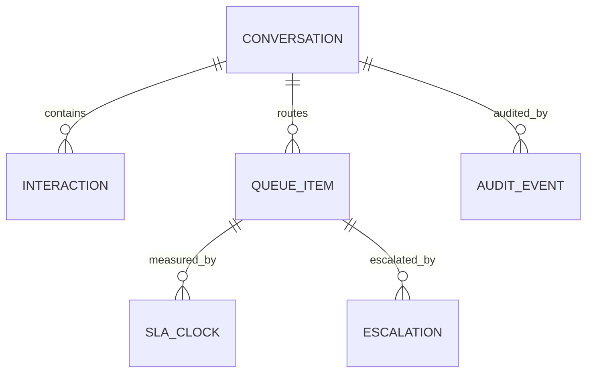

# Erd Database Schema

## Purpose
Define the erd database schema artifacts for the **Customer Support and Contact Center Platform** with implementation-ready detail.

## Domain Context
- Domain: Support Center
- Core entities: Conversation, Ticket, Queue, SLA Policy, Agent Skill, Bot Session, Escalation
- Primary workflows: intake across channels, skill-based routing and assignment, SLA monitoring and escalation, bot-to-human transfer, QA and workforce planning

## Key Design Decisions
- Enforce idempotency and correlation IDs for all mutating operations.
- Persist immutable audit events for critical lifecycle transitions.
- Separate online transaction paths from async reconciliation/repair paths.

## Reliability and Compliance
- Define SLOs and error budgets for user-facing operations.
- Include RBAC, least-privilege service identities, and full audit trails.
- Provide runbooks for degraded mode, replay, and backfill operations.

## Detailed Design Emphasis
- Table/entity constraints and invariants are explicit.
- Failure semantics for retries/timeouts are defined per integration.
- Versioning strategy documented for APIs, events, and data migrations.

## ERD Narrative and Data Integrity Controls

Schema constraints:
- `queue_item` unique active row per conversation.
- `sla_clock` unique `(queue_item_id, clock_type, policy_version)`.
- `escalation` foreign-key to `sla_clock` when breach-induced.
- `audit_event` append-only (no updates/deletes) with partitioning by `event_date`.
- Incident records link to affected queue items for postmortem impact analysis.

Operational coverage note: this artifact also specifies omnichannel controls for this design view.
