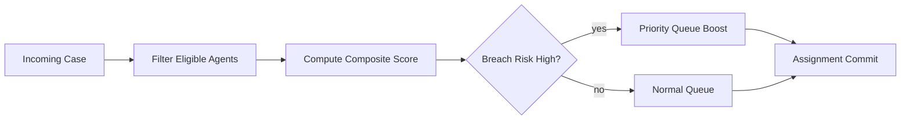

# Routing and Workforce Management

## Problem Scope
This document details architecture and operational controls for **routing and workforce management** in the **Customer Support and Contact Center Platform**.

## Core Invariants
- Critical mutations are idempotent and traceable through correlation IDs.
- Reconciliation can recompute canonical state from immutable source events.
- User-visible state transitions remain monotonic and auditable.

## Workflow Design
1. Validate request shape, policy, and actor permissions.
2. Execute transactional write(s) with optimistic concurrency protections.
3. Emit durable events for downstream projections and side effects.
4. Run compensating actions when asynchronous steps fail.

## Data and API Considerations
- Enumerate lifecycle statuses and forbidden transitions.
- Define read model projections for dashboards and operations tooling.
- Include API idempotency keys, pagination, filtering, and cursor semantics.

## Failure Handling
- Timeout handling with bounded retries and dead-letter workflows.
- Human-in-the-loop escalation path for unrecoverable conflicts.
- Post-incident replay/backfill procedure with verification checklist.

## Routing and Workforce Deep Narrative
Routing score formula combines skill match, customer tier, language, backlog age, and agent occupancy. Workforce planner constraints (shift, concurrency cap, certification) are hard filters before scoring.

Escalation chain: queue lead -> duty manager -> incident commander, with auto-escalation when acknowledgment SLA is missed.

Operational coverage note: this artifact also specifies omnichannel controls for this design view.
