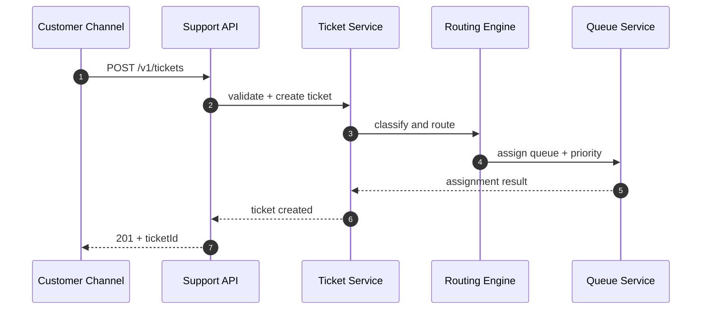
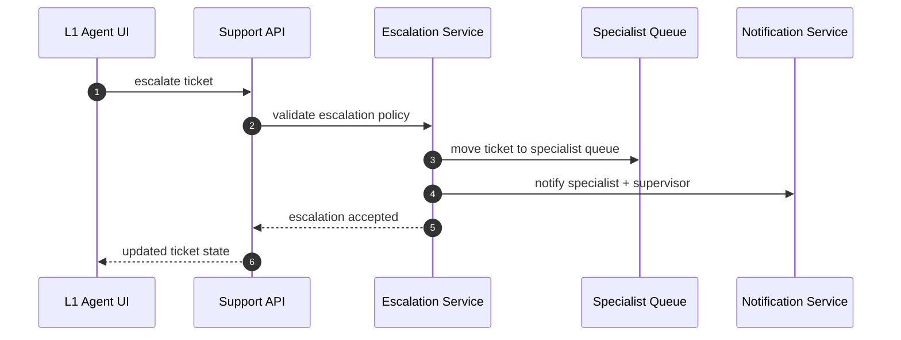

# Sequence Diagrams

## Ticket Creation and Routing

```mermaid
sequenceDiagram
    autonumber
    participant C as Customer Channel
    participant API as Support API
    participant T as Ticket Service
    participant R as Routing Engine
    participant Q as Queue Service

    C->>API: POST /v1/tickets
    API->>T: validate + create ticket
    T->>R: classify and route
    R->>Q: assign queue + priority
    Q-->>T: assignment result
    T-->>API: ticket created
    API-->>C: 201 + ticketId
```

## Escalation Workflow

```mermaid
sequenceDiagram
    autonumber
    participant A as L1 Agent UI
    participant API as Support API
    participant E as Escalation Service
    participant S as Specialist Queue
    participant N as Notification Service

    A->>API: escalate ticket
    API->>E: validate escalation policy
    E->>S: move ticket to specialist queue
    E->>N: notify specialist + supervisor
    E-->>API: escalation accepted
    API-->>A: updated ticket state
```
