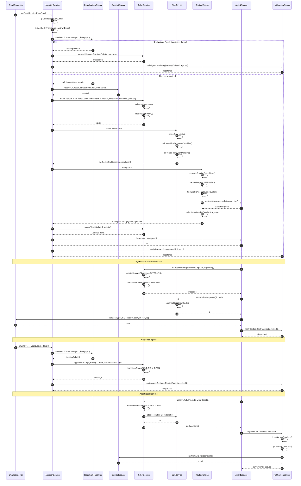
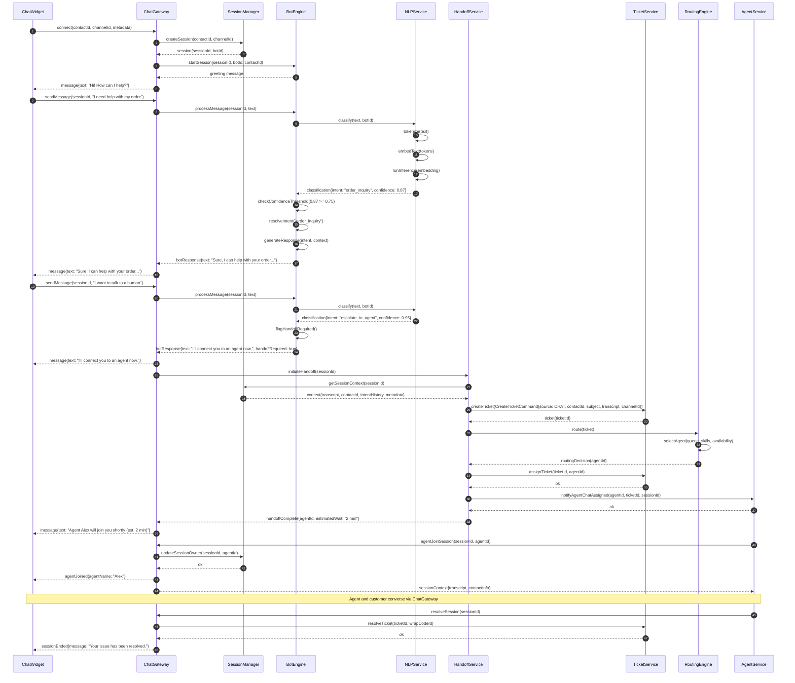
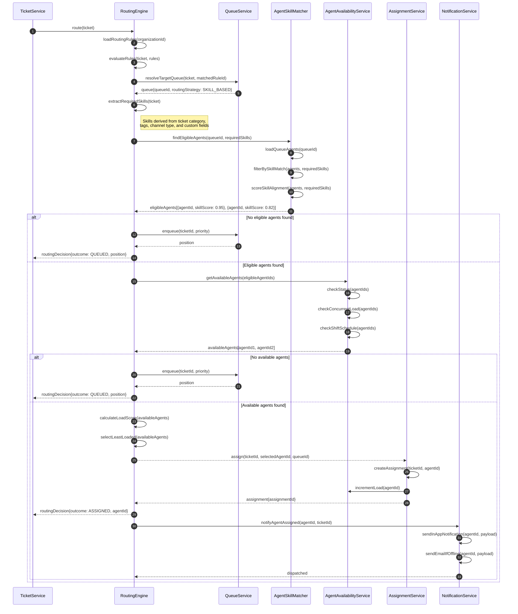
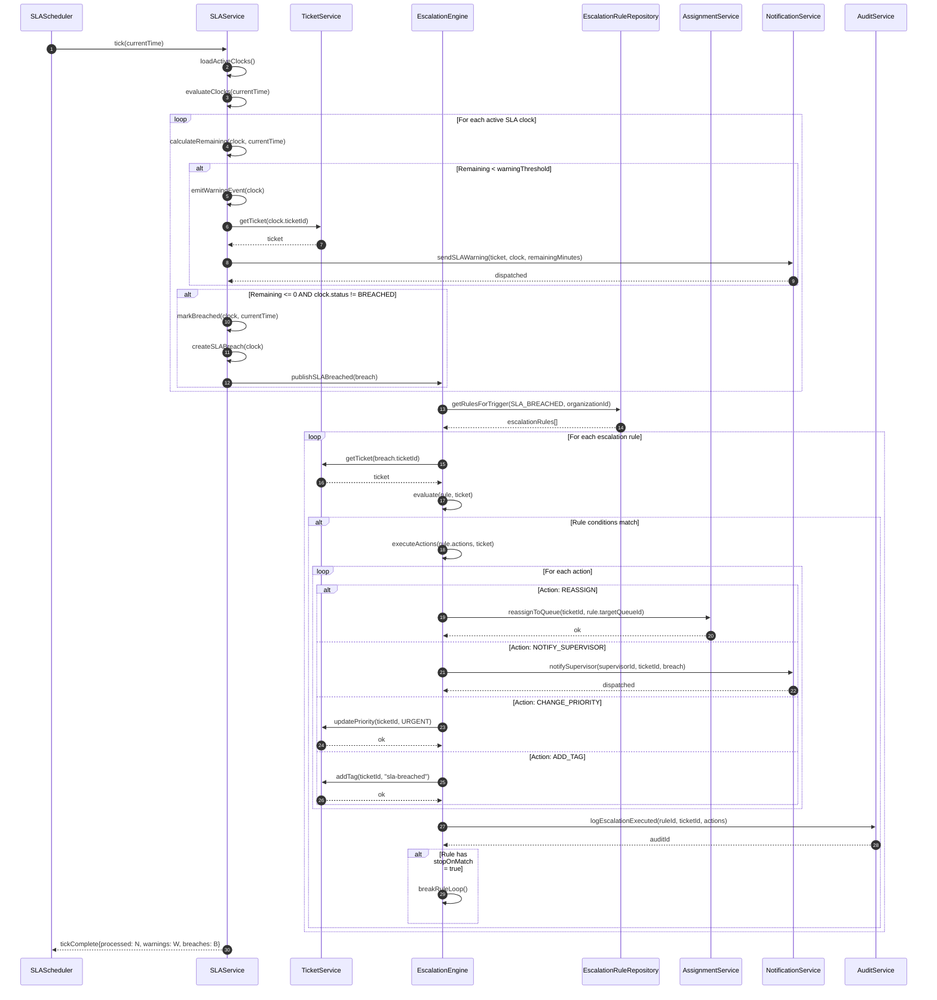
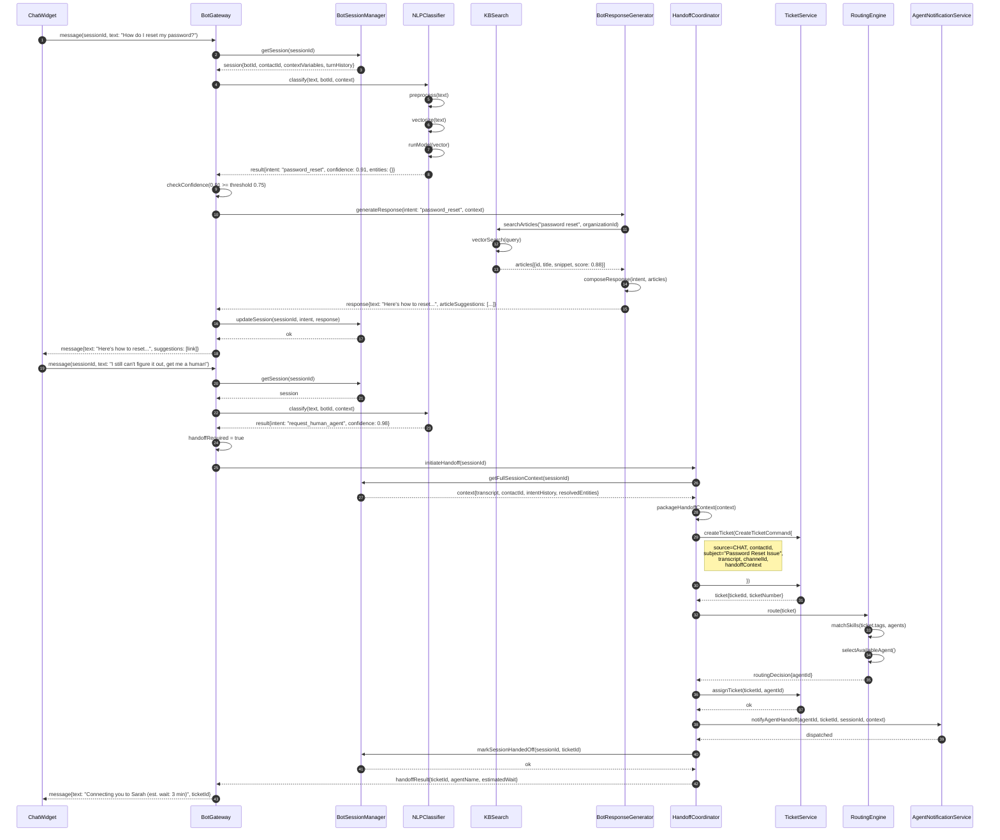
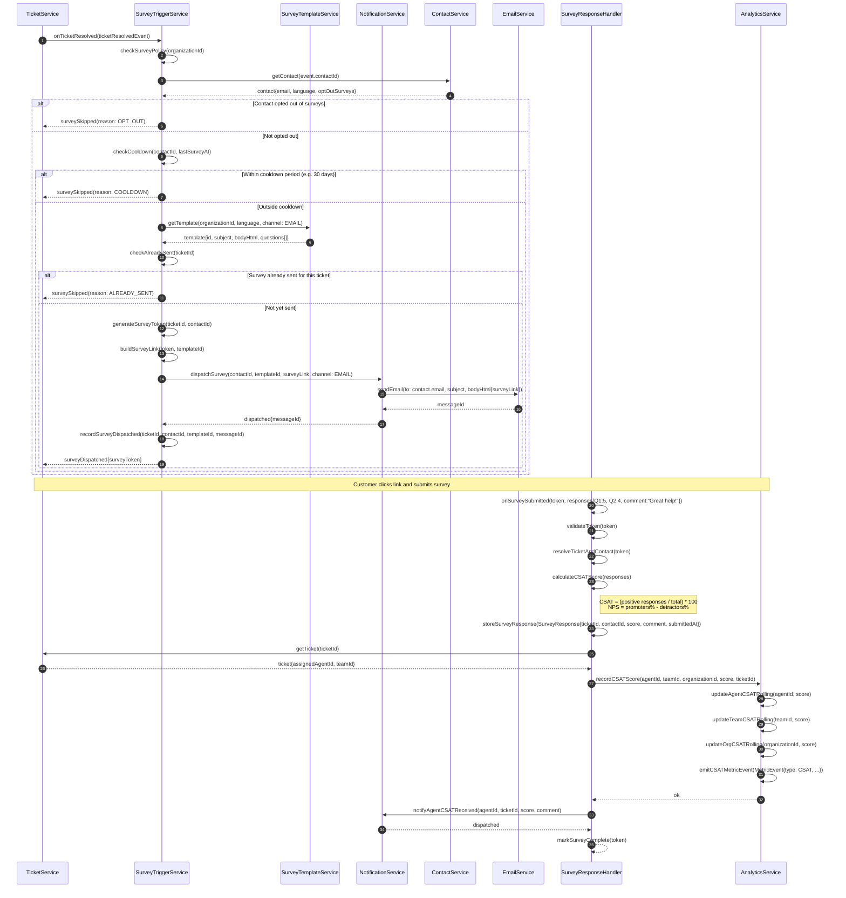

# Sequence Diagrams — Customer Support and Contact Center Platform

> **Document Purpose:** Defines runtime interaction flows between system participants using UML sequence diagrams rendered in Mermaid. Each diagram traces a key use case end-to-end, showing synchronous calls, asynchronous events, conditional branches, and error paths.

---

## SD-001 — Complete Ticket Lifecycle via Email

**Scenario:** A customer sends an email to the support address. The platform ingests it, deduplicates it, resolves the contact, creates a ticket, starts SLA clocks, routes to the best agent, notifies the agent, the agent replies, the customer is notified of the reply, the agent marks the ticket resolved, and a CSAT survey is dispatched.

**Participants:**
- `EmailConnector` — polls or receives webhooks from the email provider (Gmail / Outlook / IMAP)
- `IngestionService` — normalises raw email into platform `Message` objects
- `DeduplicationService` — prevents duplicate tickets from thread-reply chains
- `ContactService` — resolves or creates the `Contact` record
- `TicketService` — creates and manages `Ticket` lifecycle
- `SLAService` — starts first-response and resolution clocks
- `RoutingEngine` — selects the best queue/agent
- `AgentService` — updates agent load and availability
- `NotificationService` — pushes real-time and email alerts

---

## SD-002 — Live Chat Session to Ticket

**Scenario:** A customer opens the chat widget. The bot greets them, identifies their intent via NLP, responds. The customer escalates to a human agent. The bot packages the session context, creates a ticket, the routing engine assigns an agent, and the agent joins the conversation.

**Participants:**
- `ChatWidget` — browser-embedded JS widget
- `ChatGateway` — WebSocket server handling real-time chat messages
- `SessionManager` — tracks live chat sessions state
- `BotEngine` — orchestrates bot conversation
- `NLPService` — intent classification via ML model
- `HandoffService` — coordinates bot-to-agent handoff
- `TicketService` — creates ticket from chat session
- `RoutingEngine` — assigns ticket to best agent
- `AgentService` — notifies and connects agent to chat

---

## SD-003 — Skill-Based Routing

**Scenario:** A new ticket enters the queue. The routing engine evaluates routing rules, extracts required agent skills from the ticket metadata, finds eligible agents, checks real-time availability, selects the least-loaded agent, assigns the ticket, and notifies the agent.

---

## SD-004 — SLA Breach Detection and Escalation

**Scenario:** A scheduled job fires every minute. The SLA service checks all active SLA clocks, identifies clocks approaching their deadline, emits warnings, detects breaches, publishes breach events, and the escalation engine evaluates rules and takes configured actions (reassign, notify supervisor, etc.).

---

## SD-005 — Bot NLP Intent Recognition and Handoff

**Scenario:** A message arrives in a bot session. The bot gateway looks up the session, the NLP classifier determines intent with confidence score. If confidence is below threshold, a fallback KB search is attempted. If the customer requests a human (or bot cannot resolve), a handoff is initiated — the context is packaged, a ticket is created, and the routing engine assigns an agent.

---

## SD-006 — CSAT Survey Dispatch and Response Collection

**Scenario:** A ticket is resolved. The survey trigger service evaluates whether to send a survey (checking cooldown periods and opt-out preferences). A survey link is generated and dispatched via email. The customer submits the survey. The response is stored, the score is aggregated, and the analytics service updates agent and team CSAT metrics.

---

*Last updated: 2025 | Version: 1.0 | Owner: Platform Engineering*
