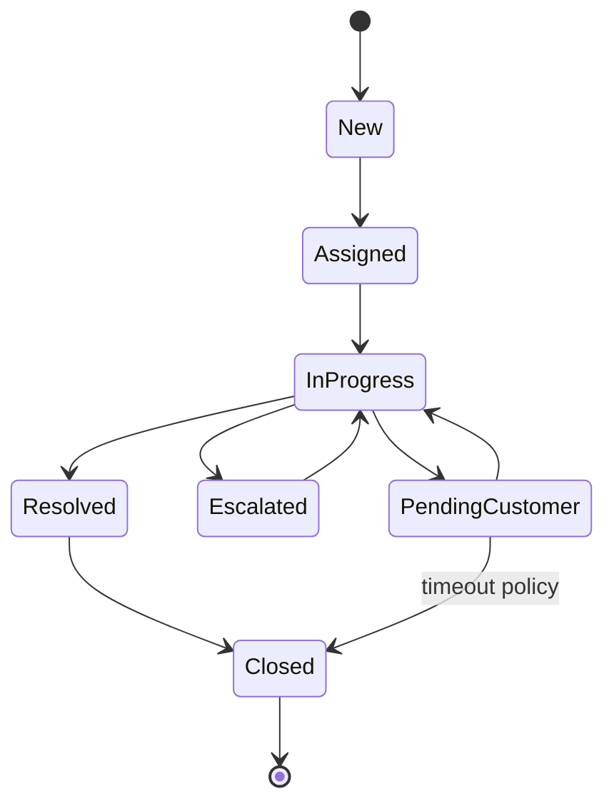
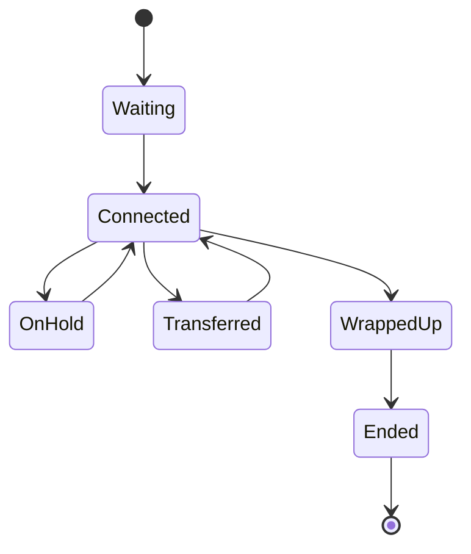
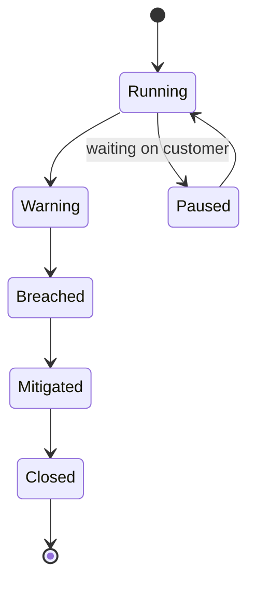
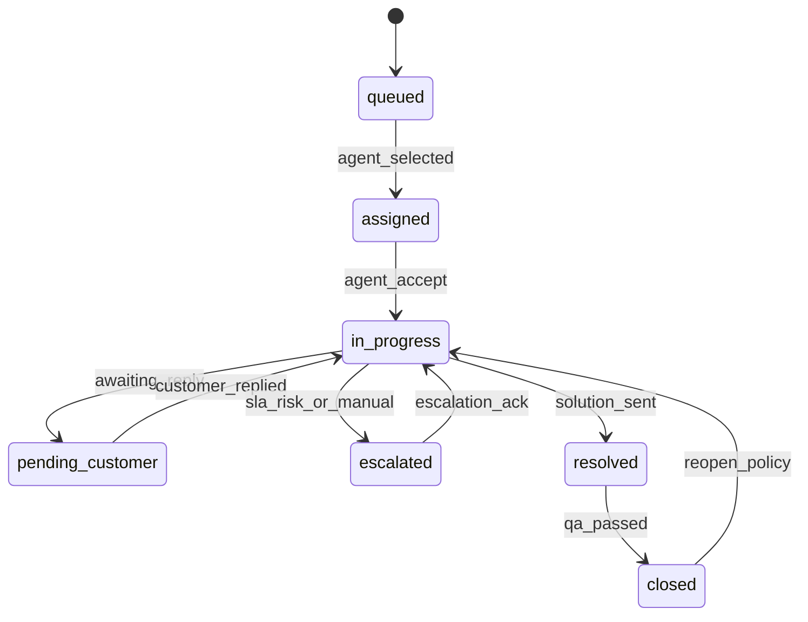

# State Machine Diagrams

## Ticket Lifecycle

## Conversation Session Lifecycle

## SLA Timer Lifecycle

## State Machine Operational Narrative

Transition guards must validate SLA pause semantics, actor authorization, and audit emission before commit.

Operational coverage note: this artifact also specifies omnichannel and incident controls for this design view.
