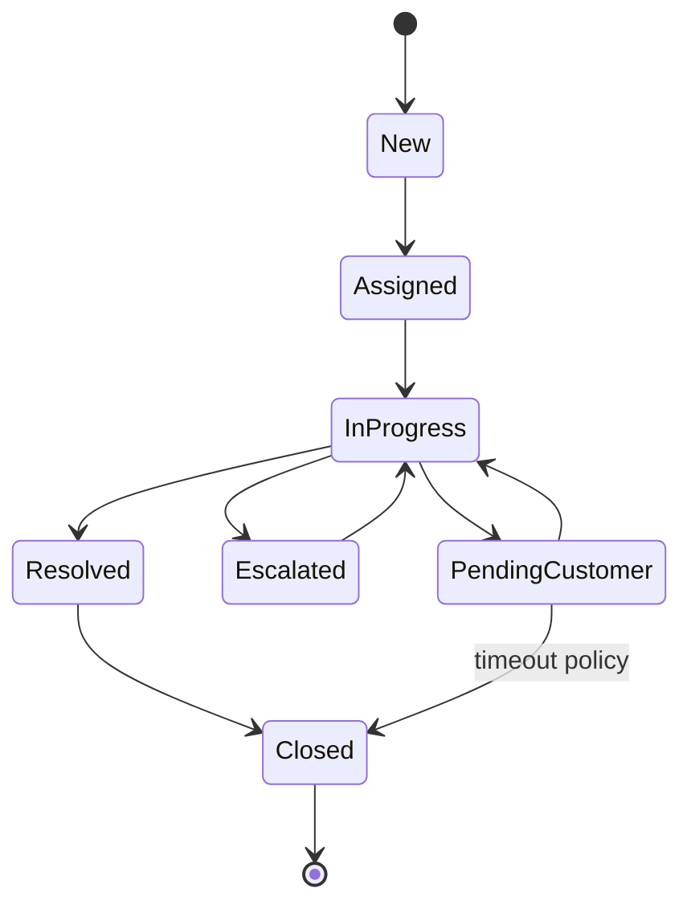
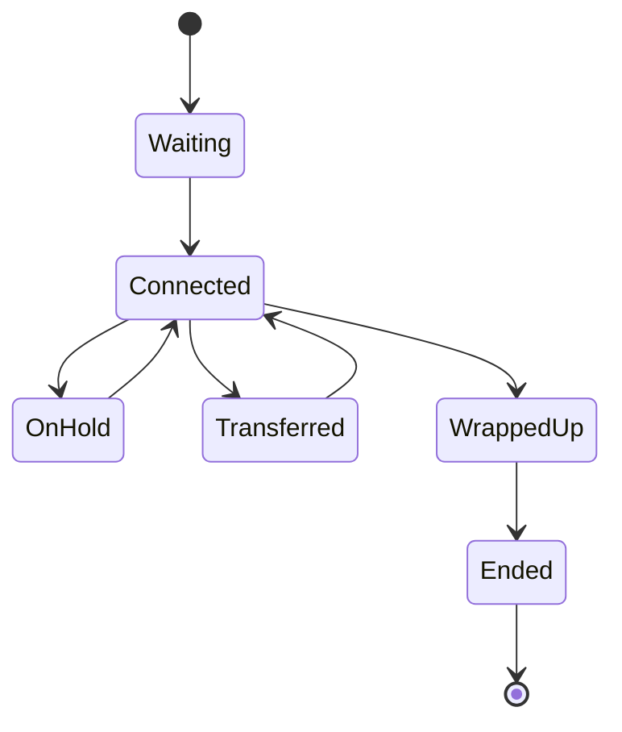
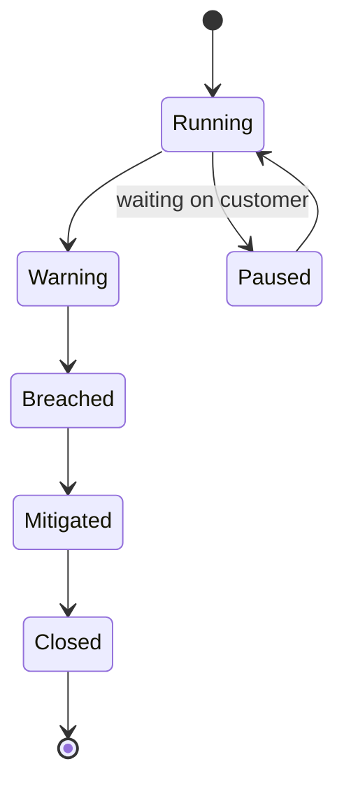

# State Machine Diagrams

## Ticket Lifecycle

```mermaid
stateDiagram-v2
    [*] --> New
    New --> Assigned
    Assigned --> InProgress
    InProgress --> PendingCustomer
    PendingCustomer --> InProgress
    InProgress --> Escalated
    Escalated --> InProgress
    InProgress --> Resolved
    Resolved --> Closed
    PendingCustomer --> Closed: timeout policy
    Closed --> [*]
```

## Conversation Session Lifecycle

```mermaid
stateDiagram-v2
    [*] --> Waiting
    Waiting --> Connected
    Connected --> OnHold
    OnHold --> Connected
    Connected --> Transferred
    Transferred --> Connected
    Connected --> WrappedUp
    WrappedUp --> Ended
    Ended --> [*]
```

## SLA Timer Lifecycle

```mermaid
stateDiagram-v2
    [*] --> Running
    Running --> Warning
    Warning --> Breached
    Running --> Paused: waiting on customer
    Paused --> Running
    Breached --> Mitigated
    Mitigated --> Closed
    Closed --> [*]
```
