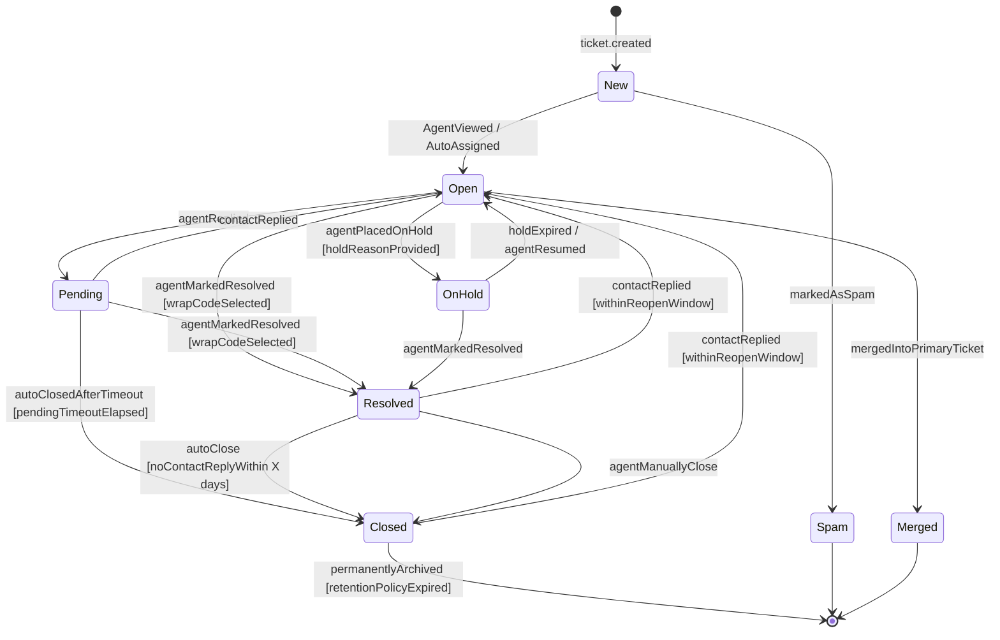
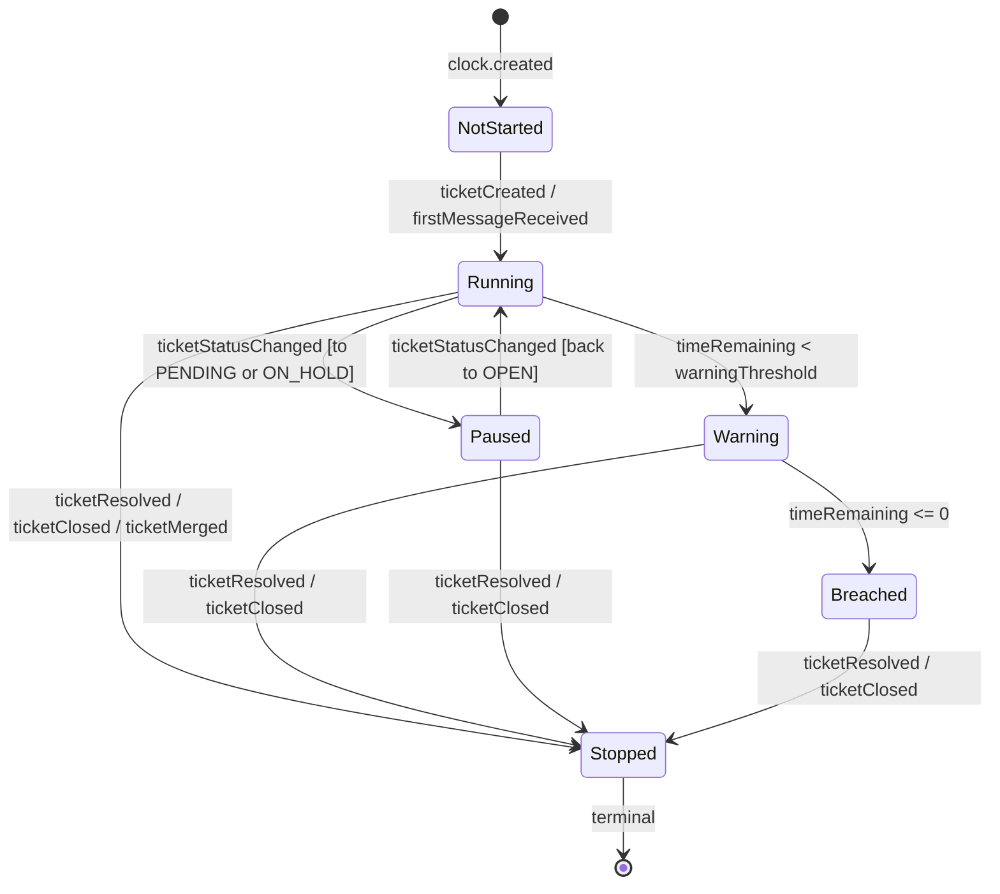
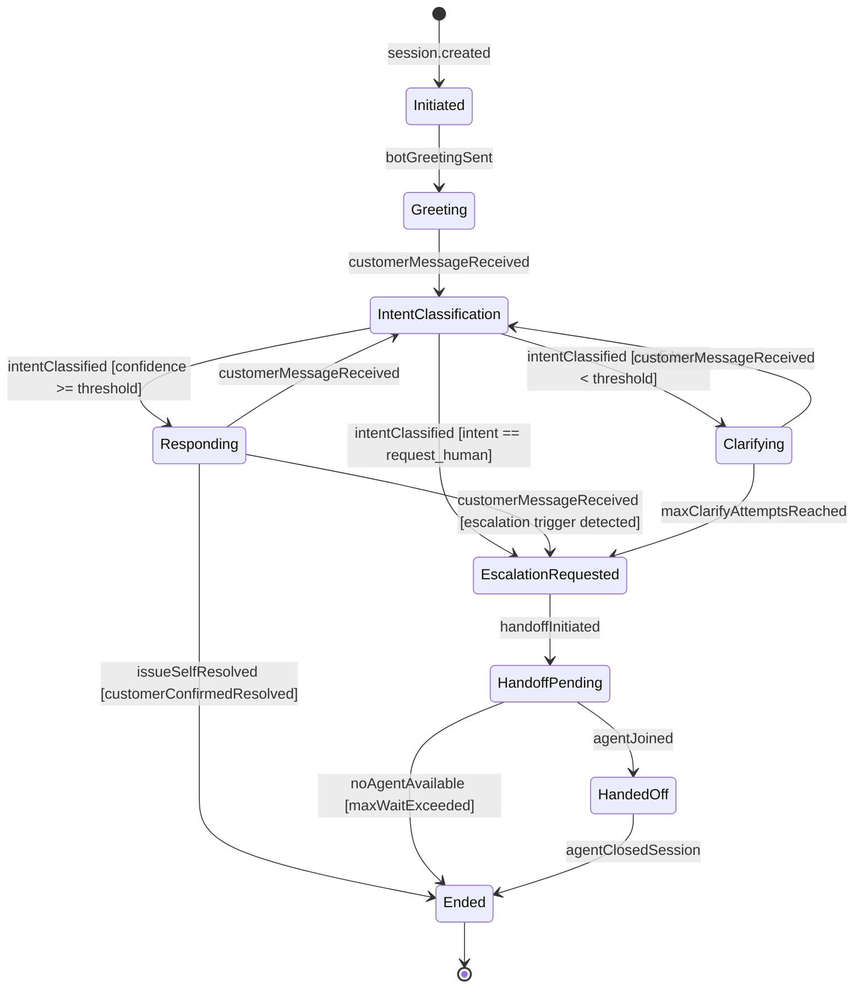
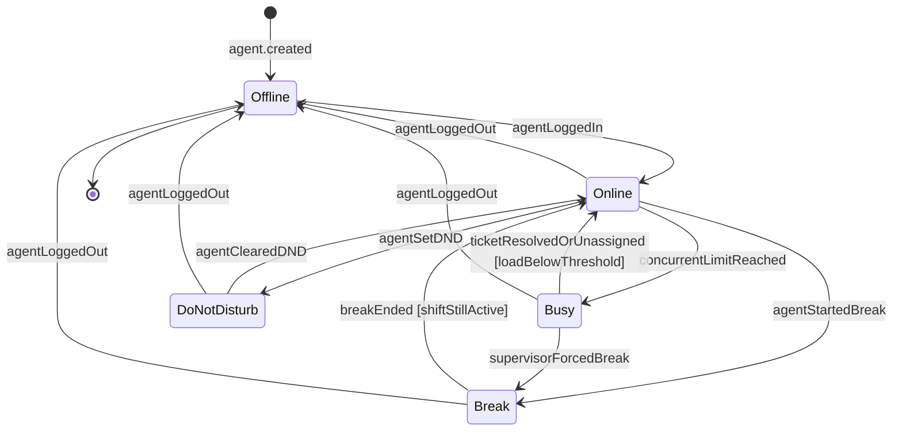
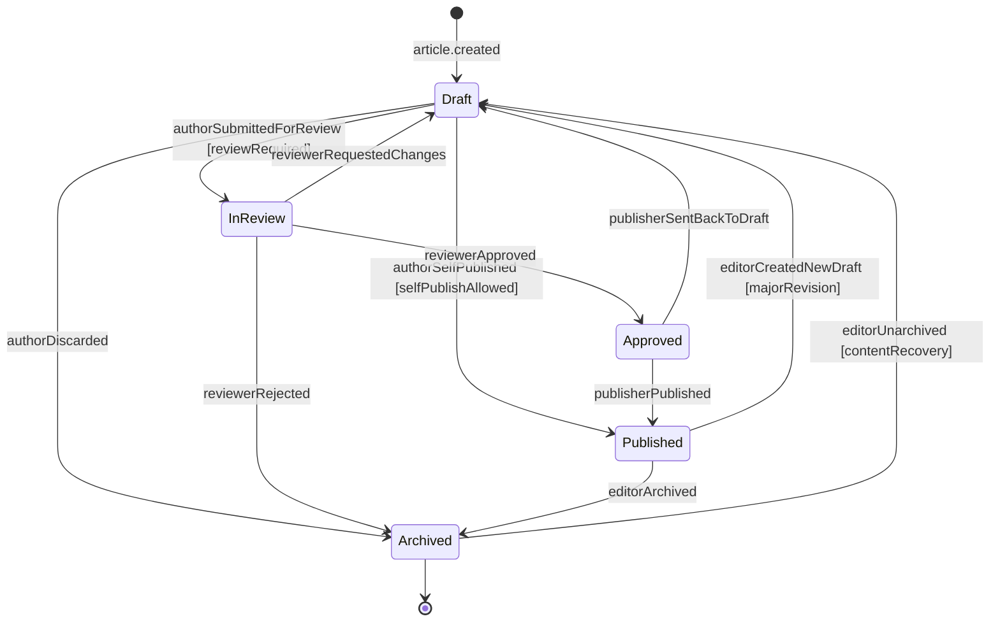

# State Machine Diagrams — Customer Support and Contact Center Platform

> **Document Purpose:** Specifies all stateful lifecycle models in the platform using UML state diagrams rendered in Mermaid `stateDiagram-v2` syntax. Each state machine includes a diagram, state descriptions, a transition table (trigger, guard, actions), and business rules referenced.

---

## SM-001 — Ticket Status State Machine

**Description:** The Ticket is the central aggregate of the platform. Its `status` field drives SLA clock behaviour, agent assignment eligibility, routing queue membership, and survey dispatch. Every transition is guarded and produces side-effects (domain events, SLA clock operations, notifications).

### State Descriptions

| State | Description |
|-------|-------------|
| **New** | Ticket has been created but no agent has viewed or been assigned to it. SLA first-response clock is running. |
| **Open** | Ticket is actively being worked on. Agent is assigned. SLA clocks are running unless business-hours paused. |
| **Pending** | Agent has replied and is awaiting a customer response. First-response SLA stops. Resolution SLA may pause per policy. |
| **On Hold** | Agent has deliberately paused work (e.g., awaiting third-party). Resolution SLA clock is paused. |
| **Resolved** | Agent has completed work and applied a wrap code. Resolution SLA clock stops. CSAT survey is triggered. |
| **Closed** | Ticket is permanently closed. Re-open only allowed within the configured window. All SLA clocks frozen. |
| **Spam** | Ticket identified as spam. Excluded from all metrics and SLA calculations. |
| **Merged** | Ticket has been merged into a primary ticket. It retains read-only history. |

### Transition Table

| # | From | To | Trigger | Guard | Actions |
|---|------|----|---------|-------|---------|
| T1 | New | Open | `AgentAssigned` event | Agent status is Online/Busy | Start first-response SLA clock; send agent notification |
| T2 | New | Open | `AgentViewed` event | Ticket not yet assigned to anyone else | Auto-assign viewing agent if policy allows |
| T3 | Open | Pending | `OutboundMessageCreated` | Message direction = OUTBOUND, sender = agent | Pause resolution SLA clock if `pause_on_pending=true` in policy |
| T4 | Pending | Open | `InboundMessageCreated` | Message direction = INBOUND, sender = contact | Resume resolution SLA clock |
| T5 | Open | OnHold | `TicketHoldRequested` | Hold reason is provided | Pause resolution SLA clock; record hold reason; set hold expiry |
| T6 | OnHold | Open | `HoldExpired` timer event | Current time >= holdExpiresAt | Resume resolution SLA clock; notify agent |
| T7 | OnHold | Open | `AgentResumedFromHold` | Agent clicks "Resume" | Resume resolution SLA clock |
| T8 | Open/Pending | Resolved | `AgentResolvedTicket` | Wrap code selected and valid | Stop all SLA clocks; record resolvedAt; trigger CSAT survey dispatch |
| T9 | Resolved | Closed | `AutoCloseTimer` | No inbound message within `auto_close_days` | Record closedAt; emit TicketClosed event |
| T10 | Resolved | Open | `ContactReplied` | Current time within `reopen_window_days` of resolvedAt | Reopen ticket; restart resolution SLA clock; notify agent |
| T11 | Closed | Open | `ContactReplied` | Current time within `reopen_window_days` of closedAt | Reopen ticket; restart resolution SLA clock; notify agent |
| T12 | Any | Merged | `TicketMerged` | Calling agent has merge permission | Transfer all messages to primary ticket; freeze SLA clocks |
| T13 | New/Open | Spam | `MarkedSpam` | Agent has spam permission | Exclude from all queues and reports |

### Business Rules

- **BR-01:** SLA clock pausing on `Pending` is optional and controlled by `SLAPolicy.pauseOnPending`.
- **BR-02:** The auto-close timeout is configurable per organization (`org.settings.auto_close_days`; default 7).
- **BR-03:** The reopen window is configurable per organization (`org.settings.reopen_window_days`; default 30).
- **BR-04:** A `Resolved → Open` transition resets the resolution SLA deadline using the remaining time budget.
- **BR-05:** Only agents with the `MERGE_TICKETS` permission can trigger the Merged transition.

---

## SM-002 — SLA Clock State Machine

**Description:** Each ticket has one or more `SLAClock` instances (first-response, next-response, resolution). The clock tracks elapsed business time against a configured deadline. The state machine is the authoritative model for breach detection logic.

### State Descriptions

| State | Description |
|-------|-------------|
| **Not Started** | Clock record created but not yet activated. Awaiting the triggering event (e.g., ticket creation confirms channel receipt). |
| **Running** | Elapsed time is accumulating. Business hours filter may pause real-time accumulation outside hours. |
| **Paused** | Clock time is frozen due to a status transition that suspends SLA obligation (Pending, On Hold). |
| **Warning** | Remaining time has dropped below `SLAPolicy.warningThresholdPercent`. Warning notifications are dispatched. |
| **Breached** | Time elapsed exceeds the deadline. SLABreach record created. Escalation engine activated. |
| **Stopped** | Terminal state. The clock is frozen (either met its deadline or ticket was resolved/closed). |

### Transition Table

| # | From | To | Trigger | Guard | Actions |
|---|------|----|---------|-------|---------|
| C1 | NotStarted | Running | `TicketCreated` | Policy applies to ticket | Record `startedAt`; calculate `dueAt` and `warnAt` |
| C2 | Running | Paused | `TicketStatusChanged` | New status is PENDING or ON_HOLD | Record `pausedAt`; accumulate pause duration |
| C3 | Paused | Running | `TicketStatusChanged` | New status is OPEN | Recalculate `dueAt` using accumulated pause; clear `pausedAt` |
| C4 | Running | Warning | `TickerEvaluation` | `remaining < warnAt` | Emit `SLAWarning` event; notify agent and supervisor |
| C5 | Warning | Breached | `TickerEvaluation` | `remaining <= 0` | Create `SLABreach` record; emit `SLABreached` event; activate EscalationEngine |
| C6 | Running/Warning/Paused/Breached | Stopped | `TicketResolved` | Any | Record `stoppedAt`; calculate final elapsed; emit `SLAClosed` metric event |

### Business Rules

- **BR-01:** Business hours calculation uses `BusinessHoursSchedule` associated with the `SLAPolicy`. Clocks advance only during business hours.
- **BR-02:** Warning threshold defaults to 80% of deadline elapsed (`warningThresholdPercent = 80`).
- **BR-03:** The `NotStarted → Running` transition is idempotent — duplicate events do not restart the clock.
- **BR-04:** If an SLAPolicy changes while clocks are Running, the `recalculate()` operation recomputes deadlines preserving elapsed time.

---

## SM-003 — Bot Session State Machine

**Description:** A `BotSession` represents a single customer interaction with the bot within a channel. Sessions progress from greeting through NLP classification loops until they end naturally (issue resolved) or via escalation (handoff to human).

### State Descriptions

| State | Description |
|-------|-------------|
| **Initiated** | Session record created; bot assigned; welcome message being composed. |
| **Greeting** | Bot has sent the initial greeting and is awaiting the first customer input. |
| **Intent Classification** | NLP model is classifying the latest customer message. |
| **Responding** | Bot has classified intent with sufficient confidence and is composing/sending a response. |
| **Clarifying** | Bot confidence was below threshold; bot is asking a clarifying question. |
| **Escalation Requested** | Customer has explicitly requested a human, or bot has triggered automatic escalation. |
| **Handoff Pending** | Ticket created and queued; waiting for an agent to join the session. |
| **Handed Off** | Agent is now actively participating in the session. Bot is silent unless explicitly invoked. |
| **Ended** | Session terminated (resolved, abandoned, or max idle timeout). |

### Transition Table

| # | From | To | Trigger | Guard | Actions |
|---|------|----|---------|-------|---------|
| B1 | Initiated | Greeting | `SessionStarted` | Bot is active | Send welcome message; start idle timeout timer |
| B2 | Greeting | IntentClassification | `CustomerMessageReceived` | Session is active | Record turn; pass text to NLPClassifier |
| B3 | IntentClassification | Responding | `IntentClassified` | `confidence >= bot.confidenceThreshold` | Select response template; resolve KB articles |
| B4 | IntentClassification | Clarifying | `IntentClassified` | `confidence < bot.confidenceThreshold` | Increment clarification counter; send clarifying question |
| B5 | Clarifying | EscalationRequested | `MaxClarifyAttempts` | `clarifyCount >= 3` | Auto-trigger handoff; log low-confidence turns |
| B6 | Any | EscalationRequested | `HandoffIntentDetected` | Intent = request_human | Begin handoff sequence |
| B7 | EscalationRequested | HandoffPending | `HandoffInitiated` | Ticket created successfully | Notify customer of estimated wait time |
| B8 | HandoffPending | HandedOff | `AgentJoinedSession` | Agent accepted assignment | Transfer session control; share transcript with agent |
| B9 | Any | Ended | `IdleTimeoutExpired` | No activity for `bot.idleTimeoutSeconds` | Send timeout message; archive session |

---

## SM-004 — Agent Status State Machine

**Description:** An `Agent`'s `status` field controls routing eligibility. Tickets are routed only to Online or Busy agents within their concurrency limit. The platform supports both manual status changes and automated transitions driven by load.

### State Descriptions

| State | Routing Eligible | Description |
|-------|-----------------|-------------|
| **Offline** | No | Agent is not logged in to the platform. |
| **Online** | Yes (within limit) | Agent is available and accepting new tickets. |
| **Busy** | No (at capacity) | Agent has reached their `maxConcurrentTickets` limit. No new assignments. |
| **Break** | No | Agent is on a scheduled or ad-hoc break. Supervisor-visible. |
| **Do Not Disturb** | No | Agent is in a sensitive conversation and should not be interrupted. |

### Transition Table

| # | From | To | Trigger | Guard | Actions |
|---|------|----|---------|-------|---------|
| A1 | Offline | Online | `AgentLogin` | Valid session | Record `lastActiveAt`; register in availability service |
| A2 | Online | Busy | `TicketAssigned` | `currentTicketCount >= maxConcurrentTickets` | Auto-set status to Busy; remove from routing pool |
| A3 | Busy | Online | `TicketResolved/Unassigned` | `currentTicketCount < maxConcurrentTickets` | Auto-set status to Online; re-add to routing pool |
| A4 | Online | Break | `AgentStartBreak` | Break type is valid | Notify supervisor; start break timer |
| A5 | Break | Online | `BreakEnded` | Agent's shift is still active | Resume availability |
| A6 | Any | Offline | `AgentLogout / SessionTimeout` | — | Unassign from routing pool; record logout time; alert supervisor if tickets open |
| A7 | Online | DoNotDisturb | `AgentSetDND` | — | Block all new assignments; flag in presence service |

### Business Rules

- **BR-01:** `maxConcurrentTickets` is set per agent (`Agent.maxConcurrentTickets`). Default is configured at the organization level.
- **BR-02:** Automatic `Online → Busy` and `Busy → Online` transitions happen synchronously on ticket assignment/resolution without manual agent action.
- **BR-03:** Supervisors can forcibly change an agent's status (e.g., force to Break). This is audit-logged.
- **BR-04:** If an agent logs out with open assigned tickets, the tickets are automatically re-queued or reassigned per `org.settings.logout_reassignment_policy`.

---

## SM-005 — KB Article Lifecycle State Machine

**Description:** A `KBArticle` moves through a content-governance workflow from initial authoring through editorial review to publication. Articles can be archived when superseded. Each transition is gated by role-based permissions.

### State Descriptions

| State | Visible to End Users | Description |
|-------|---------------------|-------------|
| **Draft** | No | Article is being authored. Auto-saved versions are kept. Not indexed or searchable. |
| **In Review** | No | Submitted for editorial or peer review. Author cannot edit while in review. |
| **Approved** | No | Approved by reviewer. Awaiting final publishing action. |
| **Published** | Yes | Live and indexed. Appears in portal search, bot suggestions, and agent KB panels. Vector embedding generated and stored. |
| **Archived** | No | Removed from active index. Preserved for audit/compliance. Not shown to end users. |

### Transition Table

| # | From | To | Trigger | Guard (Actor/Condition) | Actions |
|---|------|----|---------|------------------------|---------|
| K1 | Draft | InReview | `SubmitForReview` | Actor has `AUTHOR` role | Notify assigned reviewer; lock article for author edits |
| K2 | Draft | Published | `SelfPublish` | Actor has `PUBLISHER` role AND `org.settings.kb_require_review = false` | Index article; generate vector embedding; emit `ArticlePublished` event |
| K3 | InReview | Draft | `RequestChanges` | Actor has `REVIEWER` role | Unlock for author; add reviewer comments; notify author |
| K4 | InReview | Approved | `ApproveArticle` | Actor has `REVIEWER` role | Notify publisher/author; set `approvedAt` |
| K5 | Approved | Published | `PublishArticle` | Actor has `PUBLISHER` role | Set `publishedAt`; index article; generate vector embedding; notify author |
| K6 | Published | Draft | `CreateNewDraft` | Actor has `AUTHOR` or `PUBLISHER` role | Create draft copy; keep current published version live until new draft publishes |
| K7 | Published | Archived | `ArchiveArticle` | Actor has `PUBLISHER` role | Remove from search index; delete vector embedding; emit `ArticleArchived` event |
| K8 | Archived | Draft | `UnarchiveArticle` | Actor has `PUBLISHER` role | Restore to draft state; notify team |
| K9 | InReview | Archived | `RejectArticle` | Actor has `REVIEWER` role | Record rejection reason; notify author |

### Business Rules

- **BR-01:** When `org.settings.kb_require_review = true`, the Draft → Published shortcut is disabled for all agents with only the AUTHOR role.
- **BR-02:** Publishing an article automatically triggers vector embedding generation via the AI search service (async job with retry).
- **BR-03:** The `Published → Draft` transition preserves the live published version until the new draft is published (shadow-draft pattern).
- **BR-04:** Articles archived for > `org.settings.kb_retention_days` (default 365) are eligible for permanent deletion per the data retention policy.
- **BR-05:** Article version history is retained on all transitions. The `KBArticleVersion` table stores a snapshot on each Draft save and on each Publish action.

---

*Last updated: 2025 | Version: 1.0 | Owner: Platform Engineering*
