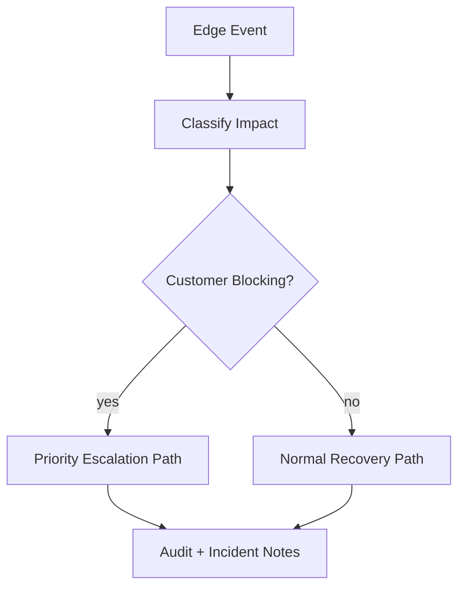

# Edge Cases - Customer Support and Contact Center Platform

This pack captures high-risk edge scenarios for Support Center workflows.
Each document includes failure mode, detection, containment, recovery, and prevention guidance.

## Included Categories
- Domain-specific failure modes
- API/UI reliability concerns
- Security and compliance controls
- Operational incident and runbook procedures

## Edge-Case Handling Strategy
This folder’s scenarios should be interpreted as operational runbooks with explicit queue impact, SLA implications, and incident triggers.

Operational coverage note: this artifact also specifies omnichannel controls for this design view.
