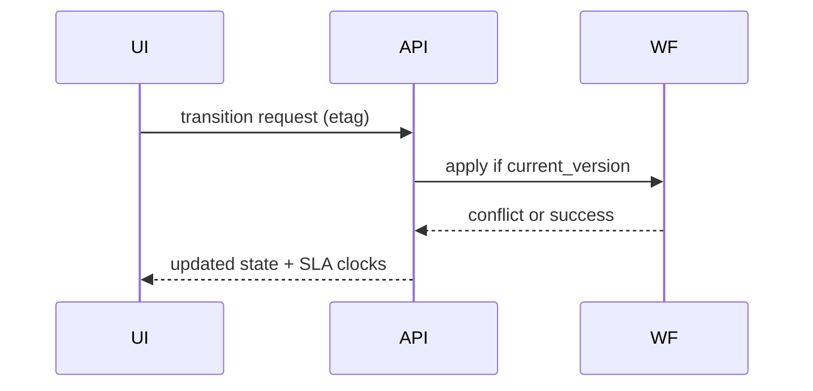

# API And Ui

## API Reliability Risks
- Duplicate client retries without stable idempotency keys.
- Pagination drift during concurrent writes.
- Partial-success composite operations lacking clear error contracts.

## UI/UX Risks
- Stale optimistic views conflicting with authoritative backend state.
- Ambiguous validation and remediation guidance for operators.

## Guardrails
- Standardized error taxonomy and retryability hints.
- ETag/version preconditions for concurrent edits.
- Correlated request IDs visible in UI and support tooling.

## API/UI Edge Case Narrative
- UI must surface queue position, SLA countdown, and escalation reason in real time.
- API should return deterministic conflict codes when stale UI actions attempt invalid transitions.
- Omnichannel race condition: duplicate send events from web + mobile must converge to one timeline entry.
- All client-visible overrides require audit badges and supervisor identity.

Operational coverage note: this artifact also specifies incident controls for this design view.
