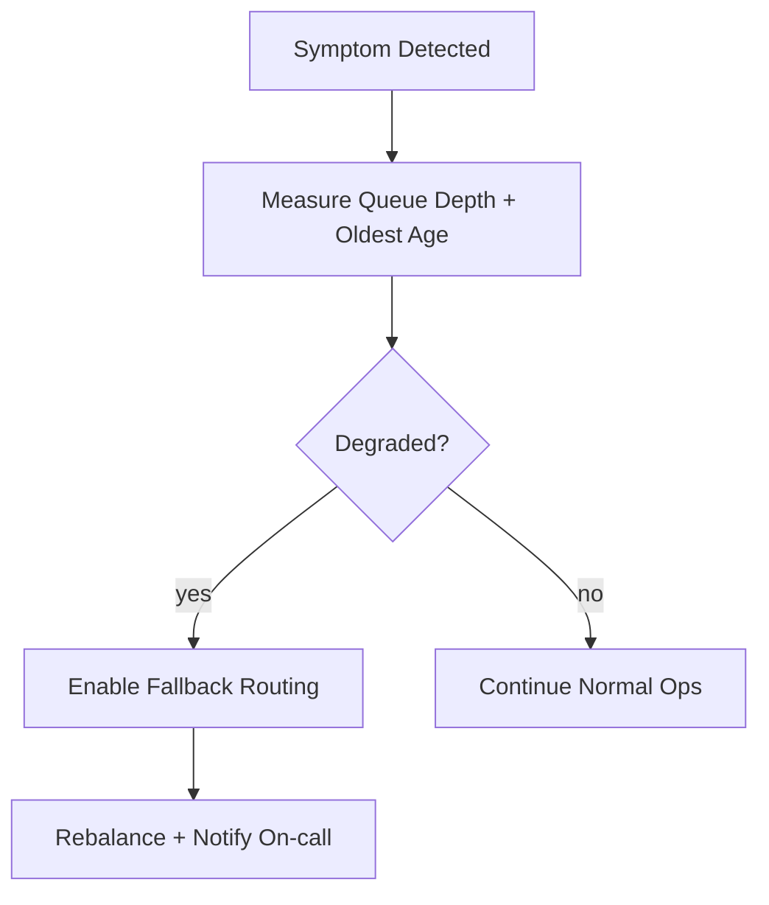

# Operations

## Day-2 Readiness
- SLO dashboard for availability, latency, and data freshness.
- Runbooks for incident triage, rollback, replay, and backfill.
- Capacity planning based on peak traffic and queue depth trends.

## Incident Lifecycle
1. Detect and classify severity with ownership routing.
2. Contain blast radius and communicate stakeholder impact.
3. Recover service and data consistency.
4. Publish postmortem with corrective actions and deadlines.

## Operations Edge Cases Narrative
Operational exceptions include queue starvation, agent disconnect storms, and regional connector brownouts.

For each edge case, define rollback criteria, SLA-risk reporting frequency, and audit records for operator actions.

Operational coverage note: this artifact also specifies omnichannel controls for this design view.
