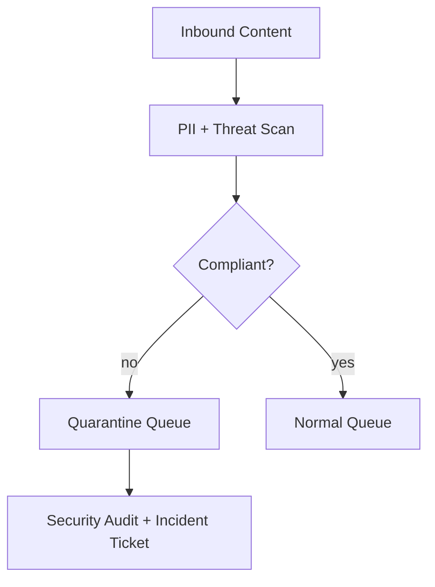

# Security And Compliance

## Sensitive Data Controls
- Classify data by sensitivity and apply masking/tokenization where needed.
- Enforce least privilege for users, services, and break-glass access.

## Compliance Requirements
- Immutable audit logs for admin and policy-changing operations.
- Evidence collection for periodic internal/external audits.
- Regional retention/deletion workflows with legal-hold exceptions.

## Verification
- Quarterly access reviews and key rotation checks.
- Automated policy tests in CI for critical authorization paths.

## Security/Compliance Edge Narratives
- Break-glass access can view but not mutate queue priority unless dual authorization is present.
- Escalation changes on regulated queues require reason taxonomy and immutable evidence.
- Omnichannel ingestion must run malware and PII classifiers before storage.

Operational coverage note: this artifact also specifies sla controls for this design view.
