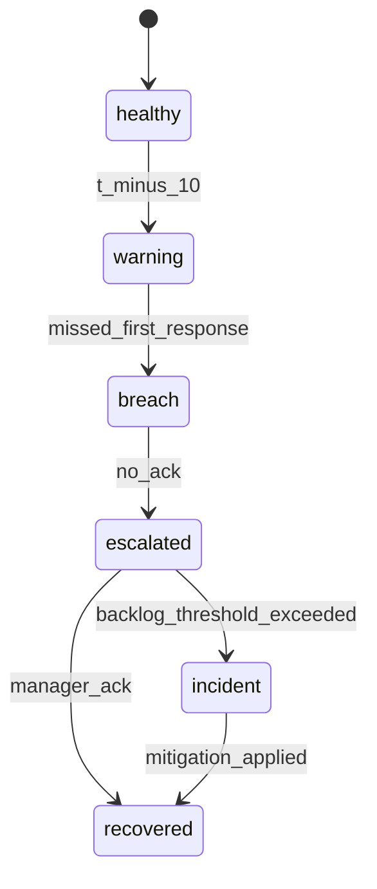

# Sla Escalation

## Scenario
Timer drift and escalation ownership handoff.

## Detection Signals
- Error-rate and latency anomalies on affected services.
- Data integrity checks (duplicate keys, missing transitions, imbalance alerts).
- Queue lag or webhook retry saturation above SLO thresholds.

## Immediate Containment
- Pause risky automation path via feature flag/runbook switch.
- Route affected records into review queue with owner assignment.
- Notify operations channel with incident context and blast radius.

## Recovery Steps
- Reconcile canonical state from source-of-truth events and logs.
- Apply deterministic compensating updates with audit annotations.
- Backfill downstream projections and verify invariant checks pass.

## Prevention
- Add contract tests and chaos scenarios for this edge condition.
- Instrument specific leading indicators and alert tuning.

## SLA Escalation Edge Narrative
This document should model timer drift, mass-breach storms, and delayed acknowledgment escalations.

Incident guidance: when breach-rate > 8% for 10 minutes, declare Sev2 and shift all noncritical queues to reduced automation.

Operational coverage note: this artifact also specifies omnichannel controls for this design view.
