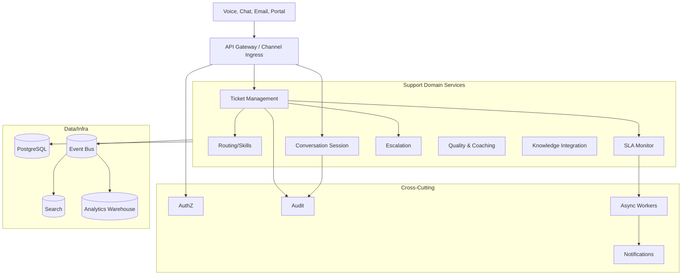

# Architecture Diagram

```mermaid
flowchart TB
    Channels[Voice, Chat, Email, Portal] --> Edge[API Gateway / Channel Ingress]

    subgraph Services[Support Domain Services]
      Ticket[Ticket Management]
      Routing[Routing/Skills]
      Session[Conversation Session]
      SLA[SLA Monitor]
      Escalation[Escalation]
      QA[Quality & Coaching]
      Knowledge[Knowledge Integration]
    end

    Edge --> Ticket
    Edge --> Session
    Ticket --> Routing
    Ticket --> SLA
    Ticket --> Escalation

    subgraph CrossCutting[Cross-Cutting]
      Auth[AuthZ]
      Audit[Audit]
      Notify[Notifications]
      Jobs[Async Workers]
    end

    Edge --> Auth
    Ticket --> Audit
    Session --> Audit
    SLA --> Jobs

    subgraph DataInfra[Data/Infra]
      DB[(PostgreSQL)]
      Bus[(Event Bus)]
      Search[(Search)]
      BI[(Analytics Warehouse)]
    end

    Services --> DB
    Services --> Bus
    Bus --> Search
    Bus --> BI
    Jobs --> Notify
```
