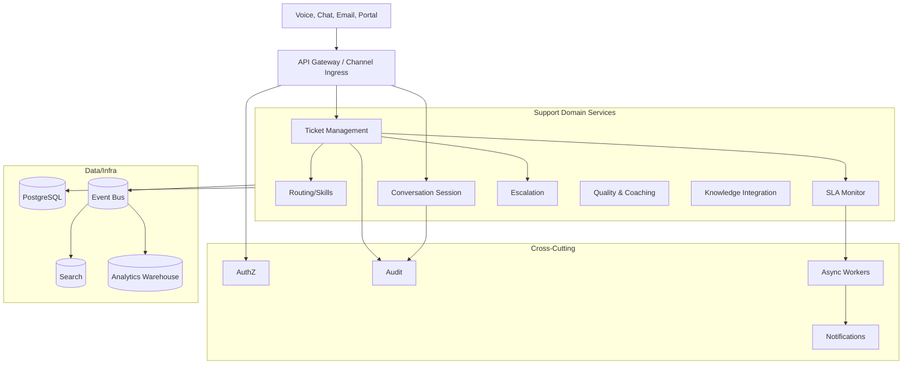
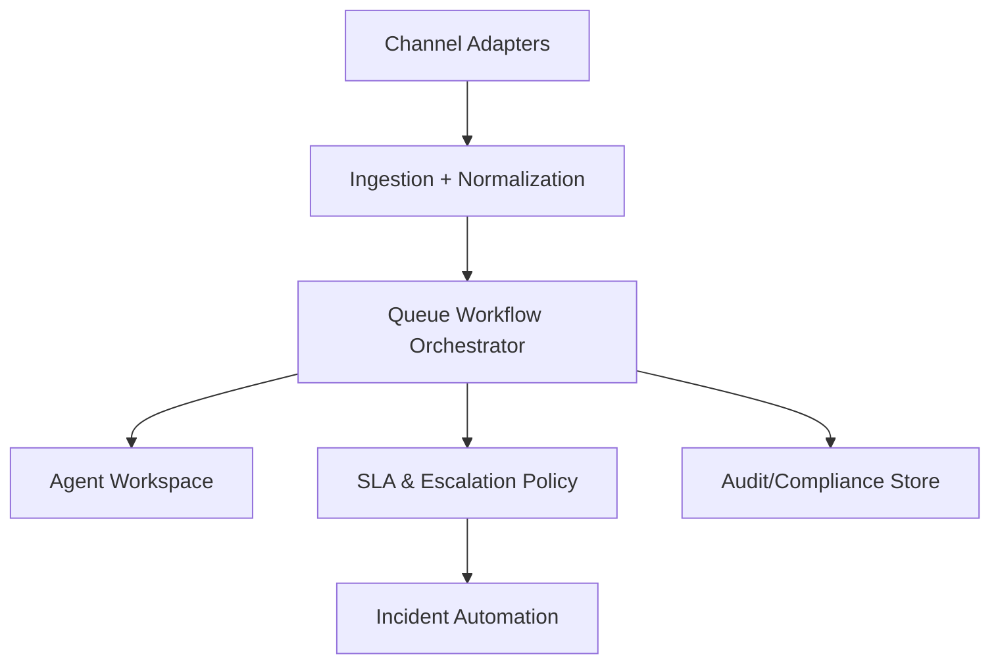

# Architecture Diagram

## Architecture Narrative (Operational Focus)
High-level architecture should depict control planes for routing, SLA policy, and incident orchestration alongside data planes.

Design requirement: no component can bypass orchestrator-owned workflow transitions; direct writes are forbidden to preserve auditability.

Operational coverage note: this artifact also specifies omnichannel controls for this design view.
