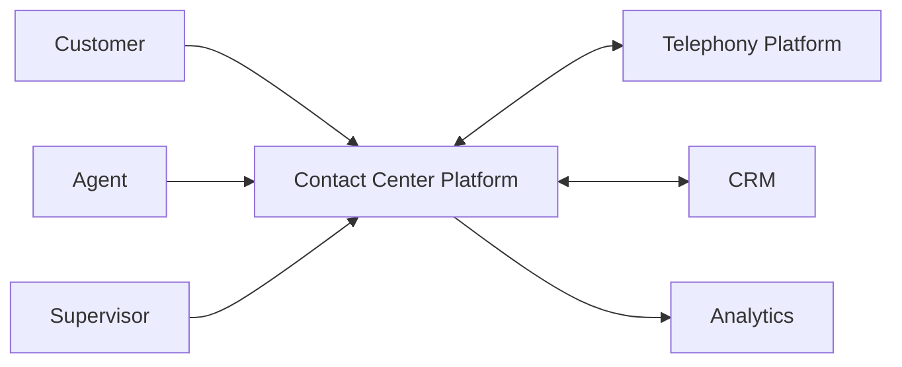
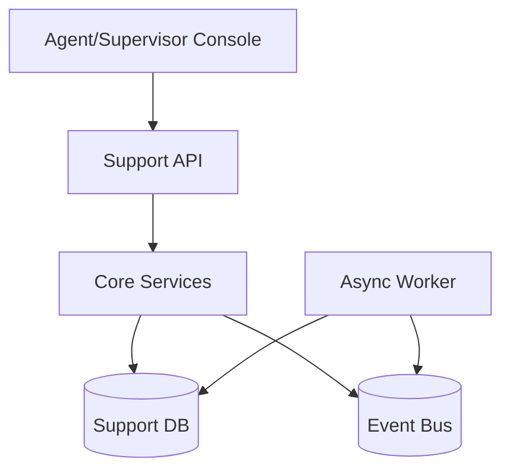
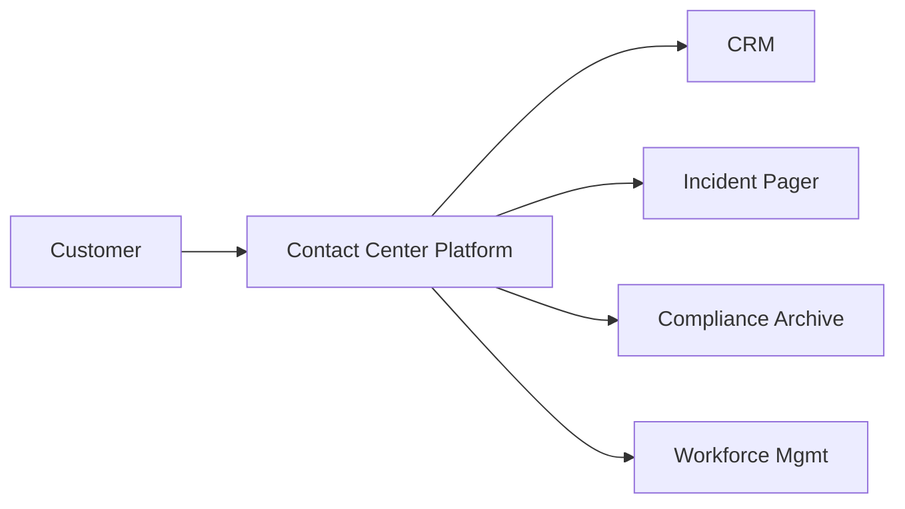

# C4 Diagrams

## C1 Context

## C2 Containers

## C4 Narrative Addendum
At C4 level, include personas and external systems that drive SLA behavior (pager, workforce management, compliance archive).

Container responsibilities should clearly split event ingestion, routing/state machine, SLA evaluation, and immutable auditing.

Operational coverage note: this artifact also specifies queue and omnichannel controls for this design view.
