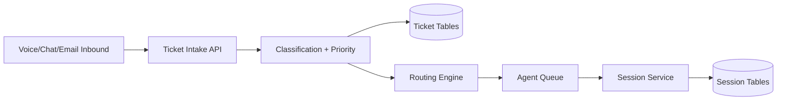
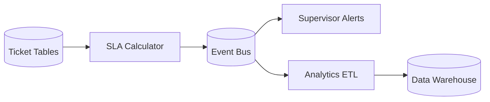
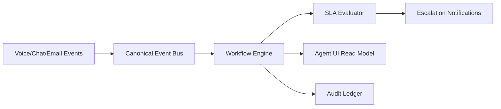

# Data Flow Diagrams

## Ticket and Session Data Flow

## SLA and Reporting Flow

## Data Flow Narrative for Omnichannel + Audit

Data flow invariants: every mutating flow has a corresponding audit flow; every inbound channel flow is normalized before persistence.

Operational coverage note: this artifact also specifies incident controls for this design view.
