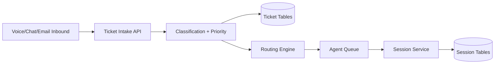
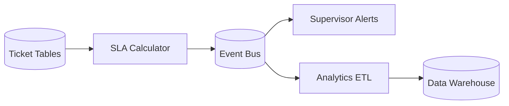

# Data Flow Diagrams

## Ticket and Session Data Flow

```mermaid
flowchart LR
    Channel[Voice/Chat/Email Inbound] --> Intake[Ticket Intake API]
    Intake --> Classify[Classification + Priority]
    Classify --> TicketStore[(Ticket Tables)]
    Classify --> Routing[Routing Engine]
    Routing --> Queue[Agent Queue]
    Queue --> Session[Session Service]
    Session --> SessionStore[(Session Tables)]
```

## SLA and Reporting Flow

```mermaid
flowchart LR
    TicketStore[(Ticket Tables)] --> SlaCalc[SLA Calculator]
    SlaCalc --> Events[(Event Bus)]
    Events --> Alerts[Supervisor Alerts]
    Events --> ETL[Analytics ETL]
    ETL --> WH[(Data Warehouse)]
```
