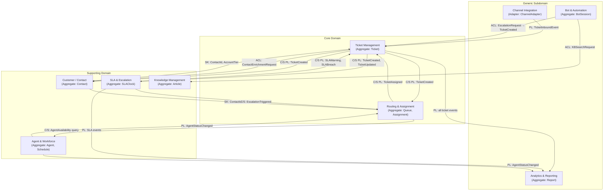
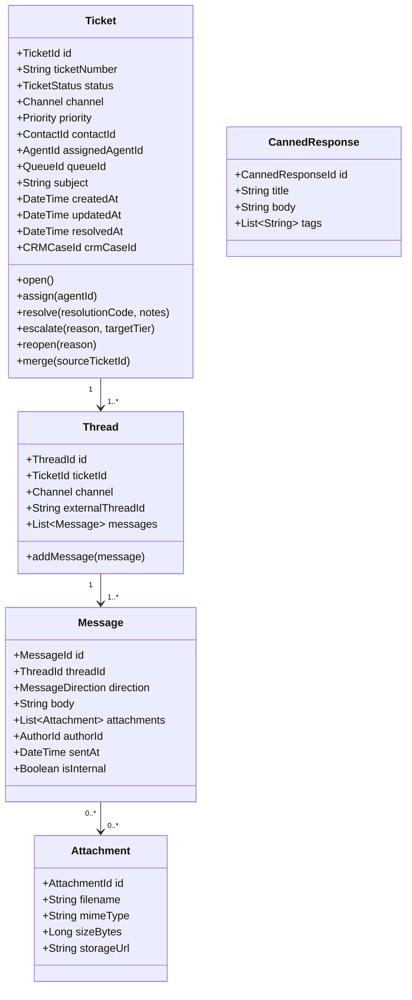
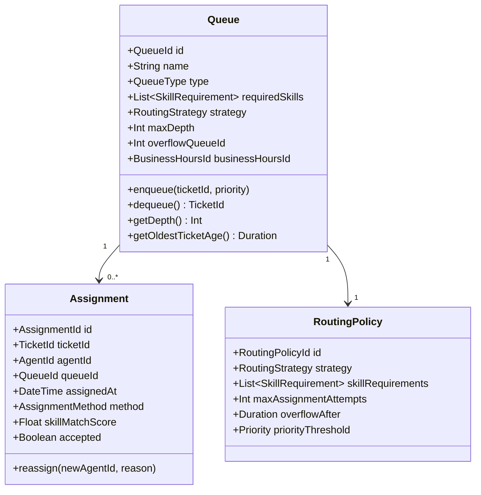
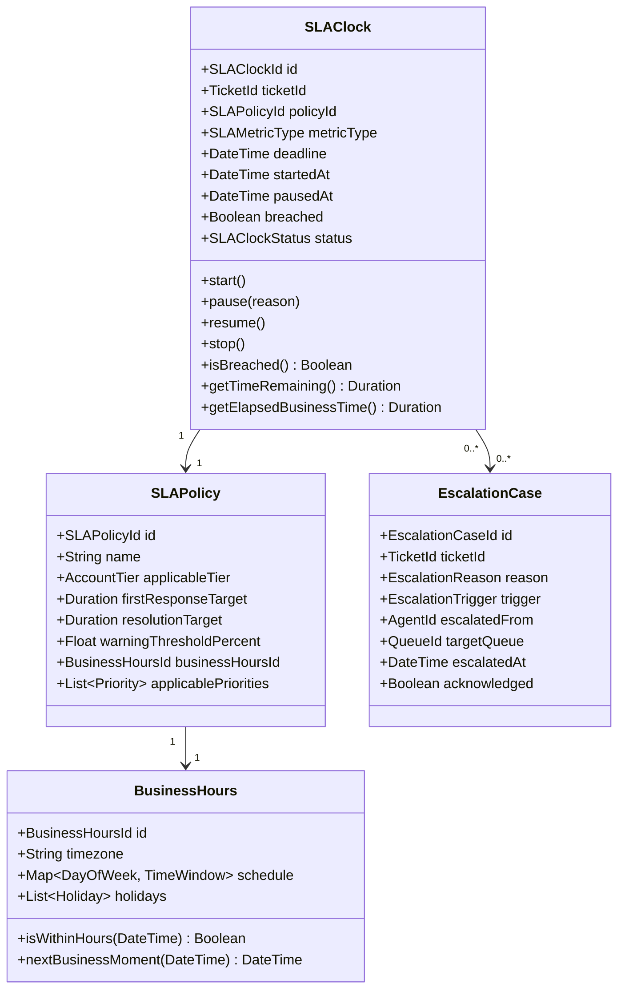
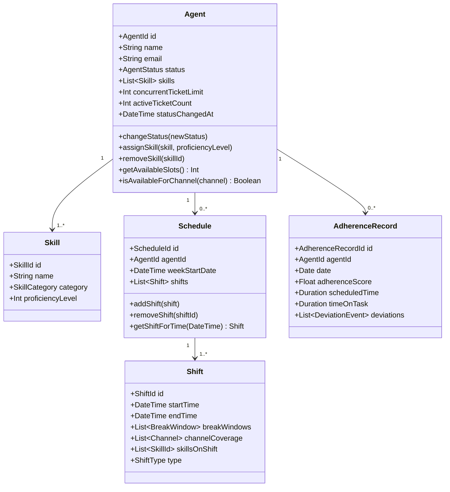
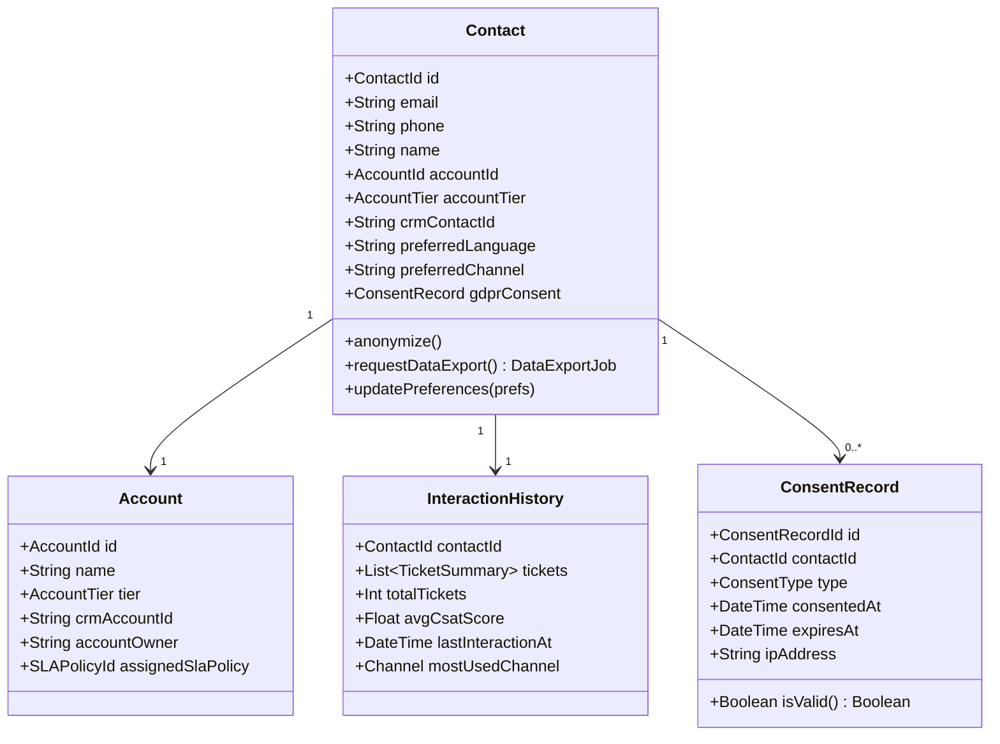

# Domain Model

> **Purpose**: Define the bounded contexts, domain aggregates, context relationships, and ubiquitous language for the **Customer Support and Contact Center Platform**. This document is the authoritative reference for domain concepts and should be consulted during all feature design, API design, and event schema decisions.

---

## 1. Bounded Contexts Overview

The platform is decomposed into nine bounded contexts. Each context owns its data, publishes events, and communicates with other contexts via well-defined integration contracts (events or APIs).

| # | Bounded Context | Classification | Aggregate Roots | Primary Responsibility |
|---|-----------------|----------------|-----------------|------------------------|
| 1 | Ticket Management | Core Domain | `Ticket`, `Thread`, `Message` | Ticket lifecycle, threading, messaging |
| 2 | Routing & Assignment | Core Domain | `Queue`, `Assignment`, `RoutingPolicy` | Queue management, skill matching, agent assignment |
| 3 | SLA & Escalation | Supporting Domain | `SLAClock`, `SLAPolicy`, `EscalationCase` | SLA enforcement, auto-escalation |
| 4 | Agent & Workforce | Supporting Domain | `Agent`, `Schedule`, `Shift` | Agent profiles, scheduling, adherence |
| 5 | Customer / Contact | Supporting Domain | `Contact`, `Account`, `InteractionHistory` | 360-degree profile, GDPR rights |
| 6 | Knowledge Management | Supporting Domain | `Article`, `Category`, `SearchIndex` | KB authoring, AI-powered search |
| 7 | Bot & Automation | Generic Subdomain | `BotSession`, `AutomationRule`, `Intent` | NLP bot flows, automation triggers |
| 8 | Analytics & Reporting | Generic Subdomain | `Report`, `MetricSnapshot`, `Dashboard` | CSAT, NPS, operational metrics |
| 9 | Channel Integration | Generic Subdomain | `ChannelAdapter`, `InboundEvent`, `OutboundEvent` | External channel normalization |

---

## 2. Context Map

The context map shows integration relationships between bounded contexts. Integration patterns used:

- **PL** — Published Language: shared canonical event schema (AsyncAPI spec)
- **ACL** — Anti-Corruption Layer: translation layer protecting core from external models
- **SK** — Shared Kernel: a small shared library (e.g., `TicketId`, `ContactId` value types)
- **C/S** — Customer/Supplier: upstream (supplier) publishes events, downstream (customer) consumes

**Integration Pattern Notes:**
- The **Channel Integration** context is purely an ACL: it receives raw external events (email MIME, WebSocket messages, IVR webhooks) and translates them into canonical `TicketInboundEvent` domain events before they cross the boundary.
- The **Bot & Automation** context acts as an upstream supplier: it creates tickets on behalf of customers during escalation via an ACL that prevents the bot model from leaking into the Ticket context.
- **Analytics & Reporting** is a pure downstream consumer of all domain events via Kafka. It never writes back to core contexts (CQRS read model).

---

## 3. Domain Aggregates

### 3.1 Ticket Management Context

**Aggregate Root: `Ticket`**

**Value Objects**: `TicketNumber`, `Priority`, `Channel`, `TicketStatus`, `ResolutionCode`, `WrapCode`

**Domain Services**: `TicketMergeService` (deduplication logic), `ThreadLinker` (associates inbound emails to existing tickets via Message-ID)

**Domain Events Published**:
| Event | When |
|-------|------|
| `TicketCreated` | New ticket opened from any channel |
| `TicketAssigned` | Agent assigned to ticket |
| `TicketReassigned` | Ticket moved to different agent |
| `TicketResolved` | Ticket marked as resolved |
| `TicketReopened` | Resolved ticket re-opened |
| `TicketEscalated` | Ticket escalated to higher tier |
| `TicketMerged` | Duplicate ticket merged into primary |
| `MessageAdded` | New message (inbound or outbound) added |
| `FirstResponseRecorded` | First outbound message sent by agent |

---

### 3.2 Routing & Assignment Context

**Aggregate Root: `Queue`**

**Value Objects**: `SkillRequirement`, `RoutingStrategy`, `AssignmentMethod`, `SkillMatchScore`

**Domain Services**: `SkillMatchingService`, `LoadBalancer`, `StickyRoutingResolver`

**Domain Events Published**:
| Event | When |
|-------|------|
| `TicketEnqueued` | Ticket added to a queue |
| `TicketDequeued` | Ticket removed from queue for assignment |
| `AssignmentCreated` | Agent assigned to ticket by routing engine |
| `AssignmentAccepted` | Agent explicitly accepts assignment |
| `AssignmentRejected` | Agent rejects / routing engine times out |
| `QueueOverflow` | Queue depth exceeds max, overflow triggered |

---

### 3.3 SLA & Escalation Context

**Aggregate Root: `SLAClock`**

**Value Objects**: `SLAMetricType` (FIRST_RESPONSE, RESOLUTION, NEXT_RESPONSE), `Duration`, `WarningThreshold`

**Domain Services**: `SLAClockEvaluator` (scheduled runner), `BusinessTimeCalculator`

**Domain Events Published**:
| Event | When |
|-------|------|
| `SLAClockStarted` | Clock begins on ticket creation |
| `SLAClockPaused` | Clock paused (e.g., waiting for customer) |
| `SLAClockResumed` | Clock resumed after pause |
| `SLAClockStopped` | Clock stopped on first response or resolution |
| `SLAWarningThresholdCrossed` | Remaining time < warning threshold |
| `SLABreached` | Deadline passed without resolution |
| `EscalationTriggered` | Auto-escalation rule fired |

---

### 3.4 Agent & Workforce Context

**Aggregate Root: `Agent`**

**Value Objects**: `AgentStatus` (ONLINE, BUSY, BREAK, DND, OFFLINE), `ProficiencyLevel`, `SkillCategory`

**Domain Events Published**:
| Event | When |
|-------|------|
| `AgentStatusChanged` | Agent status changes (ONLINE→BREAK, etc.) |
| `AgentSkillUpdated` | Skill added, removed, or proficiency changed |
| `ShiftStarted` | Agent's scheduled shift begins |
| `ShiftEnded` | Agent's scheduled shift ends |
| `AdherenceViolationDetected` | Agent offline during scheduled shift |

---

### 3.5 Customer / Contact Context

**Aggregate Root: `Contact`**

**Value Objects**: `AccountTier` (STANDARD, PREMIUM, ENTERPRISE, VIP), `PreferredChannel`, `ConsentType`

**Domain Services**: `GDPRAnonymizationService`, `DataExportService`, `CRMSyncAdapter` (ACL)

**Domain Events Published**:
| Event | When |
|-------|------|
| `ContactCreated` | New contact created |
| `ContactEnriched` | CRM data applied to contact |
| `AccountTierChanged` | Account tier upgraded/downgraded |
| `GDPRAnonymizationRequested` | Right-to-erasure request received |
| `DataExportCompleted` | Subject access request fulfilled |

---

### 3.6 Knowledge Management Context

**Aggregate Root: `Article`**

| Element | Type | Description |
|---------|------|-------------|
| `Article` | Aggregate Root | KB article with title, body, tags, version |
| `Category` | Entity | Hierarchical category tree node |
| `ArticleVersion` | Entity | Immutable version snapshot of article content |
| `SearchIndex` | Domain Service | Elasticsearch index manager with vector search |
| `ArticleFeedback` | Value Object | Helpful/Not-helpful rating with comment |

**Domain Events Published**: `ArticlePublished`, `ArticleUpdated`, `ArticleDeprecated`, `SearchQueryRecorded`

---

### 3.7 Bot & Automation Context

**Aggregate Root: `BotSession`**

| Element | Type | Description |
|---------|------|-------------|
| `BotSession` | Aggregate Root | Active bot conversation with state machine |
| `AutomationRule` | Entity | If-this-then-that rule (trigger + action) |
| `Intent` | Value Object | NLP classification result with confidence score |
| `Entity` | Value Object | Extracted named entity (order_id, date, etc.) |
| `BotFlow` | Entity | Directed graph of conversation steps |

**Domain Events Published**: `BotSessionStarted`, `IntentClassified`, `BotEscalationRequested`, `AutomationRuleFired`

---

### 3.8 Analytics & Reporting Context

This is a pure read-side context. It consumes events from all other contexts via Kafka and builds denormalized read models for reporting. It never originates writes to other contexts.

| Read Model | Source Events | Purpose |
|------------|---------------|---------|
| `TicketMetricsProjection` | TicketCreated, TicketResolved | Handle time, volume, channel mix |
| `AgentPerformanceProjection` | TicketAssigned, TicketResolved, SLABreached | Per-agent CSAT, handle time, breach rate |
| `SLAComplianceProjection` | SLABreached, SLAWarning, SLAClockStopped | SLA compliance %, breach root cause |
| `QueueHealthProjection` | TicketEnqueued, AssignmentCreated, QueueOverflow | Queue depth trends, wait time percentiles |
| `CSATProjection` | SurveyResponseRecorded | CSAT by agent, queue, channel, time period |

---

## 4. Ubiquitous Language Glossary

The following terms define the shared vocabulary for this bounded context. All code, documentation, and team communication **must** use these exact terms.

| Term | Definition |
|------|-----------|
| **Ticket** | The primary unit of customer support work. Represents a single customer issue from creation to resolution. A ticket can span multiple messages across one or more channels. |
| **Thread** | A channel-specific message thread within a ticket. A ticket may have multiple threads (e.g., one email thread and one chat thread). Each thread maps to a single external conversation identifier (e.g., email `Message-ID` chain, chat `session_id`). |
| **Message** | An individual communication within a thread, either inbound (from customer) or outbound (from agent or system). Messages are immutable once created. |
| **Channel** | The communication medium through which a ticket was created or a message was sent. Values: `EMAIL`, `CHAT`, `VOICE`, `SOCIAL`, `SMS`, `WHATSAPP`, `PORTAL`. |
| **Queue** | A prioritized holding area for unassigned tickets. Queues have routing policies, required skills, and business hour rules. Agents are assigned to one or more queues. |
| **Routing** | The process of moving a ticket from an unassigned state to assignment to a specific agent, using a configured routing strategy (round-robin, least-busy, skill-weighted, etc.). |
| **Assignment** | The act of binding a ticket to a specific agent. An assignment record captures the assigned agent, the time of assignment, and the method (manual or automated). |
| **SLA Clock** | A timer that measures elapsed business time against a configured SLA target. Clocks can be started, paused (when waiting for customer), resumed, and stopped (on first response or resolution). |
| **SLA Breach** | The condition where a ticket's SLA deadline has passed without the required action (first response or resolution). A breach event is immutable and recorded permanently. |
| **First Response** | The first outbound message sent by an agent (not an auto-acknowledgement) after ticket creation. Stopping the first-response SLA clock requires a human-authored message. |
| **Resolution** | The act of closing a ticket as solved. Triggers the SLA resolution clock to stop, schedules the CSAT survey, and moves the ticket to `RESOLVED` status. |
| **Escalation** | Moving a ticket to a higher-tier queue or agent when it cannot be resolved within current SLA constraints or when a breach occurs. Escalations are recorded and immutable. |
| **Agent** | A human support representative. Has a set of skills, an availability status, a concurrent ticket limit, and belongs to one or more queues. |
| **Skill** | A capability attribute of an agent (e.g., `billing_refunds`, `spanish_language`, `technical_networking`). Tickets require specific skills; routing matches required skills to agent proficiency. |
| **Proficiency Level** | A 1–5 integer score representing how well an agent can handle a particular skill. Routing requires agent proficiency ≥ required proficiency. |
| **Disposition** | The category applied to a ticket at resolution describing the type of outcome (e.g., `RESOLVED_FIRST_CONTACT`, `ESCALATED`, `NO_FAULT_FOUND`). |
| **Wrap Code** | A post-call or post-chat categorization code applied by the agent during wrap-up time, describing the nature of the interaction (e.g., `BILLING_INQUIRY`, `TECH_SUPPORT`, `COMPLAINT`). |
| **Handoff** | The transfer of a conversation from the Bot Engine to a human agent. Handoffs preserve the full bot conversation transcript and any extracted entities. |
| **Contact** | A customer record stored in the platform's Contact context. Enriched with CRM data. Represents the person, not the account. |
| **Account** | A company or organization that one or more contacts belong to. Accounts have tiers that influence SLA policy selection and routing priority. |
| **360 Profile** | The aggregated view of a contact including all past tickets, interaction history, CSAT scores, and CRM data. Displayed to agents at ticket-open time. |
| **CSAT** | Customer Satisfaction Score. A post-resolution survey measuring satisfaction with a specific interaction on a 1–5 scale. Agent-level and team-level CSAT are rolling averages. |
| **NPS** | Net Promoter Score. A relationship-level survey (0–10) sent periodically (not after every interaction). Score = ((Promoters - Detractors) / Total) × 100. |
| **Bot Session** | An automated conversation managed by the Bot Engine, prior to human handoff. Owns its own state machine and can be escalated as a unit. |
| **Intent** | The NLP-classified purpose of a customer message (e.g., `billing_duplicate_charge`, `technical_vpn_issue`). An intent has a confidence score and maps to a bot flow or KB category. |
| **Entity Extraction** | The NLP process of identifying structured data elements within free text (e.g., order IDs, dates, product names). Extracted entities are stored on the BotSession and transferred to the Ticket on handoff. |
| **Omni-channel** | The platform's ability to receive, manage, and respond to customer interactions across all supported channels within a unified ticket. A single ticket can have activity across email, chat, and voice simultaneously. |
| **IVR** | Interactive Voice Response. An automated telephony menu that collects DTMF input and routes calls. The platform receives IVR events via webhooks and issues routing instructions in response. |
| **Workforce Schedule** | A structured plan defining when agents are expected to work, including shift start/end, break windows, channel coverage, and skills on shift for a given time period. |
| **Business Hours** | A configured set of time windows (per day-of-week, per timezone) during which SLA clocks are considered "running". Clocks are paused outside business hours for non-24/7 SLA policies. |
| **Shrinkage** | In workforce management, the percentage of scheduled time that is not available for handling tickets (breaks, training, admin tasks, absence). Used in FTE staffing calculations. |
| **Concurrent Ticket Limit** | The maximum number of active (non-resolved, non-pending) tickets an agent may have simultaneously. Enforced by the routing engine's availability check. |
| **Screen-Pop** | Data delivered to an agent's desktop at the moment a call or chat connects, pre-populating the customer's name, account, and relevant ticket history without the agent needing to search. |
| **Canned Response** | A pre-authored reply template that agents can insert into a message with one click. Supports variable substitution (e.g., `{{customer_name}}`, `{{ticket_number}}`). |

---

## 5. Key Domain Rules (Invariants)

The following invariants must be enforced in all bounded contexts at all times. No system operation may violate these rules.

| # | Invariant | Enforced By | Context |
|---|-----------|-------------|---------|
| INV-001 | A ticket must always have exactly one assigned SLA clock per active SLA metric type (FIRST_RESPONSE, RESOLUTION). | `SLAClockEvaluator` | SLA & Escalation |
| INV-002 | A ticket's status transitions must be monotonic and follow the state machine: `OPEN → IN_PROGRESS → PENDING → RESOLVED`. Re-opening transitions back to `IN_PROGRESS`. Direct `OPEN → RESOLVED` is only permitted for auto-closed tickets. | `Ticket.resolve()` guard | Ticket Management |
| INV-003 | First-response SLA clock is stopped by the first outbound `Message` where `isInternal = false` and `authorId` is a human `AgentId` (not a bot or system author). Auto-acknowledgement emails do **not** stop the first-response clock. | `MessageAdded` event handler | SLA & Escalation |
| INV-004 | An `Assignment` can only be created for an agent whose `availableSlots > 0` (i.e., `concurrentTicketLimit - activeTicketCount > 0`) and whose `status = ONLINE`. | Routing Engine pre-check | Routing & Assignment |
| INV-005 | A `SLABreach` event is immutable once emitted. It cannot be deleted or reversed. Even if the ticket is resolved after the breach, the breach record remains. | Event store (append-only) | SLA & Escalation |
| INV-006 | A `BotSession` escalation must always produce a `Ticket` record before the WebSocket session is handed to a human agent. The ticket must have the bot transcript attached as a `Message` with `isInternal = true`. | `BotEscalationHandler` | Bot & Automation / Ticket Management |
| INV-007 | A contact's GDPR anonymization (`anonymize()`) must replace all PII fields with a deterministic pseudonym and emit a `GDPRAnonymizationRequested` event. The operation is irreversible and cannot be undone. | `GDPRAnonymizationService` | Customer / Contact |
| INV-008 | A `Queue` with `type = VIP` requires all routing strategies to evaluate `AccountTier.VIP` contacts first, regardless of ticket age or priority score. | `RoutingEngine.score()` | Routing & Assignment |
| INV-009 | SLA clocks are calculated in **business time** only for non-24/7 policies. The `BusinessTimeCalculator` must use the SLA policy's assigned `BusinessHours` calendar, not wall-clock time. | `BusinessTimeCalculator` | SLA & Escalation |
| INV-010 | A `Message` added to a `Thread` is immutable after creation. Agents may add correction notes as new internal messages; they may not modify sent messages. | `Thread.addMessage()` guard | Ticket Management |
