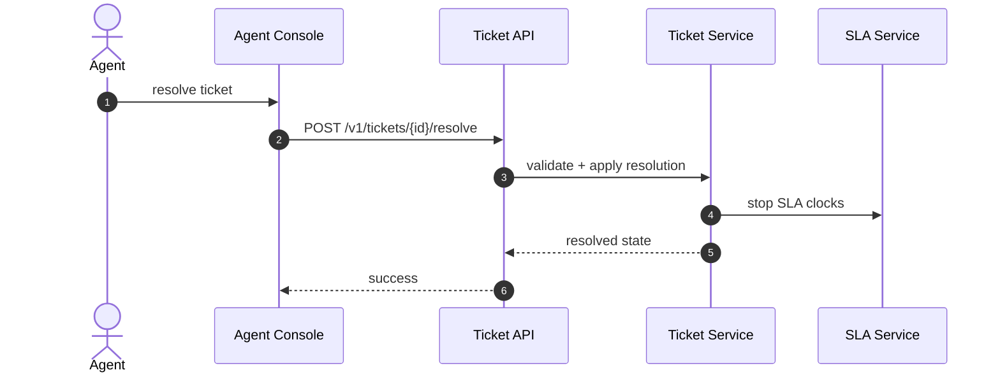
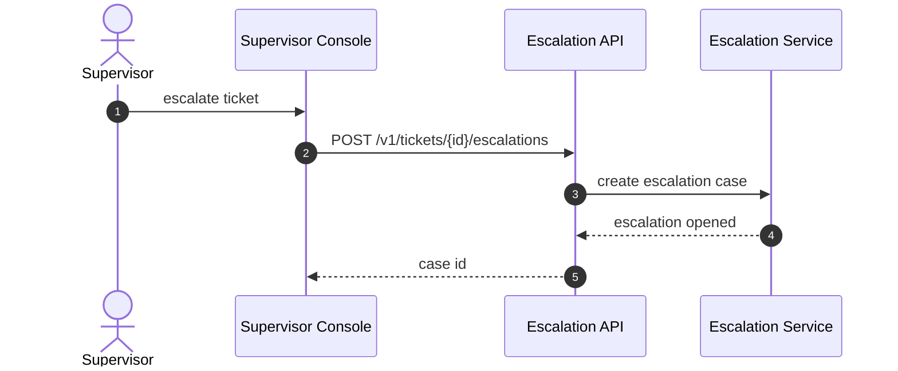
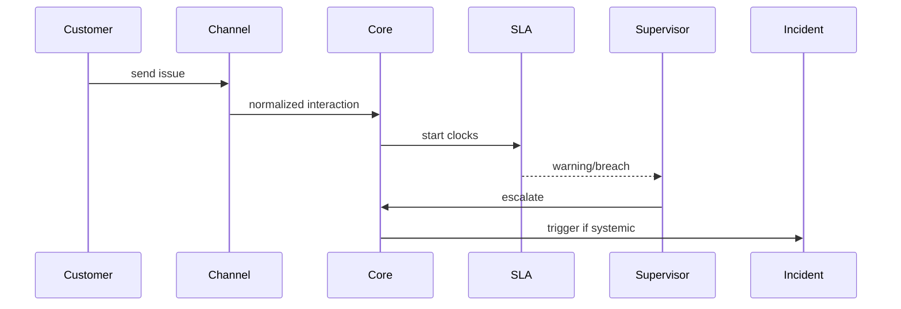

# System Sequence Diagrams

## System Sequence: Agent Resolves Ticket

## System Sequence: Supervisor Escalation

## System Sequence Narrative
Top-level sequence should include control-loop interactions for SLA warnings and incident activation.

Operational coverage note: this artifact also specifies queue, omnichannel and audit controls for this design view.
