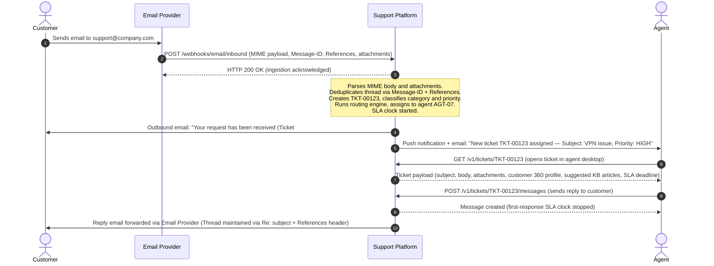
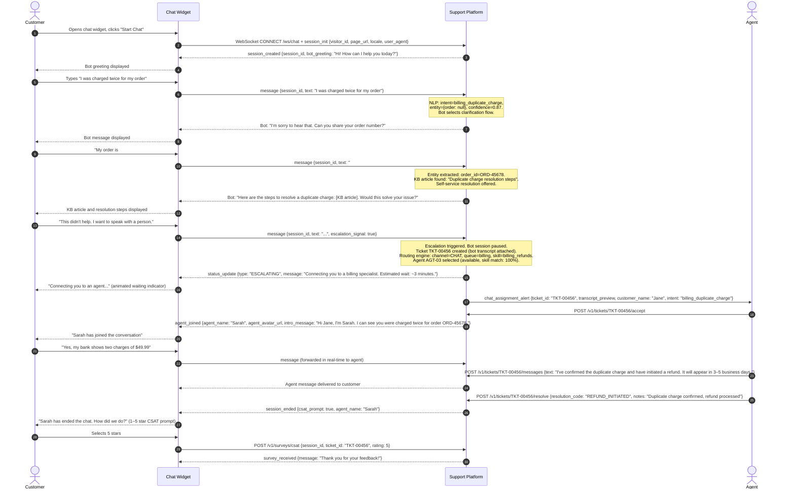
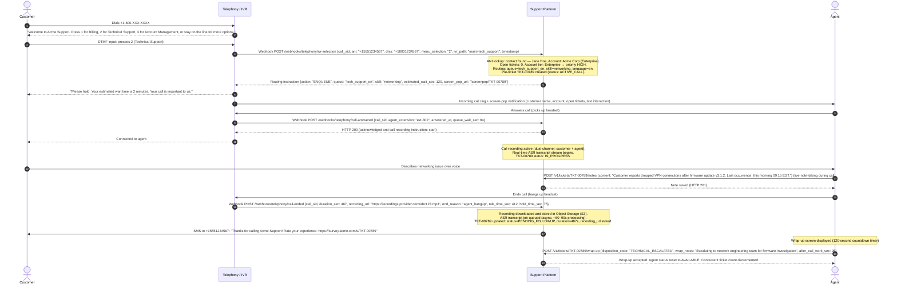
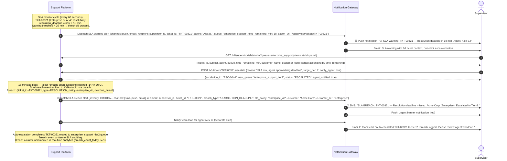
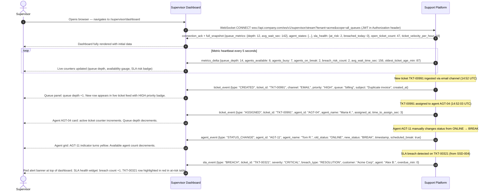
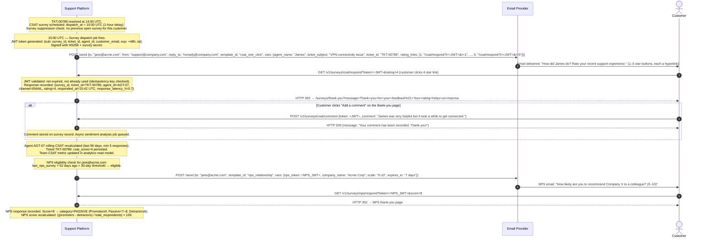
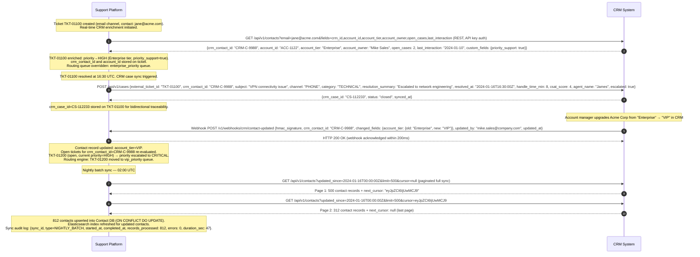

# System Sequence Diagrams

> **Scope**: System-level sequence diagrams (SSDs) treat the Customer Support and Contact Center Platform as a single black box. They capture the messages exchanged between external actors and the system boundary, and between the system and other external systems. Internal service choreography is intentionally hidden here; see `detailed-design/sequence-diagrams.md` for service-level detail.
>
> These diagrams follow the *system sequence diagram* convention from Larman's *Applying UML and Patterns*: only the system boundary participates as a lifeline, not individual internal services.

---

## Summary of System Interactions

| SSD ID | Title | Primary Actor | External Systems | Trigger |
|--------|-------|---------------|------------------|---------|
| SSD-001 | New Ticket via Email | Customer | Email Provider | Inbound email to support address |
| SSD-002 | Live Chat with Bot Escalation | Customer | Chat Widget | Widget opened on web/mobile |
| SSD-003 | Voice Call via IVR | Customer | Telephony / IVR | Inbound PSTN call |
| SSD-004 | SLA Breach Notification | Support Platform | Notification Gateway, Supervisor | SLA deadline crossed |
| SSD-005 | Real-Time Dashboard Update | Support Platform | Supervisor Dashboard | Continuous metric emission |
| SSD-006 | CSAT Survey via Email | Support Platform | Customer, Email Provider | Ticket resolved |
| SSD-007 | CRM Integration Sync | Support Platform | CRM System | Ticket creation, resolution, nightly sync |

---

## SSD-001: New Ticket via Email

### Description

A customer sends an email to the monitored support inbox (e.g., `support@company.com`). The Email Provider (SendGrid Inbound Parse, Gmail API, or Microsoft 365 webhook) parses the MIME message and forwards it to the platform via an inbound webhook. The platform deduplicates the thread using `Message-ID` and `References` headers, creates or updates a ticket, routes it to an agent, and sends a confirmation to the customer and a notification to the assigned agent.

### Participants

| Lifeline | Type | Description |
|----------|------|-------------|
| Customer | External Actor | End user sending the email |
| Email Provider | External System | Inbound mail relay (SendGrid, Gmail, Microsoft 365) |
| Support Platform | System Under Design | Black-box boundary |
| Agent | External Actor | Support agent assigned to the ticket |

### Key System Messages

| # | From | To | Message | Data Carried |
|---|------|----|---------|--------------|
| 1 | Customer | Email Provider | Email send | MIME message |
| 2 | Email Provider | Platform | Inbound webhook | MIME payload, headers, attachment URLs |
| 3 | Platform | Email Provider | Acknowledgement | HTTP 200 |
| 4 | Platform | Customer | Auto-acknowledgement email | Ticket number, estimated response time |
| 5 | Platform | Agent | Assignment notification | Ticket ID, customer name, subject, priority |
| 6 | Agent | Platform | Ticket fetch (GET) | ticket_id |
| 7 | Agent | Platform | Send reply (POST) | Message body |
| 8 | Platform | Customer | Agent reply email | Reply content (threaded) |

---

## SSD-002: Live Chat to Ticket with Bot Escalation

### Description

A customer initiates a live chat session via the embedded JavaScript widget on the company website or portal. The platform's Bot Engine handles the conversation first, performing NLP intent classification and Knowledge Base lookups to attempt self-service resolution. If the bot cannot resolve after a configured number of turns, or the customer explicitly requests a human agent, the system escalates: a ticket is created with the full bot transcript attached, and the conversation is routed to an available agent via the skill-based routing engine. A CSAT rating prompt is shown at session end.

### Participants

| Lifeline | Type | Description |
|----------|------|-------------|
| Customer | External Actor | Website or portal visitor |
| Chat Widget | External Component | Embedded JS SDK on customer's web property |
| Support Platform | System Under Design | Black-box boundary |
| Agent | External Actor | Human agent accepting the escalated chat |

### Key System Messages

| # | From | To | Message | Data Carried |
|---|------|----|---------|--------------|
| 1–2 | Customer / Widget | Platform | WebSocket connect + session init | visitor_id, page context, locale |
| 3–8 | Platform ↔ Widget ↔ Customer | — | Bot conversation turns | Intents, entities, KB articles, bot replies |
| 9 | Widget | Platform | Escalation signal | Session ID, escalation flag |
| 10 | Platform | Widget | Escalating status + wait time | Estimated wait |
| 11 | Platform | Agent | Chat assignment alert | Ticket ID, transcript preview, intent |
| 12 | Agent | Platform | Accept assignment | ticket_id |
| 13 | Platform | Widget | Agent joined event | Agent name, intro message |
| 14 | Agent | Platform | Resolve ticket | Resolution code, notes |
| 15 | Platform | Widget | Session ended + CSAT | CSAT prompt flag |
| 16 | Widget | Platform | CSAT submission | Rating (1–5), ticket_id |

---

## SSD-003: Voice Call to Ticket via IVR

### Description

A customer calls the support hotline. The Telephony/IVR system (Twilio, Genesys, or Avaya) plays a menu tree and collects DTMF input. On menu selection, the IVR fires a webhook to the platform. The platform looks up the caller by ANI (Automatic Number Identification / caller ID), determines routing priority, creates a pre-ticket, and instructs the IVR to connect to the appropriate agent queue. A screen-pop delivers customer context to the agent at answer time. The call is recorded throughout; after it ends, a transcript is generated via ASR and attached to the ticket, and a post-call SMS survey is dispatched.

### Participants

| Lifeline | Type | Description |
|----------|------|-------------|
| Customer | External Actor | Caller on a phone (PSTN or VoIP) |
| Telephony / IVR | External System | PSTN gateway + IVR menu (Twilio, Genesys, Avaya) |
| Support Platform | System Under Design | Black-box boundary |
| Agent | External Actor | Support agent answering the call |

### Key System Messages

| # | From | To | Message | Data Carried |
|---|------|----|---------|--------------|
| 1 | Customer | Telephony/IVR | PSTN call | ANI, DNIS |
| 2–3 | IVR ↔ Customer | — | IVR menu interaction | DTMF input |
| 4 | Telephony/IVR | Platform | IVR selection webhook | Call SID, ANI, menu selection |
| 5 | Platform | Telephony/IVR | Routing instruction | Queue name, skill, estimated wait |
| 6 | Telephony/IVR | Agent | Incoming call + screen-pop | Customer name, ticket pre-data |
| 7 | Telephony/IVR | Platform | Call answered webhook | Agent extension, queue wait time |
| 8 | Telephony/IVR | Platform | Call ended webhook | Duration, recording URL, end reason |
| 9 | Platform | Customer | Post-call SMS survey | Survey URL |
| 10 | Agent | Platform | Wrap-up submission | Disposition code, notes, ACW duration |

---

## SSD-004: SLA Breach Notification

### Description

The platform's SLA monitor runs on a scheduled evaluation cycle (every 60 seconds). When a ticket's first-response or resolution deadline crosses a configurable warning threshold (default: 25% of total SLA window remaining), the platform dispatches proactive alerts to the responsible supervisor. When the actual deadline is missed (breach), it emits a breach event, dispatches urgent notifications, and auto-escalates the ticket to a higher-tier queue. All breach events are written to the SLA audit log for reporting.

### Participants

| Lifeline | Type | Description |
|----------|------|-------------|
| Support Platform | System Under Design | Detects and emits SLA events |
| Notification Gateway | External System | Email / SMS / push delivery service |
| Supervisor | External Actor | Receives alerts and takes remedial action |

---

## SSD-005: Real-Time Dashboard Update

### Description

The Supervisor Dashboard establishes a persistent WebSocket connection on load, receiving a full state snapshot immediately and then receiving incremental delta events for every ticket state change, agent status change, and metric update thereafter. This eliminates the need for polling and enables sub-second latency dashboard updates. Data is scoped to the supervisor's authorized queues and tenant.

### Participants

| Lifeline | Type | Description |
|----------|------|-------------|
| Support Platform | System Under Design | Emits real-time metric and event streams |
| Supervisor Dashboard | External System (SPA) | React SPA consuming WebSocket stream |
| Supervisor | External Actor | Views and acts on live dashboard data |

---

## SSD-006: CSAT Survey via Email

### Description

After a ticket is resolved, the platform schedules a CSAT (Customer Satisfaction) survey with a configurable post-resolution delay (default: 60 minutes, ensuring customer has time to verify resolution). The survey email contains signed JWT tokens embedded in one-click star-rating hyperlinks (1–5), enabling frictionless single-click response capture. Optional free-text follow-up is available on the thank-you page. Separately, the platform evaluates NPS (Net Promoter Score) eligibility (last NPS > 30 days ago) and dispatches an NPS survey as appropriate.

### Participants

| Lifeline | Type | Description |
|----------|------|-------------|
| Support Platform | System Under Design | Schedules, dispatches, and captures surveys |
| Email Provider | External System | Email delivery (SendGrid, Postmark) |
| Customer | External Actor | Receives survey email and submits rating |

---

## SSD-007: CRM Integration Sync

### Description

The platform integrates bidirectionally with a CRM system (Salesforce, HubSpot, or Microsoft Dynamics). Contacts are enriched in real time at ticket creation via CRM REST API lookup. Resolved tickets are pushed back as CRM case records for account managers' visibility. When contact or account data changes in the CRM (tier upgrades, ownership changes), a CRM-fired webhook triggers contact updates and may re-prioritize open tickets. A nightly batch sync provides consistency recovery for any missed real-time updates.

### Participants

| Lifeline | Type | Description |
|----------|------|-------------|
| Support Platform | System Under Design | Initiates lookups, processes webhooks, pushes case data |
| CRM System | External System | Salesforce / HubSpot / Dynamics — source of truth for contacts and accounts |

---

## System Interaction Summary Table

The following table provides a consolidated reference for all external system interactions defined in the SSDs above.

| Interaction | SSD | Direction | Protocol / Transport | Trigger | Primary Data |
|-------------|-----|-----------|---------------------|---------|--------------|
| Inbound email webhook | SSD-001 | Email Provider → Platform | HTTP POST (Webhook) | New email received | MIME payload, headers, attachments |
| Outbound acknowledgement email | SSD-001 | Platform → Customer | SMTP via Email Provider | Ticket created | Ticket number, ERT |
| Agent assignment notification | SSD-001 | Platform → Agent | Push + Email | Ticket assigned | Ticket ID, subject, priority |
| Chat WebSocket session init | SSD-002 | Customer ↔ Platform | WebSocket (WSS) | Widget opened | visitor_id, page context, locale |
| Bot conversation turns | SSD-002 | Platform ↔ Widget | WebSocket messages | Each customer message | Intent, KB results, bot replies |
| Escalation signal | SSD-002 | Widget → Platform | WebSocket message | Customer requests human | Session ID, escalation flag |
| Chat assignment notification | SSD-002 | Platform → Agent | Push | Ticket routed to agent | Ticket ID, transcript preview |
| Post-chat CSAT prompt | SSD-002 | Platform → Widget | WebSocket message | Session ended | CSAT flag, agent name |
| IVR call selection webhook | SSD-003 | Telephony → Platform | HTTP POST (Webhook) | Menu DTMF selection | Call SID, ANI, menu choice, IVR path |
| IVR routing instruction | SSD-003 | Platform → Telephony | HTTP response | IVR webhook received | Queue name, estimated wait, screen-pop URL |
| Call answered webhook | SSD-003 | Telephony → Platform | HTTP POST (Webhook) | Agent answers | Call SID, agent extension, queue wait |
| Call ended webhook | SSD-003 | Telephony → Platform | HTTP POST (Webhook) | Call disconnected | Duration, recording URL, end reason |
| Post-call SMS survey | SSD-003 | Platform → Customer | SMS via SMS Gateway | Call ended + wrap-up | Survey URL with signed token |
| SLA warning alert | SSD-004 | Platform → Supervisor | Push + Email | Warning threshold crossed | Ticket ID, time remaining |
| SLA breach alert | SSD-004 | Platform → Supervisor | SMS + Push + Email | Deadline missed | Ticket ID, breach type, severity, customer |
| Dashboard WebSocket stream | SSD-005 | Platform → Dashboard | WebSocket (WSS) | Connection established + continuous | Full snapshot, then metric/event deltas |
| CSAT survey email | SSD-006 | Platform → Customer | SMTP via Email Provider | 60 min post-resolution | Signed JWT token embedded in star links |
| CSAT rating response | SSD-006 | Customer → Platform | HTTP GET | Star link clicked in email | JWT token, rating (1–5) |
| CSAT comment submission | SSD-006 | Customer → Platform | HTTP POST | Optional on thank-you page | Comment text |
| NPS survey email | SSD-006 | Platform → Customer | SMTP via Email Provider | 30-day NPS recency check | Signed NPS token, 0–10 scale |
| CRM contact lookup | SSD-007 | Platform → CRM | REST GET | Ticket created | Contact email address |
| CRM case push | SSD-007 | Platform → CRM | REST POST | Ticket resolved | Case summary, CSAT score, handle time |
| CRM contact updated webhook | SSD-007 | CRM → Platform | HTTP POST (Webhook) | Contact/account changed in CRM | Changed fields, crm_contact_id |
| CRM nightly batch sync | SSD-007 | Platform ↔ CRM | REST GET (paginated cursor) | Scheduled 02:00 UTC | All contacts updated since last sync |
