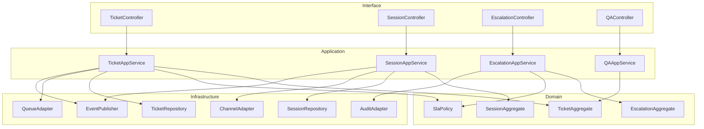

# C4 Code Diagram

```mermaid
flowchart TB
    subgraph Interface
      TicketController
      SessionController
      EscalationController
      QAController
    end

    subgraph Application
      TicketAppService
      SessionAppService
      EscalationAppService
      QAAppService
    end

    subgraph Domain
      TicketAggregate
      SessionAggregate
      EscalationAggregate
      SlaPolicy
    end

    subgraph Infrastructure
      TicketRepository
      SessionRepository
      QueueAdapter
      ChannelAdapter
      EventPublisher
      AuditAdapter
    end

    TicketController --> TicketAppService --> TicketAggregate
    SessionController --> SessionAppService --> SessionAggregate
    EscalationController --> EscalationAppService --> EscalationAggregate
    QAController --> QAAppService --> TicketAggregate

    TicketAppService --> SlaPolicy
    EscalationAppService --> SlaPolicy

    TicketAppService --> TicketRepository
    SessionAppService --> SessionRepository
    SessionAppService --> ChannelAdapter
    TicketAppService --> QueueAdapter

    TicketAppService --> EventPublisher
    SessionAppService --> EventPublisher
    EscalationAppService --> AuditAdapter
```
