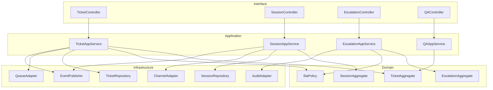
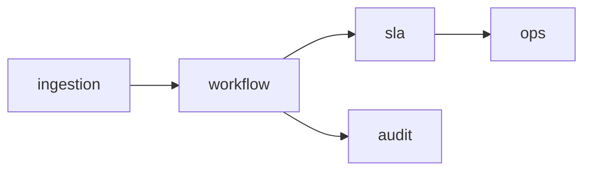

# C4 Code Diagram

## C4-Code Narrative
Map code modules to runtime responsibilities:
- `ingestion/*` -> connector adapters and event normalizer.
- `workflow/*` -> queue state machine and transition guards.
- `sla/*` -> timer service + escalation policies.
- `audit/*` -> immutable event writer.
- `ops/*` -> incident toggles and degraded-mode controls.

Operational coverage note: this artifact also specifies omnichannel controls for this design view.
