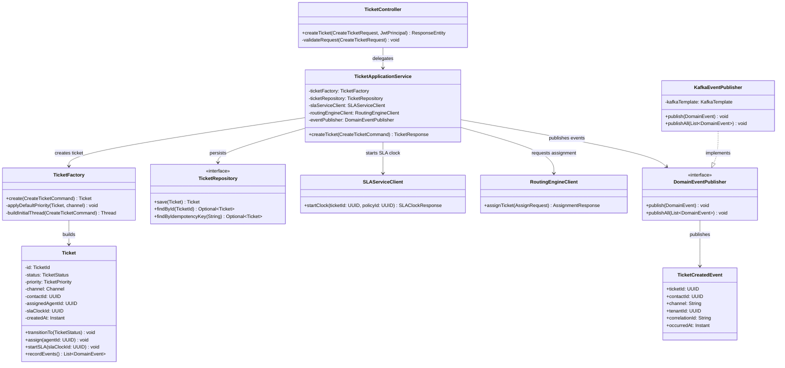
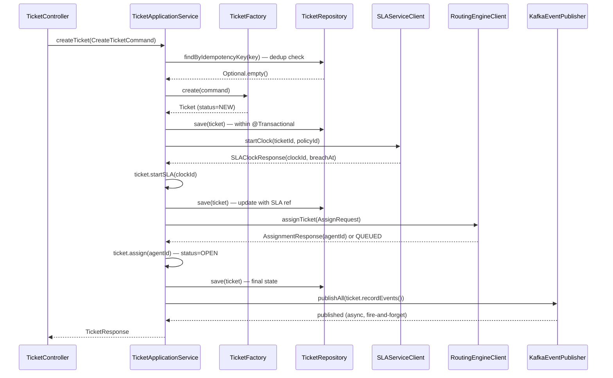
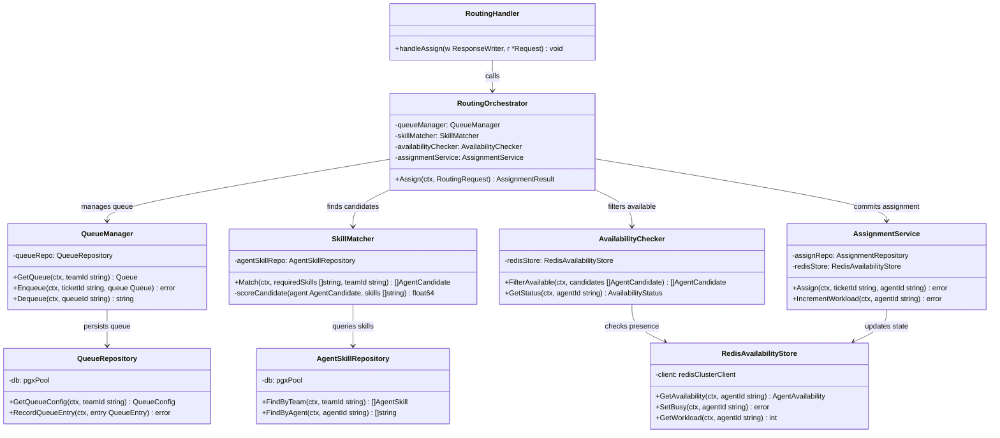
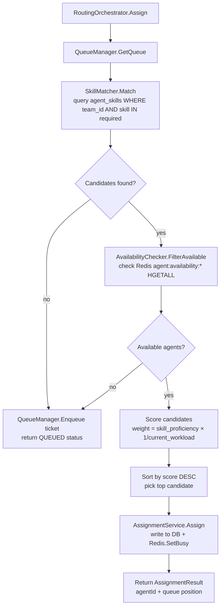
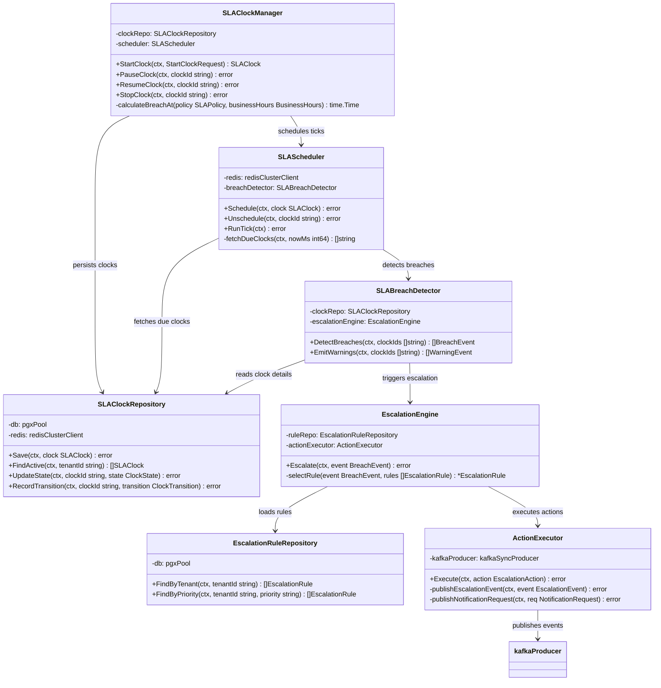
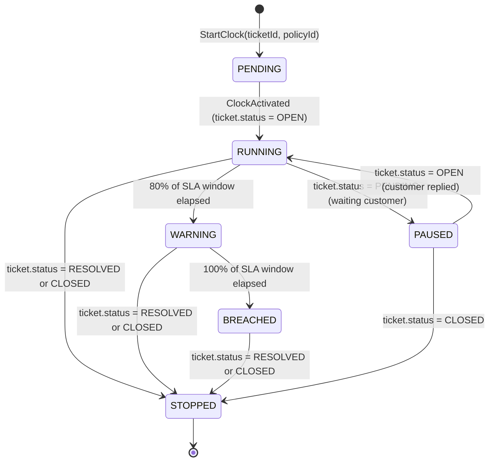
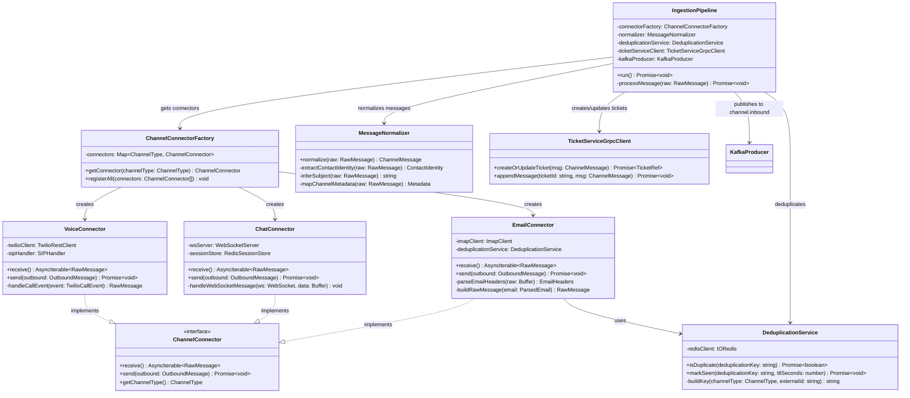
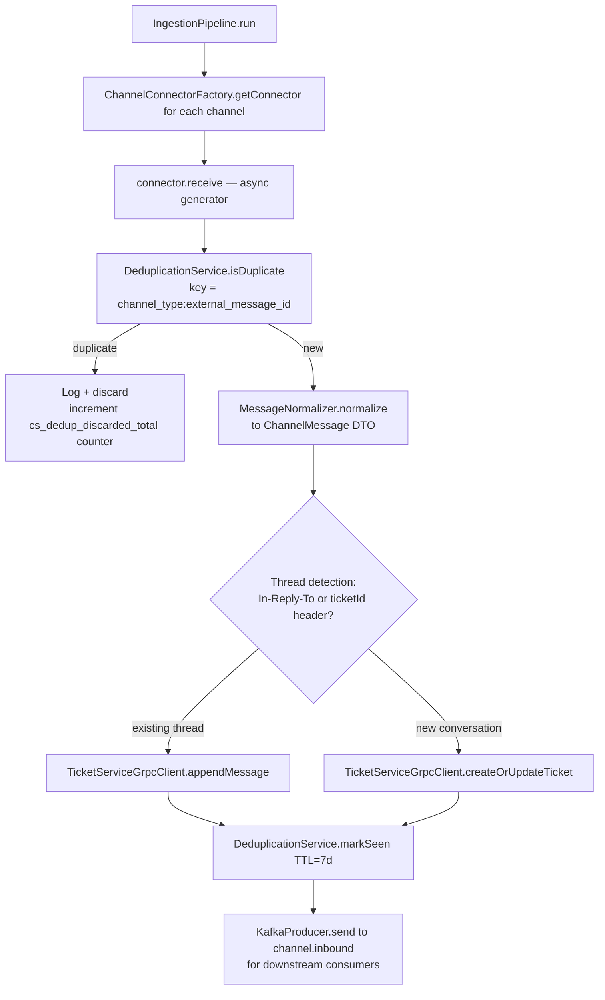
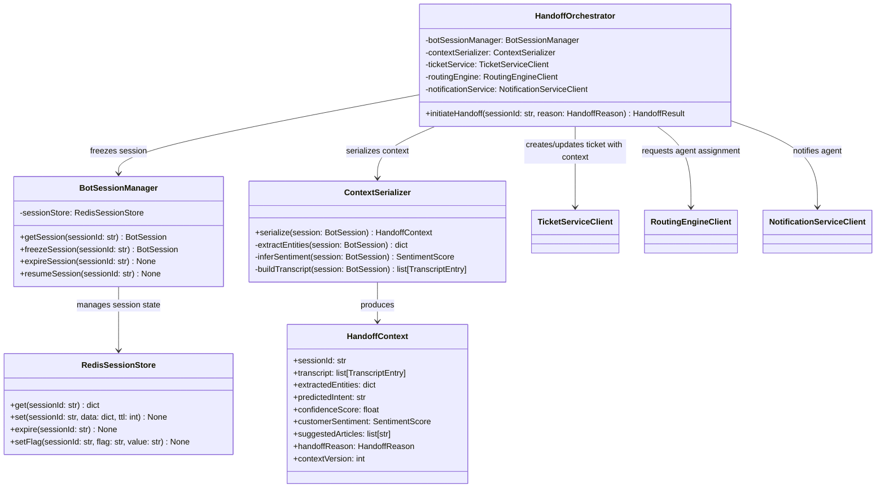

# C4 Code Diagram (Level 4) – Customer Support and Contact Center Platform

This document provides C4 Level 4 (Code) diagrams for the most critical code paths in the platform. Each diagram shows the key classes, their responsibilities, and relationships within the most important transaction boundaries.

---

## 1. Package Structure Reference

All Java services follow Domain-Driven Design (DDD) layered architecture:

### ticket-service Package Layout
```
ticket-service/
├── api/                              # Presentation layer
│   ├── TicketController.java         # REST endpoints; input validation; delegates to app service
│   ├── ThreadController.java         # Thread/message operations
│   ├── dto/
│   │   ├── CreateTicketRequest.java  # Validated input DTO (record + Bean Validation)
│   │   ├── UpdateTicketRequest.java
│   │   ├── TicketResponse.java       # Response projection; never exposes domain entity
│   │   └── TicketSummaryResponse.java
│   └── mapper/
│       └── TicketDtoMapper.java      # MapStruct mapper between domain and DTOs
├── application/                      # Use case orchestration
│   ├── TicketApplicationService.java # Orchestrates domain objects, emits domain events
│   ├── command/
│   │   ├── CreateTicketCommand.java
│   │   ├── AssignTicketCommand.java
│   │   └── CloseTicketCommand.java
│   └── handler/
│       └── TicketEventHandler.java   # Handles inbound domain events (e.g., BotHandoffRequested)
├── domain/                           # Pure domain model; no Spring/infra dependencies
│   ├── ticket/
│   │   ├── Ticket.java               # Aggregate root; guards all state transitions
│   │   ├── TicketId.java             # Value object (wraps UUID)
│   │   ├── TicketStatus.java         # Enum; transition() throws IllegalStateException on invalid
│   │   ├── TicketPriority.java
│   │   ├── TicketFactory.java        # Creates Ticket from CreateTicketCommand
│   │   ├── TicketRepository.java     # Repository interface (implemented in infrastructure/)
│   │   └── TicketDomainService.java  # Cross-aggregate domain logic
│   ├── thread/
│   │   ├── Thread.java               # Message thread entity
│   │   ├── ThreadMessage.java        # Individual message value object
│   │   └── ThreadRepository.java
│   ├── sla/
│   │   ├── SLAPolicy.java            # Immutable SLA policy value object
│   │   ├── SLAClock.java             # Clock state: start_time, breach_at, paused_at
│   │   └── SLAPolicyRepository.java
│   └── event/
│       ├── TicketCreatedEvent.java   # Domain event (immutable record)
│       ├── TicketAssignedEvent.java
│       ├── SLAStartedEvent.java
│       └── DomainEventPublisher.java # Interface for publishing events
├── infrastructure/                   # Adapters implementing domain interfaces
│   ├── persistence/
│   │   ├── TicketJpaRepository.java  # Spring Data JPA; returns JPA entities
│   │   ├── TicketJpaEntity.java      # @Entity; mapped to tickets table
│   │   └── TicketMapper.java        # Maps JPA entity ↔ domain Ticket
│   ├── messaging/
│   │   ├── KafkaEventPublisher.java  # Implements DomainEventPublisher
│   │   └── KafkaTopicConfig.java
│   └── client/
│       ├── RoutingEngineClient.java  # Feign/WebClient HTTP client for routing-engine
│       └── SLAServiceClient.java     # HTTP client for sla-svc
└── config/
    ├── SecurityConfig.java           # Keycloak + JWT filter chain
    ├── KafkaConfig.java
    └── FlywayConfig.java
```

### routing-engine Package Layout (Go)
```
routing-engine/
├── cmd/server/
│   └── main.go                       # Wire dependencies; start HTTP server
├── internal/
│   ├── handler/
│   │   └── routing_handler.go        # HTTP handler; parse request; delegate to service
│   ├── service/
│   │   ├── routing_orchestrator.go   # Top-level routing coordinator
│   │   ├── skill_matcher.go          # Filter agents by required skills
│   │   ├── availability_checker.go   # Check agent availability from Redis
│   │   ├── assignment_service.go     # Write assignment to DB and Redis
│   │   └── queue_manager.go          # Manage routing queues
│   ├── repository/
│   │   ├── agent_skill_repo.go       # pgx: query agent_skills table
│   │   └── queue_repo.go             # pgx: query routing_queues table
│   ├── store/
│   │   └── redis_availability.go     # Redis: HGETALL agent:availability:{id}
│   └── model/
│       ├── routing_request.go
│       ├── agent.go
│       └── assignment.go
└── pkg/
    ├── health/
    └── middleware/
```

---

## 2. Code Diagram 1: Ticket Creation Flow

This is the most critical write path. A new ticket is created from an inbound channel message, SLA clock is started, routing is initiated, and a domain event is published.



### Sequence: Ticket Creation Transaction



**Transaction boundary:** `TicketRepository.save()` calls are within a single `@Transactional` method. `SLAServiceClient` and `RoutingEngineClient` calls are outside the transaction (they are remote calls). If they fail, the ticket remains in `NEW` status and a compensating background job retries SLA start and routing assignment.

---

## 3. Code Diagram 2: Routing Decision Flow

The routing engine (Go) determines which agent receives a ticket based on skill matching and availability.



### Routing Algorithm Detail



---

## 4. Code Diagram 3: SLA Clock Management

The SLA clock subsystem (Go) is the most latency-sensitive component. It manages thousands of concurrent SLA clocks.



### SLA Clock State Machine



**Clock storage in Redis:**
```
Key:   sla:clock:{tenantId}          (Sorted Set)
Score: breach_at_unix_ms             (Unix timestamp in milliseconds)
Value: clockId                       (UUID string)

Key:   sla:clock:state:{clockId}     (Hash)
Fields:
  ticketId        -> UUID
  tenantId        -> UUID
  state           -> RUNNING|PAUSED|WARNING|BREACHED|STOPPED
  startedAt       -> ISO-8601
  breachAt        -> ISO-8601
  pausedAt        -> ISO-8601 (nullable)
  accruedMs       -> integer (total paused milliseconds)
  policyType      -> FIRST_RESPONSE|RESOLUTION
```

**SLA timer tick (runs every 1 second in `sla-timer-worker`):**
```go
func (s *SLAScheduler) RunTick(ctx context.Context) error {
    nowMs := time.Now().UnixMilli()
    // ZRANGEBYSCORE sla:clock:{tenantId} -inf nowMs LIMIT 0 100
    clockIds, err := s.redis.ZRangeByScore(ctx, clockKey, &redis.ZRangeBy{
        Min: "-inf", Max: strconv.FormatInt(nowMs, 10), Offset: 0, Count: 100,
    }).Result()
    if err != nil { return fmt.Errorf("fetch due clocks: %w", err) }
    if len(clockIds) == 0 { return nil }
    return s.breachDetector.DetectBreaches(ctx, clockIds)
}
```

---

## 5. Code Diagram 4: Channel Ingestion Pipeline

The channel ingestion pipeline normalizes messages from all external channels into a unified `ChannelMessage` DTO before publication to Kafka.



### Ingestion Pipeline Flow



**ChannelMessage DTO (TypeScript):**
```typescript
interface ChannelMessage {
  messageId:         string;          // Platform-generated UUID
  externalMessageId: string;          // Provider message ID (for dedup)
  channelType:       ChannelType;     // EMAIL | CHAT | SMS | WHATSAPP | VOICE | SOCIAL
  direction:         'INBOUND' | 'OUTBOUND';
  contactIdentity:   ContactIdentity; // { email?, phone?, socialHandle? }
  subject:           string | null;   // Email subject; null for chat/sms
  body:              string;          // Plain text body (HTML stripped)
  bodyHtml:          string | null;   // Original HTML (email only)
  attachments:       Attachment[];    // S3 references
  metadata:          Record<string, string>; // Channel-specific extras
  receivedAt:        Date;
  tenantId:          string;
  correlationId:     string;
}
```

---

## 6. Code Diagram 5: Bot-to-Human Handoff

The handoff is a critical atomic operation. The bot session must be cleanly transferred with all context to the agent.



---

## 7. Cross-Cutting Design Patterns

### Outbox Pattern (Reliable Event Publishing)
All Java services use the transactional outbox pattern to guarantee at-least-once event delivery:

```
1. Within @Transactional: save domain entity + save event to outbox_events table
2. OutboxPollingPublisher (background thread, 500ms poll): reads unpublished outbox_events
3. Publish to Kafka
4. Mark outbox_event as published
5. On Kafka timeout: retry up to 3× with exponential backoff; alert if all retries fail
```

### Idempotency Pattern
All mutating endpoints accept `X-Idempotency-Key` header:
```
1. Hash idempotency key + tenant_id → lookup in idempotency_keys table (Redis + DB)
2. If found and status=COMPLETED: return cached response
3. If found and status=IN_PROGRESS: return 202 Accepted (poll or wait)
4. If not found: process and store result with 24-hour TTL
```

### Row-Level Security (Multi-Tenancy)
All PostgreSQL queries are tenant-scoped using RLS policies:
```sql
-- Applied to all major tables
ALTER TABLE tickets ENABLE ROW LEVEL SECURITY;
CREATE POLICY tenant_isolation ON tickets
  USING (tenant_id = current_setting('app.tenant_id')::uuid);
-- Application sets: SET LOCAL app.tenant_id = '<tenant_uuid>'
```
