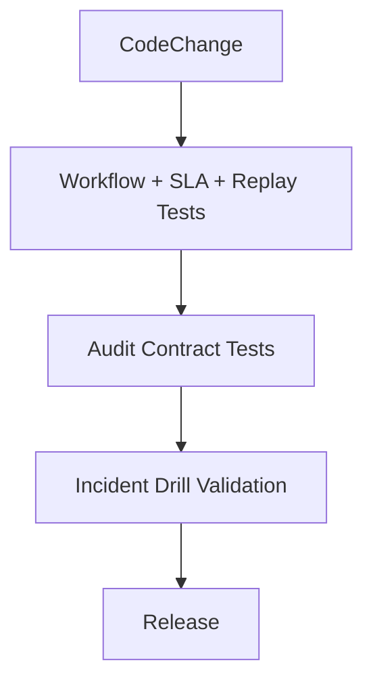

# Implementation Guidelines

## Purpose
Define the implementation guidelines artifacts for the **Customer Support and Contact Center Platform** with implementation-ready detail.

## Domain Context
- Domain: Support Center
- Core entities: Conversation, Ticket, Queue, SLA Policy, Agent Skill, Bot Session, Escalation
- Primary workflows: intake across channels, skill-based routing and assignment, SLA monitoring and escalation, bot-to-human transfer, QA and workforce planning

## Key Design Decisions
- Enforce idempotency and correlation IDs for all mutating operations.
- Persist immutable audit events for critical lifecycle transitions.
- Separate online transaction paths from async reconciliation/repair paths.

## Reliability and Compliance
- Define SLOs and error budgets for user-facing operations.
- Include RBAC, least-privilege service identities, and full audit trails.
- Provide runbooks for degraded mode, replay, and backfill operations.

## Delivery Emphasis
- Milestones mapped to slices that are testable end-to-end.
- CI quality gates include lint, unit/integration tests, and contract checks.
- Backend status matrix tracks readiness by capability and release wave.

## Implementation Guidelines: Operational Controls
1. Implement queue transitions through a single state-machine library with persisted version checks.
2. Treat SLA calculations as pure functions of policy + timeline to guarantee replayability.
3. Normalize all channels into one DTO before business logic.
4. Emit audit events in the same transaction boundary as workflow writes (outbox pattern acceptable).
5. Provide incident toggles for fallback routing, bot suppression, and escalation threshold override.

Operational coverage note: this artifact also specifies omnichannel controls for this design view.
