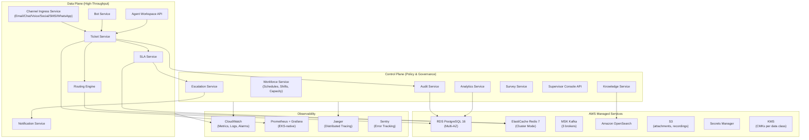
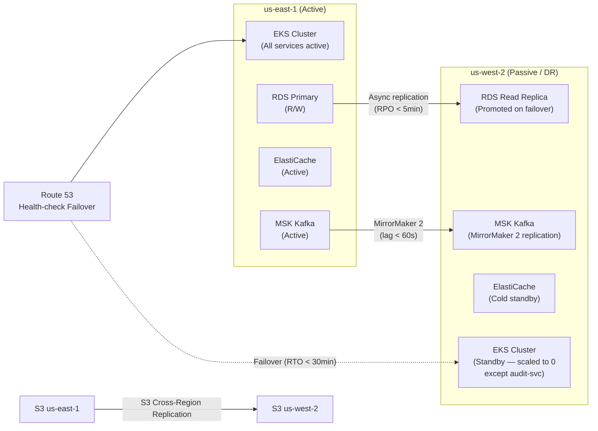
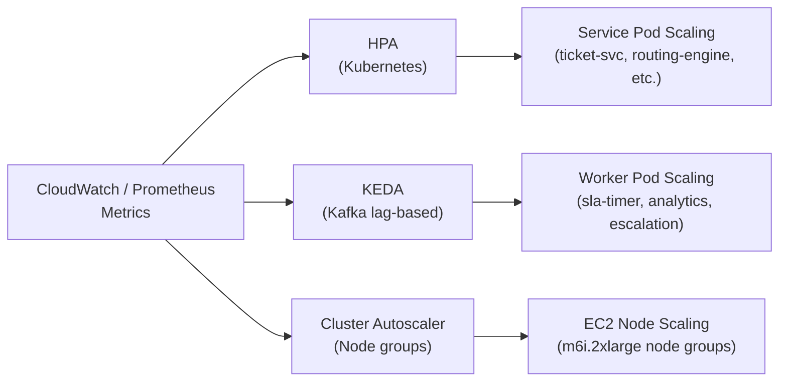
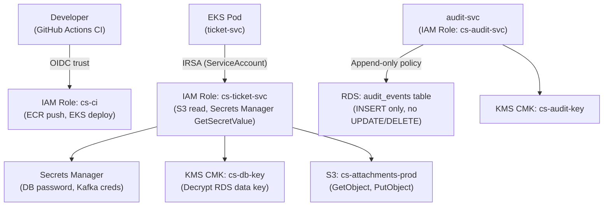
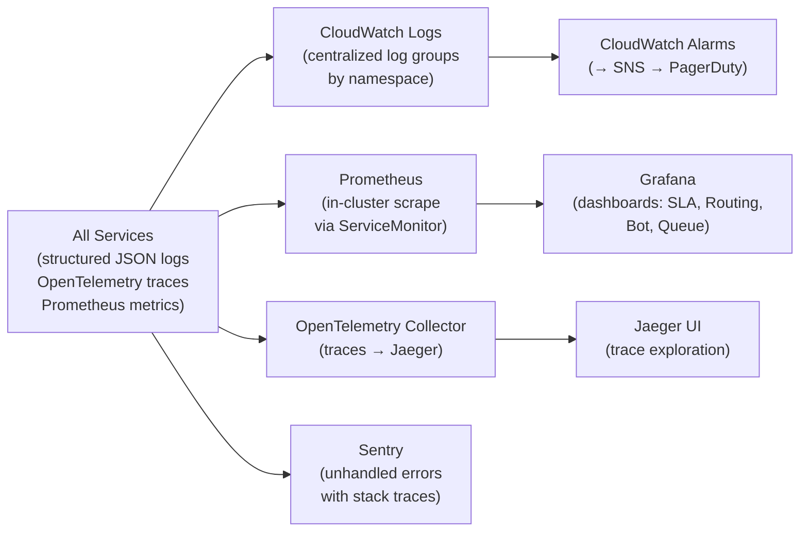

# Cloud Architecture – Customer Support and Contact Center Platform

This document defines the full cloud architecture for the Contact Center Platform on AWS, covering control plane vs. data plane separation, managed service usage, multi-region strategy, auto-scaling, cost optimization, backup/recovery, security, and observability.

---

## 1. Cloud Architecture Overview

The platform separates the **Data Plane** (high-throughput, low-latency customer-facing paths) from the **Control Plane** (policy, configuration, audit, and incident management) to ensure that a configuration error cannot impact active ticket processing.



---

## 2. AWS Service Mapping

| AWS Service | Platform Usage | Configuration |
|---|---|---|
| **Amazon EKS** | Kubernetes cluster for all service workloads | v1.29, managed node groups, IRSA enabled |
| **Amazon RDS (PostgreSQL 16)** | Operational data store: tickets, agents, contacts, SLA policies, audit events | Multi-AZ, `db.r7g.2xlarge`, 500 GB gp3, 35-day backups |
| **Amazon ElastiCache (Redis 7)** | SLA clock state, routing state, bot sessions, agent presence, caching | Cluster mode, 3 shards × 2 replicas, `cache.r7g.xlarge`, TLS+AUTH |
| **Amazon MSK (Kafka)** | All domain events: TicketCreated, SLABreached, BotHandoff, etc. | 3 brokers, `kafka.m5.2xlarge`, 7-day retention, TLS in-transit |
| **Amazon OpenSearch** | Knowledge base full-text search, ticket/conversation search | 3 data nodes `r6g.2xlarge.search`, 1 dedicated master, UltraWarm for cold articles |
| **Amazon S3** | Ticket attachments, voice recordings, bulk exports, analytics parquet | `cs-attachments-prod`, SSE-KMS, versioning enabled, lifecycle to Glacier at 90 days |
| **AWS CloudFront** | CDN for agent workspace UI, knowledge portal, media delivery | HTTP/2+HTTP/3, WAF integration, geo-restriction |
| **AWS WAF v2** | L7 DDoS, OWASP Top 10, rate-limiting, IP reputation | Managed rules + custom rules for CS-specific patterns |
| **AWS Shield Advanced** | L3/L4 DDoS protection | Enabled on ALB and CloudFront distributions |
| **AWS Secrets Manager** | Database passwords, OAuth tokens, API keys, HMAC secrets | Auto-rotation every 30 days; IRSA-bound access |
| **AWS KMS** | Encryption of RDS, S3 (attachments + recordings), ElastiCache, Kafka | 4 CMKs: `cs-db-key`, `cs-attachment-key`, `cs-recording-key`, `cs-audit-key` |
| **AWS IAM (IRSA)** | Pod-level IAM identities via ServiceAccount annotations | Least-privilege per service; no node-level credentials |
| **Amazon Route 53** | DNS: `api.cs-platform.com`, `chat.cs-platform.com`, `ws.cs-platform.com` | Health-check-based failover for multi-region |
| **AWS ACM** | TLS certificates for all domains | Auto-renew, attached to CloudFront and ALB |
| **Amazon CloudWatch** | Infrastructure metrics, log aggregation, alarms | Custom namespaces: `CS/SLA`, `CS/Routing`, `CS/Bot` |
| **AWS X-Ray** | Distributed tracing for API paths | Sampling rate 5%; 100% for error traces |
| **Amazon SNS + SES** | Notification delivery: email + push via notification-svc | DKIM, SPF configured for SES sending domain |
| **AWS Backup** | Centralized backup for RDS, EFS | Daily backups, 35-day retention, cross-region copy to `us-west-2` |

---

## 3. Multi-Region Strategy

The platform uses an **active-passive** multi-region configuration with `us-east-1` as primary and `us-west-2` as DR.



| Metric | Target | Measurement |
|---|---|---|
| RTO (Recovery Time Objective) | < 30 minutes | Time from failure detection to traffic serving in DR |
| RPO (Recovery Point Objective) | < 5 minutes | Maximum data loss window (RDS async replication lag) |
| Kafka replication lag | < 60 seconds | MirrorMaker 2 consumer lag monitoring |
| DNS failover TTL | 60 seconds | Route 53 health check interval + TTL |

**Failover Trigger Conditions:**
1. Route 53 health check fails for primary ALB for > 3 consecutive intervals (3 × 30s = 90s).
2. Manual declaration by on-call engineer via runbook.
3. RDS primary instance becomes unavailable — RDS Multi-AZ handles this within AZ automatically; cross-region requires manual promotion of read replica.

**Pre-failover Checklist:**
- Verify Kafka MirrorMaker 2 lag < 60 seconds before draining primary.
- Flush Redis SLA clocks to PostgreSQL via `POST /internal/sla/flush` before promoting DR.
- Scale up DR EKS nodegroup from 0 to target capacity (pre-warmed AMI).
- Update Secrets Manager in `us-west-2` with same secret values.

---

## 4. Managed Services

### RDS PostgreSQL 16
- **Instance:** `db.r7g.2xlarge` (8 vCPU, 64 GB RAM).
- **Storage:** 500 GB gp3, IOPS 12,000, autoscaling up to 2 TB.
- **Multi-AZ:** synchronous standby in same region for < 30s failover.
- **Read Replicas:** 1 replica in `us-east-1` for analytics queries; 1 read replica in `us-west-2` for DR.
- **Parameter Group:** `max_connections=500`, `work_mem=64MB`, `shared_buffers=16GB`, `wal_level=logical` (for CDC).
- **Row-Level Security:** enabled per-tenant on `tickets`, `contacts`, `conversations` tables.

### ElastiCache Redis 7 (Cluster Mode)
- **Shards:** 3 shards × 2 replicas = 6 total nodes.
- **Instance:** `cache.r7g.xlarge` (4 vCPU, 26 GB RAM) per node.
- **Keys used:** `sla:clock:{tenantId}:{ticketId}`, `routing:agent:{agentId}:state`, `bot:session:{sessionId}`, `agent:presence:{agentId}`.
- **TLS + AUTH:** enabled; password stored in Secrets Manager.
- **Eviction policy:** `noeviction` — SLA clocks must never be evicted silently.

### MSK Kafka
- **Brokers:** 3 × `kafka.m5.2xlarge`.
- **Topics:** `channel.inbound`, `ticket.events`, `sla.events`, `escalation.events`, `bot.events`, `notification.requests`, `audit.events`, `analytics.events`.
- **Retention:** 7 days (all topics); `audit.events` topic → 30 days.
- **Replication factor:** 3; `min.insync.replicas=2`.
- **TLS in-transit:** enforced; IAM auth via MSK IAM authentication.

### Amazon OpenSearch
- **Data nodes:** 3 × `r6g.2xlarge.search` (8 vCPU, 64 GB RAM).
- **Dedicated master:** 3 × `m6g.large.search`.
- **Storage:** 500 GB gp3 per data node.
- **Indices:** `knowledge-articles`, `tickets-search`, `conversations-search`.
- **UltraWarm:** articles older than 90 days migrated to UltraWarm (lower cost, still searchable).

---

## 5. Auto-Scaling Design



| Service | HPA Metric | Min | Max | Scale-Up Trigger | Scale-Down Delay |
|---|---|---|---|---|---|
| `channel-ingress-svc` | CPU > 70% | 3 | 12 | 2 consecutive minutes | 5 minutes |
| `ticket-svc` | CPU > 70% | 3 | 10 | 2 consecutive minutes | 5 minutes |
| `routing-engine` | CPU > 60% or Redis op rate > 50k/s | 3 | 12 | 1 minute | 10 minutes |
| `sla-timer-worker` | Active SLA clocks > 5000/pod | 3 | 10 | 1 minute | 15 minutes |
| `escalation-worker` | Kafka lag `sla.events` > 500 | 2 | 8 | 1 minute | 10 minutes |
| `bot-svc` | Active sessions > 500/pod | 3 | 15 | 1 minute | 5 minutes |
| `agent-workspace-api` | WS connections > 1000/pod | 3 | 10 | 2 minutes | 10 minutes |
| `analytics-worker` | Kafka lag `analytics.events` > 5000 | 2 | 6 | 3 minutes | 15 minutes |

KEDA (`ScaledObject`) is used for Kafka-lag-based scaling of workers, as HPA does not natively support external Kafka lag metrics.

---

## 6. Cost Optimization

| Strategy | Implementation | Estimated Saving |
|---|---|---|
| **Reserved Instances (1-year)** | RDS `db.r7g.2xlarge`, ElastiCache `cache.r7g.xlarge` (prod) | ~30% vs on-demand |
| **Spot Instances for workers** | `analytics-worker`, `retention-worker`, `survey-worker` on Spot node group with Spot interruption handler | ~60% vs on-demand for worker nodes |
| **S3 Lifecycle Policies** | Attachments: Standard → Standard-IA at 30d → Glacier at 90d → Glacier Deep Archive at 365d | ~70% storage cost reduction |
| **OpenSearch UltraWarm** | Move knowledge articles > 90 days to UltraWarm storage | ~80% OpenSearch storage cost reduction |
| **Savings Plans (Compute)** | 1-year Compute Savings Plan for EKS nodes (m6i family) | ~20% EC2 cost reduction |
| **CloudFront caching** | Cache knowledge article assets at edge; 80%+ cache-hit rate target | Reduces ALB + origin compute |
| **VPC Endpoints** | Eliminate NAT Gateway data transfer cost for S3, ECR, Secrets Manager | ~$500/month at scale |
| **Right-sizing** | Monthly cost review via AWS Cost Explorer + Compute Optimizer recommendations | Ongoing |

---

## 7. Backup and Recovery

| Data Store | Backup Method | Frequency | Retention | Recovery Test |
|---|---|---|---|---|
| RDS PostgreSQL | Automated snapshots (AWS Backup) | Daily | 35 days | Monthly point-in-time restore drill |
| RDS PostgreSQL | Transaction log backups | Every 5 minutes | 35 days | Enables 5-minute RPO restore |
| ElastiCache Redis | Manual snapshot before maintenance; Redis AOF | On-demand + AOF enabled | 7 days | Quarterly |
| MSK Kafka | Topic retention (native) + S3 export via Kafka Connect | 7-day retention; S3 archive perpetual | 7 days / perpetual | Annual |
| Amazon S3 | S3 Versioning + S3 Replication (cross-region) | Real-time replication | Versioned forever | Quarterly |
| OpenSearch | Automated snapshots to S3 | Daily | 14 days | Quarterly |
| Kubernetes configs | GitOps (ArgoCD) + Helm values in Git | Every commit | Git history | Per deployment |

**RDS Point-in-Time Recovery Procedure:**
```bash
# Restore to 30 minutes ago
aws rds restore-db-instance-to-point-in-time \
  --source-db-instance-identifier cs-prod-postgres \
  --target-db-instance-identifier cs-prod-postgres-restored \
  --restore-time $(date -u -v-30M +%Y-%m-%dT%H:%M:%SZ)
```

---

## 8. Security Architecture



**IAM Role Inventory:**

| Role | Attached Policy | Used By |
|---|---|---|
| `cs-ticket-svc` | S3 read/write `cs-attachments-prod`; SM `GetSecretValue` for `cs/ticket/*` | `ticket-svc` pods |
| `cs-routing-engine` | SM `GetSecretValue` for `cs/routing/*` | `routing-engine` pods |
| `cs-sla-worker` | SM `GetSecretValue`; CloudWatch `PutMetricData` | `sla-timer-worker` pods |
| `cs-audit-svc` | RDS IAM auth (append-only role); KMS `Decrypt` `cs-audit-key` | `audit-svc` pods |
| `cs-retention-worker` | S3 `DeleteObject` `cs-attachments-prod`; SM read | `retention-worker` pods |
| `cs-ci` | ECR push; EKS `kubectl apply`; SM read for CI secrets | GitHub Actions OIDC |

**KMS Key Usage:**
- `cs-db-key`: encrypts RDS at rest.
- `cs-attachment-key`: encrypts S3 `cs-attachments-prod`.
- `cs-recording-key`: encrypts S3 `cs-voice-recordings-prod`.
- `cs-audit-key`: encrypts S3 audit exports; used by audit-svc for signing.

---

## 9. Observability Stack



**Key Dashboards (Grafana):**
- **SLA Dashboard**: `sla_breach_rate`, `sla_warning_rate`, `timer_drift_seconds`, active clocks by tenant.
- **Routing Dashboard**: `routing_assignment_latency_p99`, queue depth per skill group, agent utilization %.
- **Bot Dashboard**: `handoff_rate`, `bot_resolution_rate`, NLP confidence score distribution.
- **Queue Dashboard**: `queue_depth` per channel, oldest ticket age, escalation rate.
- **Infrastructure Dashboard**: EKS node CPU/mem, Kafka consumer lag per topic, Redis memory usage, RDS connections.

**Alert Thresholds (PagerDuty P1):**
- `sla_breach_rate > 5%` for 5 minutes → **SEV2**.
- `kafka_consumer_lag{topic="sla.events"} > 2000` for 3 minutes → **SEV2**.
- `routing_assignment_latency_p99 > 2s` for 5 minutes → **SEV3**.
- `error_rate{service="ticket-svc"} > 1%` for 2 minutes → **SEV2**.
- `rds_connections > 450` for 5 minutes → **SEV3** (approaching max_connections=500).
