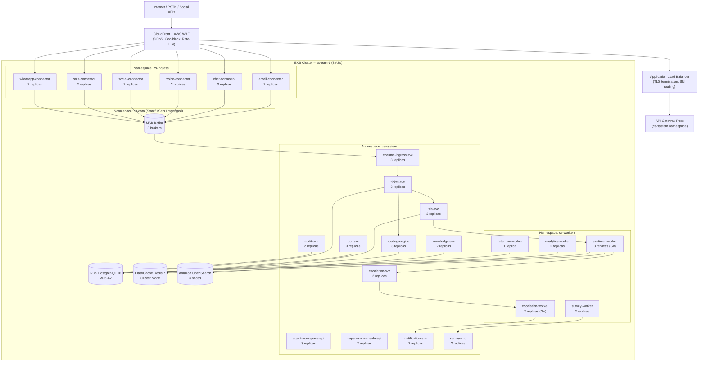

# Deployment Diagram – Customer Support and Contact Center Platform

This document specifies the full Kubernetes-based deployment topology for all services in the Contact Center Platform across namespaces, data tiers, and environments.

---

## 1. Kubernetes Cluster Topology

The platform runs on Amazon EKS across three availability zones within a single primary region (`us-east-1`) with a passive DR region (`us-west-2`). All workloads are namespace-isolated by tier.



---

## 2. Namespace: cs-system

All customer-facing API services and core domain services run in `cs-system`. Each service is deployed as a `Deployment` with a `HorizontalPodAutoscaler`.

| Service | Image | Port | Replicas (Prod) | Protocol |
|---|---|---|---|---|
| `channel-ingress-svc` | `cs/channel-ingress:latest` | 8080 | 3 | HTTP/2 + Kafka producer |
| `ticket-svc` | `cs/ticket-svc:latest` | 8080 | 3 | HTTP/2 |
| `routing-engine` | `cs/routing-engine:latest` | 8080 | 3 | HTTP/2 + Redis |
| `sla-svc` | `cs/sla-svc:latest` | 8080 | 3 | HTTP/2 + Redis |
| `escalation-svc` | `cs/escalation-svc:latest` | 8080 | 2 | HTTP/2 + Kafka consumer |
| `bot-svc` | `cs/bot-svc:latest` | 8080 | 3 | HTTP/2 + WebSocket |
| `knowledge-svc` | `cs/knowledge-svc:latest` | 8080 | 2 | HTTP/2 + OpenSearch |
| `agent-workspace-api` | `cs/agent-workspace-api:latest` | 8080 | 3 | HTTP/2 + WebSocket |
| `supervisor-console-api` | `cs/supervisor-console-api:latest` | 8080 | 2 | HTTP/2 + SSE |
| `notification-svc` | `cs/notification-svc:latest` | 8080 | 2 | HTTP/2 + Kafka consumer |
| `survey-svc` | `cs/survey-svc:latest` | 8080 | 2 | HTTP/2 |
| `audit-svc` | `cs/audit-svc:latest` | 8080 | 2 | HTTP/2 + append-only PG |
| `analytics-svc` | `cs/analytics-svc:latest` | 8080 | 2 | HTTP/2 |
| `workforce-svc` | `cs/workforce-svc:latest` | 8080 | 2 | HTTP/2 |

### Key Kubernetes manifests (cs-system):

```yaml
# ticket-svc Deployment (abbreviated)
apiVersion: apps/v1
kind: Deployment
metadata:
  name: ticket-svc
  namespace: cs-system
spec:
  replicas: 3
  selector:
    matchLabels:
      app: ticket-svc
  template:
    metadata:
      labels:
        app: ticket-svc
        version: "1.0"
    spec:
      containers:
        - name: ticket-svc
          image: cs/ticket-svc:latest
          ports:
            - containerPort: 8080
          env:
            - name: DATABASE_URL
              valueFrom:
                secretKeyRef:
                  name: cs-db-secret
                  key: url
            - name: KAFKA_BROKERS
              valueFrom:
                configMapKeyRef:
                  name: cs-kafka-config
                  key: brokers
          resources:
            requests:
              cpu: "250m"
              memory: "256Mi"
            limits:
              cpu: "1000m"
              memory: "512Mi"
          livenessProbe:
            httpGet:
              path: /healthz/live
              port: 8080
            initialDelaySeconds: 10
            periodSeconds: 15
          readinessProbe:
            httpGet:
              path: /healthz/ready
              port: 8080
            initialDelaySeconds: 5
            periodSeconds: 10
```

---

## 3. Namespace: cs-workers

High-throughput Go workers run in `cs-workers`. These are event-driven and do not expose public HTTP endpoints. SLA timer worker is the most critical — it drives all SLA clock ticks.

| Worker | Language | Replicas (Prod) | Trigger | Criticality |
|---|---|---|---|---|
| `sla-timer-worker` | Go | 3 | Redis sorted-set tick (1s poll) | P0 — SLA accuracy |
| `escalation-worker` | Go | 2 | Kafka `SLABreached` topic | P0 — breach response |
| `survey-worker` | TypeScript | 2 | Kafka `TicketResolved` topic | P2 — CSAT collection |
| `analytics-worker` | TypeScript | 2 | Kafka aggregate topics | P2 — reporting |
| `retention-worker` | TypeScript | 1 | Cron (02:00 UTC daily) | P3 — compliance |

The `sla-timer-worker` stores all active SLA clock states in Redis sorted sets keyed by `sla:clock:{tenantId}` with score = `breach_at_unix_ms`. On each tick it fetches all entries with score ≤ `now_ms` and emits `SLAWarning` or `SLABreached` events to Kafka.

```yaml
# sla-timer-worker HPA
apiVersion: autoscaling/v2
kind: HorizontalPodAutoscaler
metadata:
  name: sla-timer-worker-hpa
  namespace: cs-workers
spec:
  scaleTargetRef:
    apiVersion: apps/v1
    kind: Deployment
    name: sla-timer-worker
  minReplicas: 3
  maxReplicas: 8
  metrics:
    - type: External
      external:
        metric:
          name: kafka_consumer_lag
          selector:
            matchLabels:
              topic: sla-events
        target:
          type: AverageValue
          averageValue: "500"
```

---

## 4. Namespace: cs-ingress

Channel connectors normalize inbound messages from external channels into the internal `ChannelMessage` DTO before publishing to Kafka topic `channel.inbound`. Each connector is independently deployable.

| Connector | External System | Protocol | Replicas (Prod) | Notes |
|---|---|---|---|---|
| `email-connector` | SendGrid / SMTP relay | SMTP/IMAP + webhook | 2 | Idempotency via `Message-ID` header |
| `chat-connector` | Web SDK, mobile SDK | WebSocket + REST | 3 | Session pinning via sticky sessions |
| `voice-connector` | Twilio / AWS Connect | SIP + media | 3 | Requires dedicated node group for latency |
| `social-connector` | Twitter/X, Facebook | Webhook (OAuth2) | 2 | Rate-limit aware, per-page retry |
| `sms-connector` | Twilio SMS, SNS | Webhook | 2 | Dedup via provider message SID |
| `whatsapp-connector` | WhatsApp Business API | Webhook | 2 | Template-regulated outbound |

```yaml
# voice-connector NodeAffinity (dedicated node group for latency-sensitive SIP)
affinity:
  nodeAffinity:
    requiredDuringSchedulingIgnoredDuringExecution:
      nodeSelectorTerms:
        - matchExpressions:
            - key: node-group
              operator: In
              values: ["voice-latency"]
```

---

## 5. Data Tier

All data-tier components are managed AWS services accessed via VPC endpoints. No direct pod-to-database public paths exist.

| Component | AWS Service | Config | Purpose |
|---|---|---|---|
| PostgreSQL 16 | Amazon RDS Multi-AZ | `db.r7g.2xlarge`, 500 GB gp3, automated backups 35 days | Operational data: tickets, agents, contacts, SLA policies |
| Redis 7 | ElastiCache (Cluster Mode) | 3 shards × 2 replicas, `cache.r7g.xlarge` | Routing state, SLA clocks, bot sessions, agent presence |
| Kafka | Amazon MSK | 3 brokers, `kafka.m5.2xlarge`, 7-day retention | All domain events, inter-service async messaging |
| OpenSearch | Amazon OpenSearch | 3 data nodes, `r6g.2xlarge.search`, 1 dedicated master | Knowledge base search, conversation full-text search |
| S3 | Amazon S3 | `cs-attachments-prod`, versioning on, lifecycle to Glacier 90d | Ticket attachments, voice recordings, exports |
| Secrets | AWS Secrets Manager | Auto-rotation 30 days | DB passwords, API keys, OAuth secrets |

---

## 6. Kubernetes Resource Specifications

| Service | Dev Replicas | Stage Replicas | Prod Replicas | CPU Request/Limit | Mem Request/Limit | HPA Trigger |
|---|---|---|---|---|---|---|
| `channel-ingress-svc` | 1 | 2 | 3 | 250m / 1000m | 256Mi / 512Mi | CPU > 70% |
| `ticket-svc` | 1 | 2 | 3 | 250m / 1000m | 256Mi / 512Mi | CPU > 70% |
| `routing-engine` | 1 | 2 | 3 | 500m / 2000m | 512Mi / 1Gi | CPU > 60% |
| `sla-svc` | 1 | 2 | 3 | 250m / 1000m | 256Mi / 512Mi | CPU > 70% |
| `escalation-svc` | 1 | 1 | 2 | 100m / 500m | 128Mi / 256Mi | Queue depth > 200 |
| `bot-svc` | 1 | 2 | 3 | 250m / 1000m | 512Mi / 1Gi | Active sessions > 500 |
| `knowledge-svc` | 1 | 1 | 2 | 250m / 1000m | 256Mi / 512Mi | CPU > 70% |
| `agent-workspace-api` | 1 | 2 | 3 | 250m / 1000m | 256Mi / 512Mi | Active WS conns > 1000 |
| `supervisor-console-api` | 1 | 1 | 2 | 100m / 500m | 128Mi / 256Mi | CPU > 70% |
| `notification-svc` | 1 | 1 | 2 | 100m / 500m | 128Mi / 256Mi | Kafka lag > 1000 |
| `sla-timer-worker` | 1 | 2 | 3 | 500m / 2000m | 256Mi / 512Mi | Active clocks > 5000 |
| `escalation-worker` | 1 | 1 | 2 | 250m / 1000m | 128Mi / 256Mi | Kafka lag > 500 |
| `audit-svc` | 1 | 1 | 2 | 100m / 500m | 128Mi / 256Mi | Kafka lag > 2000 |
| `analytics-worker` | 1 | 1 | 2 | 500m / 2000m | 512Mi / 1Gi | Kafka lag > 5000 |

---

## 7. Health Check Endpoints

Every service implements both liveness and readiness probes. Readiness checks validate dependency connectivity (DB, Redis, Kafka).

| Service | Liveness Path | Readiness Path | Startup Probe |
|---|---|---|---|
| `channel-ingress-svc` | `GET /healthz/live` | `GET /healthz/ready` (Kafka ping) | 30s timeout |
| `ticket-svc` | `GET /healthz/live` | `GET /healthz/ready` (PG + Kafka) | 30s timeout |
| `routing-engine` | `GET /healthz/live` | `GET /healthz/ready` (Redis ping) | 15s timeout |
| `sla-svc` | `GET /healthz/live` | `GET /healthz/ready` (Redis + PG) | 15s timeout |
| `bot-svc` | `GET /healthz/live` | `GET /healthz/ready` (NLP client) | 60s timeout |
| `knowledge-svc` | `GET /healthz/live` | `GET /healthz/ready` (OpenSearch) | 30s timeout |
| `agent-workspace-api` | `GET /healthz/live` | `GET /healthz/ready` (PG + Redis) | 15s timeout |
| `sla-timer-worker` | `GET /healthz/live` | `GET /healthz/ready` (Redis cluster) | 20s timeout |
| `escalation-worker` | `GET /healthz/live` | `GET /healthz/ready` (Kafka + PG) | 30s timeout |
| `audit-svc` | `GET /healthz/live` | `GET /healthz/ready` (PG append test) | 20s timeout |

**Response schema for `/healthz/ready`:**
```json
{
  "status": "ok",
  "checks": {
    "postgres": "ok",
    "redis": "ok",
    "kafka": "ok"
  },
  "uptime_seconds": 4723
}
```

HTTP 200 = ready. HTTP 503 = not ready (Kubernetes holds traffic).

---

## 8. Deployment Strategies

| Service | Strategy | maxUnavailable | maxSurge | Notes |
|---|---|---|---|---|
| `ticket-svc` | `RollingUpdate` | 1 | 1 | Graceful drain: 30s terminationGracePeriodSeconds |
| `routing-engine` | `RollingUpdate` | 0 | 1 | Zero-downtime — cannot drop routing state |
| `sla-timer-worker` | `RollingUpdate` | 0 | 1 | Redis clock state persists; leader-election handoff |
| `channel-ingress-svc` | `RollingUpdate` | 1 | 2 | Stateless connector; fast rollout acceptable |
| `voice-connector` | `Recreate` | N/A | N/A | SIP sessions require full restart on version change |
| `audit-svc` | `RollingUpdate` | 0 | 1 | Append-only — no in-flight loss tolerated |
| `bot-svc` | `RollingUpdate` | 1 | 1 | Active bot sessions drain before pod shutdown |
| `retention-worker` | `Recreate` | N/A | N/A | Single-replica cron job; recreate is safe |

**Graceful shutdown hook** (TypeScript services):
```typescript
process.on('SIGTERM', async () => {
  logger.info('SIGTERM received — draining connections');
  server.close(async () => {
    await kafkaProducer.disconnect();
    await pgPool.end();
    await redisClient.quit();
    process.exit(0);
  });
});
```

---

## 9. PodDisruptionBudgets

PDBs prevent Kubernetes node drains from disrupting service availability.

```yaml
# ticket-svc PDB
apiVersion: policy/v1
kind: PodDisruptionBudget
metadata:
  name: ticket-svc-pdb
  namespace: cs-system
spec:
  minAvailable: 2
  selector:
    matchLabels:
      app: ticket-svc
---
# sla-timer-worker PDB (critical — minimum 2 replicas always up)
apiVersion: policy/v1
kind: PodDisruptionBudget
metadata:
  name: sla-timer-worker-pdb
  namespace: cs-workers
spec:
  minAvailable: 2
  selector:
    matchLabels:
      app: sla-timer-worker
---
# routing-engine PDB
apiVersion: policy/v1
kind: PodDisruptionBudget
metadata:
  name: routing-engine-pdb
  namespace: cs-system
spec:
  minAvailable: 2
  selector:
    matchLabels:
      app: routing-engine
```

All P0 services (`ticket-svc`, `routing-engine`, `sla-timer-worker`, `channel-ingress-svc`, `agent-workspace-api`) have `minAvailable: 2` or `maxUnavailable: 1`.

---

## 10. Rollout Procedure (GitOps with ArgoCD)

```mermaid
flowchart LR
    PR["Feature PR\nmerged to main"] --> CI["GitHub Actions CI\n(lint, unit, integration tests)"]
    CI --> Build["Docker build\n+ ECR push\n(SHA-tagged)"]
    Build --> ArgoCD_Dev["ArgoCD – Dev\n(auto-sync)"]
    ArgoCD_Dev --> SmokeTest["Smoke Test Suite\n(ticket create/route/SLA)"]
    SmokeTest --> ArgoCD_Stage["ArgoCD – Stage\n(manual promotion gate)"]
    ArgoCD_Stage --> LoadTest["Load Test Gate\n(k6: 500 concurrent tickets)"]
    LoadTest --> ContractTest["Consumer-Driven\nContract Tests\n(Pact)"]
    ContractTest --> ArgoCD_Prod["ArgoCD – Prod\n(manual approval + runbook sign-off)"]
    ArgoCD_Prod --> Canary["Canary: 5% traffic\n(10 min observation)"]
    Canary --> FullRollout["Full Rollout\n(RollingUpdate)"]
    FullRollout --> Monitor["Post-deploy Monitor\n(15 min SLO window)"]
```



**Promotion Gates:**

| Gate | Criterion | Failure Action |
|---|---|---|
| Unit tests | 100% pass | Block PR merge |
| Integration tests | 100% pass | Block CI |
| SLA contract tests | 100% pass | Block stage promotion |
| Load test P99 latency | < 500ms for ticket create | Block prod promotion |
| Error rate (smoke) | < 0.1% | Block stage promotion |
| Canary error rate | < 0.5% for 10 min | Auto-rollback via ArgoCD |

**Rollback procedure:**
1. ArgoCD detects canary error spike → auto-reverts `image.tag` in Helm values.
2. On manual rollback: `argocd app set cs-system --kustomize-image cs/ticket-svc=<previous-sha>`.
3. SLA timers are stateless in Redis — rollback does not corrupt SLA state.
4. Post-rollback: run `POST /internal/sla/reconcile` to verify no clock drift.
