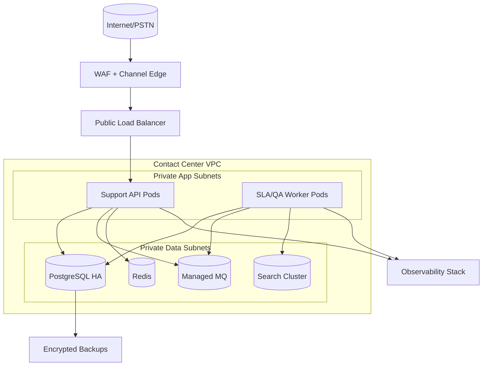
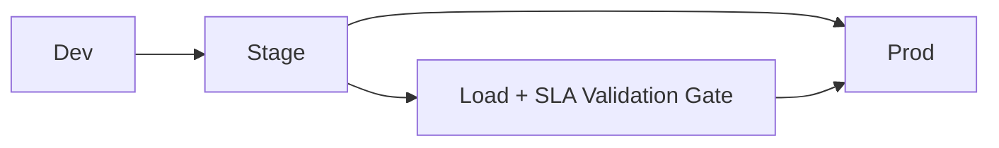
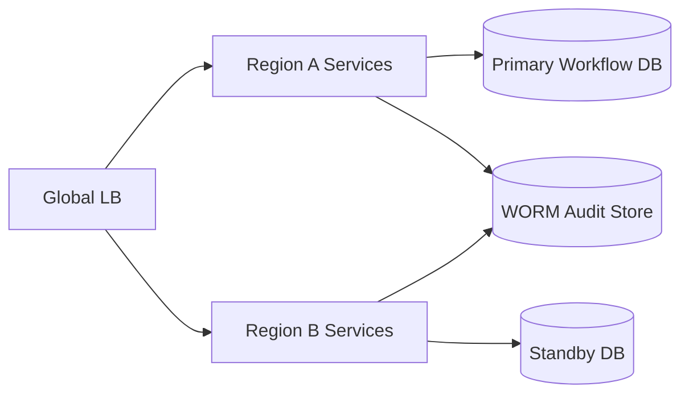

# Deployment Diagram

## Production Deployment

## Environment Promotion

## Deployment Narrative with Resilience
Deployment diagram should include active-active channel ingress, active-passive workflow DB failover, and isolated audit storage.

Incident runbook trigger: fail over only after queue-drain checkpoint and SLA clock continuity verification.

Operational coverage note: this artifact also specifies omnichannel controls for this design view.
