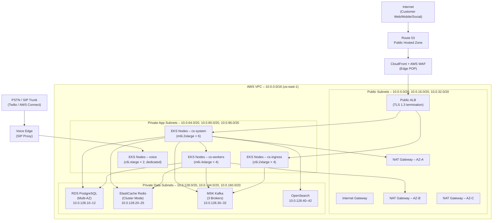
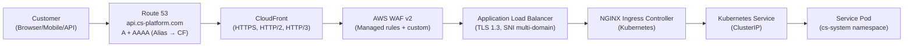
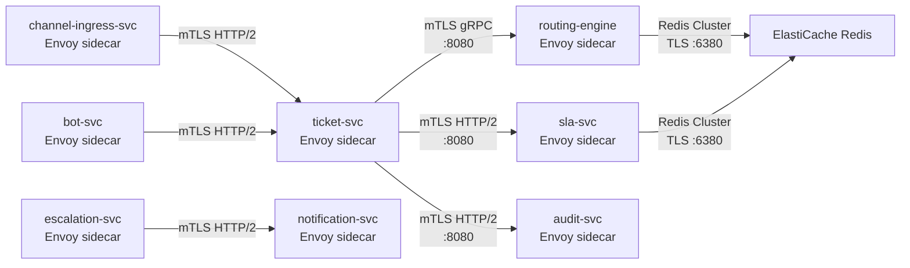
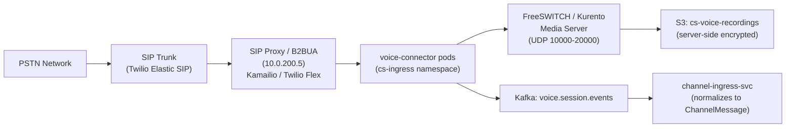
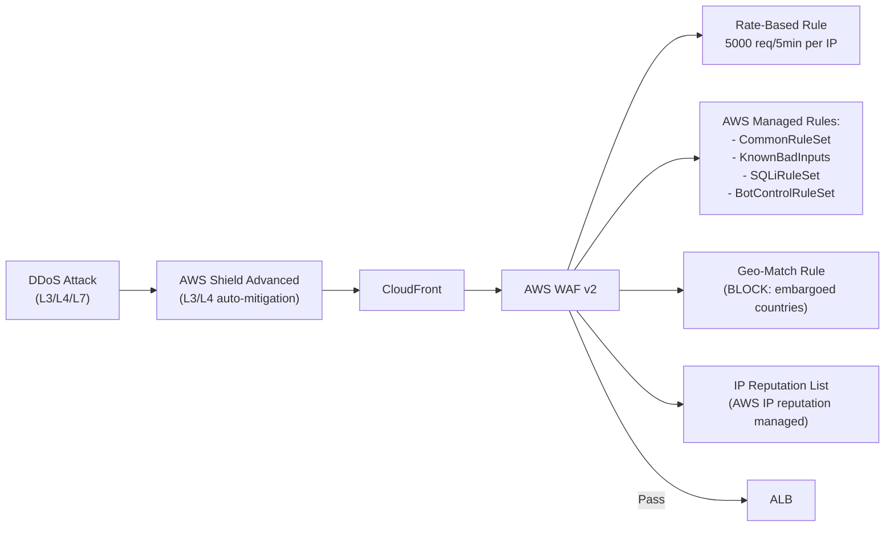

# Network Infrastructure – Customer Support and Contact Center Platform

This document defines the complete network topology, security group rules, service mesh configuration, telephony connectivity, and Kubernetes network policies for the Contact Center Platform.

---

## 1. Network Topology Diagram



---

## 2. VPC Design

**CIDR Block:** `10.0.0.0/16` — provides 65,536 IPs.

| Subnet Type | AZ-A | AZ-B | AZ-C | Purpose |
|---|---|---|---|---|
| Public | `10.0.0.0/22` | `10.0.4.0/22` | `10.0.8.0/22` | ALB, NAT Gateway, Bastion |
| Private App | `10.0.64.0/20` | `10.0.80.0/20` | `10.0.96.0/20` | EKS worker nodes |
| Private Data | `10.0.128.0/22` | `10.0.132.0/22` | `10.0.136.0/22` | RDS, ElastiCache, MSK, OpenSearch |
| Voice/Media | `10.0.200.0/24` | `10.0.201.0/24` | — | SIP proxy, media relay nodes |

**Key Components:**
- **Internet Gateway**: attached to VPC for public subnet egress.
- **NAT Gateways**: one per AZ (AZ-A, AZ-B, AZ-C) in public subnets — provides HA outbound for private subnets.
- **VPC Endpoints**: S3 (Gateway), Secrets Manager, ECR API, ECR DKR, STS, CloudWatch Logs (Interface) — eliminates NAT data transfer charges and keeps traffic within AWS backbone.
- **Route Tables**: public subnets → IGW; private app subnets → respective AZ NAT Gateway; private data subnets → no internet route (data-tier isolation).

---

## 3. Ingress Path



**ALB Listener Rules:**
- `api.cs-platform.com/v1/tickets/*` → `ticket-svc:8080`
- `api.cs-platform.com/v1/routing/*` → `routing-engine:8080`
- `ws.cs-platform.com/*` → `agent-workspace-api:8080` (WebSocket upgrade)
- `chat.cs-platform.com/*` → `chat-connector:8080` (WebSocket)
- `voice.cs-platform.com/*` → `voice-connector:8080` (SIP signaling)

**CloudFront Settings:**
- Origin shield enabled (reduce ALB hits).
- Cache policy: `CachingDisabled` for API paths; `CachingOptimized` for knowledge article CDN paths.
- Geo-restriction: block embargoed countries per compliance requirement.
- Custom headers: `X-Forwarded-For` preserved; `X-Origin-Verify` secret header for ALB origin auth.

---

## 4. Service Mesh (Istio / Envoy)

All service-to-service communication within EKS uses Istio with mTLS enforced in `STRICT` mode for `cs-system` and `cs-workers` namespaces.



**Istio PeerAuthentication (STRICT mTLS):**
```yaml
apiVersion: security.istio.io/v1beta1
kind: PeerAuthentication
metadata:
  name: cs-system-strict-mtls
  namespace: cs-system
spec:
  mtls:
    mode: STRICT
```

**Istio AuthorizationPolicy** (ticket-svc only accepts from channel-ingress, bot-svc, agent-workspace-api):
```yaml
apiVersion: security.istio.io/v1beta1
kind: AuthorizationPolicy
metadata:
  name: ticket-svc-authz
  namespace: cs-system
spec:
  selector:
    matchLabels:
      app: ticket-svc
  rules:
    - from:
        - source:
            principals:
              - "cluster.local/ns/cs-system/sa/channel-ingress-svc"
              - "cluster.local/ns/cs-system/sa/bot-svc"
              - "cluster.local/ns/cs-system/sa/agent-workspace-api"
              - "cluster.local/ns/cs-system/sa/escalation-svc"
```

---

## 5. Security Groups Per Tier

**SG: `sg-cs-alb` (Public ALB)**

| Direction | Protocol | Port | Source | Purpose |
|---|---|---|---|---|
| Inbound | TCP | 443 | `0.0.0.0/0` | HTTPS from CloudFront |
| Inbound | TCP | 80 | `0.0.0.0/0` | HTTP redirect to HTTPS |
| Outbound | TCP | 8080 | `sg-cs-app` | Forward to app nodes |

**SG: `sg-cs-app` (EKS Application Nodes)**

| Direction | Protocol | Port | Source/Dest | Purpose |
|---|---|---|---|---|
| Inbound | TCP | 8080 | `sg-cs-alb` | ALB → pod traffic |
| Inbound | TCP | 15017 | `sg-cs-app` | Istio control plane |
| Inbound | TCP | 8080 | `sg-cs-app` | Pod-to-pod (service mesh) |
| Outbound | TCP | 5432 | `sg-cs-data` | PostgreSQL |
| Outbound | TCP | 6380 | `sg-cs-data` | Redis TLS |
| Outbound | TCP | 9092–9096 | `sg-cs-data` | Kafka (MSK) |
| Outbound | TCP | 443 | `sg-cs-data` | OpenSearch HTTPS |
| Outbound | TCP | 443 | `0.0.0.0/0` via NAT | External APIs (via NAT GW) |

**SG: `sg-cs-data` (Data Tier)**

| Direction | Protocol | Port | Source | Purpose |
|---|---|---|---|---|
| Inbound | TCP | 5432 | `sg-cs-app` | PostgreSQL from app tier |
| Inbound | TCP | 6380 | `sg-cs-app` | Redis TLS from app tier |
| Inbound | TCP | 9092–9096 | `sg-cs-app` | Kafka from app tier |
| Inbound | TCP | 443 | `sg-cs-app` | OpenSearch HTTPS |
| Outbound | All | All | `sg-cs-data` | Data tier internal replication |

**SG: `sg-cs-voice` (Voice/Media Nodes)**

| Direction | Protocol | Port | Source | Purpose |
|---|---|---|---|---|
| Inbound | UDP | 10000–20000 | `0.0.0.0/0` | RTP media streams |
| Inbound | TCP | 5060–5061 | Twilio CIDR | SIP signaling |
| Outbound | UDP | 10000–20000 | `0.0.0.0/0` | RTP media egress |
| Outbound | TCP | 5061 | Twilio CIDR | SIP TLS |

---

## 6. Kubernetes Network Policies

```yaml
# Allow ticket-svc to receive only from approved sources
apiVersion: networking.k8s.io/v1
kind: NetworkPolicy
metadata:
  name: ticket-svc-ingress
  namespace: cs-system
spec:
  podSelector:
    matchLabels:
      app: ticket-svc
  policyTypes: [Ingress, Egress]
  ingress:
    - from:
        - podSelector:
            matchLabels:
              app: channel-ingress-svc
        - podSelector:
            matchLabels:
              app: bot-svc
        - podSelector:
            matchLabels:
              app: agent-workspace-api
        - podSelector:
            matchLabels:
              app: escalation-svc
      ports:
        - port: 8080
  egress:
    - to:
        - namespaceSelector:
            matchLabels:
              name: cs-data
      ports:
        - port: 5432   # PostgreSQL
        - port: 6380   # Redis
        - port: 9092   # Kafka
---
# Deny all ingress to audit-svc except from internal services
apiVersion: networking.k8s.io/v1
kind: NetworkPolicy
metadata:
  name: audit-svc-deny-external
  namespace: cs-system
spec:
  podSelector:
    matchLabels:
      app: audit-svc
  policyTypes: [Ingress]
  ingress:
    - from:
        - namespaceSelector:
            matchLabels:
              name: cs-system
        - namespaceSelector:
            matchLabels:
              name: cs-workers
---
# cs-workers can only egress to data tier
apiVersion: networking.k8s.io/v1
kind: NetworkPolicy
metadata:
  name: cs-workers-egress
  namespace: cs-workers
spec:
  podSelector: {}
  policyTypes: [Egress]
  egress:
    - to:
        - namespaceSelector:
            matchLabels:
              name: cs-data
    - to:
        - namespaceSelector:
            matchLabels:
              name: cs-system
      ports:
        - port: 8080
```

---

## 7. Telephony / Voice Network

Voice infrastructure uses a dedicated subnet (`10.0.200.0/24`) with ultra-low latency requirements.



**Voice Network Requirements:**
- Dedicated node group: `c6i.xlarge`, no hyperthreading, CPU pinning for media processes.
- UDP ports `10000–20000` open bidirectionally for RTP.
- SIP TLS (port 5061) for signaling encryption.
- Media recorded to S3 `cs-voice-recordings-prod` with SSE-KMS encryption.
- After call end, `voice-connector` emits `VoiceCallEnded` event; wrap code timer starts (BR-09: 3-minute wrap code window).

---

## 8. External Connectivity (Egress Rules)

| Destination | Protocol | Purpose | NAT Gateway | Authentication |
|---|---|---|---|---|
| SendGrid API (`api.sendgrid.com`) | HTTPS/443 | Email delivery | AZ-A NAT | API key (Secrets Manager) |
| Twitter/X API (`api.twitter.com`) | HTTPS/443 | Social DMs | AZ-A NAT | OAuth 2.0 (Secrets Manager) |
| Facebook Graph API | HTTPS/443 | Messenger | AZ-A NAT | App token (Secrets Manager) |
| Twilio REST API | HTTPS/443 | SMS/Voice | AZ-B NAT | Account SID + Auth token |
| WhatsApp Business API | HTTPS/443 | WhatsApp | AZ-B NAT | Bearer token |
| NLP Engine (internal) | HTTPS/443 | Bot NLU | VPC-internal | mTLS |
| Webhook endpoints (customer) | HTTPS/443 | Notifications | AZ-C NAT | HMAC-SHA256 signature |
| PagerDuty API | HTTPS/443 | Incident alerts | AZ-C NAT | API key |
| Datadog / Prometheus RemoteWrite | HTTPS/443 | Metrics | AZ-A NAT | API key |

All egress traffic from app pods is routed through NAT Gateways — no direct IGW access from private subnets.

---

## 9. DDoS Protection and Rate Limiting



**WAF Custom Rules:**
- Block requests with `Content-Type: text/xml` to `/v1/tickets` (SSRF prevention).
- Rate limit `/v1/auth/login` to 10 req/minute per IP.
- Block `User-Agent: *bot*` on authenticated endpoints (allow on public widget endpoints).
- `X-Origin-Verify` header required on ALB — CloudFront injects secret; direct-to-ALB requests are blocked.

**Kubernetes Ingress Rate Limiting (NGINX):**
```yaml
annotations:
  nginx.ingress.kubernetes.io/limit-rps: "100"
  nginx.ingress.kubernetes.io/limit-connections: "20"
  nginx.ingress.kubernetes.io/limit-burst-multiplier: "5"
```

---

## 10. AWS PrivateLink for Data Tier Connections

All connections from EKS pods to managed AWS services use VPC Endpoints to avoid traversing the public internet.

| Service | VPC Endpoint Type | Endpoint DNS |
|---|---|---|
| Amazon S3 | Gateway | Automatic route table injection |
| Amazon ECR API | Interface | `vpce-xxx.ecr.api.us-east-1.vpce.amazonaws.com` |
| Amazon ECR DKR | Interface | `vpce-xxx.dkr.ecr.us-east-1.vpce.amazonaws.com` |
| AWS Secrets Manager | Interface | `vpce-xxx.secretsmanager.us-east-1.vpce.amazonaws.com` |
| AWS STS | Interface | `vpce-xxx.sts.us-east-1.vpce.amazonaws.com` |
| Amazon CloudWatch Logs | Interface | `vpce-xxx.logs.us-east-1.vpce.amazonaws.com` |
| AWS KMS | Interface | `vpce-xxx.kms.us-east-1.vpce.amazonaws.com` |

RDS, ElastiCache, MSK, and OpenSearch are accessed via their private DNS names within the VPC — they do not require VPC endpoint configurations (they are already VPC-native services).

**PrivateLink Security:**
- VPC endpoint policies restrict which IAM principals can use each endpoint.
- Example Secrets Manager endpoint policy: only allow `cs-system/*` service accounts to `GetSecretValue`.
- All interface endpoint ENIs are placed in the private data subnet with `sg-cs-data` security group.
