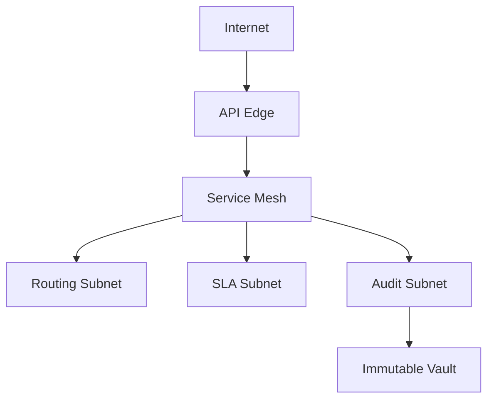

# Network Infrastructure

## Purpose
Define the network infrastructure artifacts for the **Customer Support and Contact Center Platform** with implementation-ready detail.

## Domain Context
- Domain: Support Center
- Core entities: Conversation, Ticket, Queue, SLA Policy, Agent Skill, Bot Session, Escalation
- Primary workflows: intake across channels, skill-based routing and assignment, SLA monitoring and escalation, bot-to-human transfer, QA and workforce planning

## Key Design Decisions
- Enforce idempotency and correlation IDs for all mutating operations.
- Persist immutable audit events for critical lifecycle transitions.
- Separate online transaction paths from async reconciliation/repair paths.

## Reliability and Compliance
- Define SLOs and error budgets for user-facing operations.
- Include RBAC, least-privilege service identities, and full audit trails.
- Provide runbooks for degraded mode, replay, and backfill operations.

## Infrastructure Emphasis
- Multi-environment topology (dev/stage/prod) with promotion gates.
- Network segmentation, private service communication, and WAF boundaries.
- Backup, disaster recovery, and key rotation procedures.

## Network Infrastructure Narrative
- Separate public ingress, service mesh, and compliance subnet boundaries.
- Prioritize low-latency paths from channel ingress to routing services; SLA timers depend on ingestion timestamp fidelity.
- Audit traffic is egress-restricted to append-only endpoint.

Operational coverage note: this artifact also specifies omnichannel and incident controls for this design view.
