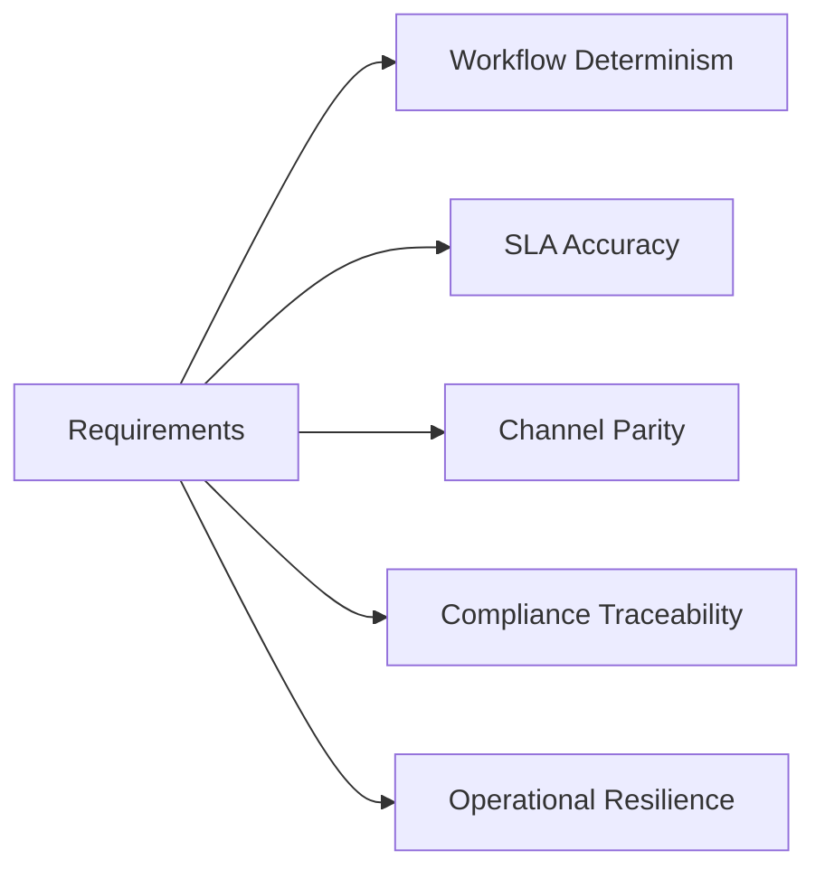

# Requirements

## Purpose
Define the requirements artifacts for the **Customer Support and Contact Center Platform** with implementation-ready detail.

## Domain Context
- Domain: Support Center
- Core entities: Conversation, Ticket, Queue, SLA Policy, Agent Skill, Bot Session, Escalation
- Primary workflows: intake across channels, skill-based routing and assignment, SLA monitoring and escalation, bot-to-human transfer, QA and workforce planning

## Key Design Decisions
- Enforce idempotency and correlation IDs for all mutating operations.
- Persist immutable audit events for critical lifecycle transitions.
- Separate online transaction paths from async reconciliation/repair paths.

## Reliability and Compliance
- Define SLOs and error budgets for user-facing operations.
- Include RBAC, least-privilege service identities, and full audit trails.
- Provide runbooks for degraded mode, replay, and backfill operations.

## Functional Requirement Themes
- User/account lifecycle and permissions for all actors.
- Transactional consistency for omnichannel conversations, routing, SLA management, and workforce operations.
- Event-driven integration contracts with upstream/downstream systems.

## Non-Functional Requirements
- Availability target: 99.9% monthly for tier-1 APIs.
- Data integrity: no silent data loss; deterministic replay supported.
- Security: encryption in transit/at rest and detailed access logs.

## Expanded Non-Functional and Operational Requirements
- **Queue/workflow:** support 100k concurrent queued items with deterministic ordering per tenant policy.
- **SLA/escalation:** compute SLA checkpoint events within 2 seconds of threshold crossing.
- **Omnichannel:** ingest and normalize voice/chat/email/social with at-least-once delivery and dedup guarantees.
- **Auditability:** immutable logs for all privileged and state-changing actions retained per policy/region.
- **Incident response:** detect and page on breach-rate anomalies within 1 minute; provide degraded mode controls.

