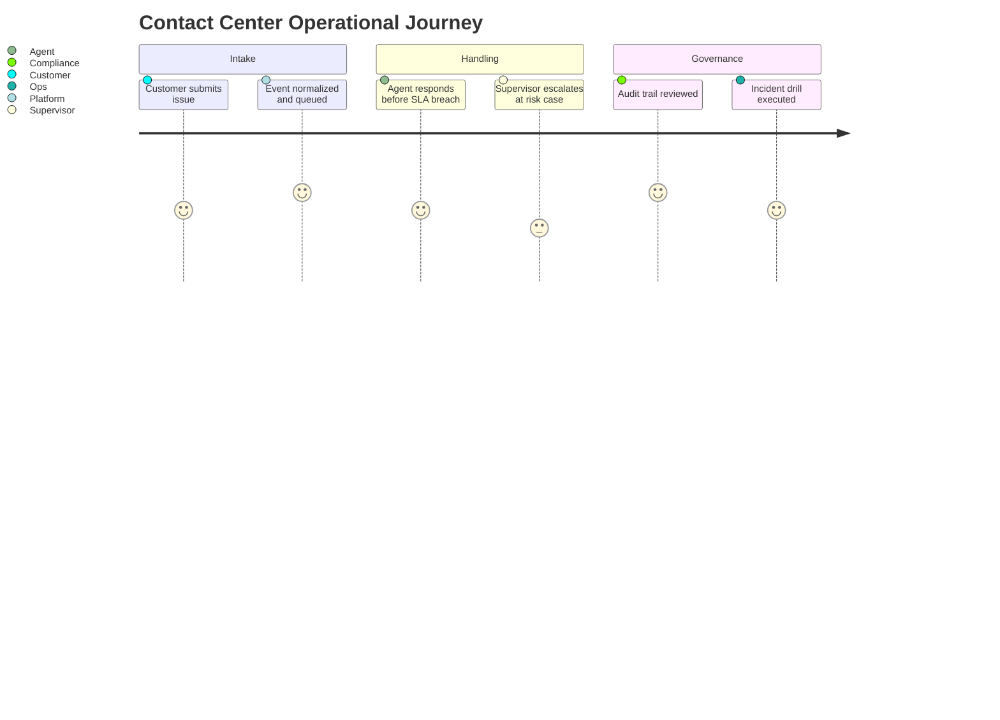

# User Stories

## Purpose
Define the user stories artifacts for the **Customer Support and Contact Center Platform** with implementation-ready detail.

## Domain Context
- Domain: Support Center
- Core entities: Conversation, Ticket, Queue, SLA Policy, Agent Skill, Bot Session, Escalation
- Primary workflows: intake across channels, skill-based routing and assignment, SLA monitoring and escalation, bot-to-human transfer, QA and workforce planning

## Key Design Decisions
- Enforce idempotency and correlation IDs for all mutating operations.
- Persist immutable audit events for critical lifecycle transitions.
- Separate online transaction paths from async reconciliation/repair paths.

## Reliability and Compliance
- Define SLOs and error budgets for user-facing operations.
- Include RBAC, least-privilege service identities, and full audit trails.
- Provide runbooks for degraded mode, replay, and backfill operations.

## Representative User Stories
- As an operator, I can complete the primary workflow with validation and audit evidence.
- As a manager, I can see queue/backlog/SLA metrics to manage throughput.
- As an admin, I can configure policy and recover from partial failures safely.

## User Stories: Operational Depth
- As a **support agent**, I need queue priority and SLA countdown visible so I can triage correctly.
- As a **supervisor**, I need deterministic escalation reasons and acknowledgments to manage breach risk.
- As a **platform engineer**, I need omnichannel deduplication and replay-safe events so incidents can be recovered.
- As a **compliance officer**, I need immutable audit timelines for every override and redaction.
- As an **incident commander**, I need one-click degraded mode with measurable rollback criteria.

