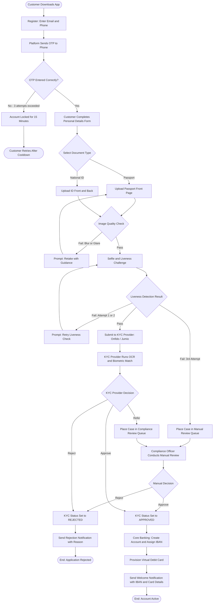
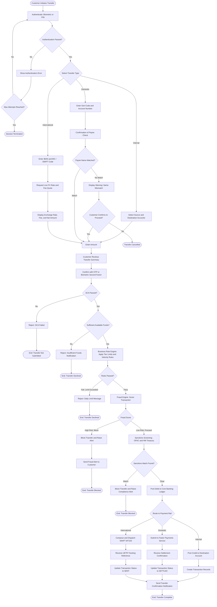
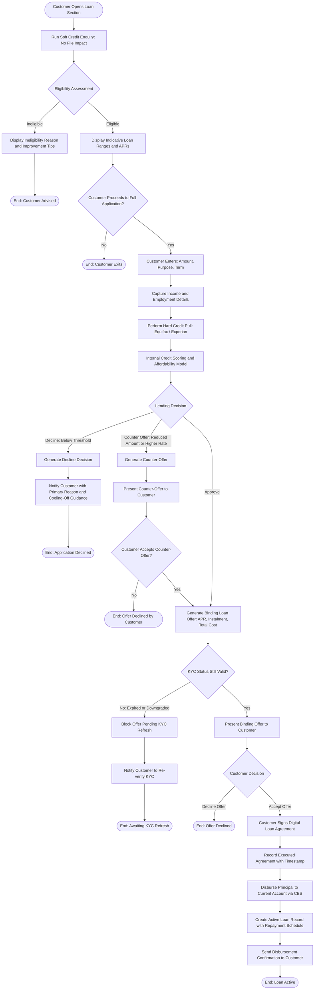
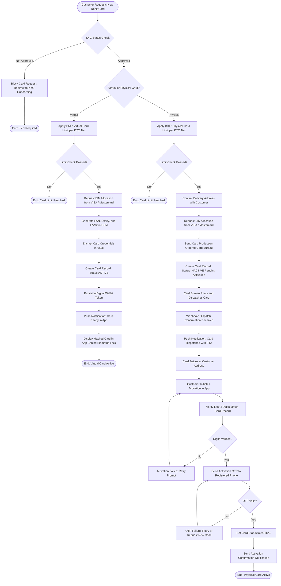

# Activity Diagrams — Digital Banking Platform

| Field | Value |
|---|---|
| Document ID | DBP-AD-001 |
| Version | 1.0 |
| Status | Approved |
| Owner | Business Analysis |
| Last Updated | 2025-01-15 |

## Overview

This document presents four activity diagrams modelling the primary end-to-end workflows of the Digital Banking Platform. Each diagram is expressed in Mermaid flowchart notation and is followed by a detailed activity-node table identifying the responsible actor, the executing system component, and any applicable business rules or SLA constraints.

---

## Account Onboarding Flow

This diagram models the complete journey from application download through to active account creation, including all error and exception paths encountered during document processing and KYC verification.

### Onboarding Activity Node Reference

| Node | Activity | Actor | System Component | Notes |
|---|---|---|---|---|
| Register | Capture email, phone, and password | Customer | Auth Service | Email uniqueness validated in real time |
| Send OTP | Generate and dispatch 6-digit OTP | Platform | Notification Service → SMS Provider | OTP valid for 10 minutes, max 3 resends |
| OTP Verify | Validate OTP against time-based hash | Platform | Auth Service | Lockout applied after 3 consecutive failures |
| Personal Details Form | Collect full name, DoB, address, nationality | Customer | Onboarding Service | Fields validated against ISO 3166 country codes |
| Document Upload | Capture front/back images of ID document | Customer | KYC Service | Resolution ≥ 640×480, file ≤ 10 MB per image |
| Image Quality Check | Assess blur, glare, cropping, and OCR readability | Platform | KYC Service (pre-check) | Synchronous; result returned in < 2 seconds |
| Liveness Challenge | Prompt customer to perform head-movement sequence | Customer | KYC Service | Random prompts to defeat replay attacks |
| KYC Provider Processing | OCR data extraction, face match, liveness scoring | KYC Provider | Onfido / Jumio | Async; webhook callback within 60 seconds |
| Manual Review | Compliance officer reviews evidence | Compliance Officer | Compliance Portal | SLA: decision within 2 business days |
| Account Creation | Open account ledger record and allocate IBAN | Platform | Core Banking Integration | Atomic; rolls back if card provisioning fails |
| Virtual Card Provision | Allocate PAN from VISA/MC BIN range, encrypt and store | Platform | Card Service | Card active within 60 seconds of account creation |
| Welcome Notification | Dispatch multi-channel welcome message | Platform | Notification Service | Push, email, and SMS dispatched simultaneously |

---

## Money Transfer Flow

This diagram covers all transfer types — internal between own accounts, domestic via Faster Payments, and international via SWIFT — including fraud screening, compliance gating, and failure paths.

### Money Transfer Activity Node Reference

| Node | Activity | Actor | System Component | SLA / Rule |
|---|---|---|---|---|
| Authenticate | Biometric or PIN challenge | Customer | Auth Service | Session token valid 15 minutes |
| Transfer Type Selection | Choose internal, domestic, or international | Customer | Payment UI | Route determines downstream processing path |
| Confirmation of Payee | Lookup beneficiary name against sort code and account | Platform | Payment Service → CoP API | Synchronous; < 2 s |
| FX Quote | Fetch live rate from FX pricing engine | Platform | FX Service | Quote valid for 30 seconds |
| SCA Challenge | OTP or biometric strong customer authentication | Customer / Platform | Auth Service | Mandatory per PSD2 SCA requirements |
| Funds Check | Verify available balance minus pending holds | Platform | Core Banking Integration | Synchronous balance read |
| Business Rule Engine | Evaluate daily limit, velocity, and tier rules | Platform | BRE | Synchronous; < 100 ms |
| Fraud Engine | Score transaction against ML model | Platform | Fraud Engine | Synchronous; < 200 ms |
| Sanctions Screening | Check names and IBANs against sanctions lists | Platform | Compliance Service | Synchronous; < 500 ms; updated lists every 4 h |
| CBS Debit Posting | Reserve and post debit on source account ledger | Platform | Core Banking Integration | Must succeed before rail submission |
| FPS Submission | Send Faster Payments instruction | Platform | Payment Rail Adapter | Settlement confirmed < 20 s |
| SWIFT MT103 Dispatch | Compose and send international payment message | Platform | SWIFT Gateway | UETR returned within 5 s of dispatch |
| Confirmation Notification | Dispatch settlement confirmation to customer | Platform | Notification Service | Within 30 s of settlement |

---

## Loan Application Flow

This diagram covers the complete personal loan journey from eligibility check through to active loan disbursement, including soft credit pull, full application, counter-offer, and rejection paths.

### Loan Application Activity Node Reference

| Node | Activity | Actor | System Component | Notes |
|---|---|---|---|---|
| Soft Credit Enquiry | Request indicative credit profile without hard footprint | Platform | Loan Service → Credit Bureau | No impact on customer credit file |
| Eligibility Assessment | Evaluate score, account history, and active defaults | Platform | Loan Service / Scoring Engine | Rule BR-005 applied |
| Loan Detail Capture | Amount, purpose, requested term | Customer | Loan Application UI | Purpose codes per Consumer Credit Act schedule |
| Hard Credit Pull | Formal credit enquiry, leaves footprint | Platform | Credit Bureau Integration | Requires customer explicit consent |
| Internal Scoring | Affordability model combining bureau data and internal history | Platform | Credit Decisioning Engine | Proprietary ML model, updated quarterly |
| Counter-Offer Generation | Produce reduced-amount or adjusted-rate alternative offer | Platform | Loan Service | Requires risk committee threshold approval |
| Binding Offer | Compliant offer including APR, APRC, monthly instalment, total repayable | Platform | Loan Service | Consumer Credit Act pre-contractual disclosure |
| KYC Re-check | Confirm KYC tier still valid and not expired | Platform | KYC Service | Loan disbursement blocked if KYC status changed |
| Digital Agreement Sign | Customer accepts and e-signs SECCI and loan agreement | Customer | Document Service | Qualified electronic signature, stored immutably |
| Disbursement | Transfer principal to nominated current account | Platform | Core Banking Integration | Completed within 2 hours of agreement execution |
| Loan Record Creation | Persist loan, repayment schedule, and lien against account | Platform | Loan Service / CBS | Amortisation schedule generated at creation |

---

## Card Issuance Flow

This diagram models both the virtual and physical card issuance journeys from customer request through BIN allocation, card record creation, delivery, and activation.

### Card Issuance Activity Node Reference

| Node | Activity | Actor | System Component | Notes |
|---|---|---|---|---|
| KYC Status Check | Verify customer KYC tier is APPROVED before card issuance | Platform | Card Service → KYC Service | Cards blocked for PENDING or REJECTED KYC status |
| Card Type Selection | Customer selects virtual or physical product | Customer | Card Request UI | Both paths trigger BRE evaluation |
| BRE Limit Check | Verify customer has not exceeded maximum cards per tier | Platform | Business Rule Engine | Tier 1: max 1 virtual; Tier 2+: 1 virtual + 1 physical |
| BIN Allocation | Request and reserve a card number from the VISA/MC BIN range | Platform | Card Service → VISA/MC | BIN range pre-allocated under bank's sponsorship agreement |
| PAN and CVV Generation | Generate cryptographically secure card credentials in HSM | Platform | Card Service / HSM | PAN stored encrypted; CVV never stored in plain text |
| Card Record Creation | Persist card metadata linked to account | Platform | Card Service / Database | Card record includes PAN hash, expiry, status, and network |
| Digital Wallet Token | Request network token for Apple Pay / Google Pay | Platform | Token Service → VISA/MC TDES | Token maps to PAN without exposing real PAN to wallet |
| Production Order | Instruct card bureau to emboss and mail physical card | Platform | Card Production Adapter | Bureau SLA: dispatch within 2 business days of order |
| Activation Verification | Match customer-entered digits against card record | Platform | Card Service | Digit match + OTP constitutes strong customer authentication |
| Card Activation | Transition card status from INACTIVE to ACTIVE in ledger | Platform | Card Service / Core Banking | CBS notified of card activation for limit and limit-checking |
