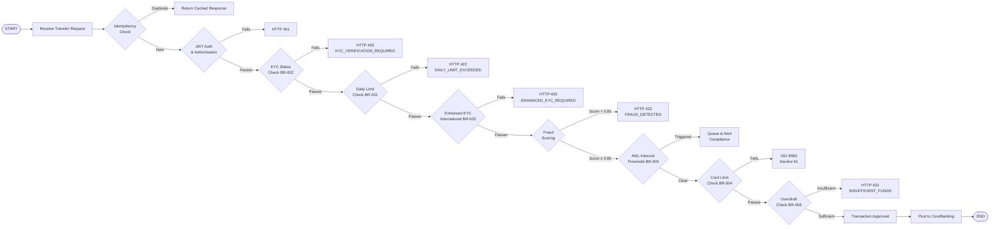

| Field | Value |
| --- | --- |
| Document ID | DBP-AN-032 |
| Version | 1.0 |
| Status | Approved |
| Owner | Platform Engineering — Compliance & Risk |
| Last Updated | 2025-01-15 |
| Classification | Internal — Restricted |

# Business Rules — Digital Banking Platform

This document is the authoritative specification for all enforceable business rules governing the Digital Banking Platform. Rules are derived from a combination of regulatory obligations (UK FCA, EU PSD2, FATF, BSA/AML), product policy decisions, and the platform's risk management framework. Each rule specifies its trigger, condition, action, enforcement layer, and failure behaviour in sufficient detail to allow deterministic implementation and full test coverage. All rule definitions in this document take precedence over any informal or legacy documentation.

---

## Enforceable Rules

The rules in this section are evaluated in real-time within the request processing pipeline as part of each inbound command's validation lifecycle; a subset are also evaluated by scheduled batch jobs that operate outside the request cycle. Any change to a rule definition must be reviewed by Platform Engineering — Compliance & Risk, approved by the Chief Compliance Officer, and reflected in both the test suite and this document before deployment.

---

### BR-001: Transfer Daily Limit

A customer may not transfer more than their configured `daily_transfer_limit` (default £10,000) across all outgoing transactions on a calendar day, with the window resetting at UTC midnight. The limit is configurable per customer tier and may be raised by a staff override with dual authorisation, subject to the exception handling process described in the override section. Attempts exceeding the limit are rejected with HTTP 422 and error code `DAILY_LIMIT_EXCEEDED`, with the current utilisation figure returned in the response body to assist the customer in understanding how much of their limit remains.

| Attribute | Value |
| --- | --- |
| Rule ID | BR-001 |
| Rule Name | Transfer Daily Limit |
| Category | Transaction Controls |
| Trigger | POST /transfers request received |
| Condition | SUM(outgoing_transactions, calendar_day_UTC) + new_amount > customer.account.daily_transfer_limit |
| Action | Reject transfer; return HTTP 422 with error code DAILY_LIMIT_EXCEEDED and current utilisation in response body |
| Enforcement Layer | TransactionService — domain validation layer, before persistence |
| Regulatory Basis | PSD2 Art. 52(6) — strong customer authentication and spending controls |
| Failure Behaviour | HTTP 422; no debit hold placed; idempotency key invalidated; event TransferRejected published |
| Test Scenario | Customer with £10,000 limit attempts £6,000 transfer after £5,000 already transferred today — expect rejection |

---

### BR-002: KYC Required Before First Transaction

No monetary transaction (debit, credit, or transfer) may be executed on an account unless the owning customer holds a `KYCRecord` with `verification_status = passed`. Accounts in `pending_kyc` status are treated as read-only; balance enquiries and statement downloads are permitted but no movement of funds is allowed under any circumstances. This rule applies universally across all transaction types, including internal transfers, direct debits, standing orders, and card payments.

| Attribute | Value |
| --- | --- |
| Rule ID | BR-002 |
| Rule Name | KYC Required Before First Transaction |
| Category | Compliance — Customer Due Diligence |
| Trigger | Any command that debits or credits an account (transfer, card payment, direct debit) |
| Condition | customer.kyc_status != 'passed' OR customer.kycRecord.verification_status != 'passed' |
| Action | Reject command; return HTTP 403 with error code KYC_VERIFICATION_REQUIRED; direct customer to complete KYC |
| Enforcement Layer | AccountService pre-condition check + TransactionService guard |
| Regulatory Basis | Money Laundering Regulations 2017 (MLR 2017), FATF Recommendation 10 — Customer Due Diligence |
| Failure Behaviour | HTTP 403; no state changes; audit log entry written with regulatory_event = true |
| Test Scenario | Customer with pending_kyc status attempts a £100 transfer — expect HTTP 403 with KYC_VERIFICATION_REQUIRED |

---

### BR-003: International Wire Above Threshold Requires Enhanced KYC

Any outgoing SWIFT or international wire with an amount greater than 10,000 in the transaction currency requires the customer to hold an active `KYCRecord` with `verification_type = enhanced`. Standard or simplified KYC is insufficient for this payment type and threshold combination, reflecting the heightened financial crime risk associated with cross-border, high-value fund movements. When this rule blocks a transaction, the platform returns an upgrade URL in the response body, enabling the customer to initiate an enhanced KYC check before resubmitting.

| Attribute | Value |
| --- | --- |
| Rule ID | BR-003 |
| Rule Name | International Wire Enhanced KYC Requirement |
| Category | Compliance — Enhanced Due Diligence |
| Trigger | POST /transfers with payment_rail = 'swift' AND amount > 10000 |
| Condition | customer.kycRecord.verification_type NOT IN ('enhanced') OR customer.kycRecord.verification_status != 'passed' |
| Action | Reject transfer; return HTTP 403 with error code ENHANCED_KYC_REQUIRED; include upgrade URL in response |
| Enforcement Layer | TransactionService — payment rail routing validation |
| Regulatory Basis | BSA/AML, FATF Recommendation 16 — Wire Transfer Rules, JMLSG Guidance Part II |
| Failure Behaviour | HTTP 403; no debit hold placed; TransferRejected event published with reason = ENHANCED_KYC_REQUIRED |
| Test Scenario | Customer with standard KYC attempts a £15,000 SWIFT transfer — expect HTTP 403 with ENHANCED_KYC_REQUIRED |

---

### BR-004: Card Per-Transaction Spending Limit

A single card transaction may not exceed the card's configured `per_transaction_limit`, which defaults to £2,500 for consumer debit cards. This limit is entirely distinct from the `daily_spend_limit` and applies at the individual authorisation level, meaning it cannot be circumvented by splitting a purchase across multiple transactions. Authorisation requests exceeding this threshold are declined at the issuer authorisation host before any hold is placed on the customer's available balance.

| Attribute | Value |
| --- | --- |
| Rule ID | BR-004 |
| Rule Name | Card Per-Transaction Spending Limit |
| Category | Transaction Controls — Card |
| Trigger | Card authorisation request received from payment network (Visa/Mastercard) |
| Condition | authorisation.amount > card.per_transaction_limit |
| Action | Decline authorisation; return ISO 8583 response code 61 (exceeds withdrawal amount limit) |
| Enforcement Layer | CardService — issuer authorisation host |
| Regulatory Basis | Visa Core Rules, Mastercard Rules — issuer authorisation obligations |
| Failure Behaviour | ISO 8583 decline code 61; no hold placed; CardDeclined event published; customer notified via push |
| Test Scenario | Customer attempts a £3,000 card payment with default limit of £2,500 — expect decline code 61 |

---

### BR-005: AML Suspicious Activity Inbound Threshold

A customer who accumulates more than £8,000 in total inbound transfers within any rolling 24-hour window triggers an automatic AML alert, regardless of the number or size of individual credits. The account is placed on a `REVIEW` hold, meaning any individual inbound or outbound transaction above £500 is queued pending a compliance review decision rather than being automatically settled. The generated alert is assigned to the next available Compliance Officer within the case management queue and must be resolved within four business hours under the platform's SLA.

| Attribute | Value |
| --- | --- |
| Rule ID | BR-005 |
| Rule Name | AML Suspicious Activity Inbound Threshold |
| Category | AML / Financial Crime |
| Trigger | Credit posted to account; evaluated after each inbound credit |
| Condition | SUM(inbound_credits, rolling_24h) > 8000 for the same customer |
| Action | Raise AML alert; place account on REVIEW hold; queue transactions > £500 pending compliance decision |
| Enforcement Layer | AML Screening Service — post-transaction event handler |
| Regulatory Basis | Proceeds of Crime Act 2002 (POCA), Bank Secrecy Act (BSA), FinCEN SAR requirements |
| Failure Behaviour | Alert created; account status set to 'review_hold'; compliance team notified via case management system |
| Test Scenario | Customer receives five £2,000 transfers within 20 hours — after the fifth transfer, expect AML alert and REVIEW hold |

---

### BR-006: Account Dormancy After 12 Months of Inactivity

An account that records no customer-initiated transactions for 12 consecutive calendar months is automatically transitioned to `status = dormant` by a scheduled batch job. Dormant accounts continue to accrue interest where applicable but generate no service fees and are excluded from all marketing and product communications. Re-activation requires the customer to complete identity re-verification and explicitly agree to the then-current terms and conditions, ensuring that both the customer's identity and consent remain current before funds movement is permitted.

| Attribute | Value |
| --- | --- |
| Rule ID | BR-006 |
| Rule Name | Account Dormancy After 12 Months Inactivity |
| Category | Account Lifecycle |
| Trigger | Scheduled daily batch job at 02:00 UTC |
| Condition | account.last_activity_at < NOW() - INTERVAL '12 months' AND account.status = 'active' |
| Action | Update account.status to 'dormant'; send dormancy notification to customer; set dormancy_notified_at |
| Enforcement Layer | AccountService — scheduled batch processor |
| Regulatory Basis | FCA Dormant Assets guidance; Building Societies Act 1986 s.119 |
| Failure Behaviour | If batch fails, retry next day; incident raised after 3 consecutive failures; no false dormancy applied |
| Test Scenario | Account with last_activity_at = 13 months ago and status = active — expect dormant transition on next batch run |

---

### BR-007: Loan-to-Income Ratio Cap

Total outstanding loan obligations for a customer may not exceed 40% of their verified annual income as declared during loan origination and confirmed against bureau data. A new loan application that would cause the combined annualised repayment obligation to breach this ratio is automatically declined by the underwriting engine, with an indicative maximum loan amount calculated and returned to aid the customer. The ratio is assessed against all active loans held by the customer across the platform, including any products in a draw-down state.

| Attribute | Value |
| --- | --- |
| Rule ID | BR-007 |
| Rule Name | Loan-to-Income Ratio Cap (40%) |
| Category | Credit Risk — Underwriting |
| Trigger | Loan application submission (POST /loan-applications) |
| Condition | (SUM(existing_monthly_payments) + new_monthly_payment) * 12 / verified_annual_income > 0.40 |
| Action | Decline loan application; return HTTP 422 with error code LOAN_TO_INCOME_EXCEEDED; provide indicative maximum loan amount |
| Enforcement Layer | LoanService — underwriting rules engine |
| Regulatory Basis | FCA MCOB 11.6 (Responsible Lending), FCA Consumer Duty |
| Failure Behaviour | HTTP 422; no credit file enquiry recorded as hard pull; affordability assessment result stored |
| Test Scenario | Customer earning £30,000/year with £8,000 existing annual obligations applies for a loan with £6,000 annual repayment — 14,000/30,000 = 46.7% > 40% — expect decline |

---

### BR-008: Overdraft Limit Calculation

An account's overdraft limit is calculated as the lesser of 25% of the customer's average monthly incoming credits over the preceding 6 months and a hard cap of £2,000, ensuring affordability without overexposing the platform's credit book. The limit is set at account opening and reviewed quarterly by the `CreditAssessmentService`, with any change communicated to the customer at least 30 days in advance in compliance with FCA notice requirements. Overdraft usage accrues interest at 39.9% EAR, charged monthly, in compliance with FCA PS19/16 high-cost credit pricing rules.

| Attribute | Value |
| --- | --- |
| Rule ID | BR-008 |
| Rule Name | Overdraft Limit Calculation and Cap |
| Category | Credit Risk — Overdraft |
| Trigger | Account creation and quarterly review job (first day of each quarter, 03:00 UTC) |
| Condition | computed_limit = MIN(AVG(monthly_inbound_credits, 6 months) * 0.25, 2000.00) |
| Action | Set account.overdraft_limit = computed_limit; notify customer of limit; record calculation basis in AuditLog |
| Enforcement Layer | AccountService + CreditAssessmentService |
| Regulatory Basis | FCA PS19/16 high-cost credit and overdrafts; FCA CONC 5A affordability |
| Failure Behaviour | If credit data unavailable, set overdraft_limit = 0 pending re-assessment; alert credit ops team |
| Test Scenario | Customer with average monthly inbound of £4,000 over 6 months — computed_limit = MIN(1000, 2000) = £1,000 — expect overdraft_limit = 1000.00 |

---

## Rule Evaluation Pipeline

During a transfer request, rules are evaluated in a fixed, deterministic sequence to ensure that higher-priority compliance and authentication checks fail fast before more expensive downstream operations — such as fraud scoring and core banking ledger writes — are ever invoked. This ordering minimises latency on the rejection path and guarantees that no costly or irreversible side effects occur until all guards have passed. The pipeline is synchronous within the request thread for all pre-persistence checks; only post-persistence checks (AML, notifications) are handled asynchronously.

| Stage | Rule(s) Applied | Latency Budget | Enforcement Point | On Failure Action |
| --- | --- | --- | --- | --- |
| Idempotency Check | None | < 5 ms | Redis cache lookup | Return HTTP 200 with cached response |
| Authentication | None | < 10 ms | API Gateway / Auth Service | Return HTTP 401 Unauthorized |
| KYC Check | BR-002 | < 15 ms | AccountService (cache-backed) | Return HTTP 403 KYC_VERIFICATION_REQUIRED |
| Daily Limit Check | BR-001 | < 20 ms | TransactionService domain layer | Return HTTP 422 DAILY_LIMIT_EXCEEDED |
| Enhanced KYC | BR-003 | < 15 ms | TransactionService routing check | Return HTTP 403 ENHANCED_KYC_REQUIRED |
| Fraud Scoring | None | < 50 ms | Fraud Scoring Service (async-capable) | Return HTTP 422 FRAUD_DETECTED; log to fraud review queue |
| AML Check | BR-005 | < 30 ms | AML Screening Service | Raise alert; queue transaction for review |
| Card Limit Check | BR-004 | < 10 ms | CardService authorisation host | ISO 8583 decline code 61 |
| Overdraft Check | BR-008 | < 20 ms | AccountService balance validation | Return HTTP 422 INSUFFICIENT_FUNDS |
| Post Transaction | None | < 100 ms | CoreBanking + PaymentRail | Compensating transaction; TransferFailed event |

---

## Exception and Override Handling

Business rules may be overridden in exceptional circumstances by authorised staff members, subject to dual-authorisation, a complete and immutable audit trail, and any regulatory notification requirements applicable to the specific rule in question. Overrides are designed to accommodate genuine edge cases — such as hardship scenarios, VIP customer requirements, or operational emergencies — without creating systemic gaps in the control framework. All override requests must be submitted through the designated staff portal or compliance console; verbal or informal overrides are not recognised and carry no legal standing. Overrides are time-limited as defined per rule below, and are subject to mandatory quarterly review by the Compliance team.

| Rule ID | Override Scenario | Authorisation Required | Override Mechanism | Audit Requirements | Maximum Override Duration | Regulatory Notification |
| --- | --- | --- | --- | --- | --- | --- |
| BR-001 | VIP customer requires temporary elevated daily transfer limit (e.g., property purchase) | Two-person authorisation: Relationship Manager + Head of Retail | Staff portal override form; sets account.daily_transfer_limit for defined period | AuditLog entry with regulatory_event=true; before/after state captured; business justification recorded | 48 hours | None required; internal escalation log updated |
| BR-002 | Customer in active KYC review needs emergency transfer (e.g., medical hardship) | Compliance Officer + Chief Compliance Officer | Manual KYC override in compliance console; one-time transaction whitelist | AuditLog entry with regulatory_event=true; Compliance Officer ID recorded; justification mandatory | Single transaction | SAR review required if amount > £3,000 |
| BR-003 | Customer with enhanced KYC pending urgently needs international wire | Compliance Officer approval | Suspend enhanced KYC requirement for single SWIFT transaction | AuditLog with regulatory_event=true; EDD checklist completed | Single transaction | MLRO notification required |
| BR-004 | High-net-worth customer requires single card transaction above per-transaction limit | Relationship Manager + CardService team | Card limit uplift via staff portal; applies to single transaction reference | AuditLog entry; card configuration change recorded; customer consent captured | Single transaction only | None; subject to scheme rules |
| BR-005 | Legitimate bulk receipt (e.g., insurance payout, inheritance) triggers false AML alert | Compliance Officer | AML alert suppression after document review; SAR assessment documented | AuditLog with regulatory_event=true; supporting documents archived in case management | 30 days | MLRO review; SAR filed if not satisfactorily explained |
| BR-006 | Dormant account reactivation without identity re-verification for vulnerable customer | Head of Customer Operations | Manual reactivation with documented vulnerability waiver | AuditLog with regulatory_event=true; vulnerability reason code applied to customer record | One-off reactivation | FCA Vulnerable Customer reporting if applicable |
| BR-007 | Loan-to-income threshold waived for secured loan with strong collateral | Credit Risk Director + Chief Risk Officer | Underwriting system exception flag; collateral valuation report attached | AuditLog with regulatory_event=true; credit committee minutes referenced | Loan term duration | FCA senior manager attestation required if portfolio-level exception |
| BR-008 | Overdraft limit cap waived for payroll-verified customer with stable income | Credit Risk Manager | CreditAssessmentService manual override; income verification evidence uploaded | AuditLog with regulatory_event=true; affordability assessment stored | Until next quarterly review | None; subject to annual Consumer Duty review |

### Override Audit Trail

All overrides are written to the `AuditLog` entity with `regulatory_event = true`, capturing the `before_state` and `after_state` of the affected entity, the `actor_id` and `actor_type` of every approver in the dual-authorisation chain, the business justification in the `reason` field, and the precise UTC timestamp of each approval step. Override records are immutable once written; no update or delete operation is permitted on `AuditLog` entries flagged as `regulatory_event = true`, and any attempt to modify such records will trigger an integrity alert to the Security Operations Centre. The Compliance team conducts a quarterly review of all `regulatory_event = true` `AuditLog` entries to validate that every override was appropriately dual-authorised, falls within its permitted duration, and is supported by adequate documentary evidence. Any overrides found to exceed their authorised duration, to lack dual-authorisation, or to be unsupported by sufficient justification are escalated to the MLRO, documented in the compliance breach register, and may be subject to voluntary disclosure to the FCA under the platform's proactive engagement policy. The quarterly review output is presented to the Risk and Compliance Committee as part of the platform's standing regulatory reporting obligations.

## Enforced Rule Summary

1. Domestic transfers above the daily limit require additional MFA challenge; limits are configurable per account tier.
2. KYC must be completed before any transaction is permitted; accounts remain in restricted mode until KYC passes.
3. International wires above $10,000 require enhanced KYC document submission before processing.
4. Card transaction decline triggers fraud review; three consecutive declines lock the card pending customer verification.
5. AML suspicious activity threshold triggers automated SAR filing workflow within 30 days as required by FinCEN.
6. Accounts with no activity for 12 consecutive months are classified as dormant; reactivation requires identity re-verification.
7. Loan-to-income ratio must not exceed 43%; applications above threshold are automatically declined by underwriting engine.
8. Overdraft facility limit is calculated at 2x monthly salary average; extension requires manual credit committee review.
