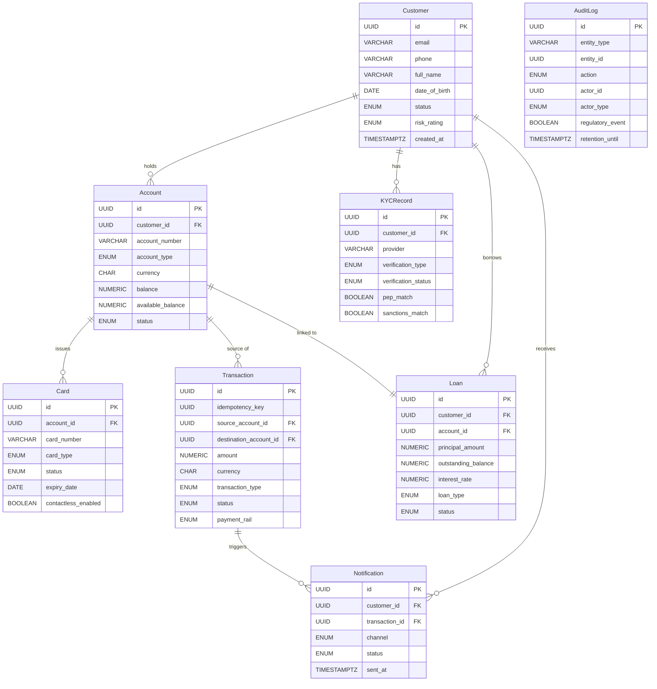

| Field | Value |
| --- | --- |
| Document ID | DBP-AN-031 |
| Version | 1.0 |
| Status | Approved |
| Owner | Platform Engineering — Data Architecture |
| Last Updated | 2025-01-15 |
| Classification | Internal — Restricted |

# Data Dictionary — Digital Banking Platform

This document is the authoritative canonical reference for all persistent data entities within the Digital Banking Platform (DBP), and supersedes any prior entity definitions published in service-level READMEs or design spikes. It governs field naming conventions, prescribed data types, constraint specifications, and master classification labels for every column in the platform's relational schema. PII classification follows the UK ICO framework and EU GDPR Article 4 definitions; any field marked as a Direct Identifier or Sensitive Identifier must be handled in accordance with the Data Protection Policy (DBP-POL-007). PCI scope is determined by PCI DSS v4.0 and applies to any field that stores, processes, or transmits cardholder data; fields marked Yes in the PCI Scope column fall within the Cardholder Data Environment (CDE) and are subject to quarterly access reviews and annual penetration testing. Teams introducing new entities or fields must submit a schema change request to the Data Architecture team for classification review before promoting the migration to production.

---

## Naming Conventions

All entity and field names in the DBP schema adhere to the following conventions to ensure consistency across microservices, event streams, and API contracts. Deviations require a written waiver from the Data Architecture team and must be recorded in the relevant service's design document.

| Convention | Rule | Example |
| --- | --- | --- |
| Entity names | PascalCase, singular noun | `Customer`, `AuditLog` |
| Field names | snake_case, all lowercase | `created_at`, `account_number` |
| Primary keys | Always named `id`, type UUID v4 | `id UUID PRIMARY KEY` |
| Foreign keys | `<referenced_entity>_id` | `customer_id`, `account_id` |
| Timestamp fields | Suffix `_at`, type TIMESTAMPTZ | `created_at`, `verified_at` |
| Date-only fields | Suffix `_date` or semantic noun, type DATE | `date_of_birth`, `expiry_date` |
| Boolean flags | Descriptive adjective or past-participle | `contactless_enabled`, `pep_match` |
| ENUM values | All lowercase with underscores | `'pending_kyc'`, `'faster_payments'` |
| Encrypted fields | Annotated `ENCRYPTED` in constraints column | `tax_id`, `document_number` |
| Monetary amounts | NUMERIC(19,4) without exception | `balance`, `amount`, `monthly_payment` |

---

## Classification Legend

Fields carry one of the following PII classification labels and a binary PCI Scope indicator derived from PCI DSS v4.0 Requirement 3. The classification assigned to a field determines the access control tier, logging obligations, and export restrictions that apply at the application layer.

| Classification Label | Definition | Handling Requirement |
| --- | --- | --- |
| None | Field contains no personally identifiable information | Standard role-based access controls apply |
| PII — Direct Identifier | Directly identifies a natural person (name, email, phone, DOB) | Access logging mandatory; encrypted in transit via TLS 1.3 |
| PII — Quasi-Identifier | Does not alone identify a person but may do so in combination | Aggregate-only access in analytics; no raw bulk export permitted |
| PII — Sensitive | Special category data: nationality, tax ID, government document numbers | Role-gated access; encrypted at rest; DPA review required for new processing |
| PII — Financial | Financial account numbers, credit bureau scores, loan balances | Restricted to Finance and Compliance roles; not included in analytics exports |
| PCI — Sensitive | Cardholder data: PAN token, CVV hash, card expiry date | Full CDE controls; HSM encryption; quarterly access review |
| PII (may contain) | Free-text or JSONB field that may incidentally contain personal data | Redact before export; log all access; DPO review for new query patterns |

---

## Core Entities

The following subsections define every persistent entity in the Digital Banking Platform schema. Each table lists the canonical field name, data type, constraint set, human-readable description, PII classification, and PCI scope. Field ordering within each table reflects the recommended column order in CREATE TABLE DDL statements.

### Customer

The `Customer` entity represents a verified natural person or legal entity that has initiated or completed an onboarding journey with the platform, and serves as the root identity record from which all accounts, loans, KYC checks, and notifications are anchored. The lifecycle of a Customer record is governed by the `status` field, and transitions are strictly enforced by the CustomerService state machine to prevent data integrity violations downstream. Fields designated PII — Direct Identifier or PII — Sensitive must never appear in application logs, query traces, or error messages; structured logging must use the `id` (UUID) as the sole customer reference.

| Field | Data Type | Constraints | Description | PII Classification | PCI Scope |
| --- | --- | --- | --- | --- | --- |
| id | UUID | PRIMARY KEY, NOT NULL | Surrogate identifier for the customer record | None | No |
| email | VARCHAR(255) | UNIQUE, NOT NULL | Primary contact email address; used for login and notifications | PII — Direct Identifier | No |
| phone | VARCHAR(20) | NOT NULL | Mobile phone number in E.164 format | PII — Direct Identifier | No |
| full_name | VARCHAR(200) | NOT NULL | Customer's full legal name as per identity document | PII — Direct Identifier | No |
| date_of_birth | DATE | NOT NULL | Customer's date of birth; used for age eligibility and KYC | PII — Direct Identifier | No |
| nationality | CHAR(3) | NOT NULL, ISO 3166-1 alpha-3 | Country of citizenship | PII — Sensitive | No |
| tax_id | VARCHAR(50) | ENCRYPTED, NULLABLE | National tax identification number (SSN, NI, or equivalent) | PII — Sensitive / Financial | No |
| status | ENUM | NOT NULL, DEFAULT 'pending_kyc' | Account lifecycle status: pending_kyc / active / suspended / closed | None | No |
| risk_rating | ENUM | NOT NULL, DEFAULT 'low' | AML/compliance risk rating: low / medium / high / pep | None | No |
| created_at | TIMESTAMPTZ | NOT NULL, DEFAULT now() | Timestamp when the customer record was first created | None | No |
| updated_at | TIMESTAMPTZ | NOT NULL | Timestamp of the most recent update to this record | None | No |
| gdpr_consent_at | TIMESTAMPTZ | NULLABLE | Timestamp when the customer provided GDPR data processing consent | None | No |

### Account

The `Account` entity models a financial account product held by a Customer, including current (checking), savings, and loan accounts, and maintains the authoritative ledger balance and available balance used for real-time transaction authorisation decisions. Multiple accounts may be linked to a single Customer, enabling multi-currency and multi-product portfolios under one identity. Each account is associated with at most one Loan disbursement record; the `account_type` ENUM value of `loan` indicates an account that was opened solely to service a loan product.

| Field | Data Type | Constraints | Description | PII Classification | PCI Scope |
| --- | --- | --- | --- | --- | --- |
| id | UUID | PRIMARY KEY, NOT NULL | Surrogate identifier for the account | None | No |
| customer_id | UUID | FOREIGN KEY → Customer.id, NOT NULL | Owning customer of this account | None | No |
| account_number | VARCHAR(34) | UNIQUE, NOT NULL, IBAN format | IBAN-compliant account identifier | PII — Financial | No |
| account_type | ENUM | NOT NULL | Product type: checking / savings / loan | None | No |
| currency | CHAR(3) | NOT NULL, ISO 4217 | Three-letter currency code | None | No |
| balance | NUMERIC(19,4) | NOT NULL, DEFAULT 0 | Ledger balance inclusive of pending transactions | None | No |
| available_balance | NUMERIC(19,4) | NOT NULL | Balance available for new transactions after holds | None | No |
| status | ENUM | NOT NULL, DEFAULT 'pending_kyc' | Lifecycle state: pending_kyc / active / frozen / dormant / closed | None | No |
| daily_transfer_limit | NUMERIC(19,4) | NOT NULL, DEFAULT 10000.00 | Maximum outgoing transfer amount per calendar day (UTC) | None | No |
| opened_at | TIMESTAMPTZ | NOT NULL, DEFAULT now() | Timestamp when the account was activated | None | No |
| last_activity_at | TIMESTAMPTZ | NULLABLE | Timestamp of the most recent customer-initiated transaction | None | No |
| dormancy_notified_at | TIMESTAMPTZ | NULLABLE | Timestamp of dormancy notification sent to customer | None | No |

### Card

The `Card` entity represents a physical or virtual payment card issued against an Account, operating on a major card network such as Visa or Mastercard. Raw PANs are never persisted; the `card_number` field stores only a network token returned by the token vault after PAN submission at issuance time. All fields marked PCI — Sensitive are subject to full Cardholder Data Environment controls, including HSM-backed encryption, quarterly access reviews, and annual penetration testing as mandated by PCI DSS v4.0 Requirement 3.

| Field | Data Type | Constraints | Description | PII Classification | PCI Scope |
| --- | --- | --- | --- | --- | --- |
| id | UUID | PRIMARY KEY, NOT NULL | Surrogate identifier for the card record | None | No |
| account_id | UUID | FOREIGN KEY → Account.id, NOT NULL | Account this card is linked to | None | No |
| card_number | VARCHAR(19) | NOT NULL, tokenized PAN | Network token replacing the raw PAN; never stores real PAN | PCI — Sensitive | Yes |
| card_type | ENUM | NOT NULL | Product type: debit / credit / virtual | None | No |
| status | ENUM | NOT NULL | Lifecycle state: requested / issued / active / blocked / expired / cancelled | None | No |
| expiry_date | DATE | NOT NULL | Card expiry date (last day of stated month) | PCI — Sensitive | Yes |
| cvv_hash | VARCHAR(64) | NOT NULL, SHA-256 + pepper | Salted hash of the CVV2/CVC2 value; raw CVV is never stored | PCI — Sensitive | Yes |
| daily_spend_limit | NUMERIC(19,4) | NOT NULL, DEFAULT 2500.00 | Maximum spend per calendar day across all merchants | None | No |
| atm_withdrawal_limit | NUMERIC(19,4) | NOT NULL, DEFAULT 500.00 | Maximum ATM cash withdrawal per calendar day | None | No |
| contactless_enabled | BOOLEAN | NOT NULL, DEFAULT true | Whether contactless (NFC) payments are permitted | None | No |
| three_ds_enrolled | BOOLEAN | NOT NULL, DEFAULT false | Whether the card is enrolled in 3D Secure authentication | None | No |
| issued_at | TIMESTAMPTZ | NOT NULL | Timestamp when the physical or virtual card was issued | None | No |

### Transaction

The `Transaction` entity is the immutable ledger record of every financial movement within the platform, including peer-to-peer transfers, card payments, direct debits, ATM withdrawals, and platform-assessed fees. Each transaction carries an `idempotency_key` to guarantee exactly-once semantics across client retries and network partitions, and any duplicate submission with the same key returns the original transaction record without re-processing. The `fraud_score` and `aml_screening_result` fields are populated asynchronously by the Risk Engine and AML Screening Service respectively; both fields may be null until those services have completed their evaluation and posted back via internal event.

| Field | Data Type | Constraints | Description | PII Classification | PCI Scope |
| --- | --- | --- | --- | --- | --- |
| id | UUID | PRIMARY KEY, NOT NULL | Surrogate identifier for the transaction | None | No |
| idempotency_key | UUID | UNIQUE, NOT NULL | Client-supplied key for exactly-once delivery guarantees | None | No |
| source_account_id | UUID | FOREIGN KEY → Account.id, NULLABLE | Debit account; null for external inbound credit | None | No |
| destination_account_id | UUID | FOREIGN KEY → Account.id, NULLABLE | Credit account; null for external outbound debit | None | No |
| amount | NUMERIC(19,4) | NOT NULL, CHECK > 0 | Transaction amount in the transaction currency | None | No |
| currency | CHAR(3) | NOT NULL, ISO 4217 | Currency of this transaction | None | No |
| fx_rate | NUMERIC(10,6) | NULLABLE | Exchange rate applied if a currency conversion occurred | None | No |
| transaction_type | ENUM | NOT NULL | Type: transfer / card_payment / direct_debit / atm_withdrawal / fee | None | No |
| status | ENUM | NOT NULL | State: initiated / processing / completed / failed / reversed | None | No |
| reference | VARCHAR(35) | NOT NULL | Payment reference passed to the receiving institution | None | No |
| payment_rail | ENUM | NOT NULL | Settlement network: faster_payments / ach / swift / sepa | None | No |
| initiated_at | TIMESTAMPTZ | NOT NULL, DEFAULT now() | Timestamp when the transaction was submitted | None | No |
| completed_at | TIMESTAMPTZ | NULLABLE | Timestamp when final settlement was confirmed | None | No |
| fraud_score | NUMERIC(5,4) | NULLABLE, CHECK 0–1 | ML model fraud probability score (0.0 = clean, 1.0 = fraud) | None | No |
| aml_screening_result | ENUM | NULLABLE | AML outcome: clear / review / blocked | None | No |

### Loan

The `Loan` entity captures the full lifecycle of a credit product originated by the platform, from initial application through active repayment to settlement or default, and stores both the original principal and the current outstanding balance to support real-time repayment scheduling and arrears management. The `credit_bureau_score` is captured at origination only and is not updated after disbursement; any re-scoring triggered by account review must be associated with a new KYC-linked credit assessment record rather than modifying this field. Monthly payment amounts in `monthly_payment` are calculated at origination using the agreed amortisation schedule and must not be updated without a formal loan modification event recorded in the AuditLog.

| Field | Data Type | Constraints | Description | PII Classification | PCI Scope |
| --- | --- | --- | --- | --- | --- |
| id | UUID | PRIMARY KEY, NOT NULL | Surrogate identifier for the loan record | None | No |
| customer_id | UUID | FOREIGN KEY → Customer.id, NOT NULL | Customer who holds this loan | None | No |
| account_id | UUID | FOREIGN KEY → Account.id, NOT NULL | Linked disbursement and repayment account | None | No |
| principal_amount | NUMERIC(19,4) | NOT NULL, CHECK > 0 | Original loan principal at origination | None | No |
| outstanding_balance | NUMERIC(19,4) | NOT NULL | Current unpaid principal balance | None | No |
| interest_rate | NUMERIC(8,6) | NOT NULL, CHECK 0–1 | Annual nominal interest rate as a decimal (e.g., 0.0599 = 5.99%) | None | No |
| term_months | INTEGER | NOT NULL, CHECK > 0 | Agreed loan term in calendar months | None | No |
| loan_type | ENUM | NOT NULL | Product: personal / mortgage / auto / overdraft | None | No |
| status | ENUM | NOT NULL | State: applied / approved / active / defaulted / settled / cancelled | None | No |
| monthly_payment | NUMERIC(19,4) | NOT NULL | Calculated monthly instalment amount | None | No |
| next_payment_due | DATE | NULLABLE | Date on which the next scheduled repayment falls due | None | No |
| credit_bureau_score | INTEGER | NULLABLE, CHECK 0–999 | Credit bureau score at origination (Experian/Equifax/TransUnion) | PII — Financial | No |
| origination_date | DATE | NOT NULL | Date the loan was formally approved and funds disbursed | None | No |

### KYCRecord

The `KYCRecord` entity stores the outcome of every identity verification check performed against a Customer by an authorised KYC provider, including document verification, biometric liveness checks, and sanctions and PEP screening results. A Customer may accumulate multiple KYC records over their lifetime, reflecting periodic re-verification requirements or step-up checks triggered by elevated risk activity or product tier changes. The `document_number` field is encrypted at rest using AES-256-GCM and may only be accessed by authorised compliance personnel via the Compliance Portal; it must never be included in API responses or application logs.

| Field | Data Type | Constraints | Description | PII Classification | PCI Scope |
| --- | --- | --- | --- | --- | --- |
| id | UUID | PRIMARY KEY, NOT NULL | Surrogate identifier for the KYC verification record | None | No |
| customer_id | UUID | FOREIGN KEY → Customer.id, NOT NULL | Customer this KYC record belongs to | None | No |
| provider | VARCHAR(100) | NOT NULL | Name of the KYC provider (e.g., Onfido, Jumio, LexisNexis) | None | No |
| verification_type | ENUM | NOT NULL | Depth of check: standard / enhanced / simplified | None | No |
| document_type | ENUM | NOT NULL | Document presented: passport / national_id / drivers_license | None | No |
| document_number | VARCHAR(50) | ENCRYPTED, NOT NULL | Document identifier number (passport no., licence no., etc.) | PII — Sensitive | No |
| verification_status | ENUM | NOT NULL | Outcome: pending / passed / failed / manual_review | None | No |
| risk_level | ENUM | NOT NULL | Risk classification: low / medium / high / pep / sanctions | None | No |
| pep_match | BOOLEAN | NOT NULL, DEFAULT false | Whether a Politically Exposed Person match was found | None | No |
| sanctions_match | BOOLEAN | NOT NULL, DEFAULT false | Whether a sanctions list match was found | None | No |
| verified_at | TIMESTAMPTZ | NULLABLE | Timestamp when the provider returned a passed verdict | None | No |
| expires_at | TIMESTAMPTZ | NULLABLE | Expiry of the KYC check (enhanced KYC expires after 3 years) | None | No |
| provider_reference | VARCHAR(100) | NOT NULL | Provider's own reference ID for this check | None | No |

### AuditLog

The `AuditLog` entity provides a tamper-evident, append-only record of every state-changing operation and sensitive read performed across all platform entities, supporting regulatory reporting, forensic investigation, and GDPR data subject access requests. It preserves before-and-after JSON snapshots of mutated records in the `before_state` and `after_state` JSONB columns; because these snapshots may incidentally contain PII, they must be redacted before inclusion in any export, analytics pipeline, or support ticket. No row in this table may be modified or deleted once written; the LifecycleService enforces retention by archiving aged records to immutable cold object storage rather than issuing DELETE statements.

| Field | Data Type | Constraints | Description | PII Classification | PCI Scope |
| --- | --- | --- | --- | --- | --- |
| id | UUID | PRIMARY KEY, NOT NULL | Surrogate identifier for the audit log entry | None | No |
| entity_type | VARCHAR(50) | NOT NULL | Class of entity affected (e.g., 'Customer', 'Transaction') | None | No |
| entity_id | UUID | NOT NULL | Primary key of the entity that was acted upon | None | No |
| action | ENUM | NOT NULL | Operation type: CREATE / READ / UPDATE / DELETE / TRANSFER / LOGIN / LOGOUT | None | No |
| actor_id | UUID | NOT NULL | Identifier of the actor who performed the action | None | No |
| actor_type | ENUM | NOT NULL | Actor class: customer / staff / system / api_client | None | No |
| ip_address | INET | NULLABLE | IP address from which the action was initiated | PII — Quasi-Identifier | No |
| user_agent | TEXT | NULLABLE | HTTP User-Agent header string of the requesting client | PII — Quasi-Identifier | No |
| before_state | JSONB | NULLABLE | JSON snapshot of the entity state before the action | PII (may contain) | Varies |
| after_state | JSONB | NULLABLE | JSON snapshot of the entity state after the action | PII (may contain) | Varies |
| reason | TEXT | NULLABLE | Human-readable justification for the action (required for overrides) | None | No |
| regulatory_event | BOOLEAN | NOT NULL, DEFAULT false | Flags events requiring regulatory reporting or extended retention | None | No |
| created_at | TIMESTAMPTZ | NOT NULL, DEFAULT now() | Timestamp when this audit record was created | None | No |
| retention_until | TIMESTAMPTZ | NOT NULL | Calculated date after which this record may be purged | None | No |

### Notification

The `Notification` entity records every outbound communication dispatched to a Customer via any supported delivery channel, including push notifications, SMS, email, and in-app messages. Message content is never stored in plaintext; only a `content_hash` (SHA-256 of the rendered body) is persisted to enable delivery audit without retaining potentially sensitive message text that could contain account balances or transaction details. Delivery receipts and failure reasons are written back asynchronously by channel provider webhook handlers and may arrive minutes after the initial `sent_at` timestamp.

| Field | Data Type | Constraints | Description | PII Classification | PCI Scope |
| --- | --- | --- | --- | --- | --- |
| id | UUID | PRIMARY KEY, NOT NULL | Surrogate identifier for the notification record | None | No |
| customer_id | UUID | FOREIGN KEY → Customer.id, NOT NULL | Recipient customer | None | No |
| transaction_id | UUID | FOREIGN KEY → Transaction.id, NULLABLE | Related transaction, if applicable | None | No |
| channel | ENUM | NOT NULL | Delivery channel: push / sms / email / in_app | None | No |
| template_id | VARCHAR(50) | NOT NULL | Identifier of the message template used | None | No |
| status | ENUM | NOT NULL | State: queued / sent / delivered / failed / opted_out | None | No |
| content_hash | VARCHAR(64) | NOT NULL | SHA-256 hash of the rendered message content for audit | None | No |
| sent_at | TIMESTAMPTZ | NULLABLE | Timestamp when the message was dispatched to the channel provider | None | No |
| delivered_at | TIMESTAMPTZ | NULLABLE | Timestamp of confirmed delivery receipt from the channel provider | None | No |
| failure_reason | TEXT | NULLABLE | Error message from the channel provider if delivery failed | None | No |
| retry_count | INTEGER | NOT NULL, DEFAULT 0, CHECK >= 0 | Number of delivery attempts made | None | No |

---

## Canonical Relationship Diagram

The diagram below illustrates the cardinality and directionality of all associations between the eight core entities in the Digital Banking Platform, using Crow's Foot notation. The `Customer` record is the root aggregate from which all other entities are reachable within at most two hops, reflecting the customer-centric ownership model of the platform. This diagram must be regenerated and reviewed by the Data Architecture team whenever a new entity or foreign key constraint is introduced via a schema migration.

---

## Data Quality Controls

Data quality rules are enforced at three layers — the database constraint layer, the application service layer, and the asynchronous validation layer — to ensure platform data remains consistent, accurate, and compliant at all times. Violations at the Critical severity level result in an immediate request rejection and a corresponding AuditLog entry; High severity violations additionally trigger a PagerDuty alert to the on-call Data Reliability Engineer. The rules below represent the minimum automated control set; additional rules may be defined at the service level and are documented in each service's OpenAPI specification under the `x-data-quality` extension.

| Rule ID | Entity | Field(s) | Rule Type | Rule Definition | Severity | Remediation |
| --- | --- | --- | --- | --- | --- | --- |
| DQ-001 | Customer | email | Format Validation | Must match RFC 5322 email regex; checked on INSERT and UPDATE | Critical | Reject write, return HTTP 422 |
| DQ-002 | Customer | status | State Machine | Transitions: pending_kyc→active, active→suspended, active→closed, suspended→active, suspended→closed only | Critical | Reject invalid transition, raise alert |
| DQ-003 | Account | balance | Range Check | balance >= 0.0000 for non-overdraft account types | Critical | Block transaction causing negative balance |
| DQ-004 | Account | available_balance | Cross-Field Check | available_balance <= balance at all times | Critical | Recalculate available_balance; alert if inconsistency detected |
| DQ-005 | Account | daily_transfer_limit | Range Check | 0 < daily_transfer_limit <= 100000.00 | High | Reject update; log to AuditLog |
| DQ-006 | Card | expiry_date | Temporal Check | expiry_date > issued_at and expiry_date <= issued_at + INTERVAL '5 years' | High | Reject card issuance request |
| DQ-007 | Card | card_number | PCI Compliance | card_number must be a valid network token (not raw PAN); validated against token vault | Critical | Reject; alert security team |
| DQ-008 | Transaction | amount | Range Check | amount > 0.0000 and amount <= 1000000.00 | Critical | Reject transaction |
| DQ-009 | Transaction | idempotency_key | Uniqueness | idempotency_key must be globally unique across all transaction records | Critical | Return existing transaction record; do not double-post |
| DQ-010 | Transaction | fx_rate | Conditional | fx_rate must be NOT NULL when source and destination currencies differ | High | Reject transaction; prompt for FX rate |
| DQ-011 | KYCRecord | expires_at | Temporal Check | expires_at > verified_at; enhanced KYC must expire within 3 years | High | Flag for KYC renewal workflow |
| DQ-012 | Customer | tax_id | Encryption Check | tax_id column must be encrypted at rest using AES-256-GCM; plaintext must never appear in query logs | Critical | Audit failure; alert data security team |
| DQ-013 | Account | last_activity_at | Dormancy Calculation | If last_activity_at < now() - INTERVAL '12 months' AND status = 'active', transition to 'dormant' | Medium | Automated status update via AccountService batch job |
| DQ-014 | Loan | outstanding_balance | Range Check | outstanding_balance >= 0 and outstanding_balance <= principal_amount | Critical | Block repayment causing negative balance; alert |
| DQ-015 | AuditLog | retention_until | Retention Policy | retention_until must be >= created_at + INTERVAL '7 years' for regulatory_event=true records | High | Reject deletion request; notify compliance team |

### Encryption Standards

All fields classified as PII — Sensitive or PCI — Sensitive are encrypted at rest using AES-256-GCM, providing both ciphertext confidentiality and integrity assurance through the authenticated encryption tag. Encryption is implemented via envelope encryption: each tenant is assigned a Data Encryption Key (DEK) managed by the platform's KMS integration (AWS KMS backed by an HSM), and the DEK is itself wrapped by a Key Encryption Key (KEK) stored exclusively within the KMS; the KEK is rotated on an annual schedule with a 90-day dual-key transition window to allow decryption of records encrypted under the outgoing key while the rotation completes. The `card_number` field stores exclusively a network token issued by Visa Token Service or Mastercard MDES following PAN submission at card issuance; the raw PAN traverses the card issuance API in memory only, is forwarded directly to the token vault over mTLS, and is never written to any DBP datastore, query log, or event stream. The `cvv_hash` field stores only a salted SHA-256 digest of the card verification value, combined with a secret pepper stored in the platform secrets manager and rotated annually; this operation is intentionally irreversible and the hash may not be used to recover the original CVV under any circumstance. Any new schema field that may hold cardholder or sensitive personal data must be reviewed by both the Data Architecture team and the Security team prior to inclusion in a production migration.

### Data Retention Policy

Each entity is subject to the retention period determined by the most restrictive applicable regulatory obligation; records must not be deleted before the end of their retention window regardless of customer deletion requests, which are satisfied by pseudonymisation within the live dataset during the retention window and followed by hard deletion only after the window expires.

| Entity | Regulatory Basis | Retention Period | Deletion Method |
| --- | --- | --- | --- |
| Customer | GDPR Art. 17, FCA SYSC 9 | 7 years after account closure | Pseudonymisation then hard delete after retention window |
| Account | FCA COBS 9A, MLR 2017 | 7 years after account closure | Logical delete with audit trail preserved |
| Transaction | PSD2 Art. 95, MLR 2017 | 7 years from transaction date | Logical delete; summaries retained for regulatory reporting |
| Card | PCI DSS Requirement 9.4 | 1 year after expiry or cancellation | Hard delete; tokenization vault purged |
| Loan | FCA MCOB, CCA 1974 | 6 years after final repayment | Logical delete with audit trail |
| KYCRecord | MLR 2017 Reg. 40 | 5 years after end of customer relationship | Hard delete; encrypted archives purged |
| AuditLog | FCA SYSC 9, MLR 2017 | 7 years (10 years for regulatory_event=true) | Immutable; no deletion; archive to cold storage after 3 years |
| Notification | Internal policy | 2 years from sent_at | Hard delete |

---

## Glossary

| Term | Definition |
| --- | --- |
| AML | Anti-Money Laundering; the set of laws, regulations, and procedures designed to prevent criminals from disguising illegally obtained funds as legitimate income. |
| CDE | Cardholder Data Environment; the people, processes, and technology that store, process, or transmit cardholder data or sensitive authentication data as defined by PCI DSS. |
| CVV / CVC2 | Card Verification Value / Card Validation Code 2; the 3- or 4-digit security code on a payment card used to verify card-not-present transactions. |
| DEK | Data Encryption Key; a symmetric key used to encrypt data at rest, itself encrypted (wrapped) by a Key Encryption Key stored in a KMS. |
| GDPR | General Data Protection Regulation (EU) 2016/679; the primary EU framework governing the processing of personal data of individuals within the European Economic Area. |
| HSM | Hardware Security Module; a dedicated physical device that safeguards and manages cryptographic keys and performs cryptographic operations in a tamper-resistant environment. |
| IBAN | International Bank Account Number; an internationally agreed standard for identifying bank accounts across national borders, defined in ISO 13616. |
| idempotency_key | A client-supplied unique identifier that allows a server to safely process retry attempts without duplicating the effect of an operation. |
| KMS | Key Management Service; a managed cloud service providing centralised creation, storage, rotation, and audit of cryptographic keys. |
| KYC | Know Your Customer; the regulatory process of verifying the identity of clients to prevent fraud, money laundering, and terrorist financing. |
| MLR 2017 | Money Laundering Regulations 2017 (UK); the primary UK AML legislation transposing the Fourth EU Anti-Money Laundering Directive into domestic law. |
| PAN | Primary Account Number; the 14–19 digit number embossed or printed on a payment card that uniquely identifies the card issuer and the cardholder account. |
| PCI DSS | Payment Card Industry Data Security Standard; the security standard mandated by the major card networks to protect cardholder data during and after financial transactions. |
| PEP | Politically Exposed Person; an individual who is or has been entrusted with a prominent public function, subject to enhanced due diligence under AML regulations. |
| PSD2 | Payment Services Directive 2 (EU) 2015/2366; the EU directive governing payment services and mandating Strong Customer Authentication for electronic payments. |
| SEPA | Single Euro Payments Area; the European payment infrastructure enabling euro-denominated credit transfers and direct debits under harmonised rules and timelines. |

---

## Change History

| Version | Date | Author | Change Summary |
| --- | --- | --- | --- |
| 1.0 | 2025-01-15 | Platform Engineering — Data Architecture | Initial approved version covering all eight core entities, data quality controls, encryption standards, retention policy, and glossary. |
