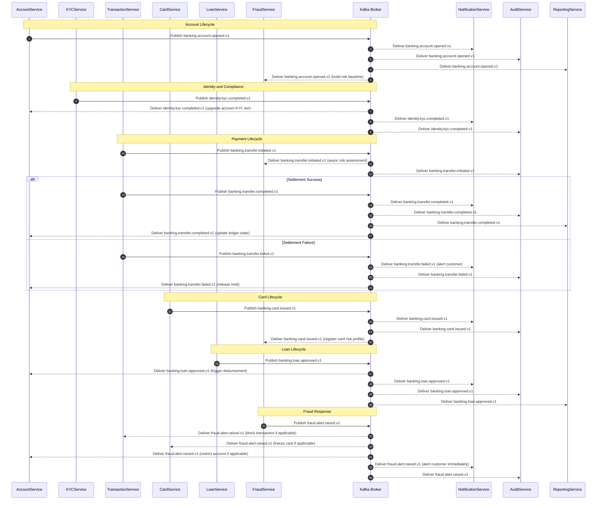

# Event Catalog — Digital Banking Platform

This catalog is the authoritative reference for all domain events published and consumed within
the Digital Banking Platform. Services must adhere to the contracts specified herein for event
publishing, schema evolution, and consumption guarantees. Any deviation requires an Architecture
Review Board approval before deployment.

---

## Contract Conventions

### CloudEvents Envelope Format

All platform events conform to the [CloudEvents 1.0 specification](https://cloudevents.io/).
Every event envelope must include the following attributes.

| Attribute       | Type        | Mandatory | Description                                         | Example                                      |
|-----------------|-------------|-----------|-----------------------------------------------------|----------------------------------------------|
| specversion     | String      | Yes       | CloudEvents specification version                   | `1.0`                                        |
| id              | UUID        | Yes       | Globally unique event identifier (UUID v4)          | `550e8400-e29b-41d4-a716-446655440000`       |
| source          | URI         | Yes       | Publishing service URI                              | `//banking.platform/services/accounts`       |
| type            | String      | Yes       | Event type following the naming convention          | `banking.account.opened.v1`                  |
| subject         | String      | Yes       | Identifier of the entity the event concerns         | `account/ACC-00123456`                       |
| time            | RFC3339     | Yes       | UTC timestamp of event occurrence                   | `2025-01-15T10:30:00.000Z`                   |
| datacontenttype | String      | Yes       | Media type of the data attribute                    | `application/json`                           |
| data            | Object      | Yes       | Domain-specific event payload                       | See per-event schema below                   |
| correlationid   | UUID        | No        | Distributed trace correlation identifier            | `7f3e4a22-1b2c-4d5e-8f9a-0b1c2d3e4f5a`      |
| causationid     | UUID        | No        | Identifier of the causing command or event          | `9b1c2d33-...`                               |
| partitionkey    | String      | No        | Kafka partition routing key                         | `ACC-00123456`                               |
| schemaurl       | URI         | No        | Confluent Schema Registry subject URL               | `https://schema-registry.banking.internal/...` |

### Naming Convention

Event type names use the dot-separated pattern `{domain}.{entity}.{verb}.{version}`:

| Segment | Description                          | Allowed Values                                                             | Notes                      |
|---------|--------------------------------------|----------------------------------------------------------------------------|----------------------------|
| domain  | Business domain                      | `banking`, `identity`, `fraud`, `notification`                             | Lowercase, single word     |
| entity  | Aggregate root name                  | `account`, `transfer`, `card`, `loan`, `kyc`, `fraudAlert`                 | camelCase                  |
| verb    | Past-tense action verb               | `opened`, `closed`, `completed`, `initiated`, `approved`, `raised`, `issued`, `failed` | Past-tense only  |
| version | Schema major version                 | `v1`, `v2`, `v3`                                                           | Monotonically increasing   |

Example: `banking.transfer.initiated.v1`

### Schema Registry Policy

All event payloads are serialised using Apache Avro and registered in Confluent Schema Registry.

| Policy                  | Configuration                                          | Rationale                                                          |
|-------------------------|--------------------------------------------------------|--------------------------------------------------------------------|
| Compatibility Mode      | `BACKWARD`                                             | Consumers on the previous schema version can deserialise new messages |
| Subject Naming Strategy | `TopicNameStrategy` (`{topic}-value`)                  | Standard Confluent strategy enabling per-topic schema validation   |
| Schema Approval         | PR review (two engineers) + schema-lint CI check       | Prevents breaking changes from reaching production                 |
| Registry Endpoint       | `https://schema-registry.banking.internal:8081`        | VPC-internal; not publicly accessible                              |
| Schema ID Caching       | 300 s TTL in producer/consumer clients                 | Reduces registry round-trips in high-throughput paths              |
| Null Safety             | Optional fields must declare `"null"` as a union type  | Ensures forward-compatible null handling across all consumers      |

### Versioning Strategy

| Scenario                            | Required Action                                          | Dual-Publish Period | Breaking Change |
|-------------------------------------|----------------------------------------------------------|---------------------|-----------------|
| Add optional field with default     | New minor schema version; same event type                | Not required        | No              |
| Add required field with a default   | New minor schema version; same event type                | Not required        | No              |
| Remove field                        | New event version (e.g., `v2`); deprecate old version    | 90 days             | Yes             |
| Change field data type              | New event version; migration runbook required            | 90 days             | Yes             |
| Rename field                        | New event version; alias mapping in consumers            | 90 days             | Yes             |
| Restructure nested object           | New event version; data migration plan required          | 90 days             | Yes             |
| Deprecate event entirely            | Deprecation notice in catalog; sunset timeline issued    | 180 days            | Informational   |

---

## Domain Events

### banking.account.opened.v1

Fired immediately after a new account has been successfully persisted and its initial KYC tier
assigned. Signals that the account is ready to receive funds and initiate transactions.

| Attribute       | Value                                                                  |
|-----------------|------------------------------------------------------------------------|
| Event Name      | `banking.account.opened.v1`                                            |
| Kafka Topic     | `banking.accounts.events`                                              |
| Partition Key   | `accountId`                                                            |
| Publisher       | AccountService                                                         |
| Consumers       | NotificationService, AuditService, ReportingService, FraudService      |
| Retention       | 7 days hot → 365 days cold (S3 Glacier archival)                       |
| Schema Version  | `1.2.0`                                                                |
| Idempotency Key | `accountId`                                                            |

**Payload Schema:**

| Field       | Avro Type                                        | Required | Description                                      |
|-------------|--------------------------------------------------|----------|--------------------------------------------------|
| accountId   | string (UUID)                                    | Yes      | Globally unique account identifier               |
| customerId  | string (UUID)                                    | Yes      | Owning customer identifier                       |
| accountType | enum {CURRENT, SAVINGS, FIXED_DEPOSIT}           | Yes      | Functional account classification                |
| currency    | string (ISO 4217)                                | Yes      | Account currency code (e.g., `USD`, `GBP`)       |
| kycTier     | int (1–3)                                        | Yes      | Customer KYC tier at time of account opening     |
| timestamp   | string (RFC3339)                                 | Yes      | UTC timestamp of account creation                |

---

### identity.kyc.completed.v1

Fired when a KYC verification cycle reaches a terminal state. Published after the external
provider webhook is received, the compliance risk score computed, and the KYC record updated.

| Attribute       | Value                                                                      |
|-----------------|----------------------------------------------------------------------------|
| Event Name      | `identity.kyc.completed.v1`                                                |
| Kafka Topic     | `identity.kyc.events`                                                      |
| Partition Key   | `customerId`                                                               |
| Publisher       | KYCService                                                                 |
| Consumers       | AccountService, NotificationService, AuditService, ComplianceService       |
| Retention       | 7 days hot → 7 years cold (regulatory requirement)                         |
| Schema Version  | `1.0.0`                                                                    |
| Idempotency Key | `kycRecordId`                                                              |

**Payload Schema:**

| Field       | Avro Type                                     | Required | Description                                       |
|-------------|-----------------------------------------------|----------|---------------------------------------------------|
| customerId  | string (UUID)                                 | Yes      | Customer undergoing verification                  |
| kycRecordId | string (UUID)                                 | Yes      | Unique KYC verification record identifier         |
| status      | enum {APPROVED, REJECTED, PENDING_REVIEW}     | Yes      | Terminal verification status                      |
| tier        | int (1–3)                                     | Yes      | Approved KYC tier granted to the customer         |
| verifiedBy  | string                                        | Yes      | Identity provider name (e.g., `Onfido`)           |
| timestamp   | string (RFC3339)                              | Yes      | UTC timestamp of verification completion          |

---

### banking.transfer.initiated.v1

Fired when a transfer request passes initial validation and enters the asynchronous processing
pipeline. Enables parallel fraud pre-screening while the transaction record is prepared.

| Attribute       | Value                                                                  |
|-----------------|------------------------------------------------------------------------|
| Event Name      | `banking.transfer.initiated.v1`                                        |
| Kafka Topic     | `banking.transfers.events`                                             |
| Partition Key   | `fromAccountId`                                                        |
| Publisher       | TransactionService                                                     |
| Consumers       | FraudService, AuditService, NotificationService                        |
| Retention       | 7 days hot → 365 days cold                                             |
| Schema Version  | `2.1.0`                                                                |
| Idempotency Key | `transactionId`                                                        |

**Payload Schema:**

| Field          | Avro Type                                        | Required | Description                               |
|----------------|--------------------------------------------------|----------|-------------------------------------------|
| transactionId  | string (UUID)                                    | Yes      | Globally unique transaction identifier    |
| fromAccountId  | string (UUID)                                    | Yes      | Debiting account identifier               |
| toAccountId    | string (UUID)                                    | Yes      | Crediting account identifier              |
| amount         | decimal (precision 18, scale 2)                  | Yes      | Transfer amount                           |
| currency       | string (ISO 4217)                                | Yes      | Transfer currency code                    |
| transferType   | enum {ACH, SWIFT, INTERNAL, REAL_TIME}           | Yes      | Settlement rail classification            |
| timestamp      | string (RFC3339)                                 | Yes      | UTC timestamp of transfer initiation      |

---

### banking.transfer.completed.v1

Fired when a transfer has successfully settled on the designated payment rail and the beneficiary
account has been credited. This is the terminal success event in the transfer lifecycle.

| Attribute       | Value                                                                              |
|-----------------|------------------------------------------------------------------------------------|
| Event Name      | `banking.transfer.completed.v1`                                                    |
| Kafka Topic     | `banking.transfers.events`                                                         |
| Partition Key   | `fromAccountId`                                                                    |
| Publisher       | TransactionService                                                                 |
| Consumers       | NotificationService, AuditService, ReportingService, AccountService                |
| Retention       | 7 days hot → 365 days cold                                                         |
| Schema Version  | `1.3.0`                                                                            |
| Idempotency Key | `transactionId`                                                                    |

**Payload Schema:**

| Field          | Avro Type                  | Required | Description                                                         |
|----------------|----------------------------|----------|---------------------------------------------------------------------|
| transactionId  | string (UUID)              | Yes      | Originating transaction identifier                                  |
| settledAt      | string (RFC3339)           | Yes      | UTC timestamp of settlement on the rail                             |
| reference      | string                     | Yes      | Internal ledger reference number                                    |
| railReference  | string (nullable)          | No       | External payment rail reference (ACH trace number, SWIFT UETR)      |
| timestamp      | string (RFC3339)           | Yes      | UTC timestamp of event publication                                  |

---

### banking.transfer.failed.v1

Fired when a transfer cannot be completed. Failure may originate at validation, fraud screening,
balance check, Core Banking posting, or payment rail submission. The `retryable` field signals
whether automatic retry is safe.

| Attribute       | Value                                                                                   |
|-----------------|-----------------------------------------------------------------------------------------|
| Event Name      | `banking.transfer.failed.v1`                                                            |
| Kafka Topic     | `banking.transfers.events`                                                              |
| Partition Key   | `fromAccountId`                                                                         |
| Publisher       | TransactionService                                                                      |
| Consumers       | NotificationService, AuditService, AccountService, FraudService                         |
| Retention       | 7 days hot → 365 days cold                                                              |
| Schema Version  | `1.1.0`                                                                                 |
| Idempotency Key | `transactionId`                                                                         |

**Payload Schema:**

| Field          | Avro Type         | Required | Description                                                                      |
|----------------|-------------------|----------|----------------------------------------------------------------------------------|
| transactionId  | string (UUID)     | Yes      | Originating transaction identifier                                               |
| failureCode    | string            | Yes      | Machine-readable failure code (`INSUFFICIENT_FUNDS`, `FRAUD_BLOCK`, `RAIL_REJECTED`) |
| failureReason  | string            | Yes      | Human-readable failure description for audit purposes                            |
| retryable      | boolean           | Yes      | Whether the operation is safe to retry automatically                             |
| timestamp      | string (RFC3339)  | Yes      | UTC timestamp of failure                                                         |

---

### banking.card.issued.v1

Fired when a payment card has been provisioned (physical embossing request submitted or virtual
card generated) and the card record has been activated in the Card bounded context.

| Attribute       | Value                                                          |
|-----------------|----------------------------------------------------------------|
| Event Name      | `banking.card.issued.v1`                                       |
| Kafka Topic     | `banking.cards.events`                                         |
| Partition Key   | `accountId`                                                    |
| Publisher       | CardService                                                    |
| Consumers       | NotificationService, AuditService, FraudService                |
| Retention       | 7 days hot → 365 days cold                                     |
| Schema Version  | `1.0.0`                                                        |
| Idempotency Key | `cardId`                                                       |

**Payload Schema:**

| Field       | Avro Type                                    | Required | Description                                   |
|-------------|----------------------------------------------|----------|-----------------------------------------------|
| cardId      | string (UUID)                                | Yes      | Globally unique card identifier               |
| accountId   | string (UUID)                                | Yes      | Linked account identifier                     |
| cardType    | enum {DEBIT, CREDIT, PREPAID, VIRTUAL}       | Yes      | Card product type                             |
| network     | enum {VISA, MASTERCARD}                      | Yes      | Payment network                               |
| maskedPan   | string                                       | Yes      | Masked PAN for display (`****-****-****-1234`) |
| timestamp   | string (RFC3339)                             | Yes      | UTC timestamp of card issuance                |

---

### banking.loan.approved.v1

Fired after a loan application has been evaluated, approved, and the customer has formally
accepted the offer. Triggers disbursement workflow in AccountService and repayment schedule
generation in LoanService.

| Attribute       | Value                                                                          |
|-----------------|--------------------------------------------------------------------------------|
| Event Name      | `banking.loan.approved.v1`                                                     |
| Kafka Topic     | `banking.loans.events`                                                         |
| Partition Key   | `customerId`                                                                   |
| Publisher       | LoanService                                                                    |
| Consumers       | AccountService, NotificationService, AuditService, ReportingService            |
| Retention       | 7 days hot → 7 years cold (regulatory requirement)                             |
| Schema Version  | `1.0.0`                                                                        |
| Idempotency Key | `loanId`                                                                       |

**Payload Schema:**

| Field         | Avro Type                       | Required | Description                                          |
|---------------|---------------------------------|----------|------------------------------------------------------|
| loanId        | string (UUID)                   | Yes      | Globally unique loan identifier                      |
| customerId    | string (UUID)                   | Yes      | Borrower customer identifier                         |
| principal     | decimal (precision 18, scale 2) | Yes      | Approved loan principal amount                       |
| interestRate  | decimal (precision 5, scale 4)  | Yes      | Annual interest rate as a decimal (e.g., `0.0599`)   |
| termMonths    | int                             | Yes      | Loan term in calendar months                         |
| timestamp     | string (RFC3339)                | Yes      | UTC timestamp of offer acceptance                    |

---

### fraud.alert.raised.v1

Fired when the FraudService ML model or rule engine detects suspicious activity and elevates the
risk level to an actionable alert. The `action` field specifies the automated response applied.

| Attribute       | Value                                                                                  |
|-----------------|----------------------------------------------------------------------------------------|
| Event Name      | `fraud.alert.raised.v1`                                                                |
| Kafka Topic     | `fraud.alerts.events`                                                                  |
| Partition Key   | `transactionId`                                                                        |
| Publisher       | FraudService                                                                           |
| Consumers       | TransactionService, CardService, AccountService, NotificationService, AuditService     |
| Retention       | 7 days hot → 7 years cold (regulatory requirement)                                     |
| Schema Version  | `1.2.0`                                                                                |
| Idempotency Key | `alertId`                                                                              |

**Payload Schema:**

| Field          | Avro Type                                                               | Required | Description                                         |
|----------------|-------------------------------------------------------------------------|----------|-----------------------------------------------------|
| alertId        | string (UUID)                                                           | Yes      | Globally unique fraud alert identifier              |
| transactionId  | string (UUID, nullable)                                                 | No       | Associated transaction (null for account-level alerts) |
| riskScore      | float (0.0–1.0)                                                         | Yes      | ML model risk probability score                     |
| alertType      | enum {VELOCITY, GEO_ANOMALY, DEVICE_RISK, PATTERN_MATCH, MANUAL_REVIEW}| Yes      | Classification of detected risk pattern             |
| action         | enum {BLOCK, REVIEW, CHALLENGE, ALLOW_WITH_LOG}                         | Yes      | Automated action applied by FraudService            |
| timestamp      | string (RFC3339)                                                        | Yes      | UTC timestamp of alert generation                   |

---

## Publish and Consumption Sequence

The sequence diagram below illustrates the end-to-end event flows across all eight domain events,
showing producers, the Kafka broker, and all consuming services for each event type.

---

## Operational SLOs

The following table specifies operational obligations for each domain event covering publish
latency, consumer processing SLA, retry behaviour, DLQ policy, and alerting thresholds.

| Event                            | Max Publish Latency | Consumer Processing SLA | Retry Policy                                              | DLQ Retention | Alert Threshold              |
|----------------------------------|---------------------|-------------------------|-----------------------------------------------------------|---------------|------------------------------|
| banking.account.opened.v1        | p99 ≤ 500 ms        | p99 ≤ 2 s               | 3 attempts, exponential back-off: 1 s / 2 s / 4 s        | 14 days       | Error rate > 5% over 5 min   |
| identity.kyc.completed.v1        | p99 ≤ 1 s           | p99 ≤ 5 s               | 5 attempts, exponential back-off: 2 s / 4 s / 8 s / 16 s / 32 s | 30 days | Error rate > 2% over 5 min   |
| banking.transfer.initiated.v1    | p99 ≤ 200 ms        | p99 ≤ 1 s               | 3 attempts, fixed interval: 500 ms                        | 7 days        | Error rate > 1% over 1 min   |
| banking.transfer.completed.v1    | p99 ≤ 500 ms        | p99 ≤ 3 s               | 5 attempts, exponential back-off: 1 s / 2 s / 4 s / 8 s / 16 s | 14 days | Error rate > 0.5% over 5 min |
| banking.transfer.failed.v1       | p99 ≤ 200 ms        | p99 ≤ 1 s               | 3 attempts, fixed interval: 500 ms                        | 14 days       | Error rate > 5% over 5 min   |
| banking.card.issued.v1           | p99 ≤ 500 ms        | p99 ≤ 2 s               | 3 attempts, exponential back-off: 1 s / 2 s / 4 s        | 14 days       | Error rate > 5% over 5 min   |
| banking.loan.approved.v1         | p99 ≤ 1 s           | p99 ≤ 5 s               | 5 attempts, exponential back-off: 2 s / 4 s / 8 s / 16 s / 32 s | 30 days | Error rate > 2% over 5 min   |
| fraud.alert.raised.v1            | p99 ≤ 100 ms        | p99 ≤ 500 ms            | 5 attempts, fixed interval: 200 ms                        | 30 days + PagerDuty | Error rate > 0.1% over 1 min |

### Dead-Letter Queue Conventions

DLQ topics follow the pattern `{original-topic}.dlq`. Messages forwarded to a DLQ are enriched
with the following Kafka headers before forwarding:

| Header Key                  | Description                                          |
|-----------------------------|------------------------------------------------------|
| `x-dlq-reason`              | Machine-readable failure reason code                 |
| `x-dlq-retry-count`         | Number of delivery attempts made before DLQ routing  |
| `x-dlq-original-timestamp`  | Original message publication timestamp               |
| `x-dlq-consumer-group`      | Consumer group that raised the processing failure    |

### Consumer Group Naming

Consumer groups follow the pattern `{service-name}.{topic-short-name}.cg` to ensure per-group
offset management and independent replay capability. Examples:
`notificationservice.transfers.cg`, `auditservice.accounts.cg`, `fraudservice.transfers.cg`.
