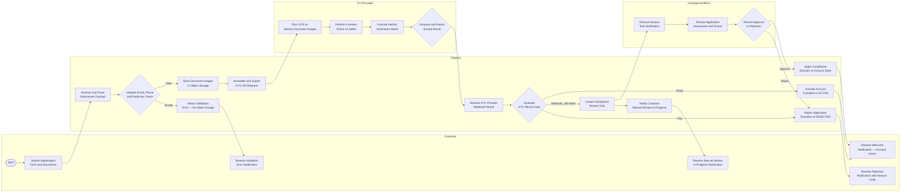

| Field | Value |
| --- | --- |
| Document ID | DBP-AN-030 |
| Version | 1.0 |
| Status | Approved |
| Owner | Platform Engineering — Core Banking |
| Last Updated | 2025-01-15 |
| Classification | Internal — Restricted |

# Swimlane Diagrams — Digital Banking Platform

---

## Introduction

Swimlane diagrams serve as the authoritative process visualisation format for all cross-functional
workflows within the Digital Banking Platform, providing a level of ownership clarity that sequence
diagrams and simple flowcharts cannot achieve at scale. Each lane in these diagrams corresponds to
a single, named actor — whether a customer-facing channel, an internal microservice, a third-party
provider, or a human role such as a Compliance Officer — so that responsibility for every action,
decision, and state transition is unambiguous at a glance. This design choice is deliberate: in a
regulated retail banking environment the ability to identify precisely who owns each step of a
process is not a convenience afforded by good documentation practices but a hard requirement
imposed by frameworks including the Payment Services Regulations 2017, the Money Laundering
Regulations 2017, and the FCA's Systems and Controls sourcebook. When a regulator or external
auditor requests evidence that customer due diligence is performed by a designated responsible
party, or that Strong Customer Authentication is applied at a specific point in the payment
initiation lifecycle, these diagrams provide the primary process-level reference upon which all
more detailed technical evidence rests.

The practical value of the swimlane format extends well beyond regulatory documentation and into
the day-to-day disciplines of engineering and quality assurance. Teams responsible for individual
lanes use the diagrams to identify interface contracts that require formal specification — every
arrow that crosses a lane boundary represents a service dependency that must be governed by a
published API contract, a message schema, or a shared domain event definition. QA engineers use
the diagrams as the primary input to their failure-mode test matrices, since each system state
change identified in the accompanying step detail tables provides both the trigger condition and
the assertion target for a structured negative-path test scenario. Product managers use the lane
boundaries during backlog refinement to assess the blast radius of proposed changes and to identify
which teams must be consulted before a feature is scoped, preventing the recurring pattern where an
interface is redesigned unilaterally by one team without awareness of the downstream consequences
for adjacent service owners. The diagrams are therefore living engineering assets subject to the
same version-control and review discipline as the source code they describe.

---

## KYC / Onboarding Flow

The customer onboarding journey is the most complex and highest-risk ingestion point in the
platform, combining stringent regulatory obligations under the Fifth Anti-Money Laundering
Directive with the commercial imperative to minimise drop-off for legitimate applicants whose
first experience sets the tone for the entire customer relationship. The flow encompasses four
distinct lanes of ownership: the Customer submitting identity and contact information through the
onboarding UI, the Platform's orchestration layer acting as the internal process owner and account
state machine, the external KYC Provider executing automated document and liveness verification,
and the Compliance Officer handling cases where automated confidence falls below the PASS
threshold. Three distinct terminal outcomes are possible — immediate account activation following
a clean KYC PASS, human-escalated review when the provider returns MANUAL_REVIEW, and outright
rejection when verification fails unambiguously or the Compliance Officer rules against the
applicant. The handoff from the KYC Provider to the Compliance Officer lane is the most
operationally sensitive transition in the flow, introducing variable human-gated latency that must
be explicitly modelled in both the customer-facing onboarding SLA and the compliance team's
operational capacity planning.

The diagram also captures an earlier validation gate owned entirely by the Platform, which fires
before any data is transmitted to the KYC Provider. This gate rejects submissions with malformed
contact details or that match the fingerprint of an existing account record, simultaneously
preventing unnecessary API costs from failed KYC calls and satisfying the requirement under the
Customer Due Diligence Rules that a firm must not open a duplicate account where the resulting
identity ambiguity could obstruct AML monitoring obligations. All three result outcomes from the
KYC Provider are routed back through the Platform before any customer-visible action is taken,
enforcing the architectural invariant that no external system can directly drive account state
transitions without the Platform's authorisation layer acting as the final control point and the
sole writer of the account audit log.

### Step Detail

| Step | Actor | Action | System State Change | Failure Mode |
| --- | --- | --- | --- | --- |
| 1 | Customer | Submits registration form with full name, date of birth, address, contact details, and identity document images via the onboarding UI | Application record created in SUBMITTED state; document images persisted in object storage with signed URL references | Payload exceeds size limit; unsupported document image format; network timeout during multi-part upload |
| 2 | Platform | Validates email and phone format against RFC standards; runs duplicate check against existing accounts and pending applications matched by identity fingerprint | No state change on failure; validation error code recorded in the application event log | Duplicate check false positive due to name normalisation mismatch; regex rejecting valid international phone number formats |
| 3 | Platform | Generates signed time-limited document image URLs; assembles KYC API request payload with applicant data and image references; attaches idempotency key for retry safety | KYC check record created in PENDING state; outbound API request logged with correlation ID | Document URL signing failure; KYC payload schema version mismatch returning HTTP 400; idempotency key collision on concurrent submissions |
| 4 | KYCProvider | Runs optical character recognition on identity document images to extract name, date of birth, document number, and issuing authority | Extracted field values and per-field confidence scores stored in provider's intermediate result record | Poor image quality or glare causing OCR extraction failure; unsupported document type from issuing country; partial extraction leaving mandatory fields empty |
| 5 | KYCProvider | Performs liveness check by analysing submitted selfie image or video for presentation attack indicators and biometric match against document photograph | Liveness score and presentation attack probability recorded; biometric match score computed and stored | Video codec incompatibility with provider SDK; liveness model false negative on legitimate applicant; photo injection attack correctly flagged |
| 6 | KYCProvider | Executes identity verification by matching OCR-extracted fields against authoritative government reference databases; screens result against PEP and sanctions lists | Identity match score, PEP flag, and sanctions match status stored; overall confidence score aggregated from all sub-checks | Reference database temporarily unavailable; sanctions list update lag producing stale result; ambiguous name match requiring manual adjudication |
| 7 | KYCProvider | Aggregates all sub-scores against configured thresholds; assigns overall result code of PASS, MANUAL_REVIEW, or FAIL; dispatches signed webhook to Platform | KYC check record updated to final result code; webhook event published with result payload and HMAC signature | Webhook delivery failure after maximum retries; Platform HMAC verification failure due to key rotation; result payload schema change breaking Platform deserialisation |
| 8 | Platform | On PASS result: transitions application from SUBMITTED to ACTIVE; creates full account record; archives KYC evidence package; publishes AccountActivated domain event | Account record in ACTIVE state; KYC evidence archived with immutable reference; audit trail entry created with timestamp and result provenance | Concurrent state transition conflict from duplicate webhook delivery; notification service unavailable causing silent activation without customer alert |
| 9 | Platform | On MANUAL_REVIEW result: creates structured review task in compliance workflow engine with full evidence package; starts SLA countdown timer; sends in-progress notification to Customer | Review task created in PENDING state with deadline timestamp; Customer notified of expected review window | Compliance workflow engine unavailable; evidence package assembly failure due to expired document URLs; SLA timer not started causing undetected SLA breach |
| 10 | ComplianceOfficer | Reviews application in workflow UI examining OCR outputs, liveness scores, original document images, and watchlist match details; records structured approval or rejection with mandatory written rationale | Review task updated to IN_REVIEW during review and COMPLETED after decision; officer ID, timestamp, and rationale stored against the decision record | SLA breach due to officer unavailability; two officers recording conflicting decisions on the same application; rationale field bypassed by UI validation defect |
| 11 | Platform | On Compliance APPROVE: transitions account to ACTIVE; archives compliance decision with officer ID and timestamp; dispatches welcome notification to Customer | Account record in ACTIVE state; compliance decision archived; AccountActivated domain event published to downstream consumers | Stale account state read from replica causing incorrect or no-op transition; event publishing failure preventing downstream services from recognising the activation |
| 12 | Platform | On FAIL result or Compliance REJECT: transitions application to REJECTED; dispatches rejection notification to Customer with applicable reason code and appeal pathway | Application archived in REJECTED state; retention policy timer started; CustomerRejected event published | Reason code mapping failure producing misleading customer message; regulatory restriction on disclosing the specific verification failure reason requiring fallback to a compliant generic message |

---

## Domestic Transfer Flow

Domestic transfers represent both the highest-volume and the most operationally critical
transaction type on the platform, executing under real-time processing expectations set by the
Faster Payments Service scheme while simultaneously enforcing multi-layered fraud controls,
preserving double-entry accounting integrity in the core ledger, and delivering confirmation
notifications within seconds of settlement. The end-to-end flow involves five lanes: the Customer
channel that initiates the request and receives all feedback throughout the lifecycle, the
TransactionService that acts as the stateful orchestrator and owns the canonical transfer record,
CoreBanking which maintains the authoritative ledger and posts all journal entries, the PaymentRail
which executes interbank settlement through the scheme appropriate to the payment type, and the
NotificationService which consumes domain events asynchronously to decouple customer-facing
notification latency from the synchronous settlement confirmation path. Two cross-cutting concerns
are made explicit in this diagram that are frequently under-specified in informal designs:
idempotency key checking applied at the earliest possible gate to prevent duplicate charges when
mobile clients retry on connection timeout, and the compensating transaction path that defines
the precise sequence of state reversals required when settlement fails after a debit hold has
already been committed.

The placement of the fraud scoring step before the debit hold is a deliberate architectural
decision that reflects the cost-of-failure calculus for this flow: detecting a fraudulent or
limit-breaching payment before any state mutation reduces all compensation work to a single
transfer record update and avoids the need to reverse a ledger hold. The debit hold mechanism
creates a window of temporal inconsistency in the customer's available balance during the
settlement phase, bounded by a defined hold expiry timeout that triggers automatic compensation
if the TransactionService does not receive a settlement response within the SLA window. The
NotificationService's consumption of the TransferCompleted domain event via an asynchronous
message bus rather than a synchronous callback is deliberate — it ensures that a notification
delivery failure cannot cause a payment to be marked as failed, and it allows the notification
service to be scaled, deployed, or temporarily unavailable without affecting the payment
processing path in any way.

```mermaid
flowchart LR
    subgraph Customer
        A1([Start])
        A2[Initiate Transfer\nvia Mobile or Web UI]
        A3[Receive Cached Response\nNo Duplicate Charge Incurred]
        A4[Receive Rejection\nNotification with Reason]
        A5[Receive Transfer\nConfirmation Notification]
        A6[Receive Failure Notification\nRefund Confirmed]
    end

    subgraph TransactionService
        B1[Receive Transfer\nRequest — Parse Payload]
        B2[Look Up Idempotency\nKey in Distributed Cache]
        B3{Key Found\nin Cache?}
        B4[Check Daily and\nPer-Transaction Limits]
        B5[Request Real-Time\nFraud Score]
        B6{Validation and\nFraud Result}
        B7[Send Rejection\nNotification to Customer]
        B8[Place Debit Hold\nvia AccountService]
        B9[Submit Payment\nInstruction to CoreBanking]
        B10[Route Instruction\nto PaymentRail Adapter]
        B11[Release Debit Hold\nPublish TransferCompleted]
        B12[Execute Compensation:\nRelease Hold and Reverse Journal\nSet Status FAILED]
    end

    subgraph CoreBanking
        C1[Validate Account\nState and Currency]
        C2[Post Double-Entry\nJournal Entry]
        C3[Return Journal Entry\nID and Confirmation]
    end

    subgraph PaymentRail
        D1[Receive Payment\nInstruction from Adapter]
        D2[Execute Interbank\nSettlement via Scheme]
        D3{Scheme Settlement\nResult}
    end

    subgraph NotificationService
        E1[Consume TransferCompleted\nEvent from Message Bus]
        E2[Construct and Dispatch\nSMS and Push Notification]
    end

    A1 --> A2
    A2 --> B1
    B1 --> B2
    B2 --> B3
    B3 -- Found: Return Cached --> A3
    B3 -- Not Found: Continue --> B4
    B4 --> B5
    B5 --> B6
    B6 -- Rejected --> B7
    B7 --> A4
    B6 -- Approved --> B8
    B8 --> B9
    B9 --> C1
    C1 --> C2
    C2 --> C3
    C3 --> B10
    B10 --> D1
    D1 --> D2
    D2 --> D3
    D3 -- Success --> B11
    D3 -- Failure --> B12
    B11 --> E1
    E1 --> E2
    E2 --> A5
    B12 --> A6
```

### Step Detail

| Step | Actor | Action | System State Change | Failure Mode |
| --- | --- | --- | --- | --- |
| 1 | Customer | Submits transfer request specifying source account, destination sort code and account number, amount, currency, and optional reference via an authenticated mobile or web session | Transfer record created in INITIATED state; idempotency key generated from deterministic hash of request fingerprint and stored in cache | Client-side validation bypass allowing invalid sort code format; request submitted without idempotency header creating a deduplication gap |
| 2 | TransactionService | Computes idempotency key from composite of account ID, amount, destination, and client-supplied reference; looks up key in distributed cache to detect retry | No state change on cache hit; cache entry TTL refreshed to prevent premature eviction on slow retries | Cache eviction under memory pressure causing re-processing of a legitimate client retry; hash collision on composite key producing false duplicate detection |
| 3 | TransactionService | Retrieves current daily outbound total for the source account from AccountService; compares transfer amount against configured daily aggregate and per-transaction limit thresholds | Transfer record updated to LIMIT_CHECKED; limit evaluation result recorded with the threshold snapshot used | Limit metadata stale due to cache propagation lag from a concurrent transfer; limit service timeout causing fail-open or fail-closed depending on circuit breaker policy |
| 4 | TransactionService | Calls fraud scoring engine with transaction attributes including amount, destination bank, time of day, device fingerprint, and recent velocity metrics | Fraud score and risk band stored against the transfer record; scoring model version recorded for auditability | Fraud engine response latency spike breaching configured timeout; model returning ambiguous risk band requiring manual override; device fingerprint unavailable on web channel |
| 5 | TransactionService | Calls AccountService to place a debit hold equal to the full transfer amount on the source account; stores the returned hold ID and expiry timestamp against the transfer record | Source account available balance decremented by transfer amount; hold record created with expiry timestamp and owning transfer reference | AccountService unavailable causing hold placement failure; optimistic lock conflict under concurrent transfers from the same account; hold amount rounding mismatch in foreign currency transfers |
| 6 | TransactionService | Submits payment instruction to CoreBanking including source account reference, hold ID, transfer amount, currency, destination details, and idempotency key | Payment instruction record created in SUBMITTED state in CoreBanking | CoreBanking timeout after hold already placed creating an orphan hold; duplicate journal entry on retry if CoreBanking did not honour the idempotency key |
| 7 | CoreBanking | Validates source account is in ACTIVE state and that instruction currency matches the account's base currency; posts double-entry journal debiting source and crediting settlement suspense | Ledger entries created with journal entry ID; source account ledger balance updated; suspense account credited | Currency mismatch between instruction and account base currency; account transitioning to BLOCKED during journal posting; constraint violation creating partial unbalanced journal |
| 8 | TransactionService | Selects payment rail by looking up the destination sort code in the routing table; applies amount-based and urgency-based scheme preference rules; forwards instruction to the selected adapter | Rail selection decision recorded against transfer record with scheme name and adapter version | Destination sort code absent from routing table; preferred rail unavailable with no configured fallback scheme; routing table cache stale due to a scheme membership change |
| 9 | PaymentRail | Receives and validates the payment instruction against scheme-specific format requirements; submits to the interbank settlement network with a scheme-assigned end-to-end reference | Scheme-level settlement record created; interbank message dispatched; FPID or ACH trace number allocated on submission | Scheme network outage; beneficiary bank rejecting payment citing closed or invalid account; batch scheme cut-off time exceeded requiring deferral to the next processing cycle |
| 10 | PaymentRail | Scheme returns settlement confirmation or a structured error code; adapter translates scheme result to the platform's canonical settlement result model and returns to TransactionService | Settlement result stored against the scheme record; final status communicated to TransactionService | Response timeout leaving settlement outcome unknown; ambiguous scheme error code with no platform mapping requiring manual reconciliation with the scheme |
| 11 | TransactionService | On successful settlement: releases debit hold via AccountService; updates transfer status to COMPLETED; publishes TransferCompleted domain event to the message bus | Hold released; transfer status set to COMPLETED; balance restored to available; domain event published with transfer details and post-transfer balance | Event broker temporarily unavailable causing silent COMPLETED status without notification triggered; hold release API call failing leaving a ghost hold reducing available balance |
| 12 | NotificationService | Consumes TransferCompleted domain event from the message bus; deserialises event payload; constructs notification content including transfer reference, amount, destination name, and new available balance | Notification record created in PENDING state; outbound dispatch to push and SMS gateways initiated | Consumer lag causing notification delayed beyond acceptable SLA; malformed event payload causing deserialisation failure and dead-letter queue accumulation |
| 13 | NotificationService | Dispatches push notification and SMS to the customer; records delivery confirmation or failure receipt from each gateway | Notification record updated to SENT or DELIVERY_FAILED; delivery receipt logged with gateway provider reference | Push token expired requiring re-registration; SMS gateway outage; notification suppressed by customer communication preference setting |
| 14 | TransactionService | On settlement failure: releases debit hold; posts compensating journal to CoreBanking to reverse the suspense credit; sets transfer status to FAILED; publishes TransferFailed event | Hold released; journal reversed; transfer status set to FAILED; customer refund confirmed by hold release | Partial compensation failure where hold is released but journal reversal times out, creating an inconsistent ledger state requiring manual reconciliation |

---

## Design Rationale

Swimlane diagrams were chosen as the canonical process visualisation format for this platform in
deliberate preference to UML sequence diagrams, because the primary communication challenge in a
multi-team regulated environment is ownership clarity rather than temporal message precision.
Sequence diagrams are optimised for expressing the exact ordering of synchronous and asynchronous
calls between named components, and they are the correct tool in an API design review where call
depth, response correlation, or concurrent message interleaving must be reasoned about carefully.
However, they present all participants on equivalent axes with no visual encoding of accountability,
making it difficult to answer the question that matters most during both incident response and
regulatory review: who is responsible for this action? The swimlane format maps directly onto the
organisational and contractual structure of the platform — each lane corresponds to an engineering
team, a third-party provider, or a named human role — and this mapping makes ownership gaps
immediately visible as process steps that sit ambiguously between lanes or cross a boundary
without a defined and documented interface contract.

The diagrams are constructed to satisfy documentation requirements under several specific
regulatory frameworks that govern the platform's operations in the United Kingdom. Under the
Payment Services Directive 2 and its UK retained implementation in the Payment Services Regulations
2017, the platform must demonstrate that Strong Customer Authentication is applied at a specific,
auditable point in the payment initiation flow and that the authentication component is assigned to
a defined service rather than treated as a diffuse platform-wide control without a clear owner.
The FCA's Systems and Controls sourcebook, specifically SYSC 8's requirements on outsourcing and
SYSC 4's requirements on governance and internal controls, requires that operational processes be
documented at a level sufficient for a competent independent reviewer to assess control
effectiveness and assignment — a threshold that the combination of the swimlane diagrams and the
step detail tables is designed to meet concretely. Under the Money Laundering Regulations 2017,
the Customer Due Diligence process must be documented in a manner that identifies the responsible
party for each verification action and the evidence record produced as proof — requirements that
the KYC onboarding diagram satisfies by assigning each verification sub-step to either the
Platform, the KYC Provider, or the Compliance Officer and annotating the system state change that
constitutes the auditable record of that action.

QA teams consume these diagrams as the primary input to risk-based test planning, working from
the principle that every lane boundary and every decision node in the diagram represents a distinct
failure domain warranting explicit test coverage. The step detail tables are translated directly
into test scenario catalogues: the failure mode column for each step becomes a set of candidate
negative-path test cases, the system state change column defines the assertion target that each
test must verify, and the actor column determines whether the appropriate test vehicle is a unit
test, a cross-service integration test, or a full end-to-end scenario spanning multiple lanes. The
idempotency check in the domestic transfer flow, for example, maps directly to an integration test
that submits the same transfer request twice within the cache TTL window and asserts that the
second request returns the cached response without creating a second transfer record, placing a
second debit hold, or posting a second journal entry to the ledger. This level of traceability
from diagram step to test assertion reduces systematic coverage gaps at precisely the cross-service
boundaries where production incidents most frequently originate and where regression is hardest
to detect through code review alone.

The governance process for maintaining these diagrams is integrated into the platform's pull
request review workflow rather than delegated to a separate documentation cadence that inevitably
drifts out of sync with implementation changes. Any pull request that modifies the observable
behaviour of a process depicted in a swimlane diagram — by adding a processing step, changing
the owning service of an existing action, altering the conditions on a decision node, or
introducing a new external dependency that crosses a lane boundary — is required to include a
corresponding diagram update before the pull request can receive final approval. This requirement
is enforced through a CODEOWNERS configuration that designates the Platform Engineering Lead and
at least one senior engineer from the affected service team as mandatory reviewers for all files
within the `analysis/` directory, ensuring that diagram changes receive the same peer scrutiny
applied to production code changes. The git history of the diagram files consequently provides a
reliable and auditable trail of process evolution that can be presented to external auditors
alongside the corresponding code change history, making the documentation and the implementation
mutually verifiable rather than separately maintained.

A quarterly review cycle supplements the pull-request-driven update mechanism to detect and
remediate drift that accumulates through incremental changes individually too small to trigger the
diagram update requirement in isolation. During each quarterly review, the Platform Engineering
Lead facilitates a structured walkthrough of all swimlane diagrams with representatives from QA,
Compliance, Risk, and each service team, comparing the documented flow against the current
production deployment topology, the most recent incident post-mortems, and any schema or contract
changes introduced since the previous review. Any discrepancy between a diagram and observed
production behaviour is treated as a defect, logged as a backlog item, and prioritised in the same
sprint planning cycle as engineering defects rather than deferred to an unscheduled documentation
cleanup sprint. Integration of post-mortem findings is particularly valuable: incidents that
revealed undocumented failure modes or unexpected cross-lane interactions are retrospectively
incorporated into the step detail tables, so that the failure mode catalogue continuously improves
in coverage of the real production failure space rather than remaining confined to the theoretical
failure space anticipated at original design time.

Version management follows the platform's standard approach for internal technical documentation.
The version field in the metadata table is incremented for any change that alters the diagram
structure — adding or removing lanes, introducing or removing nodes, modifying branching
conditions, or changing the step detail table in a way that materially affects the test scenarios
derivable from it. Cosmetic edits to prose descriptions or diagram node labels that do not alter
process semantics are applied without a version increment, subject to the review owner's
discretion. Document IDs follow the convention DBP-AN-NNN, where DBP identifies the Digital
Banking Platform, AN identifies the analysis document category, and the three-digit suffix is
assigned sequentially at document creation time; swimlane diagrams carry the AN prefix to
distinguish them from architecture decision records (AD), data flow diagrams (DF), and threat
model documents (TM), each of which operates under its own numbering namespace and approval
process.

---
