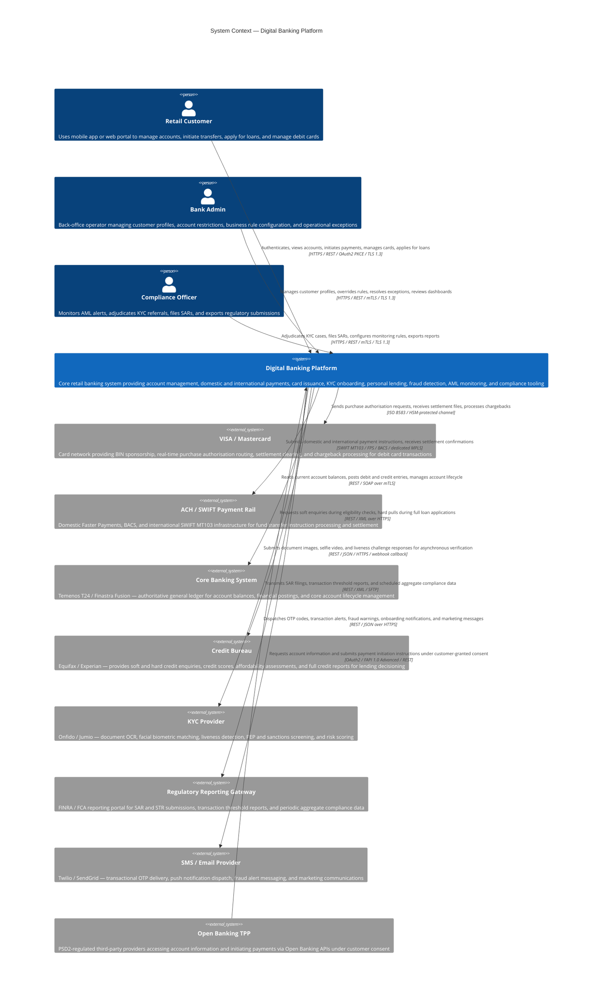
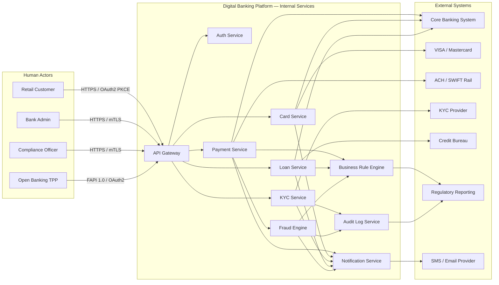

# System Context Diagram — Digital Banking Platform

| Field | Value |
|---|---|
| Document ID | DBP-SCD-001 |
| Version | 1.0 |
| Status | Approved |
| Owner | Enterprise Architecture |
| Last Updated | 2025-01-15 |

## Purpose

This document presents the C4 Model System Context view for the Digital Banking Platform. It identifies all external actors, human personas, and third-party systems that interact with the platform, establishes integration boundaries, security trust zones, and data-exchange protocols. This view serves as the primary reference for enterprise architects, security engineers, integration teams, and external auditors assessing the system's integration surface area and dependency landscape.

## C4 System Context Diagram

The diagram below uses C4 Model notation. The Digital Banking Platform is the focus system at the centre. Three human personas interact directly with the platform. Eight external systems provide specialised infrastructure capabilities including payment rails, identity verification, core ledger services, notification delivery, and regulatory reporting.

## Integration Interaction Table

The following table enumerates every directional relationship shown in the context diagram, specifying the communication protocol, payload content, call pattern, and operational SLA.

| # | From | To | Protocol | Data Exchanged | Pattern | Operational SLA |
|---|---|---|---|---|---|---|
| 1 | Retail Customer | Digital Banking Platform | HTTPS REST / OAuth2 PKCE | Auth tokens, account queries, payment requests, card commands, loan applications | Synchronous | < 2 s p99 |
| 2 | Bank Admin | Digital Banking Platform | HTTPS REST / mTLS | Customer profile updates, rule parameters, case decisions, restriction commands | Synchronous | < 3 s p99 |
| 3 | Compliance Officer | Digital Banking Platform | HTTPS REST / mTLS | KYC adjudication decisions, SAR payloads, report generation parameters | Synchronous | < 5 s p99 |
| 4 | Digital Banking Platform | VISA / Mastercard | ISO 8583 / HSM | Authorisation requests and responses, settlement files, chargeback notices, dispute data | Real-time auth + nightly batch settlement | < 500 ms auth |
| 5 | Digital Banking Platform | ACH / SWIFT Rail | SWIFT MT103 / FPS / BACS | Payment instructions, settlement confirmations, return credits, UETR tracking | Real-time (FPS) / batch (BACS, SWIFT) | FPS < 20 s |
| 6 | Digital Banking Platform | Core Banking System | REST / SOAP / mTLS | Balance reads, debit/credit postings, account status changes, statement data | Synchronous per transaction | < 1 s p95 |
| 7 | Digital Banking Platform | Credit Bureau | REST / XML / HTTPS | Soft enquiry request/response, hard pull request/response, affordability report | Synchronous per loan event | < 10 s p99 |
| 8 | Digital Banking Platform | KYC Provider | REST / JSON / HTTPS | Document images, selfie video, liveness result, risk score, verification outcome | Async with webhook callback | < 60 s end-to-end |
| 9 | Digital Banking Platform | Regulatory Reporting | REST / XML / SFTP | SAR filings, STR data, transaction threshold reports, aggregate monthly compliance data | Event-driven + daily/monthly scheduled | < 24 h scheduled |
| 10 | Digital Banking Platform | SMS / Email Provider | REST / JSON / HTTPS | OTP codes, transaction confirmation SMS, fraud alerts, onboarding emails, marketing | Event-driven per notification event | < 5 s delivery |
| 11 | Open Banking TPP | Digital Banking Platform | OAuth2 / FAPI 1.0 / REST | Account balances, transaction history, payment initiation requests, consent tokens | On-demand, rate-limited per TPP | < 2 s p99 |

## Trust Boundary Definitions

The Digital Banking Platform operates across four defined security zones. Each zone enforces distinct authentication controls, network segregation, and encryption standards. Cross-zone communication is permitted only through designated gateway services with explicit, audited firewall rule sets.

| Zone | Name | Contained Systems | Authentication | Encryption |
|---|---|---|---|---|
| Zone 0 | Internet-Facing DMZ | Customer mobile app, web portal, Open Banking API gateway endpoints | OAuth2 PKCE, device binding, biometric MFA | TLS 1.3 only, HSTS with preload, certificate pinning on mobile |
| Zone 1 | Application Processing Zone | Internal API gateway, microservices mesh, BRE, fraud engine, notification dispatcher | Service-mesh mTLS, short-lived JWT bearer tokens, SPIFFE/SPIRE identities | TLS 1.3 / AES-256-GCM between all services |
| Zone 2 | Data Persistence Zone | PostgreSQL clusters, Redis cache, document object store, HashiCorp Vault, message broker | IAM role-based access, encrypted credential rotation, Vault dynamic secrets | TLS in transit, AES-256-CBC at rest, column-level encryption for PII fields |
| Zone 3 | External Partner Integration Zone | Core Banking System, Card Network HSM link, KYC Provider, Payment Rail, Credit Bureau | Mutual TLS client certificates, rotating partner API keys, IP allowlist enforcement | Dedicated VPN or MPLS circuit, mTLS per session, HSM for all symmetric key material |

Direct access from Zone 0 to Zone 2 or Zone 3 is architecturally prohibited. All inbound customer requests are terminated at the Zone 0/1 boundary by the API Gateway before being forwarded through internal service mesh channels.

## External Dependency Risk Matrix

| External System | Criticality | Failure Mode | Business Impact | Primary Mitigation | Secondary Mitigation | Recovery Target |
|---|---|---|---|---|---|---|
| Core Banking System | Critical | Unplanned downtime or high latency | Balance reads and all financial postings unavailable | Circuit breaker, read-through balance cache with 5-minute TTL | Async retry queue with deduplication key | RTO 15 min, RPO 0 |
| VISA / Mastercard | Critical | Authorisation network outage | All card-present and card-not-present payments decline | Issuer stand-in processing, offline floor-limit mode | Alternate BIN sponsor routing | RTO 5 min |
| ACH / SWIFT Rail | High | Payment rail unavailability or congestion | Domestic and international transfers delayed | Persistent outbound payment queue with exponential backoff | Alternative SWIFT bureau routing | RTO 30 min |
| KYC Provider | High | OCR or biometric service degradation | New customer onboarding halted, tier upgrades blocked | Secondary provider fallback (Jumio as standby for Onfido) | Manual review queue activation | RTO 60 min |
| Credit Bureau | High | API timeout or connectivity failure | Loan eligibility checks and credit decisions unavailable | Cached credit score with 24-hour TTL for soft enquiries | Manual underwriting fallback workflow | RTO 30 min |
| SMS / Email Provider | Medium | Delivery failure or rate-limit threshold breach | OTP delivery delayed, user authentication degraded | Dual-provider routing with automatic failover | Fallback from Twilio to SendGrid for SMS channel | RTO 10 min |
| Regulatory Reporting | Medium | Gateway downtime or submission rejection | Delayed regulatory filing, potential compliance breach | Durable message queue with retry, immutable audit log | Manual submission workflow with compliance sign-off | RTO 4 hours |
| Open Banking TPP | Low | API version mismatch or consent token expiry | Reduced open banking service coverage | Versioned API contracts, graceful degradation, consent refresh | Rate limiting with informative error responses | RTO 1 hour |

## Data Flow Summary Diagram

The following diagram illustrates the runtime data flow across major internal components and external systems during representative transaction and onboarding scenarios.

## Open Banking API Contract Summary

The Digital Banking Platform exposes a PSD2-compliant Open Banking API surface conforming to the UK Open Banking Standard v3.1. All third-party provider access is mediated through a dedicated FAPI-compliant API gateway profile. Consent management is handled by a standalone Authorisation Server supporting OpenID Connect hybrid flow and Dynamic Client Registration (DCR) per RFC 7591.

| API Category | Standard | Version | Endpoint Prefix | Rate Limit per TPP |
|---|---|---|---|---|
| Account Information (AISP) | UK OB Standard | 3.1.10 | /open-banking/v3.1/aisp | 500 req / min |
| Payment Initiation (PISP) | UK OB Standard | 3.1.10 | /open-banking/v3.1/pisp | 100 req / min |
| Confirmation of Funds (CBPII) | UK OB Standard | 3.1.10 | /open-banking/v3.1/cbpii | 200 req / min |
| Dynamic Client Registration | RFC 7591 / OIDC | — | /connect/register | 10 req / hour per IP |
| Authorisation Server Discovery | OpenID Connect | 1.0 | /.well-known/openid-configuration | Unlimited |

## Integration Architecture Principles

The following principles govern the design and operation of all integrations defined in this context view.

| Principle | Statement |
|---|---|
| Zero Trust Networking | Every inter-service and external call requires mutual authentication. No implicit trust is granted based on network location or IP address alone. |
| Asynchronous Resilience | Long-running external operations (KYC, credit bureau) use async request-callback patterns with durable retry queues to prevent cascade failures. |
| Data Minimisation | Only the minimum data necessary for each integration's stated purpose is transmitted, in compliance with GDPR Article 5(1)(c). |
| Idempotent Operations | All payment, posting, and notification calls include a client-generated idempotency key to prevent duplicate processing on retried requests. |
| Immutable Audit Trail | Every system-to-system interaction that modifies a financial balance, customer status, or security attribute is written to the append-only audit log. |
| Graceful Degradation | Non-critical dependencies (notifications, open banking, credit bureau) are designed to fail open with cached data or reduced functionality rather than causing full service interruption. |
| API Versioning | All externally consumed APIs are versioned with a deprecation notice period of minimum 6 months before any breaking change takes effect. |

## Monitoring and Observability

All external integrations are instrumented with the following observability controls to support SLA management and incident detection.

| Integration | Health Check Method | Latency Alert Threshold | Error Rate Alert Threshold | Dashboard |
|---|---|---|---|---|
| Core Banking System | Active ping every 30 s | p99 > 2 s | Error rate > 0.1% over 5 min | CBS Integration Health |
| VISA / Mastercard | ISO 8583 echo test every 60 s | Auth latency > 1 s | Decline rate spike > 5% | Card Network Dashboard |
| KYC Provider | REST GET /healthz every 60 s | Callback latency > 120 s | Failure rate > 2% | KYC Pipeline Monitor |
| Payment Rail | Heartbeat message every 5 min | Settlement delay > 30 s | Rejection rate > 0.5% | Payment Rail SLA |
| Credit Bureau | REST GET /status every 2 min | Response time > 15 s | Timeout rate > 1% | Credit Services Board |
| SMS / Email Provider | REST GET /health every 60 s | Delivery latency > 10 s | Bounce rate > 3% | Notification Ops |
