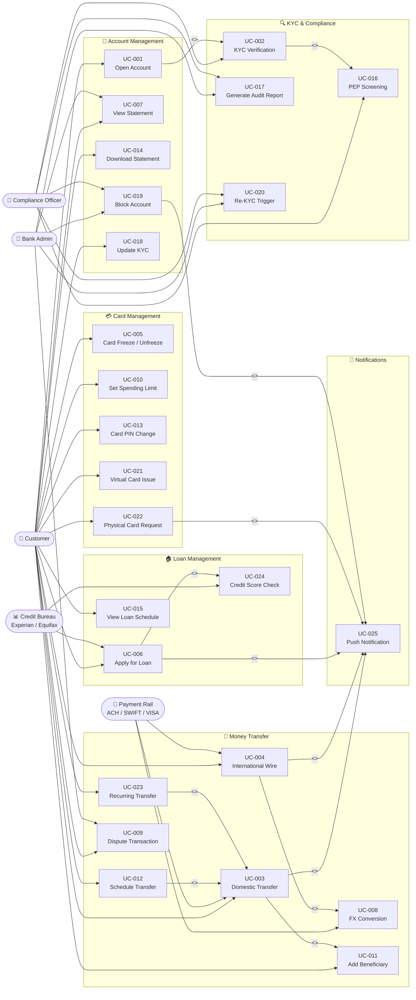

# Use Case Diagram — Digital Banking Platform

## Introduction

This document captures the complete use case model for the **Digital Banking Platform**, a
full-featured retail banking system that enables customers to manage accounts, transfer funds,
apply for loans, manage payment cards, and receive real-time notifications. The use case diagram
and accompanying tables define the behavioral requirements of the system from the perspective of
its actors, forming the foundation for downstream functional specifications and test plans.

The platform serves both individual retail customers and internal banking staff, while integrating
with multiple external networks and service providers. The use case model covers six major
subsystems: Account Management, Card Management, Money Transfer, KYC & Compliance, Loan
Management, and Notifications.

---

## Scope and Boundaries

The Digital Banking Platform use case model covers:

- **In Scope:** Mobile and web banking self-service, back-office operations, compliance workflows,
  payment processing integration, loan origination, card lifecycle management, and notification delivery.
- **Out of Scope:** Core banking ledger internals, payment network protocol implementations,
  physical branch operations, ATM management, and investment/brokerage services.
- **Platform Boundaries:** The system boundary encompasses the customer-facing applications,
  API gateway, microservices layer, and the compliance/admin portals. External systems (ACH,
  SWIFT, VISA/MC, Credit Bureaus, KYC providers) are outside the boundary.
- **Regulatory Scope:** The platform operates under PCI DSS (card data), PSD2 (open banking
  in EU), BSA/AML (anti-money laundering), GLBA (data privacy), and KYC regulations.
- **User Base:** Retail individual customers, internal bank operations staff, and compliance
  officers. Business banking is a future-phase extension.

---

## Actors

### Customer (Primary Actor)

The **Customer** is a retail banking user who interacts with the platform through the mobile
app (iOS/Android) or web portal. Customers perform day-to-day banking operations: opening
accounts, transferring money, managing cards, applying for loans, and viewing statements.
A customer must complete KYC (Know Your Customer) onboarding before accessing financial services.

**Characteristics:**
- Authenticates using username/password combined with MFA (biometric or OTP)
- May hold multiple account types: current, savings, fixed deposit
- Subject to transaction limits based on KYC tier (Tier 1, 2, 3)
- Can raise disputes, freeze cards, and set spending controls independently
- Receives push notifications, SMS, and email for all significant events

### Bank Admin (Internal Actor)

The **Bank Admin** is an internal operations staff member with elevated privileges. Admins
can manage customer accounts, configure system parameters, generate reports, resolve disputes,
and perform manual overrides. Access is strictly role-based and all actions are immutably audited.

**Characteristics:**
- Accesses the system through a secure, hardened admin portal (not the customer app)
- Operates under the four-eyes principle for sensitive operations (maker-checker)
- Action logging is mandatory — every mutation is captured with user ID, timestamp, and justification
- Role hierarchy: Maker → Checker → Approver → Super Admin

### Compliance Officer (Internal Actor)

The **Compliance Officer** specializes in regulatory compliance, including KYC review, AML
transaction monitoring, PEP (Politically Exposed Persons) screening, sanctions screening, and
regulatory reporting. Compliance Officers can freeze accounts, escalate cases, and file
Suspicious Activity Reports (SARs).

**Characteristics:**
- Uses a dedicated compliance portal with integrated case management tools
- Reviews flagged transactions and pending onboarding applications in a queue
- Generates regulatory reports for FinCEN, FCA, or applicable local regulators
- Operates under strict segregation of duties — cannot approve their own escalations
- Has read-only access to full transaction history across all customer accounts

### Payment Rail (External System Actor)

The **Payment Rail** represents the external payment networks that the platform integrates with
to execute fund transfers and card transactions:

- **ACH Network (Nacha):** Domestic batch transfers within the United States
- **SWIFT Network:** International wire transfers using MT/MX messaging standards
- **VISA/Mastercard Network:** Real-time card payment authorization and end-of-day settlement

**Characteristics:**
- Communicates via standardized protocols: ISO 8583, NACHA ACH files, SWIFT MT103/MT202, REST
- Subject to cut-off times, settlement windows, and network availability windows
- Returns status codes, acknowledgments, and daily/weekly settlement reports
- Carries SLA obligations (VISA auth: < 1 second; ACH: next-business-day or same-day)

### Credit Bureau (External System Actor)

The **Credit Bureau** represents external credit reporting agencies providing credit intelligence:

- **US Market:** Experian, Equifax, TransUnion
- **International Markets:** CIBIL (India), Experian UK, Schufa (Germany)

**Characteristics:**
- Provides FICO scores, credit history reports, and tradeline data on soft/hard inquiry
- Accessed during loan origination, periodic credit monitoring, and re-KYC workflows
- Returns standardized credit data in JSON/XML format via REST APIs
- Subject to FCRA (Fair Credit Reporting Act) compliance and consent requirements
- Responses typically returned within 1–3 seconds for real-time scoring

---

## Use Case Diagram

The following Mermaid diagram represents the UML use case structure using a flowchart. Actors
appear on the left and right sides; use cases are grouped by subsystem using subgraphs. Arrow
labels denote include and extend relationships between use cases.

---

## Use Case Inventory

The following table provides a complete inventory of all 25 use cases with identifiers, actors,
priority classification, and estimated implementation complexity.

| UC-ID  | Name                   | Primary Actor(s)               | Secondary Actor(s)            | Priority | Complexity |
|--------|------------------------|--------------------------------|-------------------------------|----------|------------|
| UC-001 | Open Account           | Customer                       | Bank Admin, KYC Provider      | Critical | High       |
| UC-002 | KYC Verification       | Compliance Officer, Customer   | KYC Provider (Onfido/Jumio)   | Critical | High       |
| UC-003 | Domestic Transfer      | Customer                       | Payment Rail (ACH)            | Critical | Medium     |
| UC-004 | International Wire     | Customer                       | Payment Rail (SWIFT)          | Critical | High       |
| UC-005 | Card Freeze/Unfreeze   | Customer                       | Card Service                  | High     | Low        |
| UC-006 | Apply for Loan         | Customer                       | Credit Bureau, Risk Engine    | Critical | High       |
| UC-007 | View Statement         | Customer, Bank Admin           | Core Banking System           | High     | Low        |
| UC-008 | FX Conversion          | Customer                       | FX Rate Provider              | High     | Medium     |
| UC-009 | Dispute Transaction    | Customer, Bank Admin           | Payment Rail, Ops Team        | High     | Medium     |
| UC-010 | Set Spending Limit     | Customer                       | Card Service                  | Medium   | Low        |
| UC-011 | Add Beneficiary        | Customer                       | Verification Service          | High     | Low        |
| UC-012 | Schedule Transfer      | Customer                       | Scheduler Service             | Medium   | Medium     |
| UC-013 | Card PIN Change        | Customer                       | Card Service, HSM             | High     | Medium     |
| UC-014 | Download Statement     | Customer                       | Document Generation Service   | Medium   | Low        |
| UC-015 | View Loan Schedule     | Customer                       | Loan Service                  | Medium   | Low        |
| UC-016 | PEP Screening          | Compliance Officer             | Sanctions Database, OFAC      | Critical | Medium     |
| UC-017 | Generate Audit Report  | Compliance Officer, Bank Admin | Audit Service, Data Warehouse | High     | Medium     |
| UC-018 | Update KYC             | Customer                       | KYC Provider, Compliance      | High     | Medium     |
| UC-019 | Block Account          | Bank Admin, Compliance Officer | Notification Service          | Critical | Low        |
| UC-020 | Re-KYC Trigger         | Bank Admin, Compliance Officer | Customer, KYC Provider        | High     | Medium     |
| UC-021 | Virtual Card Issue     | Customer                       | Card Service, Tokenization    | High     | Medium     |
| UC-022 | Physical Card Request  | Customer                       | Card Production, Courier      | High     | Medium     |
| UC-023 | Recurring Transfer     | Customer                       | Scheduler, Payment Rail       | Medium   | Medium     |
| UC-024 | Credit Score Check     | Customer                       | Credit Bureau (Experian/EQ)   | Medium   | Low        |
| UC-025 | Push Notification      | System (Event-Driven)          | FCM, APNS, SMS Gateway        | High     | Low        |

---

## Actor-Use Case Matrix

The matrix indicates which actors are directly involved (✅) or provide supporting/system-level
participation (🔧) in each use case. A dash (—) indicates no involvement.

| UC-ID  | Use Case Name          | Customer | Bank Admin | Compliance Officer | Payment Rail | Credit Bureau |
|--------|------------------------|----------|------------|--------------------|--------------|---------------|
| UC-001 | Open Account           | ✅       | 🔧         | 🔧                 | —            | —             |
| UC-002 | KYC Verification       | ✅       | —          | ✅                 | —            | —             |
| UC-003 | Domestic Transfer      | ✅       | —          | —                  | ✅           | —             |
| UC-004 | International Wire     | ✅       | —          | —                  | ✅           | —             |
| UC-005 | Card Freeze/Unfreeze   | ✅       | 🔧         | —                  | —            | —             |
| UC-006 | Apply for Loan         | ✅       | 🔧         | —                  | —            | ✅            |
| UC-007 | View Statement         | ✅       | ✅         | —                  | —            | —             |
| UC-008 | FX Conversion          | ✅       | —          | —                  | ✅           | —             |
| UC-009 | Dispute Transaction    | ✅       | ✅         | —                  | 🔧           | —             |
| UC-010 | Set Spending Limit     | ✅       | —          | —                  | —            | —             |
| UC-011 | Add Beneficiary        | ✅       | —          | —                  | —            | —             |
| UC-012 | Schedule Transfer      | ✅       | —          | —                  | 🔧           | —             |
| UC-013 | Card PIN Change        | ✅       | —          | —                  | —            | —             |
| UC-014 | Download Statement     | ✅       | 🔧         | —                  | —            | —             |
| UC-015 | View Loan Schedule     | ✅       | —          | —                  | —            | —             |
| UC-016 | PEP Screening          | —        | —          | ✅                 | —            | —             |
| UC-017 | Generate Audit Report  | —        | ✅         | ✅                 | —            | —             |
| UC-018 | Update KYC             | ✅       | —          | 🔧                 | —            | —             |
| UC-019 | Block Account          | —        | ✅         | ✅                 | —            | —             |
| UC-020 | Re-KYC Trigger         | 🔧       | ✅         | ✅                 | —            | —             |
| UC-021 | Virtual Card Issue     | ✅       | —          | —                  | —            | —             |
| UC-022 | Physical Card Request  | ✅       | —          | —                  | —            | —             |
| UC-023 | Recurring Transfer     | ✅       | —          | —                  | ✅           | —             |
| UC-024 | Credit Score Check     | ✅       | —          | —                  | —            | ✅            |
| UC-025 | Push Notification      | ✅       | 🔧         | —                  | —            | —             |

---

## Use Case Relationships Summary

### Include Relationships

Include relationships model mandatory sub-behaviors always executed as part of a base use case.
The included use case cannot be invoked independently in the context described below.

| Base Use Case            | Included Use Case        | Rationale                                                              |
|--------------------------|--------------------------|------------------------------------------------------------------------|
| UC-001 Open Account      | UC-002 KYC Verification  | Every new account opening mandates KYC completion before activation    |
| UC-004 Intl Wire         | UC-008 FX Conversion     | International transfers always involve currency conversion at runtime  |
| UC-003 Dom Transfer      | UC-011 Add Beneficiary   | A transfer requires a validated beneficiary record on the account      |
| UC-006 Apply for Loan    | UC-024 Credit Score Check| Loan eligibility evaluation always requires a credit bureau pull       |
| UC-002 KYC Verification  | UC-016 PEP Screening     | All KYC checks include mandatory PEP and OFAC sanctions screening      |
| UC-012 Schedule Transfer | UC-003 Dom Transfer      | Scheduled transfers execute via the domestic transfer base flow        |
| UC-023 Recurring Transfer| UC-003 Dom Transfer      | Each recurring transfer instance invokes the domestic transfer flow    |

### Extend Relationships

Extend relationships model optional or event-triggered behaviors that conditionally augment a
base use case under specific circumstances.

| Base Use Case              | Extending Use Case       | Trigger Condition                                         |
|----------------------------|--------------------------|-----------------------------------------------------------|
| UC-003 Domestic Transfer   | UC-025 Push Notification | Notification fired on transfer success or failure         |
| UC-004 International Wire  | UC-025 Push Notification | Notification fired on wire status change                  |
| UC-006 Apply for Loan      | UC-025 Push Notification | Notification fired on loan approval, rejection, disbursal |
| UC-022 Physical Card Req.  | UC-025 Push Notification | Notification fired when card is dispatched / delivered    |
| UC-019 Block Account       | UC-025 Push Notification | Customer notified immediately when account is blocked     |

---

## Priority Classification

Use cases are classified into implementation tiers for phased delivery:

**Phase 1 — MVP (Critical):** UC-001, UC-002, UC-003, UC-006, UC-016, UC-019
These form the regulatory and functional minimum: onboarding, KYC, domestic payments, and compliance.

**Phase 2 — Core Banking (High):** UC-004, UC-005, UC-007, UC-008, UC-009, UC-011, UC-013, UC-014, UC-017, UC-018, UC-020, UC-021, UC-022, UC-025
Full card management, international payments, dispute handling, and notifications.

**Phase 3 — Advanced Features (Medium):** UC-010, UC-012, UC-015, UC-023, UC-024
Scheduled/recurring transfers, loan schedule visibility, spending controls, and credit monitoring.

---

*Document Version: 1.0 | Project: Digital Banking Platform | Classification: Internal*
