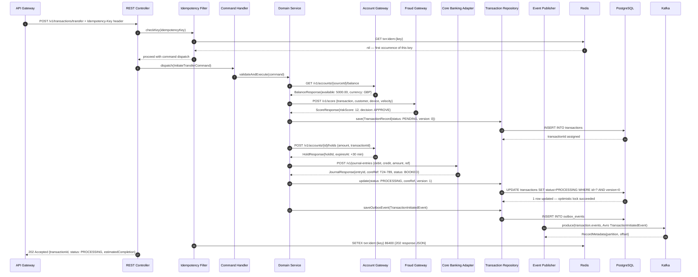
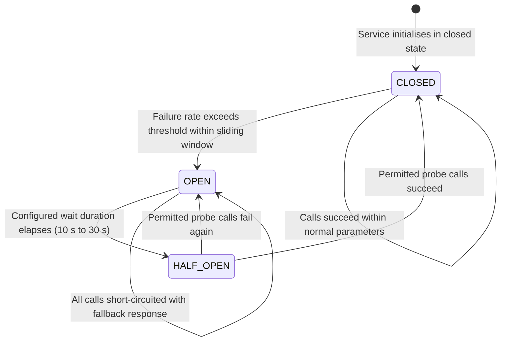

| Field | Value |
| --- | --- |
| Document ID | DBP-DD-019 |
| Version | 1.0 |
| Status | Approved |
| Owner | Architecture Team — Core Banking Engineering |
| Last Updated | 2025-01-15 |
| Classification | Internal — Restricted |

# C4 Component Diagram — TransactionService

## Overview

TransactionService is the authoritative command-and-query engine for all monetary movements within the Digital Banking Platform. It enforces business rules around transaction limits, fraud thresholds, and regulatory constraints before committing any debit or credit operation to the ledger. Acting as the central orchestrator, it coordinates synchronously with AccountService for balance verification and FraudService for real-time risk scoring, and posts authoritative journal entries to the Core Banking System via the ISO 20022 pain.001 message format.

The service is implemented following the CQRS (Command Query Responsibility Segregation) pattern, underpinned by an event-driven architecture using Axon Framework 4.9. All state mutations are executed as commands routed through the Axon command bus, while read operations are served through optimised query projections backed by separate read models. Domain events published to Apache Kafka ensure downstream consumers maintain eventual consistency without coupling to TransactionService's internal state or database schema.

Idempotency is a first-class architectural concern. Every mutating request must carry an `Idempotency-Key` header, validated against a Redis-backed deduplication store before any command is dispatched. This guarantees exactly-once semantics under client retries and network partitions alike — a property critical for financial operations where duplicate transactions represent both a financial liability and a regulatory breach.

---

## C4 Component Diagram

The diagram below illustrates all internal components of the `TransactionService` Spring Boot container, the external callers and webhook sources that invoke it, and the external systems and data stores it depends upon.

```mermaid
C4Component
    title TransactionService — C4 Component Diagram

    Container_Ext(apiGateway, "API Gateway", "Kong / AWS ALB", "Authenticates JWT tokens, enforces rate limits, routes to TransactionService")
    Container_Ext(fraudWebhook, "FraudService Webhook", "HTTPS POST", "Delivers async fraud decision callbacks signed with HMAC-SHA256")
    Container_Ext(paymentRailWebhook, "Payment Rail Webhook", "ACH / SWIFT / FasterPayments", "Delivers payment status and settlement confirmations via mTLS")

    Container_Boundary(ts, "TransactionService", "Spring Boot 3.2 — Java 17") {
        Component(restCtrl, "REST API Controller", "Spring MVC 6", "Exposes /v1/transactions endpoints; validates input, extracts idempotency key, dispatches commands and queries")
        Component(cmdBus, "Command Handler", "Axon Framework 4.9", "Receives InitiateTransfer and CancelTransaction commands; manages aggregate lifecycle and optimistic lock retry")
        Component(queryBus, "Query Handler", "Axon Framework 4.9", "Handles GetTransactionById, ListTransactions, GetTransactionSummary queries against read projections")
        Component(domainSvc, "Transaction Domain Service", "Domain Layer — DDD Aggregate", "Enforces business rules: daily limits, velocity checks, FX, compliance holds, duplicate detection")
        Component(fraudGW, "Fraud Check Gateway", "OpenFeign + Resilience4j", "Calls FraudService /v1/score synchronously; maps risk score to APPROVE, REVIEW, or DECLINE")
        Component(accountGW, "Account Gateway", "OpenFeign + Resilience4j", "Calls AccountService for balance check, debit hold placement, and hold release on completion or rollback")
        Component(coreBankingAdapter, "Core Banking Adapter", "HTTP REST Client", "Posts journal entries to Temenos T24; translates domain model to ISO 20022 pain.001 message")
        Component(paymentRouter, "Payment Rail Router", "Strategy Pattern", "Selects ACH, SWIFT, or FasterPayments adapter based on currency, amount, and destination country")
        Component(txnRepo, "Transaction Repository", "Spring Data JPA", "Persists TransactionRecord, TransactionLeg, and OutboxEvent entities to PostgreSQL")
        Component(eventPublisher, "Event Publisher", "Kafka Producer — Avro", "Serialises domain events to Avro; publishes to transaction.events via transactional outbox pattern")
        Component(idempotencyFilter, "Idempotency Filter", "Redis Servlet Filter", "Checks and stores idempotency keys with 24-hour TTL; replays cached response on duplicate request")
    }

    ContainerDb_Ext(postgres, "PostgreSQL", "AWS RDS PostgreSQL 15 Multi-AZ", "Transaction records, audit trail, outbox events, transaction legs")
    ContainerDb_Ext(kafka, "Apache Kafka", "AWS MSK — 3 brokers", "Domain event streaming on transaction.events and transaction.dlq topics")
    ContainerDb_Ext(redis, "Redis", "AWS ElastiCache 7.x Cluster Mode", "Idempotency key store, distributed locks, rate-limit counters")
    Container_Ext(fraudSvc, "FraudService", "Python 3.11 — FastAPI", "Real-time ML fraud scoring; returns risk score and decision within 300 ms SLA")
    Container_Ext(accountSvc, "AccountService", "Spring Boot 3.2", "Account lifecycle management; balance, hold, and daily limit enforcement")
    Container_Ext(coreBank, "Core Banking System", "Temenos T24 Transact", "Authoritative general ledger; settlement and regulatory reporting source of truth")

    Rel(apiGateway, restCtrl, "HTTPS REST — JSON", "JWT bearer token")
    Rel(fraudWebhook, restCtrl, "HTTPS POST — JSON", "HMAC-SHA256 signed webhook")
    Rel(paymentRailWebhook, restCtrl, "HTTPS POST — JSON", "Mutual TLS certificate")
    Rel(restCtrl, idempotencyFilter, "Checks idempotency-key before dispatching")
    Rel(restCtrl, cmdBus, "Dispatches typed command on Axon bus")
    Rel(restCtrl, queryBus, "Dispatches typed query on Axon bus")
    Rel(cmdBus, domainSvc, "Invokes domain validation and orchestration")
    Rel(domainSvc, fraudGW, "Synchronous fraud score request with transaction context")
    Rel(domainSvc, accountGW, "Balance verification and hold placement")
    Rel(domainSvc, coreBankingAdapter, "Post ISO 20022 journal entry")
    Rel(domainSvc, paymentRouter, "Route external payment to scheme adapter")
    Rel(domainSvc, txnRepo, "Persist transaction state and outbox event")
    Rel(domainSvc, eventPublisher, "Publish domain event after commit")
    Rel(queryBus, txnRepo, "Read transaction projections")
    Rel(txnRepo, postgres, "JDBC via Hikari connection pool")
    Rel(eventPublisher, kafka, "Avro event to transaction.events topic")
    Rel(idempotencyFilter, redis, "GET and SETEX on idempotency namespace")
    Rel(fraudGW, fraudSvc, "HTTPS POST /v1/score")
    Rel(accountGW, accountSvc, "HTTPS /v1/accounts/{id}/holds")
    Rel(coreBankingAdapter, coreBank, "HTTPS REST — ISO 20022 pain.001")
```



---

## Transfer Command Sequence

The following sequence traces a successful domestic fund transfer from API Gateway arrival through all internal TransactionService components to Kafka event publication.



---

## Component Responsibilities

| Component | Primary Responsibility | Technology | Owning Team |
| --- | --- | --- | --- |
| REST API Controller | HTTP endpoint exposure, OpenAPI contract enforcement, request validation, response mapping | Spring MVC 6 | Platform Engineering |
| Command Handler | Command routing, aggregate lifecycle management, optimistic lock retry logic | Axon Framework 4.9 | Platform Engineering |
| Query Handler | Query projection dispatch, read model hydration, pagination and cursor support | Axon Framework 4.9 | Platform Engineering |
| Transaction Domain Service | Business rule enforcement, orchestration, FX handling, limit and velocity checks | DDD Aggregate | Core Banking |
| Fraud Check Gateway | Synchronous fraud score retrieval, decision mapping, circuit breaker fallback to REVIEW | OpenFeign + Resilience4j | Risk Engineering |
| Account Gateway | Balance verification, debit hold placement and release, daily limit enforcement | OpenFeign + Resilience4j | Core Banking |
| Core Banking Adapter | ISO 20022 message construction, journal entry posting, idempotent retry on T24 failures | RestTemplate + Jackson | Integration |
| Payment Rail Router | Strategy selection (ACH / SWIFT / FPS), adapter invocation, scheme rule validation | Strategy Pattern | Payments |
| Transaction Repository | JPA entity persistence, version management, outbox event storage, query projections | Spring Data JPA | Platform Engineering |
| Event Publisher | Avro serialisation, Kafka transactional produce, outbox relay, DLQ routing | Kafka Producer | Platform Engineering |
| Idempotency Filter | Request deduplication, cached response replay, key expiry management, audit logging | Redis Servlet Filter | Platform Engineering |

---

## Dependency Injection Configuration

All external gateway beans are singleton-scoped Spring components decorated with Resilience4j circuit breakers, retry policies, and timeout limits declared in `application.yml`.

```yaml
resilience4j:
  circuitbreaker:
    instances:
      fraudGateway:
        slidingWindowSize: 20
        failureRateThreshold: 50
        waitDurationInOpenState: 10s
        permittedNumberOfCallsInHalfOpenState: 5
        registerHealthIndicator: true
      accountGateway:
        slidingWindowSize: 20
        failureRateThreshold: 40
        waitDurationInOpenState: 15s
        permittedNumberOfCallsInHalfOpenState: 5
      coreBankingAdapter:
        slidingWindowSize: 10
        failureRateThreshold: 30
        waitDurationInOpenState: 30s
        permittedNumberOfCallsInHalfOpenState: 3
  retry:
    instances:
      fraudGateway:
        maxAttempts: 2
        waitDuration: 200ms
      accountGateway:
        maxAttempts: 3
        waitDuration: 300ms
        exponentialBackoffMultiplier: 2
      coreBankingAdapter:
        maxAttempts: 3
        waitDuration: 500ms
        exponentialBackoffMultiplier: 2
        maxWaitDuration: 5s
  timelimiter:
    instances:
      fraudGateway:
        timeoutDuration: 500ms
      accountGateway:
        timeoutDuration: 1s
      coreBankingAdapter:
        timeoutDuration: 3s
```

| Bean | Scope | Configuration Class | Notes |
| --- | --- | --- | --- |
| `FraudCheckGateway` | Singleton | `GatewayConfiguration` | Feign client with Resilience4j decorator and mTLS |
| `AccountGateway` | Singleton | `GatewayConfiguration` | WireMock stub active in `test` Spring profile |
| `CoreBankingAdapter` | Singleton | `AdapterConfiguration` | RestTemplate; HTTP proxy configured for PCI zone routing |
| `PaymentRailRouter` | Singleton | `PaymentConfiguration` | Holds injected list of `PaymentRailAdapter` strategy beans |
| `IdempotencyFilter` | Singleton | `FilterConfiguration` | Registered at `HIGHEST_PRECEDENCE + 1` servlet filter order |
| `TransactionRepository` | Singleton | Auto-configured | Hikari pool: max=50, min=10, connectionTimeout=3 s |
| `EventPublisher` | Singleton | `KafkaConfiguration` | Transactional Kafka producer with exactly-once delivery semantics |
| `CommandGateway` | Singleton | Axon auto-configuration | Retries x3 on `OptimisticLockException` before failing |
| `QueryGateway` | Singleton | Axon auto-configuration | Supports subscription queries for live projection updates |

---

## Failure Modes and Mitigation

| Component | Failure Mode | Detection | Mitigation | Recovery SLA |
| --- | --- | --- | --- | --- |
| REST API Controller | Missing `Idempotency-Key` header | Bean validation annotation | Return HTTP 400; no command dispatched | Instant |
| Idempotency Filter | Redis cluster unreachable | `RedisConnectionFailureException` | Fail-open; log warning; alert on-call team | 30 s reconnect |
| Fraud Check Gateway | FraudService timeout > 500 ms | Resilience4j `TimeLimiter` | Circuit opens at 50% failure rate; fallback to REVIEW decision | 10 s half-open |
| Account Gateway | AccountService HTTP 503 response | Feign HTTP 5xx handling | Retry x3 exponential back-off; propagate 503 to caller | 15 s circuit open |
| Core Banking Adapter | T24 unreachable after 3 s | `SocketTimeoutException` | Retry x3; mark `PENDING_CORE`; enqueue for delayed retry | Manual ops review |
| Payment Rail Router | Adapter throws unchecked exception | Exception propagation | Route to `transaction.dlq`; alert payments team | 1 h resolution |
| Transaction Repository | DB connection pool exhausted | `CannotGetJdbcConnectionException` | Hikari alert; read replica for queries during drain | 60 s pool recovery |
| Event Publisher | Kafka brokers unreachable | Producer `TimeoutException` | Outbox relay retries on reconnect; no event lost if DB committed | Kafka auto-reconnect |
| Command Handler | Optimistic lock conflict | JPA `OptimisticLockException` | Axon retries command x3 after fresh aggregate reload | 3 x 100 ms backoff |
| Query Handler | Projection rebuild lag > 30 s | Axon token processor metric | Return stale data with `X-Data-Lag-Seconds` header; trigger rebuild | 30 s projection replay |

---

## Circuit Breaker State Transitions



---

## API Endpoint Catalogue

| Method | Path | Dispatches | Response | Idempotency Key |
| --- | --- | --- | --- | --- |
| POST | /v1/transactions/transfer | `InitiateTransferCommand` | 202 Accepted | Required |
| POST | /v1/transactions/external-transfer | `InitiateExternalTransferCommand` | 202 Accepted | Required |
| POST | /v1/transactions/{id}/cancel | `CancelTransactionCommand` | 200 OK | Required |
| GET | /v1/transactions/{id} | `GetTransactionByIdQuery` | 200 OK | Not required |
| GET | /v1/transactions | `ListTransactionsQuery` | 200 OK | Not required |
| GET | /v1/transactions/summary | `GetTransactionSummaryQuery` | 200 OK | Not required |
| POST | /v1/webhooks/fraud-decision | `FraudDecisionWebhookCommand` | 200 OK | Required |
| POST | /v1/webhooks/payment-status | `PaymentStatusWebhookCommand` | 200 OK | Required |

---

## Performance Targets

| Metric | Target | Alert Threshold | Measurement Point |
| --- | --- | --- | --- |
| Transfer command p50 latency | < 200 ms | > 400 ms | REST API Controller |
| Transfer command p99 latency | < 800 ms | > 1,200 ms | REST API Controller |
| Fraud check p99 latency | < 300 ms | > 500 ms | Fraud Check Gateway |
| Account hold p99 latency | < 150 ms | > 300 ms | Account Gateway |
| Core Banking post p99 latency | < 2,000 ms | > 3,000 ms | Core Banking Adapter |
| Event publish p99 latency | < 50 ms | > 100 ms | Event Publisher |
| Throughput target | 500 TPS peak | < 400 TPS sustained | Load balancer metrics |
| DB pool utilisation | < 70% | > 85% | Hikari pool JMX metrics |
| Redis round-trip p99 | < 5 ms | > 20 ms | Idempotency Filter |
