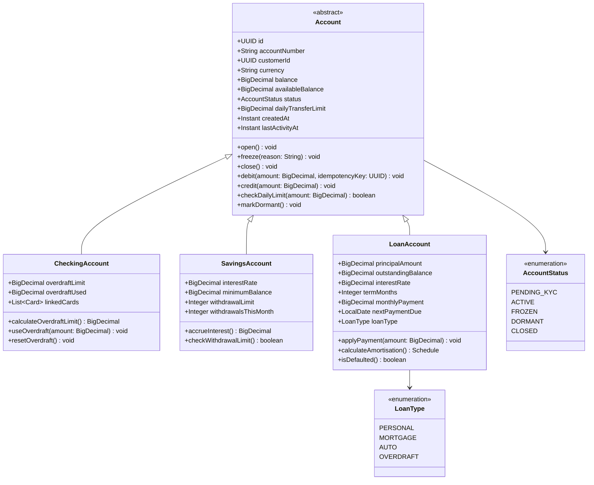
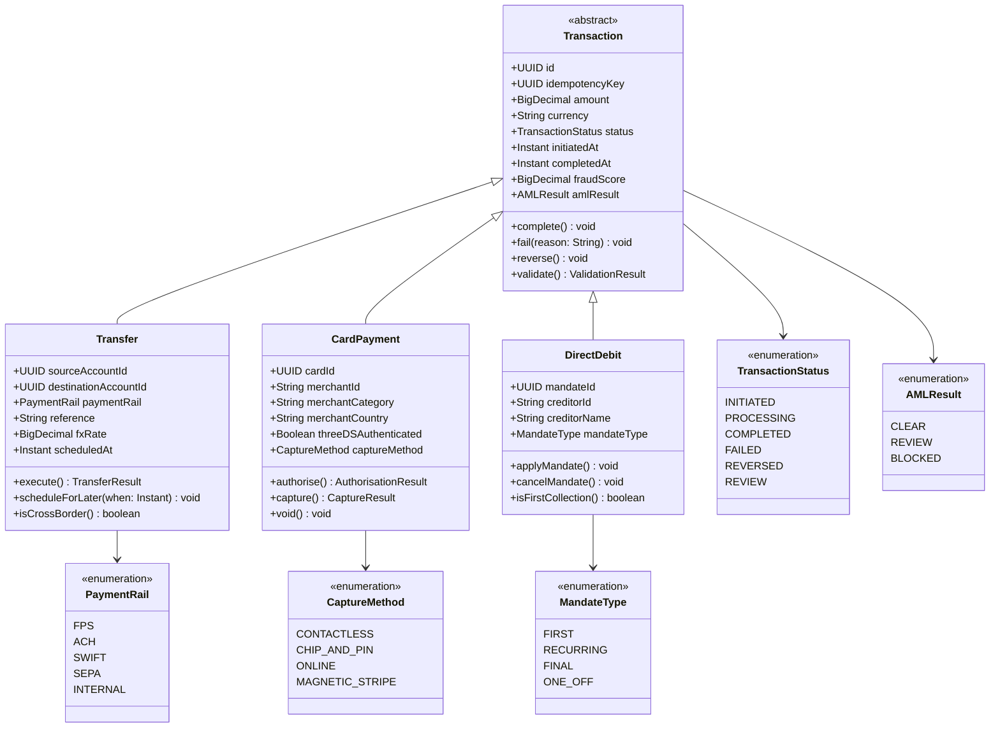
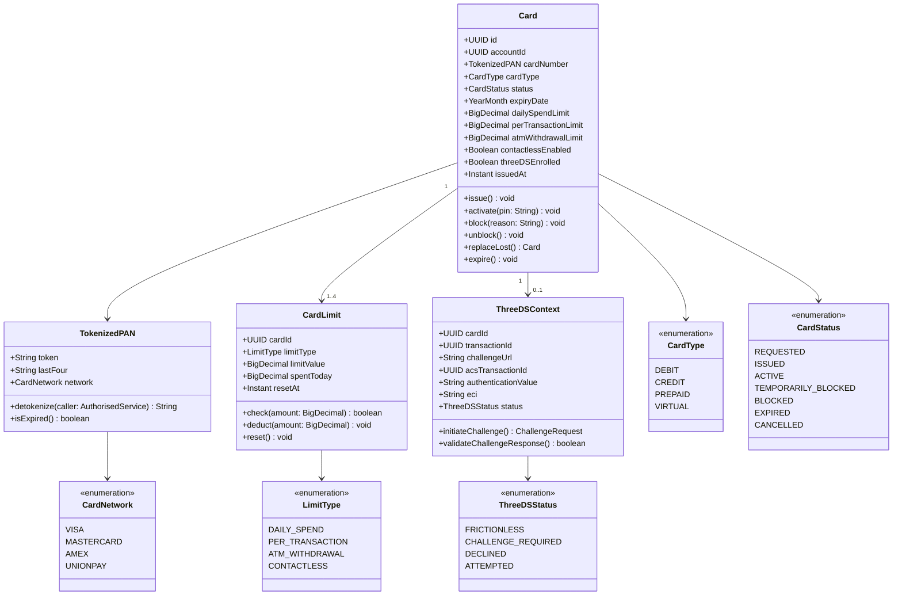

| Field | Value |
| --- | --- |
| Document ID | DBP-DD-033 |
| Version | 1.0 |
| Status | Approved |
| Owner | Architecture Team |
| Last Updated | 2025-01-15 |
| Classification | Internal — Restricted |

# Class Diagrams — Core Domain Model

## Overview

The Digital Banking Platform domain model is organised around Domain-Driven Design principles. Three principal aggregate clusters govern the majority of business behaviour: the Account hierarchy, the Transaction hierarchy, and the Card cluster. Each aggregate is an independent consistency boundary with its own transactional scope, persistence strategy, and Kafka event stream. No operation is permitted to modify more than one aggregate root within a single database transaction; cross-aggregate coordination is achieved exclusively through domain events and saga-based orchestration managed by the `TransactionService` process manager.

The abstract base classes `Account` and `Transaction` exist to enforce invariants that apply universally across all product subtypes. Rather than duplicating status checking, idempotency key recording, and daily limit enforcement in each concrete class, these concerns are implemented once in the abstract parent and inherited by all subtypes. Enumerations representing lifecycle states are first-class domain concepts, not database strings, ensuring that invalid state transitions are caught at compile time rather than at runtime.

Associations between aggregates are modelled exclusively as UUID references. No aggregate holds a direct Java object reference to another aggregate root. This design decision is deliberate: it decouples aggregate persistence, prevents ORM-driven lazy loading from crossing bounded-context boundaries, and allows each aggregate to be deployed, scaled, and evolved independently.

---

## Account Hierarchy

The `Account` abstract class is the aggregate root for all deposit and lending products. Concrete subtypes — `CheckingAccount`, `SavingsAccount`, and `LoanAccount` — inherit the identity, balance, status, and limit attributes defined on the parent while adding product-specific business logic. The `debit` and `credit` methods on the abstract class are the sole entry points for balance mutation; they validate the idempotency key, verify account status, evaluate the daily transfer limit, update `availableBalance` and `balance` atomically, and emit a `BalanceChanged` domain event before returning. No external service may increment or decrement a balance by modifying the field directly.

`LoanAccount` diverges from the deposit product pattern in that its `balance` field represents outstanding principal rather than a spendable balance. Payments are routed through `applyPayment`, which recalculates the amortisation schedule, reduces `outstandingBalance`, and emits a `LoanPaymentApplied` event. An account is considered defaulted when `outstandingBalance` remains positive after `nextPaymentDue` has elapsed past a five-calendar-day grace period, at which point `isDefaulted()` returns true and the account transitions to the DEFAULTED state.

---

## Transaction Hierarchy

The `Transaction` abstract class is the aggregate root for all monetary events. Its concrete subtypes — `Transfer`, `CardPayment`, and `DirectDebit` — represent the three primary payment types supported by the platform. The abstract `validate()` method enforces universal pre-execution checks: idempotency key presence, ISO 4217 currency code validity, and amount positivity. Each subclass overrides `validate()` to add type-specific rules: `Transfer` verifies that source and destination accounts are distinct and that the requested `PaymentRail` is available in the destination currency; `CardPayment` confirms that the card is active and that the merchant country is not on the blocked-jurisdiction list; `DirectDebit` confirms that the mandate reference is valid and has not been cancelled.

`fraudScore` and `amlResult` are stored directly on the `Transaction` aggregate rather than in separate audit entities. This co-location ensures that every compliance query — such as a regulator requesting all transactions above a threshold that were cleared by AML screening — can be answered with a single indexed table scan without joins to external audit tables. All state transitions on `Transaction` produce domain events that are persisted in the outbox table and published to Kafka before the HTTP response is returned, guaranteeing at-least-once delivery to downstream consumers including the notification service and the regulatory reporting pipeline.

---

## Card Classes

The Card cluster models the physical and virtual card instruments issued to customers, together with the tokenisation, three-domain security (3DS), and spend-limit enforcement mechanisms that surround them. `Card` is the aggregate root; it owns the `TokenizedPAN` value object and one `CardLimit` entity per limit dimension. `ThreeDSContext` is a transient value object instantiated at the start of each 3DS authentication flow and discarded upon resolution.

`TokenizedPAN` encapsulates the network tokenisation layer. The raw Primary Account Number (PAN) is held exclusively in a PCI DSS-compliant external token vault — Thales payShield HSM in the production environment. The platform stores only the network-issued token and the last four digits for display. The `detokenize` method accepts only a caller presenting a valid `AuthorisedService` principal and each invocation is audited in a separate PCI audit log, independent of the main transaction log.

`CardLimit` is modelled as a separate entity with a `limitType` discriminator, enabling different reset schedules per dimension — daily spend resets at UTC midnight, ATM withdrawal limits reset at end of the local banking day, and per-transaction limits are evaluated without a running total. Each `CardLimit` instance independently enforces its ceiling and maintains a `spentToday` running total that is decremented on reversal. Adding a new limit dimension, such as a monthly e-commerce cap, requires inserting a new `CardLimit` row, not altering the `Card` table schema.

---

## Design Decisions

The table below records the architectural decisions that shaped this domain model and were ratified by the Architecture Review Board. Each row documents an alternative that was formally considered and the rationale for the decision that was adopted.

| Decision | Alternatives Considered | Rationale |
| --- | --- | --- |
| Abstract `Account` class with concrete subtypes sharing a single repository | Separate top-level classes per product with no inheritance; flat polymorphic entity with a type discriminator and no subclass methods | A shared abstract class enforces universal invariants — status checks, idempotency key recording, daily limit enforcement — in one place. Duplicating these guards across sibling classes would create a maintenance surface for divergent behaviour and allow a future subclass author to bypass a critical guard inadvertently. |
| `TokenizedPAN` as a value object with raw PAN stored only in an external HSM vault | Storing encrypted PAN in the `card` database table with AES-256 application-level encryption | Network tokenisation reduces PCI DSS compliance scope from SAQ D to SAQ A-EP, substantially lowering audit burden and eliminating card numbers from backup media, database exports, and log files. The HSM vault provides FIPS 140-2 Level 3 key management the platform cannot replicate in application code. |
| Inter-aggregate references by UUID only | Object references between aggregates; shared domain model with a single database transaction spanning all aggregates | UUID references decouple aggregate persistence entirely. They prevent ORM lazy loading from crossing bounded-context lines, allow each aggregate to be stored in a different database or region, and make the explicit intent — these are separate consistency boundaries — visible at the type level. |
| `CardLimit` as a separate entity per limit dimension | Scalar fields (`dailySpendLimit`, `dailySpentToday`) embedded directly on the `Card` entity | Separate entities permit independent reset schedules, independent reversal accounting, and independent addition of new limit types without altering the `Card` schema. A monthly contactless cap, for instance, can be introduced by inserting a new `CardLimit` row without a table migration. |
| `ThreeDSContext` as a transient value object, not persisted on `Card` | Storing 3DS session fields as nullable columns on the `Card` entity | 3DS contexts are valid for minutes and are irrelevant once resolved. Nullable columns on `Card` would be null for 99.9% of reads, complicating audit queries and potentially surfacing stale authentication values in card projections read by the notification service. |
| `fraudScore` and `amlResult` collocated on `Transaction` | Separate `FraudDecision` and `AMLDecision` entities with foreign keys referencing `Transaction` | Regulatory queries — for example, all transactions above £10,000 that passed AML screening within a calendar quarter — require no join when the result is a first-class field on `Transaction`. Co-location also eliminates the risk of a decision record being detached from its transaction by a cascade-delete or orphaned-record defect. |
| `validate()` as an abstract method on `Transaction` with mandatory subclass overrides | Validation logic placed entirely in the application service layer | Placing validation inside the aggregate ensures that every code path creating a `Transaction` — including saga compensating actions, batch processors, and test fixtures — passes through the same rule set. Service-layer-only validation is systematically bypassed by direct aggregate construction in integration tests and background jobs. |

---

## Aggregate Boundaries

The three aggregates described in this document each represent an independent consistency boundary. A database transaction must never span more than one aggregate root simultaneously. Any operation that must modify two aggregates — for example, a `Transfer` that debits a source account and credits a destination account — must do so through an eventually consistent saga where each aggregate is modified in its own database transaction and a defined compensating action exists for each step.

`Account` is the aggregate root for all balance, limit, and lifecycle state within a single customer account product. It owns the `AccountStatus` state machine and enforces the invariant that a FROZEN or CLOSED account cannot accept debits. The `CheckingAccount`, `SavingsAccount`, and `LoanAccount` subtypes are not persisted as independent root entities; they are loaded and stored through a single `AccountRepository` that uses a `product_type` discriminator column to materialise the correct concrete class on load.

`Transaction` is the aggregate root for the complete lifecycle of a single monetary event. It owns its fraud score, AML result, and internal state machine. The `Transfer`, `CardPayment`, and `DirectDebit` subtypes reference their respective source accounts and cards exclusively by UUID. The transaction aggregate is never loaded with account or card object references — the service layer is responsible for loading each aggregate separately, within its own unit of work, using its own repository.

`Card` is the aggregate root for card issuance, activation, blocking, and spend control. It owns the `CardLimit` entities and the ephemeral `ThreeDSContext`. The `Card` aggregate references the owning account by `accountId` UUID. The `CardPayment` transaction references its card by `cardId` UUID. Neither reference is navigated as an in-memory object graph during command execution.

This boundary discipline ensures that each aggregate's persistence, caching, and event-sourcing strategies can evolve independently. It also ensures that the Lending bounded context — currently modelled as `LoanAccount` within the Account aggregate — can be split into a standalone service without requiring schema changes in the Account, Transaction, or Card contexts.
