| Field | Value |
| --- | --- |
| Document ID | DBP-DD-037 |
| Version | 1.0 |
| Status | Approved |
| Owner | Architecture Team |
| Last Updated | 2025-01-15 |
| Classification | Internal — Restricted |

# C4 Component Diagrams — TransactionService and AccountService

## Overview

The Digital Banking Platform is decomposed into approximately twenty bounded-context microservices, each owning its database schema and publishing domain events over Apache Kafka. This document provides C4 Component-level diagrams for two services at the heart of the platform: TransactionService and AccountService. The C4 Model (Context, Containers, Components, Code) standard is used throughout the platform's architecture documentation; component diagrams sit at the third level and expose the internal structure of a single deployable container.

TransactionService is the authoritative command-and-query engine for all monetary movements. AccountService manages account lifecycle, balance state, and daily limit enforcement. Together, these two services handle the vast majority of customer interactions and represent the highest regulatory and operational risk tier.

All component diagrams use the C4Component Mermaid syntax supported by the Structurizr DSL toolchain adopted by the platform. Components are classified by their architectural pattern (REST Controller, Domain Service, Gateway, Repository, etc.) and annotated with their primary technology, SLA, and failure mode.

---

## C4 Component: TransactionService

TransactionService is built on Axon Framework 4.9, implementing a strict CQRS and event-sourcing architecture. Commands such as `InitiateTransfer`, `CancelTransaction`, and `ReverseTransaction` are routed through the Axon command bus to dedicated command handlers that manage aggregate lifecycle and persist state transitions as immutable domain events. Query responsibilities are fully segregated: the Axon query bus routes read requests to projection-backed query handlers that are decoupled from the write model entirely, allowing each side to scale, evolve, and be deployed independently. The service acts as the payment orchestrator for all outbound monetary movements, coordinating synchronous gateway calls to FraudService and AccountService while routing payment instructions through the correct rail adapter based on currency, destination country, and amount thresholds.

Multi-step payment workflows are coordinated by a Saga Orchestrator implemented on AWS Step Functions. When a payment involves a debit hold, a rail-specific posting, and a downstream credit confirmation, the Saga Orchestrator sequences these steps as state machine transitions and executes compensation logic in reverse order if any step times out or returns a terminal failure. This removes long-running distributed transaction logic from the synchronous request path, decouples failure handling from the core domain service, and provides a durable, auditable execution record for every payment saga that can be inspected during incident response or regulatory review.

```mermaid
C4Component
    title TransactionService — Internal Components

    Container_Ext(apiGateway, "API Gateway", "Kong / AWS ALB", "Routes authenticated requests; enforces rate limits and JWT validation")
    Container_Ext(fraudWebhook, "FraudService Webhook", "HTTPS POST / HMAC-SHA256", "Delivers async fraud review decisions back to TransactionService")
    Container_Ext(amlWebhook, "AMLService Webhook", "HTTPS POST / mTLS", "Delivers AML screening results asynchronously via signed callback")

    Container_Boundary(ts, "TransactionService", "Spring Boot 3.2 — Java 17 — 4 vCPU / 8 GB") {
        Component(restCtrl, "REST Controller", "Spring MVC 6", "Exposes /v1/transactions endpoints; validates input schema; extracts Idempotency-Key header; dispatches typed commands and queries")
        Component(idempFilter, "Idempotency Filter", "Redis Servlet Filter", "Intercepts all mutating requests; checks UUID key against Redis namespace txn:idem:; replays cached 201 response on duplicate; 24-hour TTL")
        Component(cmdHandler, "Command Handler", "Axon Framework 4.9", "Handles InitiateTransfer, CancelTransaction, ReverseTransaction commands; manages aggregate lifecycle; applies optimistic locking with version field")
        Component(queryHandler, "Query Handler", "Axon Framework 4.9", "Handles GetTransaction, ListTransactions, GetTransactionSummary queries; routes to read projection tables")
        Component(domainSvc, "Transaction Domain Service", "Domain Layer — DDD Aggregate", "Enforces BR-001 daily limit, BR-002 velocity check, BR-003 FX spread, BR-004 compliance hold, BR-005 duplicate detection; orchestrates gateway calls")
        Component(fraudGW, "Fraud Check Gateway", "OpenFeign + Resilience4j", "Calls FraudService /v1/score synchronously; circuit breaker OPEN after 5 failures in 10s; fallback approves with review flag; 300ms timeout")
        Component(amlGW, "AML Screening Gateway", "OpenFeign — Async Webhook", "Submits transaction context to AMLService; stores pending status; webhook delivers CLEAR, REVIEW, or BLOCKED result")
        Component(accountGW, "Account Gateway", "OpenFeign + Resilience4j", "Calls AccountService for balance check, debit hold placement, hold release, and credit confirmation; retries 2× with exponential backoff")
        Component(paymentRouter, "Payment Rail Router", "Strategy Pattern", "Selects ACH, SWIFT, FasterPayments, SEPA, or Internal adapter based on currency, destination country, and amount thresholds")
        Component(coreBankingAdapter, "Core Banking Adapter", "HTTP REST Client — ISO 20022", "Translates domain model to ISO 20022 pain.001 XML; posts to Temenos T24 Transact; maps T24 response codes to domain exceptions")
        Component(sagaOrchestrator, "Saga Orchestrator", "AWS Step Functions", "Coordinates multi-step payment sagas: hold → route → post → confirm; handles compensation on timeout or failure")
        Component(txnRepo, "Transaction Repository", "Spring Data JPA", "Persists TransactionRecord, TransactionLeg, and OutboxEvent to PostgreSQL; uses SELECT FOR UPDATE for status transitions")
        Component(eventPublisher, "Event Publisher", "Kafka Producer — Avro", "Reads outbox table in transactional batch; publishes TransactionInitiated, TransactionCompleted, TransactionFailed events to transaction.events topic")
    }

    ContainerDb_Ext(postgres, "PostgreSQL 15", "AWS RDS Multi-AZ", "banking_core schema: transactions, accounts, audit_logs, outbox_events")
    ContainerDb_Ext(redis, "Redis 7", "AWS ElastiCache Cluster", "Idempotency key namespace, distributed transaction locks, velocity counters")
    ContainerDb_Ext(kafka, "Apache Kafka", "AWS MSK — 3 brokers", "transaction.events, transaction.dlq, account.events topics")
    Container_Ext(fraudSvc, "FraudService", "Python 3.11 / FastAPI", "Real-time ML fraud scoring; 300ms SLA; returns risk_score and decision")
    Container_Ext(amlSvc, "AMLService", "Java 17 / Spring Boot", "Screening against OFAC, HM Treasury, EU sanctions; adverse media; PEP lists")
    Container_Ext(accountSvc, "AccountService", "Spring Boot 3.2", "Account lifecycle; balance, hold, and daily limit enforcement")
    Container_Ext(coreBank, "Core Banking System", "Temenos T24 Transact", "Authoritative general ledger; settlement source of truth")

    Rel(apiGateway, restCtrl, "HTTPS REST", "JWT bearer + mTLS")
    Rel(fraudWebhook, restCtrl, "HTTPS POST", "HMAC-SHA256 signed callback")
    Rel(amlWebhook, restCtrl, "HTTPS POST", "mTLS signed callback")
    Rel(restCtrl, idempFilter, "Filter chain — pre-handler")
    Rel(restCtrl, cmdHandler, "Dispatch InitiateTransfer command")
    Rel(restCtrl, queryHandler, "Dispatch GetTransaction query")
    Rel(cmdHandler, domainSvc, "Invoke domain validation and rule engine")
    Rel(domainSvc, fraudGW, "Synchronous fraud score request")
    Rel(domainSvc, amlGW, "Async AML screening submission")
    Rel(domainSvc, accountGW, "Balance check and hold placement")
    Rel(domainSvc, paymentRouter, "Route to payment rail adapter")
    Rel(domainSvc, sagaOrchestrator, "Start payment saga via Step Functions API")
    Rel(domainSvc, txnRepo, "Persist transaction state and outbox event")
    Rel(queryHandler, txnRepo, "Read transaction projections")
    Rel(txnRepo, postgres, "JDBC — Hikari pool — 20 connections")
    Rel(eventPublisher, postgres, "Outbox polling — SELECT FOR UPDATE SKIP LOCKED")
    Rel(eventPublisher, kafka, "Avro event — transaction.events topic")
    Rel(idempFilter, redis, "GET and SETEX — txn:idem namespace")
    Rel(fraudGW, fraudSvc, "HTTPS POST /v1/score")
    Rel(amlGW, amlSvc, "HTTPS POST /v1/screen")
    Rel(accountGW, accountSvc, "HTTPS /v1/accounts/{id}/holds")
    Rel(coreBankingAdapter, coreBank, "HTTPS REST — ISO 20022 pain.001")
    Rel(paymentRouter, coreBankingAdapter, "Delegate to Core Banking Adapter")
```

Every component within TransactionService is bounded by a single responsibility: controllers own input validation and dispatch, gateways own external integration contracts, and the domain service owns business rule enforcement in isolation from infrastructure concerns. The Saga Orchestrator is intentionally external to the synchronous request path — it is invoked via an async API call so that long-running compensation workflows do not block the HTTP thread pool.

### Component Responsibilities

| Component | Pattern | Technology | SLA | Key Dependencies | Failure Mode |
| --- | --- | --- | --- | --- | --- |
| REST Controller | MVC Controller | Spring MVC 6 | < 50ms parse + route | Idempotency Filter, Command/Query Bus | Returns 400 on validation error; 500 on bus timeout |
| Idempotency Filter | Servlet Filter | Redis + Lua script | < 5ms | Redis | On Redis unavailable: fail-open with warning log; idempotency degraded |
| Command Handler | CQRS Command Side | Axon Framework 4.9 | < 100ms dispatch | Domain Service | Returns CommandExecutionException; HTTP 422 to caller |
| Query Handler | CQRS Query Side | Axon Framework 4.9 | < 200ms | Transaction Repository | Returns empty page on DB timeout; no partial data |
| Transaction Domain Service | DDD Aggregate | Java 17 | < 500ms total | Fraud GW, Account GW, AML GW | Compensates via Saga Orchestrator on partial failure |
| Fraud Check Gateway | Anti-Corruption Layer | OpenFeign + Resilience4j | 300ms timeout | FraudService | Circuit breaker OPEN → fallback approve with review flag |
| AML Screening Gateway | Async Gateway | OpenFeign + Webhook | < 30s async | AMLService | Retry × 3; escalate to compliance queue if all fail |
| Account Gateway | Anti-Corruption Layer | OpenFeign + Resilience4j | 200ms timeout | AccountService | Retry × 2; transaction fails if hold cannot be placed |
| Payment Rail Router | Strategy Pattern | Java 17 | < 10ms routing logic | Core Banking Adapter | Falls back to internal rail if external rails unreachable |
| Core Banking Adapter | Adapter (Hexagonal) | HTTP + ISO 20022 | < 2s T24 round-trip | Temenos T24 | Retry × 3 with jitter; idempotency key prevents duplicate posts |
| Saga Orchestrator | Saga (Orchestration) | AWS Step Functions | < 60s end-to-end | All gateways | Executes compensation steps in reverse order on failure |
| Transaction Repository | Repository | Spring Data JPA | < 50ms read; < 100ms write | PostgreSQL | Read replica fallback for queries; writes fail-fast |
| Event Publisher | Outbox Publisher | Kafka + Avro | < 500ms lag | Kafka, PostgreSQL | Events queued in outbox; retried indefinitely until Kafka available |

---

## C4 Component: AccountService

AccountService is the authoritative owner of all account state within the Digital Banking Platform. It enforces dormancy rules by scanning for accounts with no `last_activity_at` event in the preceding ninety days, manages balance atomically using `SELECT FOR UPDATE NOWAIT` to prevent race conditions under concurrent hold placements, and exposes a synchronous hold API used exclusively by TransactionService to reserve funds before a payment instruction is posted to the Core Banking System. The account state machine — spanning `pending_kyc`, `active`, `frozen`, `dormant`, and `closed` states — is enforced by the Account Domain Service, which validates every state transition against the current aggregate version to prevent stale-read conflicts in high-throughput scenarios.

The Daily Limit Tracker is a purpose-built component that uses a Redis sliding window to enforce the 24-hour spend cap defined in business rule BR-001, without incurring a database round-trip on every transaction. When TransactionService consumes a `TransactionCompleted` event from Kafka, the limit tracker performs an atomic `INCRBY` via a Lua script against the `daily_limit:{account_id}` key, which carries a TTL aligned to the account's configured `daily_reset_at` timestamp. This design ensures sub-ten-millisecond limit checks even at peak load, while the PostgreSQL `daily_limit_snapshots` table provides a durable audit record for reconciliation and regulatory reporting.

```mermaid
C4Component
    title AccountService — Internal Components

    Container_Ext(apiGateway, "API Gateway", "Kong / AWS ALB", "Authenticates JWT tokens; routes /v1/accounts requests to AccountService")
    Container_Ext(transactionSvcEvents, "TransactionService Events", "Kafka — transaction.events topic", "Consumed to update last_activity_at and daily limit usage")

    Container_Boundary(as, "AccountService", "Spring Boot 3.2 — Java 17 — 2 vCPU / 4 GB") {
        Component(restCtrl, "REST Controller", "Spring MVC 6", "Exposes /v1/accounts endpoints; handles balance reads, holds, limit updates; validates JWT scope banking:write for mutations")
        Component(cmdHandler, "Account Command Handler", "Axon Framework 4.9", "Handles OpenAccount, FreezeAccount, CloseAccount, UpdateLimits commands; enforces optimistic locking via aggregate version")
        Component(domainSvc, "Account Domain Service", "Domain Layer — DDD Aggregate", "Enforces BR-006 minimum balance, BR-007 dormancy threshold (90 days inactivity), BR-008 overdraft calculation; validates account state machine transitions")
        Component(kycGW, "KYC Validation Gateway", "OpenFeign + Resilience4j", "Calls KYCService /v1/kyc/{customerId}/status before OpenAccount; blocks account creation if KYC status is not passed; 500ms timeout")
        Component(limitTracker, "Daily Limit Tracker", "Redis — Sliding Window", "Enforces 24-hour rolling transfer limit per BR-001; stores daily_transfer_used in Redis with TTL aligned to daily_reset_at; atomic INCRBY via Lua script")
        Component(balanceEngine, "Balance Engine", "PostgreSQL SELECT FOR UPDATE", "Performs atomic balance deduction and hold management; uses SELECT FOR UPDATE NOWAIT to prevent deadlocks; publishes BalanceUpdated event on commit")
        Component(accountRepo, "Account Repository", "Spring Data JPA", "Persists AccountRecord and HoldRecord entities; read replica routing for balance queries under read-heavy load")
        Component(dormancyScheduler, "Dormancy Scheduler", "Spring Scheduler — @Scheduled", "Runs daily at 01:00 UTC; scans accounts where last_activity_at < NOW() - 90 days and status = active; transitions to dormant and publishes AccountDormant event")
        Component(notificationGW, "Notification Gateway", "Kafka Producer — Avro", "Publishes AccountFrozen, AccountDormant, AccountClosed, DailyLimitWarning events to account.events topic; consumed by NotificationService")
        Component(customerGW, "Customer Gateway", "OpenFeign", "Validates customer exists and is in active or pending_kyc status before any account operation")
    }

    ContainerDb_Ext(postgres, "PostgreSQL 15", "AWS RDS Multi-AZ", "banking_core schema: accounts, holds, daily_limit_snapshots")
    ContainerDb_Ext(redis, "Redis 7", "AWS ElastiCache Cluster", "daily_limit:{account_id} keys, account state cache, distributed lock namespace")
    ContainerDb_Ext(kafka, "Apache Kafka", "AWS MSK", "account.events topic; subscribes to transaction.events for limit reconciliation")
    Container_Ext(kycSvc, "KYCService", "Spring Boot 3.2", "KYC verification status and expiry; authoritative source for customer verification state")
    Container_Ext(customerSvc, "CustomerService", "Spring Boot 3.2", "Customer master record; status and risk rating lookups")

    Rel(apiGateway, restCtrl, "HTTPS REST", "JWT bearer token — banking:read or banking:write scope")
    Rel(transactionSvcEvents, notificationGW, "Kafka consume — transaction.events", "Updates daily_transfer_used via limitTracker")
    Rel(restCtrl, cmdHandler, "Dispatch OpenAccount / FreezeAccount command")
    Rel(restCtrl, domainSvc, "Balance read and hold API calls")
    Rel(cmdHandler, domainSvc, "Invoke account state machine validation")
    Rel(domainSvc, kycGW, "Verify KYC status before account open")
    Rel(domainSvc, customerGW, "Validate customer existence and status")
    Rel(domainSvc, limitTracker, "Check and update daily transfer limit")
    Rel(domainSvc, balanceEngine, "Atomic balance deduction and hold placement")
    Rel(balanceEngine, accountRepo, "SELECT FOR UPDATE — holds and balances")
    Rel(accountRepo, postgres, "JDBC — Hikari pool — read/write split")
    Rel(limitTracker, redis, "INCRBY — daily_limit:{account_id} — Lua atomic script")
    Rel(dormancyScheduler, accountRepo, "Batch scan — last_activity_at check")
    Rel(dormancyScheduler, notificationGW, "Publish AccountDormant event")
    Rel(notificationGW, kafka, "Avro event — account.events topic")
    Rel(kycGW, kycSvc, "HTTPS GET /v1/kyc/{customerId}/status")
    Rel(customerGW, customerSvc, "HTTPS GET /v1/customers/{customerId}")
```

AccountService is deliberately kept slim relative to TransactionService: it owns exactly one domain — account state and balances — and delegates all payment orchestration, fraud assessment, and AML screening to downstream services. The Dormancy Scheduler is the only batch process within AccountService; all other operations are strictly request-driven, ensuring the service remains stateless from an operational scaling perspective.

### Component Responsibilities

| Component | Pattern | Technology | SLA | Key Dependencies | Failure Mode |
| --- | --- | --- | --- | --- | --- |
| REST Controller | MVC Controller | Spring MVC 6 | < 50ms routing | Command Handler, Domain Service | Returns 403 on insufficient scope; 422 on invalid state transition |
| Account Command Handler | CQRS Command Side | Axon Framework 4.9 | < 100ms | Domain Service | Rejects command with AccountStateMachineException |
| Account Domain Service | DDD Aggregate | Java 17 | < 300ms | KYC GW, Balance Engine, Limit Tracker | Rolls back command; returns domain exception to caller |
| KYC Validation Gateway | Anti-Corruption Layer | OpenFeign + Resilience4j | 500ms timeout | KYCService | Circuit breaker → blocks account opening; manual override required |
| Daily Limit Tracker | Redis Sliding Window | Redis Lua + Spring | < 10ms | Redis | On Redis failure: reject limit-consuming operations; read-only mode |
| Balance Engine | Atomic DB Operation | PostgreSQL + NOWAIT | < 100ms | PostgreSQL | NOWAIT throws on lock contention; caller retries with backoff |
| Account Repository | Repository | Spring Data JPA | < 50ms read | PostgreSQL | Read replica for reads; write to primary; fail-fast on primary down |
| Dormancy Scheduler | Batch Job | Spring Scheduler | Daily — 01:00 UTC | Account Repo, Notification GW | Logs failures and retries next day; does not block operations |
| Notification Gateway | Event Publisher | Kafka + Avro | < 100ms publish | Kafka | Queued in memory; retried with exponential backoff up to 30 minutes |
| Customer Gateway | Anti-Corruption Layer | OpenFeign | 300ms timeout | CustomerService | Circuit breaker → blocks account operations on customer service down |

---

## Inter-Service Communication Patterns

TransactionService and AccountService communicate synchronously for operations that require an immediate, consistent response — specifically, debit hold placement and balance verification, where a stale read could allow an over-limit payment to proceed. All synchronous calls are protected by Resilience4j circuit breakers configured with tight thresholds appropriate to financial SLAs: a circuit that opens after five failures in ten seconds prevents a degraded downstream service from cascading into TransactionService's request threads. Asynchronous communication via Kafka is used for all eventual-consistency flows, including daily limit reconciliation, activity tracking, and downstream notification delivery, where a short lag between the transaction event and the account state update is operationally acceptable and architecturally preferable to tight coupling.

| Service Pair | Pattern | Protocol | Timeout | Retry Policy | Circuit Breaker |
| --- | --- | --- | --- | --- | --- |
| API Gateway → TransactionService | Synchronous | HTTPS REST / JWT | 30s | None — client-initiated retry only | N/A — API Gateway handles upstream |
| TransactionService → AccountService (holds) | Synchronous | HTTPS REST / mTLS | 200ms | 2× exponential backoff — 50ms, 100ms | Resilience4j — OPEN after 5 failures in 10s — 30s wait |
| TransactionService → FraudService | Synchronous | HTTPS REST / mTLS | 300ms | None — fallback on first failure | Resilience4j — OPEN after 5 failures in 10s — 60s wait |
| TransactionService → AMLService | Asynchronous (webhook) | HTTPS + HMAC / Kafka | 30s webhook timeout | 3× with 5s, 15s, 60s backoff | None — async; DLQ after 3 failures |
| TransactionService → Core Banking | Synchronous | HTTPS REST / mTLS — ISO 20022 | 2s | 3× with jitter — 200ms, 600ms, 2s | Resilience4j — OPEN after 3 failures in 30s — 120s wait |
| TransactionService → Kafka (outbox) | Asynchronous | Kafka / Avro | N/A | Infinite retry until Kafka available | N/A — outbox guarantees at-least-once delivery |
| AccountService → KYCService | Synchronous | HTTPS REST / JWT | 500ms | 1× immediate retry | Resilience4j — OPEN after 3 failures in 15s — 60s wait |
| AccountService → Kafka (events) | Asynchronous | Kafka / Avro | N/A | In-memory retry up to 30 minutes | N/A |
| TransactionService → AccountService (reads) | Asynchronous (read from events) | Kafka — account.events topic | N/A | Kafka consumer retry group | N/A — eventual consistency acceptable |

---

## Business Rule Reference

Both TransactionService and AccountService enforce a shared body of business rules, each rule owned exclusively by the service that holds the relevant aggregate. The table below documents the canonical rule identifier, the enforcing service, the component responsible for the check, and the resulting action when the rule is violated. Rule identifiers are referenced in code-level annotations, compliance audit reports, and incident postmortems to provide an unambiguous traceability chain from a customer-facing rejection back to the regulatory or risk policy that originated the constraint.

Ownership is deliberate: TransactionService owns rules that apply at the point of payment initiation, where velocity, FX, and fraud signals are evaluated in real time against the transaction being submitted. AccountService owns rules that apply to the account entity itself, including minimum balance thresholds, dormancy policy, and overdraft limits. Neither service cross-invokes the other's rule engine; instead, TransactionService asks AccountService for a hold and AccountService independently decides whether the hold is permissible given its own rules, returning a typed rejection if not.

| Rule ID | Description | Enforcing Service | Enforcing Component | Violation Action |
| --- | --- | --- | --- | --- |
| BR-001 | 24-hour rolling transfer limit per account | AccountService | Daily Limit Tracker | Hold rejected with `DAILY_LIMIT_EXCEEDED`; TransactionService returns HTTP 422 |
| BR-002 | Transaction velocity — max 10 transactions per 60 seconds | TransactionService | Transaction Domain Service | Transaction rejected with `VELOCITY_LIMIT_EXCEEDED`; Redis counter decremented on rejection |
| BR-003 | FX spread cap — max 3% above mid-market rate | TransactionService | Transaction Domain Service | Transaction rejected with `FX_SPREAD_EXCEEDED`; rate refresh triggered |
| BR-004 | Compliance hold — AML status REVIEW or BLOCKED | TransactionService | AML Screening Gateway | Transaction placed in `compliance_hold` status; compliance queue notified |
| BR-005 | Duplicate detection — same amount, payee, and reference within 60s | TransactionService | Idempotency Filter + Domain Service | Second request replays cached response; no double-processing |
| BR-006 | Minimum balance enforcement — account must retain configured floor | AccountService | Balance Engine | Hold rejected with `INSUFFICIENT_FUNDS`; current balance and hold amount returned |
| BR-007 | Dormancy threshold — 90 days without debit or credit activity | AccountService | Dormancy Scheduler | Account transitioned to `dormant`; `AccountDormant` event published; customer notified |
| BR-008 | Overdraft calculation — structured overdraft facility applies before rejection | AccountService | Account Domain Service | Overdraft drawn if facility active; else hold rejected with `INSUFFICIENT_FUNDS` |

---

## Deployment and Scaling

TransactionService and AccountService are deployed as independent Kubernetes workloads within the `banking-core` namespace on Amazon EKS. Each service maintains its own Helm chart, Horizontal Pod Autoscaler configuration, and PodDisruptionBudget to ensure zero-downtime rolling deployments. The two services share the same `banking_core` PostgreSQL schema on an RDS Multi-AZ instance but operate on strictly non-overlapping table sets; schema migrations for each service are managed independently via Flyway, versioned under the owning service's repository, and applied during the service's own deployment pipeline without coordination windows.

TransactionService scales horizontally on CPU utilisation and custom Kafka consumer lag metrics exported to CloudWatch via the KEDA operator. AccountService scales on CPU and active HTTP connection count. Both services are configured with a minimum of two replicas and a maximum of ten, with pod anti-affinity rules ensuring replicas are distributed across at least two availability zones at all times. Connection pool sizing, JVM heap configuration, and Kafka consumer group partition counts have been co-designed to ensure no single replica becomes a bottleneck at the peak transaction volume of 1,200 transactions per second projected for the platform's Year 2 capacity plan.

| Service | Min Replicas | Max Replicas | Scale Trigger | JVM Heap | DB Pool Size | Kafka Partitions |
| --- | --- | --- | --- | --- | --- | --- |
| TransactionService | 2 | 10 | CPU > 70% or Kafka lag > 500 msgs | 4 GB (Xmx) / 512 MB metaspace | 20 per replica | 12 — transaction.events |
| AccountService | 2 | 8 | CPU > 65% or HTTP connections > 150 | 2 GB (Xmx) / 256 MB metaspace | 10 per replica | 6 — account.events |
| PostgreSQL (shared) | N/A — RDS managed | N/A | Auto-storage scaling | N/A | Max 200 connections (PgBouncer proxied) | N/A |
| Redis ElastiCache | 3-node cluster | Auto-failover | Memory > 75% → eviction policy LRU | N/A | N/A | N/A |
| Apache Kafka (MSK) | 3 brokers | Manual broker scaling | Disk > 70% → ops alert | N/A | N/A | 18 partitions total across topics |

---

## Key Design Decisions

The architectural decisions recorded below represent choices that were explicitly evaluated against alternatives during the design phase. Each decision carries significant consequences for operability, regulatory compliance, and future extensibility; understanding the rationale is essential for any engineer proposing changes to these services. Decisions are recorded here to prevent the gradual erosion of architectural intent that occurs when context is held only in the memories of the original designers.

The selection of the transactional outbox pattern over direct Kafka publishing in TransactionService was the most consequential consistency decision. Direct publishing within a database transaction is not possible with PostgreSQL and Kafka as separate systems; the outbox pattern guarantees that an event is published if and only if the corresponding database write commits, eliminating the dual-write problem that would otherwise produce phantom transactions or silent data loss under network partition. The trade-off accepted is a small additional latency between transaction commit and event publication, bounded by the outbox polling interval of 500 milliseconds.

| Decision | Options Considered | Decision Made | Rationale | Trade-offs Accepted |
| --- | --- | --- | --- | --- |
| Event publishing consistency | Direct Kafka publish in transaction vs. transactional outbox | Transactional outbox pattern | Eliminates dual-write problem; at-least-once delivery guaranteed | Up to 500ms publication lag; additional outbox table and polling thread |
| Balance locking strategy | Optimistic locking (version field) vs. pessimistic SELECT FOR UPDATE | SELECT FOR UPDATE NOWAIT | Prevents over-limit holds under concurrent requests; immediate failure on contention is preferable to silent retry | Higher lock contention under burst load; requires retry-with-backoff at caller |
| Saga implementation | Choreography (event-driven) vs. orchestration (Step Functions) | AWS Step Functions orchestration | Centralised visibility into payment workflow state; explicit compensation logic; audit trail via Step Functions execution history | Additional AWS service dependency; Step Functions execution cost at scale |
| Daily limit enforcement | Database counter vs. Redis sliding window | Redis sliding window | Sub-millisecond latency on every transaction hold check; no DB round-trip in the critical payment path | Redis failure degrades limit enforcement; PostgreSQL snapshot required for reconciliation |
| AML screening mode | Synchronous blocking vs. async webhook | Async webhook with compliance hold | AML screening can take up to 30 seconds; blocking the payment thread for this duration is operationally untenable | Payment is held in `compliance_hold` state until AML decision arrives; customer UX shows pending status |
| CQRS implementation | Shared read/write model vs. separated command and query sides | Axon Framework CQRS with separate projections | Query-side projections can be optimised independently; write-side aggregate enforces invariants without query load interference | Increased complexity; eventual consistency between write and read models during projection replay |

---

## Observability and Alerting

Both services export structured JSON logs to Amazon CloudWatch Logs via the Fluent Bit DaemonSet, Prometheus metrics to a centralised Prometheus/Thanos cluster via `/actuator/prometheus`, and distributed traces to AWS X-Ray via the OpenTelemetry Java agent. Every inbound HTTP request, outbound gateway call, database query, and Kafka publish carries a `correlation_id` set by the API Gateway and propagated through all downstream calls via the `X-Correlation-ID` HTTP header and the Kafka record header `correlation_id`. This enables end-to-end request tracing across service boundaries without manual log correlation.

Alerting is managed in PagerDuty with three severity levels: P1 (immediate page, 5-minute acknowledgement SLA), P2 (page during business hours), and P3 (Slack notification only). The alert thresholds below represent the production-tuned values validated during load testing at 1,000 transactions per second. Thresholds are reviewed quarterly or following any incident whose root cause involved a metric that was not alerted on or was alerted on too late to prevent customer impact.

| Alert Name | Service | Metric | Threshold | Severity | Runbook |
| --- | --- | --- | --- | --- | --- |
| TransactionService P99 Latency High | TransactionService | `http_server_requests_seconds` p99 | > 2s for 3 consecutive minutes | P1 | RB-TXN-001 |
| Transaction Error Rate High | TransactionService | `http_server_requests_seconds_count{status=~"5.."}` / total | > 1% over 5 minutes | P1 | RB-TXN-002 |
| Fraud Circuit Breaker Open | TransactionService | `resilience4j_circuitbreaker_state{name="fraudCheckGateway"}` | State = OPEN for > 60s | P1 | RB-TXN-003 |
| Outbox Event Lag | TransactionService | Kafka consumer lag on `transaction.events` | > 1,000 messages for 5 minutes | P2 | RB-TXN-004 |
| Idempotency Redis Unavailable | TransactionService | `redis_connected_clients` for txn namespace | 0 connections for > 30s | P2 | RB-TXN-005 |
| AccountService P99 Latency High | AccountService | `http_server_requests_seconds` p99 | > 1s for 3 consecutive minutes | P1 | RB-ACC-001 |
| Balance Engine Lock Contention | AccountService | `db_select_for_update_nowait_failures_total` | > 50 per minute | P2 | RB-ACC-002 |
| Daily Limit Redis Unavailable | AccountService | `redis_connected_clients` for account namespace | 0 connections for > 30s | P1 | RB-ACC-003 |
| Dormancy Scheduler Failure | AccountService | `spring_batch_job_status{name="dormancyJob"}` | Status = FAILED | P3 | RB-ACC-004 |
| KYC Circuit Breaker Open | AccountService | `resilience4j_circuitbreaker_state{name="kycValidationGateway"}` | State = OPEN for > 120s | P2 | RB-ACC-005 |
| AML Compliance Queue Depth | TransactionService | `compliance_hold_queue_depth` | > 200 pending items | P2 | RB-TXN-006 |

---

## Security Controls

Security controls for both services are layered across the network, application, and data tiers. At the network tier, all service-to-service communication within the cluster uses mutual TLS enforced by the Istio service mesh, with certificates rotated automatically every 24 hours via cert-manager and AWS Private CA. The API Gateway validates JWT tokens issued by the platform's Identity and Access Management service before any request reaches TransactionService or AccountService; tokens carry a `banking:read` or `banking:write` scope claim that is independently verified by each service's REST Controller on every request.

At the data tier, all columns containing account numbers, sort codes, and PII are encrypted at rest using AWS KMS-managed customer master keys with automatic annual rotation. Column-level encryption is implemented via the Hibernate `@ColumnTransformer` annotation applied uniformly to all sensitive entity fields, ensuring that plaintext values are never written to disk or included in database backups. Application logs are scrubbed of sensitive fields by a custom Logback `MaskingConverter` that redacts account numbers, IBANs, and card PANs before log entries leave the JVM process.

| Control | Layer | Mechanism | Applies To | Review Frequency |
| --- | --- | --- | --- | --- |
| Mutual TLS for service-to-service calls | Network | Istio service mesh + cert-manager + AWS Private CA | All inter-service HTTP calls | Certificates rotated every 24 hours |
| JWT scope validation | Application | Spring Security — custom `JwtScopeValidator` | All REST Controller endpoints | Reviewed on every API change |
| Idempotency key scoping | Application | Redis namespace isolation per service | TransactionService — `txn:idem:` namespace | Verified in integration test suite |
| Column-level encryption for PII | Data | Hibernate `@ColumnTransformer` + AWS KMS | `account_number`, `sort_code`, `iban`, `customer_id` in all tables | Annual KMS key rotation |
| Log scrubbing | Application | Logback `MaskingConverter` | All JSON log output from both services | Reviewed on every logging change |
| Database credential rotation | Infrastructure | AWS Secrets Manager automatic rotation — 30-day cycle | RDS master and application credentials | 30-day automated rotation |
| Outbox event signing | Application | HMAC-SHA256 signature on every Kafka record header | `transaction.events` and `account.events` topics | Signature key rotated quarterly |
| Webhook HMAC validation | Application | Custom `HmacSignatureFilter` — SHA-256 + shared secret | FraudService and AMLService webhook callbacks | Shared secret rotated on every credential rotation cycle |
| Rate limiting | Network | Kong rate-limit plugin — 500 req/s per API key | API Gateway → TransactionService and AccountService | Thresholds reviewed quarterly |
| Audit logging | Application | Custom `AuditEventPublisher` — immutable append-only log | All command executions in both services | Retained for 7 years per PCI-DSS requirement |

---

## Related Documents

The documents listed below provide complementary context for the component diagrams in this file. Readers requiring a full understanding of the platform's architecture should consult the C4 Container diagram before this document and the detailed API specifications and data model references alongside it. Runbook references are maintained in the platform's internal Confluence space under the `Digital Banking Platform / Runbooks` section.

| Document ID | Title | Relationship |
| --- | --- | --- |
| DBP-DD-001 | C4 Context Diagram — Digital Banking Platform | Parent context for all container and component diagrams |
| DBP-DD-005 | C4 Container Diagram — Banking Core Services | Container-level view from which this component diagram descends |
| DBP-DD-019 | C4 Component Diagram — TransactionService (single-service view) | Complementary single-service diagram with additional sequence flows |
| DBP-DD-022 | API Specification — TransactionService v1 | OpenAPI 3.1 specification for all /v1/transactions endpoints |
| DBP-DD-023 | API Specification — AccountService v1 | OpenAPI 3.1 specification for all /v1/accounts endpoints |
| DBP-DD-031 | Data Model — banking_core Schema | Full ERD and column definitions for all tables owned by both services |
| DBP-DD-034 | Event Catalogue — transaction.events and account.events | Avro schema definitions, versioning policy, and consumer SLA expectations |
| DBP-OPS-011 | Runbook — TransactionService Incident Response | Operational procedures for P1 and P2 alerts listed in this document |
| DBP-OPS-012 | Runbook — AccountService Incident Response | Operational procedures for AccountService P1 and P2 alerts |
