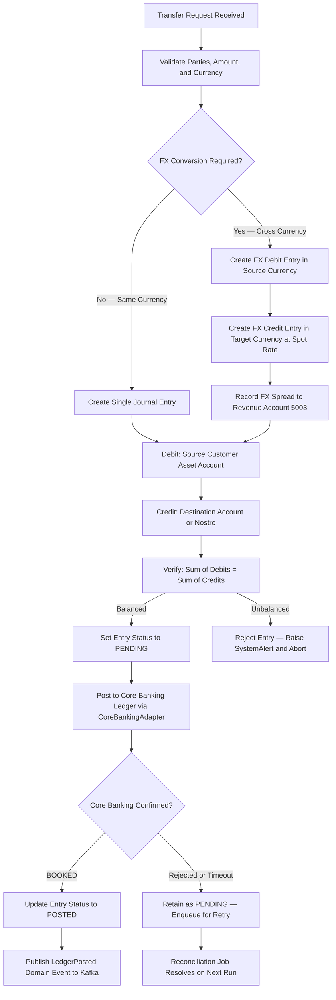
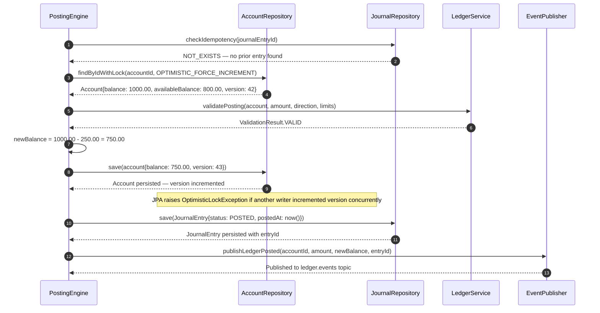
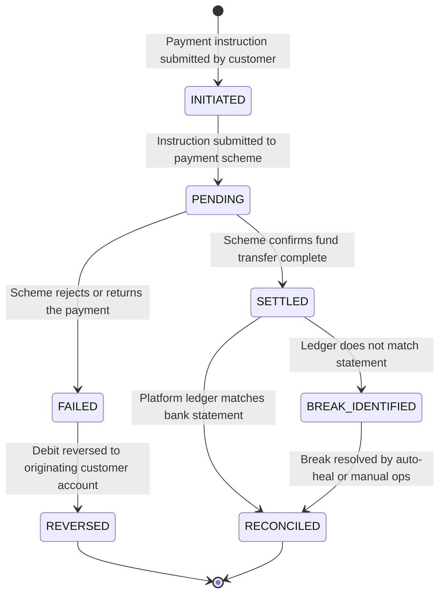
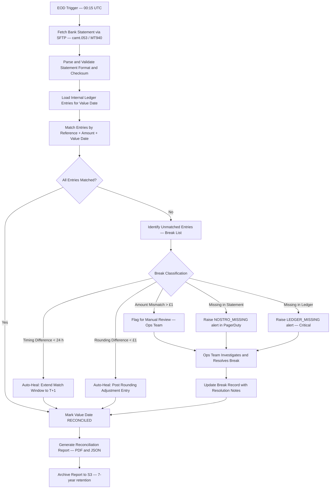
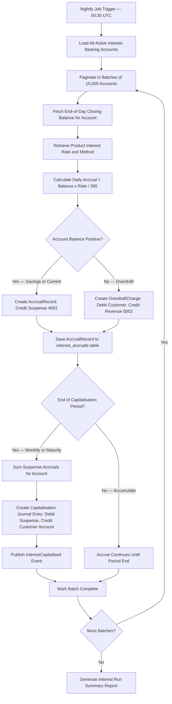
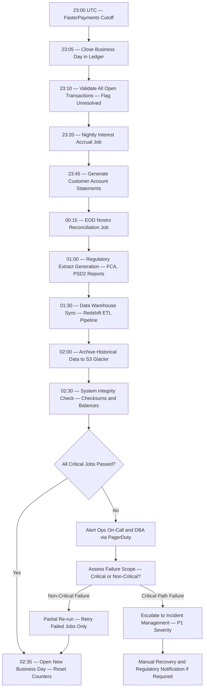

| Field | Value |
| --- | --- |
| Document ID | DBP-DD-020 |
| Version | 1.0 |
| Status | Approved |
| Owner | Core Banking Engineering |
| Last Updated | 2025-01-15 |
| Classification | Internal — Restricted |

# Core Banking Engine — Digital Banking Platform

## Double-Entry Bookkeeping Model

All financial transactions within the Digital Banking Platform are governed by the principles of double-entry bookkeeping. Every transaction produces at least one debit entry and one equal credit entry, ensuring the fundamental accounting equation — Assets = Liabilities + Equity — is preserved at all times. The Core Banking Engine rejects any journal entry where the sum of debits does not equal the sum of credits before it is written to the ledger.

The chart of accounts is structured using a five-tier hierarchy: account type, product category, sub-category, account identifier, and currency. This hierarchy supports multi-currency balances, regulatory reporting by product line, and granular profit-and-loss attribution.

### Chart of Accounts

| Code Range | Account Type | Normal Balance | Sub-Categories | Description |
| --- | --- | --- | --- | --- |
| 1000–1999 | Asset | Debit | Current, Savings, Fixed Deposit | Customer-held account balances |
| 2000–2999 | Liability | Credit | Overdraft, Payables | Amounts owed to customers or counterparties |
| 3000–3999 | Nostro / Vostro | Asset | FPS, CHAPS, SWIFT, ACH | Correspondent bank settlement accounts |
| 4000–4999 | Suspense / Transit | Liability | Accrued Interest, In-Flight | Unreconciled or in-transit balances |
| 5000–5999 | Revenue | Credit | Fee Income, FX Spread, Interest Income | Platform income accounts |
| 6000–6999 | Expense | Debit | Interest Expense, Operational | Platform cost accounts |
| 7000–7999 | Equity / Capital | Credit | Regulatory Capital, Retained Earnings | Shareholder and regulatory capital |

### Journal Entry Schema

| Field | Type | Constraints | Description |
| --- | --- | --- | --- |
| entry_id | UUID | PK, NOT NULL | Unique journal entry identifier; used for idempotency |
| debit_account | VARCHAR(20) | FK → chart_of_accounts, NOT NULL | Account to debit |
| credit_account | VARCHAR(20) | FK → chart_of_accounts, NOT NULL | Account to credit |
| amount | DECIMAL(18,4) | > 0, NOT NULL | Transaction amount in the booking currency |
| currency | CHAR(3) | ISO 4217, NOT NULL | Currency code (GBP, EUR, USD, etc.) |
| reference | VARCHAR(100) | NOT NULL, UNIQUE | Caller-assigned external reference for idempotency |
| narrative | VARCHAR(255) | NULL | Human-readable transaction description |
| value_date | DATE | NOT NULL | Date the entry takes economic effect |
| booking_date | TIMESTAMPTZ | NOT NULL, DEFAULT NOW() | Timestamp the entry was recorded in the ledger |
| status | ENUM | PENDING, POSTED, REVERSED | Posting lifecycle state |
| reversal_of | UUID | FK → journal_entries, NULL | References original entry if this is a reversal |
| created_by | VARCHAR(50) | NOT NULL | Originating service name or operator ID |

### Sample Journal Entries

| Transaction Type | Debit Account | Credit Account | Amount | Narrative |
| --- | --- | --- | --- | --- |
| Customer Cash Deposit | 3001 Nostro Account | 1001 Customer Current | £1,000.00 | Cash deposit credited to customer account |
| Customer ATM Withdrawal | 1001 Customer Current | 3001 Nostro Account | £200.00 | ATM cash withdrawal |
| Internal Transfer A to B | 1001 Customer A Current | 1002 Customer B Current | £500.00 | Peer-to-peer internal transfer |
| FX Purchase GBP to EUR | 1001 Customer GBP Current | 1003 Customer EUR Current | £1,000.00 / €1,170.00 | FX conversion at spot rate |
| Savings Interest Accrual | 6001 Interest Expense | 4001 Accrued Interest Suspense | £12.33 | Daily savings interest accrual |
| Interest Capitalisation | 4001 Accrued Interest Suspense | 1002 Customer Savings | £370.00 | Monthly savings interest credited to account |
| Transaction Fee Charge | 1001 Customer Current | 5001 Fee Revenue | £0.50 | Domestic transfer fee |
| Overdraft Interest Daily | 6002 Overdraft Interest Expense | 5002 Overdraft Interest Revenue | £3.25 | Daily overdraft interest charge |

### Double-Entry Transfer Flowchart



---

## Account Posting Engine

The Account Posting Engine is the subsystem within CoreBankingService responsible for atomically applying debit and credit operations to account balances. It ensures no posting is applied more than once, account balances remain consistent under concurrent access, and every posting generates a corresponding, immutable audit record.

### Posting Workflow

The posting workflow follows a strict sequence: validate input → check idempotency → acquire optimistic lock → compute new balance → persist journal entry → update account balance → release lock → publish event. This sequence guarantees data integrity under concurrent posting requests from multiple TransactionService replicas.



### Optimistic Locking Strategy

The Account entity carries a `@Version`-annotated `version` column managed by Hibernate. Every `UPDATE` statement appends `AND version = :expectedVersion` to prevent lost updates under concurrent writers. On `OptimisticLockException`, the PostingEngine reloads the aggregate from the database and retries up to three times. After three failed retries, the posting is rejected with `POSTING_LOCK_EXHAUSTED` and the calling transaction is rolled back entirely.

### Idempotency

Each journal entry carries a caller-assigned `journalEntryId` UUID. Before executing any posting, the engine queries `journal_entries` for an existing row with the same ID. If found with `POSTED` status, the cached result is returned immediately. If found with `PENDING` status, the engine waits up to five seconds for the in-flight operation to resolve before returning a `503 Service Unavailable`.

### Posting Error Codes

| Error Code | HTTP Status | Trigger Condition | Retry Safe |
| --- | --- | --- | --- |
| `POSTING_INSUFFICIENT_FUNDS` | 422 | Available balance less than debit amount | No |
| `POSTING_ACCOUNT_FROZEN` | 422 | Account status is FROZEN or SUSPENDED | No |
| `POSTING_DAILY_LIMIT_EXCEEDED` | 422 | Cumulative daily debit limit breached | No |
| `POSTING_DUPLICATE_ENTRY` | 200 | `journalEntryId` already in POSTED state | Yes — returns cached result |
| `POSTING_LOCK_EXHAUSTED` | 503 | Three optimistic lock retries all failed | Yes — caller retries with back-off |
| `POSTING_CURRENCY_MISMATCH` | 422 | Debit currency does not match account currency | No |
| `POSTING_ACCOUNT_NOT_FOUND` | 404 | Supplied accountId does not exist | No |
| `POSTING_LEDGER_TIMEOUT` | 503 | Core Banking did not respond within 3 s | Yes — idempotent on retry |
| `POSTING_AMOUNT_ZERO_OR_NEGATIVE` | 422 | Posting amount is zero or negative | No |

---

## Settlement and Reconciliation

Settlement is the process by which inter-bank obligations arising from payment instructions are discharged between financial institutions. The platform maintains internal ledger positions and reconciles them daily against correspondent bank statements and payment scheme settlement files.

### Settlement Lifecycle



### Nostro Reconciliation

The platform maintains Nostro accounts at correspondent banks for each payment scheme. At end of day, the Reconciliation Engine fetches the MT940 or ISO 20022 camt.053 statement via SFTP, loads all `SETTLED` ledger entries for the same value date, and performs a three-way match by payment reference, amount, and value date.



### Break Resolution SLA

| Break Type | Severity | Auto-Heal | Resolution SLA | Escalation Path |
| --- | --- | --- | --- | --- |
| Timing difference T+0 vs T+1 | Low | Yes | 24 hours | Automatic |
| Rounding difference less than £1 | Low | Yes — rounding adjustment journal | 24 hours | Automatic |
| Duplicate settlement entry | Medium | No | 4 hours | Settlement Operations |
| Amount mismatch greater than £1 | High | No | 2 hours | Settlement Operations + Finance |
| Entry missing in bank statement | High | No | 4 hours | Settlement Operations |
| Entry missing in platform ledger | Critical | No | 1 hour | CTO on-call + Finance Director |
| Closing balance mismatch | Critical | No | 1 hour | CTO on-call + Regulatory notification |

### Reconciliation Report Format

| Field | Type | Description |
| --- | --- | --- |
| report_date | DATE | Value date of the reconciliation run |
| scheme | VARCHAR(20) | Payment scheme: FPS, CHAPS, SWIFT, ACH |
| nostro_account | VARCHAR(30) | Nostro account number at correspondent |
| opening_balance | DECIMAL(18,4) | Opening balance per bank statement |
| closing_balance_statement | DECIMAL(18,4) | Closing balance per bank statement |
| closing_balance_ledger | DECIMAL(18,4) | Closing balance per internal platform ledger |
| difference | DECIMAL(18,4) | Statement minus ledger; zero indicates full reconciliation |
| matched_entries | INTEGER | Count of entries matched automatically |
| unmatched_entries | INTEGER | Count of open breaks |
| status | ENUM | RECONCILED, BREAK_OPEN, BREAK_RESOLVED |
| generated_at | TIMESTAMPTZ | Timestamp the report was generated |

---

## Interest Calculation

The Interest Calculation Engine runs nightly for all interest-bearing accounts, computing daily accruals and capitalising at end of month. Both simple and compound interest are supported and configured per product type in the product catalogue.

### Daily Accrual Formula

For all savings products, interest accrues daily on the end-of-day closing balance:

```
Daily Accrual = End-of-Day Balance x (Annual Interest Rate / 365)
```

For compound interest products, accrued interest is added to the principal at each capitalisation event (monthly, quarterly, or at maturity), so subsequent accruals calculate on the grown principal.

### Interest Product Configuration

| Product Type | Interest Method | Annual Rate | Capitalisation | Overdraft Daily Cap |
| --- | --- | --- | --- | --- |
| Standard Current Account | Simple | 0.10% AER | Monthly | N/A |
| Instant Access Savings | Simple | 4.50% AER | Monthly | N/A |
| Fixed-Term Deposit (1 year) | Compound | 5.25% AER | At maturity | N/A |
| Business Current Account | Simple | 0.25% AER | Quarterly | N/A |
| Arranged Overdraft | Simple | 39.9% EAR | Daily debit | None — rate-based |
| Unarranged Overdraft | Simple | 49.9% EAR | Daily debit | £5.00 per day |

### Nightly Interest Accrual Job



---

## EOD Processing

The End-of-Day processing pipeline is a sequenced set of batch jobs that close the business day, compute interest, generate regulatory extracts, and prepare the platform for the next trading day. All jobs run within a defined window between 23:00 UTC and 06:00 UTC to avoid impacting peak daytime transaction volumes.

### EOD Job Sequence

The pipeline executes jobs in strict dependency order. If any critical-path job fails, the pipeline halts and raises an incident alert. Non-critical jobs can be skipped and re-run without affecting the critical path.



### Payment Scheme Cutoff Times

| Payment Scheme | Cutoff Time | Settlement Timing | EOD File Submission |
| --- | --- | --- | --- |
| Faster Payments (FPS) | 23:00 UTC | Near-real-time intraday | 23:30 UTC summary file |
| CHAPS | 16:00 UTC | Same-day RTGS | 16:30 UTC reconciliation file |
| Bacs / ACH | 22:00 UTC | D+2 settlement | 22:30 UTC submission |
| SWIFT (international) | 17:00 CET | Variable 1–3 business days | 17:30 CET SWIFT MT940 |
| SEPA Credit Transfer | 15:00 CET | Same-day TARGET2 | 15:30 CET |
| Visa / Mastercard | 18:00 UTC | T+1 net settlement | 19:00 UTC clearing file |

### EOD Failure Handling

When a non-critical EOD job fails, the pipeline logs the failure with a unique `jobRunId`, records the failed batch offsets, and schedules a partial re-run. The re-run starts from the last successfully completed checkpoint, not from the beginning of the job. For interest accrual failures, the system identifies affected account batches from the `interest_accruals` table where `status = FAILED` and reprocesses only those batches.

For critical-path failures — specifically the business day close and the reconciliation job — the platform enters a controlled hold state where new outgoing payments are queued but not dispatched until the critical job completes. Incoming payments continue to be accepted and credited during the hold period to avoid customer impact.
