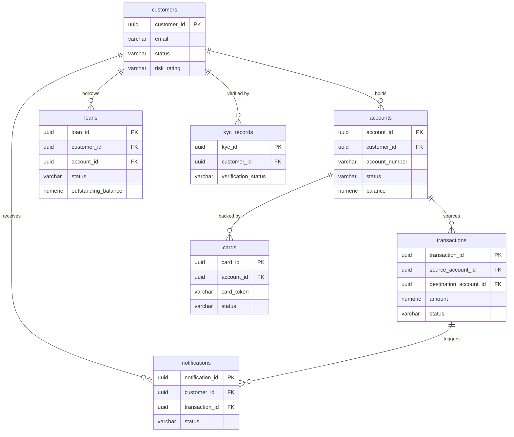

| Field | Value |
| --- | --- |
| Document ID | DBP-DD-036 |
| Version | 1.0 |
| Status | Approved |
| Owner | Architecture Team |
| Last Updated | 2025-01-15 |
| Classification | Internal — Restricted |

# Entity-Relationship Design — Database Schema

## Introduction

The Digital Banking Platform persists all operational and compliance data in a multi-schema PostgreSQL 15 cluster, divided into five purpose-bounded schemas: `banking_core`, `banking_cards`, `banking_lending`, `banking_compliance`, and `banking_notifications`. Each schema maps to a distinct bounded context and is owned by a corresponding microservice with exclusive write access. Cross-schema foreign-key references are permitted only where referential integrity is architecturally required; all other inter-service data sharing occurs via published domain events and materialised read models, never through direct cross-schema joins at the application layer.

PCI-DSS scope segmentation is enforced structurally: the `banking_cards` schema constitutes the entire Cardholder Data Environment (CDE). Network-level controls, database role grants, and application firewall rules ensure that only the `CardService` and the PCI-compliant payment processor can connect to this schema. All remaining schemas are classified as out-of-scope for PCI-DSS unless a service explicitly references card data via a tokenised reference — the PAN itself is never present outside the CDE. This boundary is reviewed annually by the Qualified Security Assessor (QSA) as part of the platform's PCI-DSS v4.0 assessment.

Row-Level Security (RLS) is enabled and enforced on all tables across every schema. Customer-facing API clients may only access rows associated with their own `customer_id`, which is injected into the session via `SET LOCAL app.current_customer_id`. Compliance staff operate under filtered policies that scope reads to their assigned case queue. Internal system service accounts that require unrestricted access — such as the AuditService writer or the batch reconciliation job — bypass RLS by connecting under a superuser-equivalent `SET ROLE` that is granted only to specific named service accounts, with all such role escalations logged to the audit trail.

## PCI-DSS Scope Annotations

The table below maps every schema and table to its PCI-DSS scope classification, PII presence, and encryption requirements. Teams modifying any table marked as CDE must undergo a change-advisory review with the Security Engineering team before deployment. Any new column added to a CDE table that could potentially hold cardholder data must be reviewed against PCI-DSS v4.0 Requirement 3 before the migration is approved.

| Schema | Table | CDE Scope | PII | Encryption Required | Notes |
| --- | --- | --- | --- | --- | --- |
| banking_core | customers | No | Yes | tax_id_encrypted (AES-256-GCM) | GDPR subject access applies |
| banking_core | accounts | No | No | None | Contains IBAN; masked in logs |
| banking_core | transactions | No | No | None | aml_screening_result logged separately |
| banking_core | audit_logs | No | Partial | None | before_state / after_state may contain PII |
| banking_cards | cards | Yes | Yes | card_token (Vault), cvv_hash (SHA-256+pepper) | Full PCI-DSS CDE controls required |
| banking_cards | card_limits | Yes | No | None | Associated with CDE cards table |
| banking_cards | card_tokens | Yes | Yes | token_value (Vault) | Network tokenisation records |
| banking_lending | loans | No | No | None | Links to customer_id; PII by association |
| banking_lending | loan_payments | No | No | None | — |
| banking_lending | loan_underwriting_decisions | No | Partial | credit_score (sensitive) | Governed by fair lending laws |
| banking_compliance | kyc_records | No | Yes | document_number_encrypted (AES-256-GCM) | Regulatory retention 7 years |
| banking_compliance | aml_alerts | No | Partial | None | SAR filing triggers restricted access |
| banking_compliance | compliance_overrides | No | No | None | Dual-control required for write |
| banking_notifications | notifications | No | Partial | content_hash only | Content not stored; only hash retained |
| banking_notifications | notification_templates | No | No | None | No customer data stored |

## Schema: banking_core

The `banking_core` schema is the operational core of the Digital Banking Platform, hosting the customer master record, the account ledger, the transaction log, and the immutable audit trail. Every other schema holds a dependency on `banking_core` for customer and account identity, making this schema the root of the platform's relational graph. Write throughput is highest here, and all tables in this schema are sized and indexed for OLTP workloads; analytical queries are redirected to the read replica or to the event-sourced reporting projection in Apache Kafka Streams. The schema is owned exclusively by the `CoreBankingService`, which is the only service granted `INSERT`, `UPDATE`, and `DELETE` privileges; all other services receive read-only grants scoped to specific views.

### Table: customers

The `customers` table is the authoritative master record for all platform customers, serving as the identity anchor for every downstream relationship in the system.

```sql
CREATE TABLE banking_core.customers (
    customer_id           UUID          NOT NULL DEFAULT gen_random_uuid(),
    email                 VARCHAR(255)  NOT NULL,
    phone                 VARCHAR(20),
    full_name             VARCHAR(200)  NOT NULL,
    date_of_birth         DATE          NOT NULL,
    nationality           CHAR(3)       NOT NULL,
    tax_id_encrypted      BYTEA,
    status                VARCHAR(20)   NOT NULL CHECK (status IN ('pending_kyc','active','suspended','closed')),
    risk_rating           VARCHAR(20)   NOT NULL DEFAULT 'low' CHECK (risk_rating IN ('low','medium','high','pep')),
    gdpr_consent_at       TIMESTAMPTZ,
    gdpr_consent_version  VARCHAR(10),
    created_at            TIMESTAMPTZ   NOT NULL DEFAULT NOW(),
    updated_at            TIMESTAMPTZ   NOT NULL DEFAULT NOW(),
    CONSTRAINT customers_pkey PRIMARY KEY (customer_id),
    CONSTRAINT customers_email_unique UNIQUE (email)
);

COMMENT ON TABLE banking_core.customers IS 'Customer master record. PII. GDPR subject access applies. Retention: active + 7 years post-closure.';
COMMENT ON COLUMN banking_core.customers.tax_id_encrypted IS 'AES-256-GCM encrypted tax identifier. Encryption key managed in AWS KMS. Never log in plaintext.';
COMMENT ON COLUMN banking_core.customers.risk_rating IS 'AML risk rating assigned by compliance. PEP = Politically Exposed Person. Reviewed quarterly.';

CREATE INDEX idx_customers_email ON banking_core.customers (email);
CREATE INDEX idx_customers_status ON banking_core.customers (status);
CREATE INDEX idx_customers_risk_rating ON banking_core.customers (risk_rating);
```

### Table: accounts

Each row in the `accounts` table represents a single financial account held by a customer, storing the live balance state and daily transfer limit counters alongside account lifecycle metadata.

```sql
CREATE TABLE banking_core.accounts (
    account_id              UUID            NOT NULL DEFAULT gen_random_uuid(),
    customer_id             UUID            NOT NULL,
    account_number          VARCHAR(34)     NOT NULL,
    account_type            VARCHAR(20)     NOT NULL CHECK (account_type IN ('checking','savings','loan')),
    currency                CHAR(3)         NOT NULL,
    balance                 NUMERIC(19,4)   NOT NULL DEFAULT 0,
    available_balance       NUMERIC(19,4)   NOT NULL DEFAULT 0,
    overdraft_limit         NUMERIC(19,4)   NOT NULL DEFAULT 0,
    status                  VARCHAR(20)     NOT NULL CHECK (status IN ('pending_kyc','active','frozen','dormant','closed')),
    daily_transfer_limit    NUMERIC(19,4)   NOT NULL DEFAULT 10000,
    daily_transfer_used     NUMERIC(19,4)   NOT NULL DEFAULT 0,
    daily_reset_at          TIMESTAMPTZ,
    opened_at               TIMESTAMPTZ     NOT NULL DEFAULT NOW(),
    last_activity_at        TIMESTAMPTZ,
    dormancy_notified_at    TIMESTAMPTZ,
    closed_at               TIMESTAMPTZ,
    CONSTRAINT accounts_pkey PRIMARY KEY (account_id),
    CONSTRAINT accounts_account_number_unique UNIQUE (account_number),
    CONSTRAINT accounts_customer_fk FOREIGN KEY (customer_id) REFERENCES banking_core.customers (customer_id),
    CONSTRAINT accounts_balance_check CHECK (balance >= -overdraft_limit),
    CONSTRAINT accounts_available_balance_check CHECK (available_balance <= balance)
);

COMMENT ON TABLE banking_core.accounts IS 'Account ledger record. Stores live balance and daily limit state. account_number is IBAN-formatted.';
COMMENT ON COLUMN banking_core.accounts.account_number IS 'IBAN-formatted account number. Masked to last 4 digits in all non-privileged log output.';

CREATE INDEX idx_accounts_customer ON banking_core.accounts (customer_id);
CREATE INDEX idx_accounts_status ON banking_core.accounts (status);
CREATE INDEX idx_accounts_account_number ON banking_core.accounts (account_number);
```

### Table: transactions

The `transactions` table is the append-only monetary event log for the platform, capturing every debit, credit, and fee movement with full idempotency and AML screening metadata.

```sql
CREATE TABLE banking_core.transactions (
    transaction_id            UUID            NOT NULL DEFAULT gen_random_uuid(),
    idempotency_key           UUID            NOT NULL,
    source_account_id         UUID,
    destination_account_id    UUID,
    amount                    NUMERIC(19,4)   NOT NULL CHECK (amount > 0),
    currency                  CHAR(3)         NOT NULL,
    fx_rate                   NUMERIC(10,6),
    base_currency_amount      NUMERIC(19,4),
    transaction_type          VARCHAR(30)     NOT NULL CHECK (transaction_type IN ('transfer','card_payment','direct_debit','atm_withdrawal','fee','interest','reversal')),
    status                    VARCHAR(20)     NOT NULL DEFAULT 'initiated' CHECK (status IN ('initiated','processing','review','completed','failed','reversed')),
    payment_rail              VARCHAR(30)     CHECK (payment_rail IN ('faster_payments','ach','swift','sepa','internal')),
    reference                 VARCHAR(35),
    external_reference        VARCHAR(50),
    fraud_score               NUMERIC(5,4),
    aml_screening_result      VARCHAR(20)     NOT NULL DEFAULT 'pending' CHECK (aml_screening_result IN ('pending','clear','review','blocked')),
    initiated_at              TIMESTAMPTZ     NOT NULL DEFAULT NOW(),
    processing_started_at     TIMESTAMPTZ,
    completed_at              TIMESTAMPTZ,
    failed_at                 TIMESTAMPTZ,
    failure_reason            TEXT,
    reversal_of               UUID,
    scheduled_at              TIMESTAMPTZ,
    CONSTRAINT transactions_pkey PRIMARY KEY (transaction_id),
    CONSTRAINT transactions_idempotency_unique UNIQUE (idempotency_key),
    CONSTRAINT transactions_source_fk FOREIGN KEY (source_account_id) REFERENCES banking_core.accounts (account_id),
    CONSTRAINT transactions_destination_fk FOREIGN KEY (destination_account_id) REFERENCES banking_core.accounts (account_id),
    CONSTRAINT transactions_reversal_fk FOREIGN KEY (reversal_of) REFERENCES banking_core.transactions (transaction_id)
);

COMMENT ON TABLE banking_core.transactions IS 'Immutable transaction log. Append-only in practice; status transitions only. Partitioned by initiated_at for query performance.';
COMMENT ON COLUMN banking_core.transactions.idempotency_key IS 'Caller-supplied UUID. Redis-backed deduplication ensures exactly-once processing under retries.';
COMMENT ON COLUMN banking_core.transactions.fraud_score IS 'Range 0.0000–1.0000. Score >= 0.7500 triggers REVIEW status. Populated by FraudService.';

CREATE INDEX idx_transactions_source ON banking_core.transactions (source_account_id);
CREATE INDEX idx_transactions_destination ON banking_core.transactions (destination_account_id);
CREATE INDEX idx_transactions_status ON banking_core.transactions (status);
CREATE INDEX idx_transactions_idempotency ON banking_core.transactions (idempotency_key);
CREATE INDEX idx_transactions_initiated_at ON banking_core.transactions USING BRIN (initiated_at);
```

### Table: audit_logs

The `audit_logs` table is the immutable regulatory audit trail for all entity mutations and access events across the platform, partitioned monthly for retention management and query efficiency.

```sql
CREATE TABLE banking_core.audit_logs (
    audit_id            UUID            NOT NULL DEFAULT gen_random_uuid(),
    entity_type         VARCHAR(50)     NOT NULL,
    entity_id           UUID            NOT NULL,
    action              VARCHAR(20)     NOT NULL CHECK (action IN ('CREATE','READ','UPDATE','DELETE','TRANSFER','LOGIN','LOGOUT','OVERRIDE','EXPORT')),
    actor_id            UUID            NOT NULL,
    actor_type          VARCHAR(20)     NOT NULL CHECK (actor_type IN ('customer','staff','system','api_client','compliance_officer')),
    ip_address          INET,
    user_agent          TEXT,
    before_state        JSONB,
    after_state         JSONB,
    reason              TEXT,
    regulatory_event    BOOLEAN         NOT NULL DEFAULT false,
    correlation_id      UUID,
    created_at          TIMESTAMPTZ     NOT NULL DEFAULT NOW(),
    retention_until     TIMESTAMPTZ     NOT NULL,
    CONSTRAINT audit_logs_pkey PRIMARY KEY (audit_id, created_at)
) PARTITION BY RANGE (created_at);

COMMENT ON TABLE banking_core.audit_logs IS 'Append-only regulatory audit trail. Partitioned monthly. Retention minimum 7 years per FCA requirements.';
COMMENT ON COLUMN banking_core.audit_logs.regulatory_event IS 'When true, event is included in automated regulatory reporting extracts. Cannot be deleted.';
COMMENT ON COLUMN banking_core.audit_logs.before_state IS 'JSONB snapshot of entity state prior to mutation. PII fields are redacted by AuditService before persistence.';

-- Monthly partition example
CREATE TABLE banking_core.audit_logs_2025_01 PARTITION OF banking_core.audit_logs
    FOR VALUES FROM ('2025-01-01') TO ('2025-02-01');

CREATE INDEX idx_audit_entity ON banking_core.audit_logs (entity_type, entity_id);
CREATE INDEX idx_audit_actor ON banking_core.audit_logs (actor_id);
CREATE INDEX idx_audit_created_at ON banking_core.audit_logs USING BRIN (created_at);
CREATE INDEX idx_audit_regulatory ON banking_core.audit_logs (created_at) WHERE regulatory_event = true;
```

## Schema: banking_cards

The `banking_cards` schema is the sole Cardholder Data Environment (CDE) within the platform and is subject to the full set of PCI-DSS v4.0 controls. At the network level, this schema is accessible only via a dedicated database endpoint bound to a private subnet that has no routing path from general application subnets. Database role grants are restricted to the `CardService` service account and the PCI-compliant payment processor integration user; all other service accounts are explicitly denied `CONNECT` rights to the CDE database. All column values that could match a Primary Account Number (PAN) are tokenised through HashiCorp Vault Transit before the row is inserted, meaning the raw PAN is never written to disk. Vault Transit keys are stored in a FIPS 140-2 Level 3 HSM and rotated on a 12-month schedule aligned with the PCI-DSS key management policy.

### Table: cards

Each row represents a single physical or virtual payment card issued to a customer, holding only the tokenised PAN reference, the last-four digits for display purposes, and the hashed security credentials.

```sql
CREATE TABLE banking_cards.cards (
    card_id                 UUID            NOT NULL DEFAULT gen_random_uuid(),
    account_id              UUID            NOT NULL,
    card_token              VARCHAR(64)     NOT NULL,
    card_last_four          CHAR(4)         NOT NULL,
    card_type               VARCHAR(20)     NOT NULL CHECK (card_type IN ('debit','credit','virtual')),
    card_network            VARCHAR(20)     NOT NULL CHECK (card_network IN ('visa','mastercard','amex')),
    status                  VARCHAR(30)     NOT NULL DEFAULT 'requested' CHECK (status IN ('requested','issued','active','temporarily_blocked','blocked','expired','cancelled')),
    expiry_date             DATE            NOT NULL,
    cvv_hash                VARCHAR(64)     NOT NULL,
    pin_hash                VARCHAR(64),
    daily_spend_limit       NUMERIC(19,4)   NOT NULL DEFAULT 2500,
    per_transaction_limit   NUMERIC(19,4)   NOT NULL DEFAULT 2500,
    atm_withdrawal_limit    NUMERIC(19,4)   NOT NULL DEFAULT 500,
    contactless_enabled     BOOLEAN         NOT NULL DEFAULT true,
    three_ds_enrolled       BOOLEAN         NOT NULL DEFAULT true,
    issued_at               TIMESTAMPTZ     NOT NULL DEFAULT NOW(),
    activated_at            TIMESTAMPTZ,
    blocked_at              TIMESTAMPTZ,
    block_reason            VARCHAR(100),
    expires_at              TIMESTAMPTZ,
    cancelled_at            TIMESTAMPTZ,
    CONSTRAINT cards_pkey PRIMARY KEY (card_id),
    CONSTRAINT cards_token_unique UNIQUE (card_token),
    CONSTRAINT cards_account_fk FOREIGN KEY (account_id) REFERENCES banking_core.accounts (account_id)
);

COMMENT ON TABLE banking_cards.cards IS 'PCI-DSS CDE. Stores tokenised card references only. Raw PAN never persisted. Access restricted to CardService role.';
COMMENT ON COLUMN banking_cards.cards.card_token IS 'PCI-DSS CDE: Vault Transit tokenised PAN. Never log, export, or expose in API responses. Ref: PCI-DSS v4.0 Req 3.3.';
COMMENT ON COLUMN banking_cards.cards.cvv_hash IS 'SHA-256 with application-layer pepper. CVV never stored in recoverable form per PCI-DSS Req 3.3.2.';
COMMENT ON COLUMN banking_cards.cards.pin_hash IS 'Argon2id hash of PIN. PIN block encrypted with zone master key during HSM processing. PCI-DSS Req 8.3.';

CREATE INDEX idx_cards_account ON banking_cards.cards (account_id);
CREATE INDEX idx_cards_status ON banking_cards.cards (status);
CREATE INDEX idx_cards_token ON banking_cards.cards (card_token);
```

## Schema: banking_lending

The `banking_lending` schema manages the full lifecycle of credit products offered by the platform, from initial application through underwriting, disbursement, active repayment, and final settlement or write-off. Loan origination records are linked to both the customer master and the associated funding account, enabling automated disbursement and direct-debit collection without requiring cross-schema joins at query time. Underwriting decisions, including credit bureau scores and loan-to-income ratios, are stored alongside the loan record to support regulatory reporting obligations under the Consumer Credit Act and fair lending legislation. Missed payment counters feed directly into the AML risk re-scoring pipeline, triggering a compliance review when thresholds are exceeded.

### Table: loans

```sql
CREATE TABLE banking_lending.loans (
    loan_id                     UUID            NOT NULL DEFAULT gen_random_uuid(),
    customer_id                 UUID            NOT NULL,
    account_id                  UUID            NOT NULL,
    principal_amount            NUMERIC(19,4)   NOT NULL CHECK (principal_amount > 0),
    outstanding_balance         NUMERIC(19,4)   NOT NULL,
    interest_rate               NUMERIC(8,6)    NOT NULL CHECK (interest_rate >= 0),
    term_months                 INTEGER         NOT NULL CHECK (term_months > 0),
    loan_type                   VARCHAR(20)     NOT NULL CHECK (loan_type IN ('personal','mortgage','auto','overdraft')),
    status                      VARCHAR(30)     NOT NULL DEFAULT 'applied' CHECK (status IN ('applied','pending_underwriting','approved','offer_accepted','active','delinquent','defaulted','settled','written_off','cancelled')),
    monthly_payment             NUMERIC(19,4),
    next_payment_due            DATE,
    missed_payments_count       INTEGER         NOT NULL DEFAULT 0,
    credit_bureau_score         INTEGER         CHECK (credit_bureau_score BETWEEN 300 AND 850),
    loan_to_income_ratio        NUMERIC(5,4),
    origination_date            DATE,
    disbursed_at                TIMESTAMPTZ,
    settled_at                  TIMESTAMPTZ,
    CONSTRAINT loans_pkey PRIMARY KEY (loan_id),
    CONSTRAINT loans_customer_fk FOREIGN KEY (customer_id) REFERENCES banking_core.customers (customer_id),
    CONSTRAINT loans_account_fk FOREIGN KEY (account_id) REFERENCES banking_core.accounts (account_id)
);

COMMENT ON TABLE banking_lending.loans IS 'Loan product master record. Lifecycle from application through settlement. Feeds regulatory credit reporting.';
COMMENT ON COLUMN banking_lending.loans.credit_bureau_score IS 'FICO score at origination from credit bureau. Range 300–850. Governed by fair credit reporting legislation.';

CREATE INDEX idx_loans_customer ON banking_lending.loans (customer_id);
CREATE INDEX idx_loans_status ON banking_lending.loans (status);
CREATE INDEX idx_loans_next_payment ON banking_lending.loans (next_payment_due) WHERE status = 'active';
```

## Schema: banking_compliance

The `banking_compliance` schema centralises all regulatory data across the platform, covering KYC verification records, AML alert case management, and the dual-control compliance override framework. KYC records store encrypted document references returned by the identity verification provider, along with structured match flags for politically exposed person (PEP) lists, sanctions lists, and adverse media databases. AML alerts are raised automatically by the screening engine when transaction patterns trigger rule thresholds, and each alert progresses through a case workflow that may result in a Suspicious Activity Report (SAR) filing — at which point access to the alert record becomes restricted to MLRO-credentialed staff only. The dual-control `compliance_overrides` table requires two distinct compliance officers to authorise any manual override of a system-applied restriction, with both approver identities recorded in the audit trail to satisfy the four-eyes principle required by FCA oversight.

### Table: kyc_records

```sql
CREATE TABLE banking_compliance.kyc_records (
    kyc_id                      UUID            NOT NULL DEFAULT gen_random_uuid(),
    customer_id                 UUID            NOT NULL,
    provider                    VARCHAR(100)    NOT NULL,
    verification_type           VARCHAR(20)     NOT NULL CHECK (verification_type IN ('simplified','standard','enhanced')),
    document_type               VARCHAR(30)     NOT NULL CHECK (document_type IN ('passport','national_id','drivers_license','utility_bill','bank_statement')),
    document_number_encrypted   BYTEA,
    verification_status         VARCHAR(20)     NOT NULL DEFAULT 'pending' CHECK (verification_status IN ('pending','passed','failed','manual_review','expired')),
    risk_level                  VARCHAR(20)     NOT NULL DEFAULT 'low' CHECK (risk_level IN ('low','medium','high','pep','sanctions')),
    pep_match                   BOOLEAN         NOT NULL DEFAULT false,
    sanctions_match             BOOLEAN         NOT NULL DEFAULT false,
    adverse_media_match         BOOLEAN         NOT NULL DEFAULT false,
    provider_reference          VARCHAR(100),
    verified_at                 TIMESTAMPTZ,
    expires_at                  TIMESTAMPTZ,
    reviewer_id                 UUID,
    reviewed_at                 TIMESTAMPTZ,
    review_notes                TEXT,
    created_at                  TIMESTAMPTZ     NOT NULL DEFAULT NOW(),
    CONSTRAINT kyc_records_pkey PRIMARY KEY (kyc_id),
    CONSTRAINT kyc_customer_fk FOREIGN KEY (customer_id) REFERENCES banking_core.customers (customer_id),
    CONSTRAINT kyc_reviewer_fk FOREIGN KEY (reviewer_id) REFERENCES banking_core.customers (customer_id)
);

COMMENT ON TABLE banking_compliance.kyc_records IS 'KYC verification records. Regulatory retention 7 years per AMLD6. Contains encrypted document references.';
COMMENT ON COLUMN banking_compliance.kyc_records.document_number_encrypted IS 'AES-256-GCM encrypted document number. Key rotated annually. Plaintext never persisted.';
COMMENT ON COLUMN banking_compliance.kyc_records.sanctions_match IS 'True if customer matched against OFAC, HM Treasury, or EU sanctions lists. Triggers automatic account freeze.';

CREATE INDEX idx_kyc_customer ON banking_compliance.kyc_records (customer_id);
CREATE INDEX idx_kyc_status ON banking_compliance.kyc_records (verification_status);
CREATE INDEX idx_kyc_expires ON banking_compliance.kyc_records (expires_at) WHERE verification_status = 'passed';
```

## Schema: banking_notifications

The `banking_notifications` schema operates as a write-once delivery log for all customer-facing communications dispatched by the platform. Message body content is never persisted to the database; instead, the `NotificationService` renders the template, computes a SHA-256 hash of the rendered output, and stores only that hash in the `content_hash` column. This design ensures the schema contains no regulated personal data beyond the customer and transaction identifiers, reducing the GDPR surface area to a minimum while still providing an auditable proof that a specific message was dispatched at a recorded point in time.

### Table: notifications

```sql
CREATE TABLE banking_notifications.notifications (
    notification_id     UUID            NOT NULL DEFAULT gen_random_uuid(),
    customer_id         UUID            NOT NULL,
    transaction_id      UUID,
    channel             VARCHAR(20)     NOT NULL CHECK (channel IN ('push','sms','email','in_app')),
    template_id         VARCHAR(50)     NOT NULL,
    status              VARCHAR(20)     NOT NULL DEFAULT 'queued' CHECK (status IN ('queued','sent','delivered','failed','opted_out')),
    content_hash        VARCHAR(64),
    idempotency_key     UUID            NOT NULL,
    sent_at             TIMESTAMPTZ,
    delivered_at        TIMESTAMPTZ,
    failed_at           TIMESTAMPTZ,
    failure_reason      TEXT,
    retry_count         INTEGER         NOT NULL DEFAULT 0,
    max_retries         INTEGER         NOT NULL DEFAULT 3,
    created_at          TIMESTAMPTZ     NOT NULL DEFAULT NOW(),
    CONSTRAINT notifications_pkey PRIMARY KEY (notification_id),
    CONSTRAINT notifications_idempotency_unique UNIQUE (idempotency_key),
    CONSTRAINT notifications_customer_fk FOREIGN KEY (customer_id) REFERENCES banking_core.customers (customer_id),
    CONSTRAINT notifications_transaction_fk FOREIGN KEY (transaction_id) REFERENCES banking_core.transactions (transaction_id)
);

COMMENT ON TABLE banking_notifications.notifications IS 'Delivery audit log. Message body never stored. content_hash is SHA-256 of rendered content for audit proof.';

CREATE INDEX idx_notifications_customer ON banking_notifications.notifications (customer_id);
CREATE INDEX idx_notifications_status ON banking_notifications.notifications (status);
CREATE INDEX idx_notifications_created_at ON banking_notifications.notifications USING BRIN (created_at);
```

## Entity Relationship Overview

The diagram below presents the primary relationships between the core entities of the Digital Banking Platform. Cross-schema foreign keys are shown as standard relationships; in practice these cross logical isolation boundaries and are enforced at the application layer in addition to the database constraint level. The diagram omits intermediate tables such as `card_limits`, `loan_payments`, and `compliance_overrides` for clarity, focusing instead on the identity and ownership graph that underpins every service interaction on the platform.



## Row-Level Security Policies

Row-Level Security is enforced at the PostgreSQL database engine level using `CREATE POLICY` statements, providing a defence-in-depth layer that operates independently of the application's own access control logic. Even if an application-layer authorisation bug permitted a service to issue an unrestricted SQL query, the RLS policies would silently filter the result set to only the rows the authenticated session is permitted to see. Policies are additive: a user with multiple granted roles receives the union of all applicable permissive policies. The examples below use `banking_core.customers` as the primary illustration; equivalent policies are applied to all tables across all five schemas, with policy definitions maintained in the `db/policies/` directory of the platform infrastructure repository.

```sql
-- Enable RLS on the customers table
ALTER TABLE banking_core.customers ENABLE ROW LEVEL SECURITY;
ALTER TABLE banking_core.customers FORCE ROW LEVEL SECURITY;

-- API clients (service role: api_client) can only see their own customer record
CREATE POLICY api_client_own_customer
    ON banking_core.customers
    AS PERMISSIVE FOR SELECT
    TO api_client
    USING (customer_id = current_setting('app.current_customer_id', true)::UUID);

-- Customer service staff can see customers assigned to their team
CREATE POLICY staff_assigned_customers
    ON banking_core.customers
    AS PERMISSIVE FOR SELECT
    TO customer_service_staff
    USING (
        customer_id IN (
            SELECT customer_id FROM banking_core.staff_customer_assignments
            WHERE staff_id = current_setting('app.current_staff_id', true)::UUID
        )
    );

-- Compliance officers can read all customers but only write to risk_rating and status
CREATE POLICY compliance_read_all
    ON banking_core.customers
    AS PERMISSIVE FOR SELECT
    TO compliance_officer
    USING (true);

CREATE POLICY compliance_update_restricted
    ON banking_core.customers
    AS PERMISSIVE FOR UPDATE
    TO compliance_officer
    USING (true)
    WITH CHECK (true); -- Column-level privileges restrict to risk_rating, status only
```

## Database Migration Strategy

All schema changes are managed through Flyway 10.x versioned migrations, providing a fully auditable and repeatable history of every DDL and DML change applied to the database. The shadow database pattern ensures that every migration script is validated against a clean schema clone on every pull request build, catching syntax errors, constraint violations, and destructive column drops before they reach any environment with live data.

| Attribute | Value |
| --- | --- |
| Migration Tool | Flyway 10.x — managed via Gradle plugin |
| Naming Convention | `V{version}__{description}.sql` — e.g. `V036__add_loan_underwriting_table.sql` |
| Rollback Policy | Undo migrations (`U{version}__description.sql`) for all DDL. DML-only migrations use compensating transactions. |
| CI Integration | Flyway validate runs on every PR build against a shadow database. Migrate runs on deployment to staging then production. |
| Environment Promotion | Schema versions must be identical between staging and production before any production migration is allowed. |
| Baseline | V001 applies to all environments. Pre-existing production schemas are baselined at V000. |

## Backup and Recovery

The platform's backup strategy is designed to meet a Recovery Point Objective (RPO) of five minutes and a Recovery Time Objective (RTO) of thirty minutes for the primary operational database, with cross-region recovery capabilities providing a worst-case RPO of seven days for catastrophic regional failure scenarios. All backup artefacts are encrypted at rest using AWS-managed KMS keys with a dedicated key per environment, and the restoration procedure is exercised in the non-production environment on a quarterly schedule to validate that RTO targets are achievable in practice.

| Backup Type | Frequency | Retention | RPO | RTO | Tool |
| --- | --- | --- | --- | --- | --- |
| Continuous WAL Archiving | Continuous — 5-minute archive segments | 35 days | < 5 minutes | < 30 minutes | AWS RDS automated backups + S3 lifecycle |
| Daily Snapshot | Daily at 02:00 UTC | 35 days | 24 hours | < 1 hour | RDS automated snapshot |
| Weekly Cross-Region Snapshot | Weekly Sunday 03:00 UTC | 12 weeks | 7 days | < 4 hours | RDS cross-region snapshot copy to eu-west-2 → us-east-1 |
| Point-in-Time Recovery | On demand | Up to 35-day WAL window | 5 minutes | < 30 minutes | RDS PITR — restore to any second within retention window |
