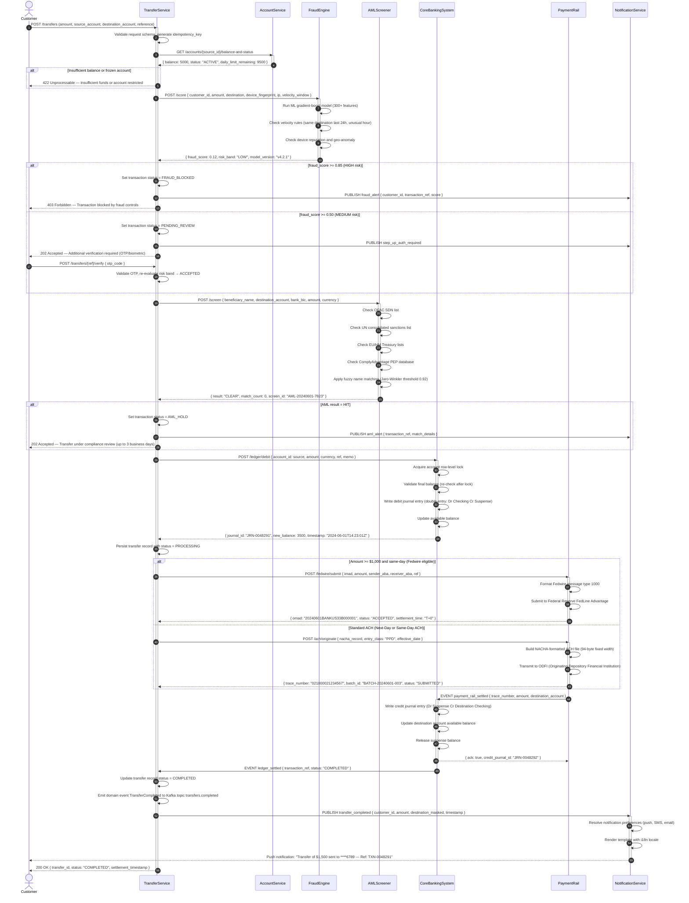
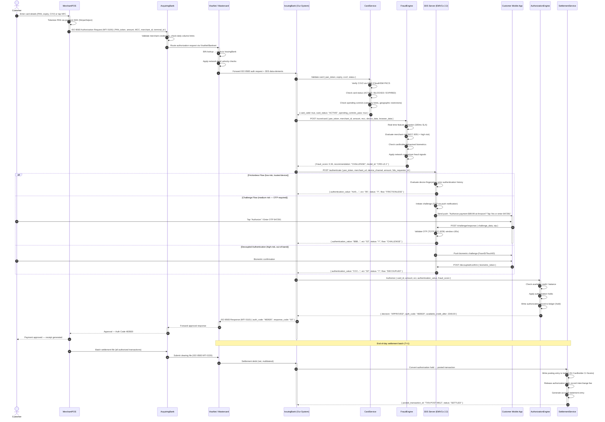
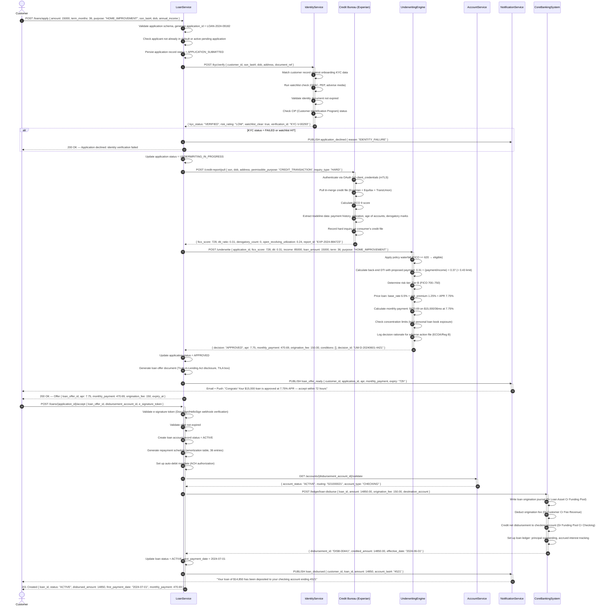

# Sequence Diagrams — Digital Banking Platform

---

## Domestic Money Transfer with Fraud Check and AML Screening

This diagram captures the full lifecycle of a domestic money transfer, from customer initiation through fraud scoring, AML sanctions screening, core banking debit/credit, payment rail submission, and final notification delivery.

---

## Card Payment with 3DS Authentication

This diagram covers the full card-not-present payment flow including 3D Secure 2.x authentication, authorization decision, and next-day settlement batch processing through card network rails.

---

## Loan Application with Credit Bureau Pull

This diagram covers the full personal loan origination flow: identity verification, credit bureau inquiry, automated underwriting decisioning, offer presentation, customer acceptance, and loan disbursement to a linked deposit account.

